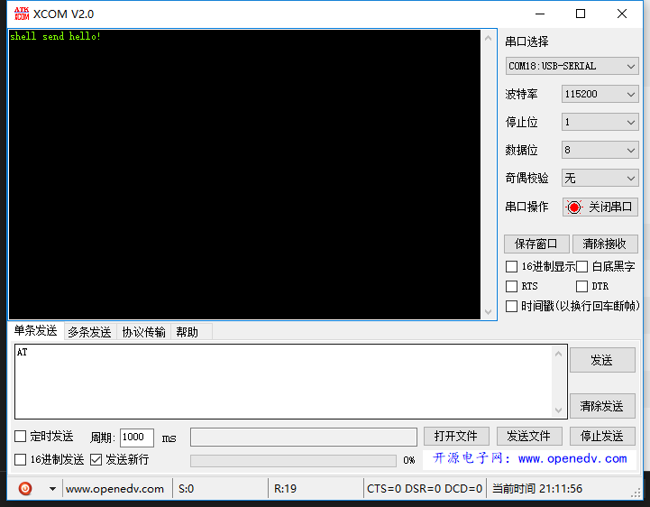
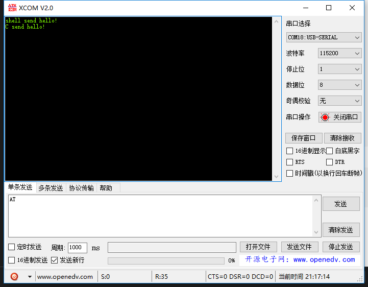

上一篇[文章](https://zhen8838.github.io/2018/06/20/Linuxblue2/)描述了如何使用编程的方式去搜索附近蓝牙，这一次记录我如何编程与HC-06串口蓝牙模块通信。

<!--more-->


## 搜索以及配对
如果自己写程序进行搜索与配对，会十分麻烦，这里我就偷懒，使用bluez自带的方式进行蓝牙的配对。
使用bluetoothctl配对蓝牙设备，操作如下：
```sh
bluetoothctl
scan on #开启搜索
devices #查看附近设备
scan off #关闭搜索
agent on #开启代理
default-agent
pair 98:D3:37:91:00:DD #配对蓝牙，会提示输入ping码
quit #退出
```

## rfcomm通信
rfcomm是模拟串口的一种通信方式，与串口蓝牙也是以这个方式通信的。方式有两种。

1.  命令行操作
    ```sh
    rfcomm connect hci0 98:D3:37:91:00:DD & #放入后台执行
    ```
    出现一下内容代表建立rfcomm成功。
    ```sh
    Connected /dev/rfcomm0 to 98:D3:37:91:00:DD on channel 1
    ```
    现在我们可以通过对`/dev/rfcomm0`操作来发送数据，比如：
    ```sh
    echo "shell send hello!" > /dev/rfcomm0
    ```
    可以看到蓝牙接收到这条数据了：

    

2.  程序操作
    编写程序如下（**要先配对才可以**）：
    
    ```c
    #include <stdio.h>
    #include <unistd.h>
    #include <sys/socket.h>
    #include <bluetooth/bluetooth.h>
    #include <bluetooth/rfcomm.h>
    #include "tlpi_hdr.h"
    int main(int argc, char **argv)
    {
        struct sockaddr_rc addr = { 0 };
        int s, status;
        char dest[18] = "98:D3:37:91:00:DD";

        // allocate a socket
        s = socket(AF_BLUETOOTH, SOCK_STREAM, BTPROTO_RFCOMM);

        // set the connection parameters (who to connect to)
        addr.rc_family = AF_BLUETOOTH;
        addr.rc_channel = (uint8_t) 1;
        str2ba( dest, &addr.rc_bdaddr );

        // connect to server
        status = connect(s, (struct sockaddr *)&addr, sizeof(addr));

        // send a message
        if( status == 0 ) {
            status = write(s, "C send hello!\n", 16);
        }

        if( status < 0 ) 
        {
            errExit("connct error");
        }

        close(s);
        return 0;
    }
    ```
    

    编译运行：
    ```sh
    root@H5:~# gcc -o rfuart_client rfuart_client.c -lbluetooth
    root@H5:~# ./rfuart_client
    [1]+  Done                    rfcomm connect hci0 98:D3:37:91:00:DD
    ```
    结果如下：

    