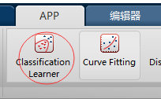
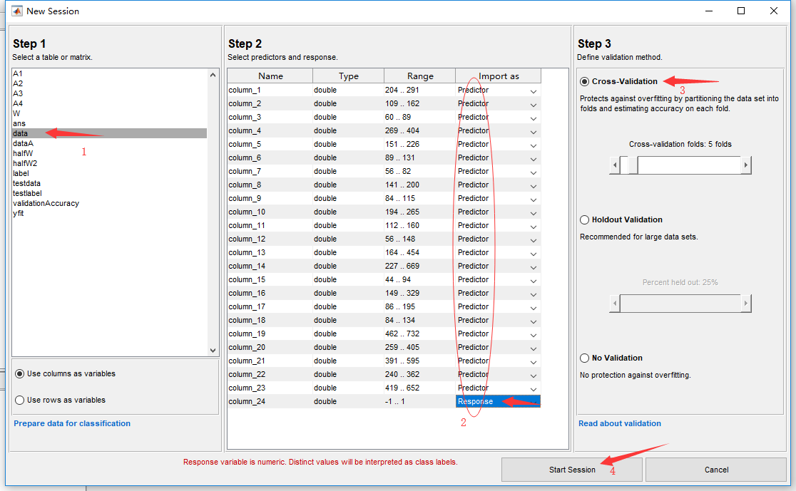

&emsp;&emsp;在matlab中，既可以使用函数来对数据进行分类，也使用图形化界面的工具箱来进行分类操作。接下来讲讲如何使用。**这里我主要介绍受监督的训练模型分类。** 

<!--more-->


&emsp;&emsp;使用此工具箱, 我们可以使用各种分类器来探索受监督的机器学习。同时可以浏览数据、选择功能、指定验证方案、培训模型和评估结果。可以执行自动培训以搜索最佳分类模型类型, 包括决策树、判别分析、支持向量机、逻辑回归、最近邻居和集合分类等等。

-   **什么是受监督的机器学习？**

    >&emsp;&emsp;通过提供已知的一组输入数据 (观察或示例) 和已知的数据响应 (例如, 标签或类) 来执行受监督的机器学习。使用数据培训模型, 以生成对新数据的响应的预测。若要将模型与新数据一起使用, 或者要了解编程分类, 可以将模型导出到工作区或生成 MATLAB^R^用于重新创建经过培训的模型的代码。
    
    
    
#   点击开始自动分类器

&emsp;&emsp;我们可以使用**Classification Learner**对数据进行自动训练并且能选择不同的模型。
&emsp;&emsp;我们在**APP**选项卡中单击**Classification Learner**即可启动。



#   新建训练模型

&emsp;&emsp;单击**New Session**建立新模型,出现下图对话框:



*   **Step1:选择数据**
    &emsp;&emsp;这里输入的数据必须要**参数与标签合一**的数据，比如我放入的数据是data，为套管缺陷数据。是一个$286*24$的矩阵，其$1\sim23$列为数据参数，第$24$列为标签，有缺陷为$1$,无缺陷则为$-1$。
    
    &emsp;&emsp;其中$1\sim200$行为无缺陷数据，所以对于的$24$列都为$-1$，$201\sim286$行为有缺陷数据，所以对于的$24$列都为$1$。

*   **Step2:选择预测者与反应者**

    &emsp;&emsp;首先这里放入数据是，我选择了column模式，所以是以列作为读取数据顺序。$1\sim23$列都为数据参数，所以作为**Predictor**导入。$24$列作为标签，所以作为**Response**导入。

*   **Step3:选择验证模式**

    &emsp;&emsp;这里选择**交叉验证**(Cross validation),目的是为了得到可靠稳定的模型。在建立PCR 或PLS 模型时，一个很重要的因素是取多少个主成分的问题。用cross validation 校验每个主成分下的PRESS值，选择PRESS值小的主成分数。或PRESS值不再变小时的主成分数。
    &emsp;&emsp;也可以Holdout验证，随机从最初的样本中选出部分，形成交叉验证数据，而剩余的就当做训练数据。 一般来说，少于原本样本三分之一的数据被选做验证数据。

*   **Step4:点击开始**    

#   开始训练

&emsp;&emsp;新建模型完毕后，可以选择各种类型的分类器进行数据分类。


*   **Step1:选择PCA参数**
    &emsp;&emsp;我们可以对数据进行PCA降维，也可以调整PCA中的某些参数来调整训练模型。
*   **Step2:选择分类器类型**
    &emsp;&emsp;这里可以选择SVM分类器、KNN分类器、逻辑回归分类器等等。每种分类器中都可以选择不同的核函数，比如SVM分类器，可以选择Linear核、Quadratic核、cubic核、Gaussian核等。
*   **Step3:选择扩展设置**
    &emsp;&emsp;在这里我们可以分类器的参数做调节，典型的参数有:惩罚因子等级、核函数缩放因子、参数是否标准化等等。
*   **Step4:运行**
    &emsp;&emsp;接下来直接运行即可得出训练模型。

#   训练结果

&emsp;&emsp;我这里对所有的SVM模型都进行了运行，可以查看到如下界面。 


*   **1:分类模型状态**

    &emsp;&emsp;可以查看到当前有100%的准确率，这个准确率是之前使用交叉验证，模型对于自己的分类结果做的验证的准确率。

*   **2:数据图表**

    &emsp;&emsp;这里可以对数据各个部分进行可视化分析。

*   **3:图表选项**

    &emsp;&emsp;因为目前是24维数据，对于2维图形是无法全部绘制的，所以可以选择对任意两个维度作图。

*   **4:导出模型**

    &emsp;&emsp;模型建立完毕后，可以选择导出模型，进行下一步的工作。

#   预测结果

&emsp;&emsp;我将导出的模型对新输入缺陷与非缺陷数据进行识别。代码如下:

```matlab
%% 开始预测
yfit = trainedClassifier1.predictFcn(testdata);
n=sum(testlabel ==  yfit)/length(testlabel)*100;
disp('Linear SVM');
disp(n);

yfit = trainedClassifier2.predictFcn(testdata);
n=sum(testlabel ==  yfit)/length(testlabel)*100;
disp('Quadratic SVM');
disp(n);

yfit = trainedClassifier3.predictFcn(testdata);
n=sum(testlabel ==  yfit)/length(testlabel)*100;
disp('Cubic SVM');
disp(n);

yfit = trainedClassifier4.predictFcn(testdata);
n=sum(testlabel ==  yfit)/length(testlabel)*100;
disp('Fine Gaussian SVM');
disp(n);

yfit = trainedClassifier5.predictFcn(testdata);
n=sum(testlabel ==  yfit)/length(testlabel)*100;
disp('Medium Gaussian SVM');
disp(n);

yfit = trainedClassifier6.predictFcn(testdata);
n=sum(testlabel ==  yfit)/length(testlabel)*100;
disp('Coarse Gaussian SVM');
disp(n);
```
**结果如下:**
```matlab
Linear SVM
   84.2105

Quadratic SVM
   84.2105

Cubic SVM
   84.2105

Fine Gaussian SVM
   86.4662

Medium Gaussian SVM
   84.9624

Coarse Gaussian SVM
   84.2105

```


