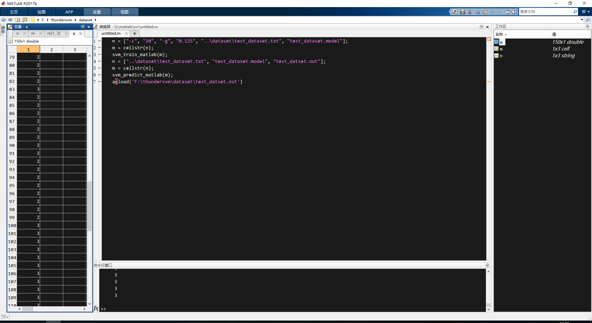

我决定用这个SVM库加速我的svr模型训练。我的系统是Windows，Matlab版本是2017b。我需要自己编译安装入坑一波。[官方手册](http://thundersvm.readthedocs.io/en/latest/get-started.html#)


<!--more-->


# 准备

1.  cmake
    在cmake[官网](https://cmake.org/download/)下载Windows win64-x64 Installer并安装。

2.  Visual C++
    这个我的电脑已经安装了Visual Studio 2015。我可以在matlab中查看我的c++编译器版本
    ```matlab
    >> mex -setup c++
    MEX 配置为使用 'Microsoft Visual C++ 2015 Professional' 以进行 C++ 语言编译。
    警告: MATLAB C 和 Fortran API 已更改，现可支持
        包含 2^32-1 个以上元素的 MATLAB 变量。您需要
        更新代码以利用新的 API。
        您可以在以下网址找到更多的相关信息:
        http://www.mathworks.com/help/matlab/matlab_external/upgrading-mex-files-to-use-64-bit-api.html。

    要选择不同的 C++ 编译器，请从以下选项中选择一种命令:
    Microsoft Visual C++ 2015  mex -setup:H:\MATLAB\R2017b\bin\win64\mexopts\msvcpp2015.xml C++
    Microsoft Visual C++ 2015 Professional  mex -setup:C:\Users\59732\AppData\Roaming\MathWorks\MATLAB\R2017b\mex_C++_win64.xml C++
    ```

1.  CUDA
    如果需要使用gpu加速，需要安装[CUDA](https://developer.nvidia.com/cuda-downloads) 7.5以上版本。**(必须先安装Visual Studio)**

# Windows版安装

1.  下载工程。
手动下载zip的话，文件夹名不一样，需要修改。
```sh
git clone https://github.com/zeyiwen/thundersvm.git
```

2.  构建Visual Studio工程
进入文件夹中。
```sh
cd thundersvm
mkdir build
cd build
cmake .. -DCMAKE_WINDOWS_EXPORT_ALL_SYMBOLS=TRUE -DBUILD_SHARED_LIBS=TRUE -G "Visual Studio 14 2015 Win64"
```
这个`Visual Studio 14 2015 Win64`是因为我安装了Visual Studio 15，对应的cmake选择的版本是这个，成功后生成如下文件。


3.  编译
打开`thundersvm.sln`。选择`生成`->`生成ALL_BUILD`。成功后如下：
```sh
5>------ 已启动生成: 项目: ALL_BUILD, 配置: Debug x64 ------
5>  Building Custom Rule F:/thundersvm/CMakeLists.txt
5>  CMake does not need to re-run because F:/thundersvm/build/CMakeFiles/generate.stamp is up-to-date.
========== 生成: 成功 5 个，失败 0 个，最新 0 个，跳过 0 个 ==========
```

# 测试

我这里直接测试Matlab的使用。

1.  添加路径
将他的matlab函数添加到默认路径。


1.  程序
因为我是Windows，所以官方的例子的斜杠需要更换
```matlab
n = ["-c", "10", "-g", "0.125", "..\dataset\test_dataset.txt", "test_dataset.model"];
m = cellstr(n);
svm_train_matlab(m);
n = ["..\dataset\test_dataset.txt", "test_dataset.model", "test_datset.out"];
m = cellstr(n);
svm_predict_matlab(m);
a=load('F:\thundersvm\dataset\test_datset.out')
```
svm分类结果输出如下：

