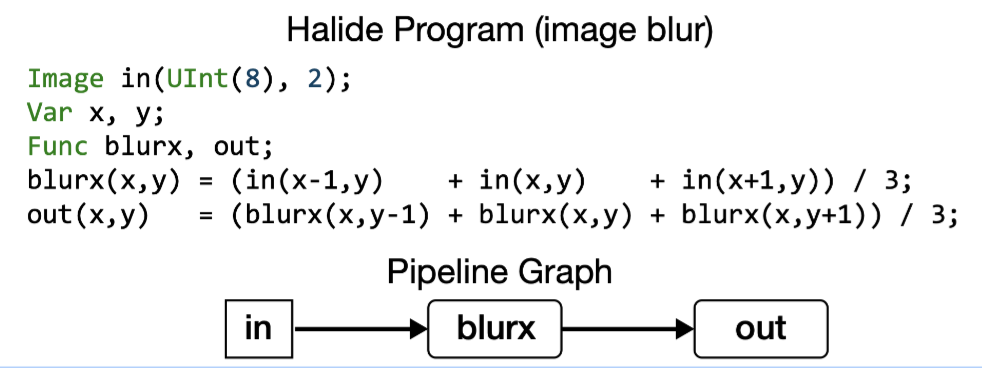
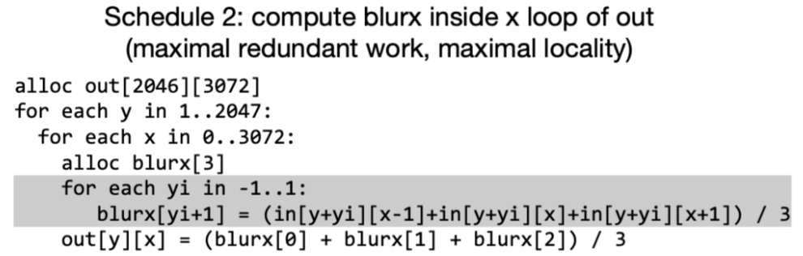
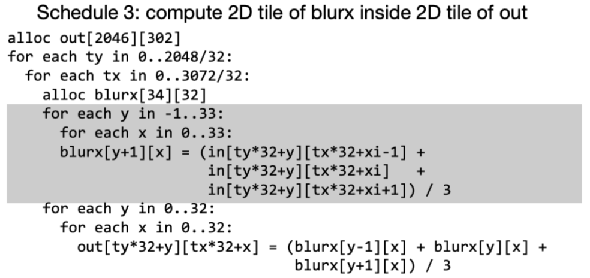
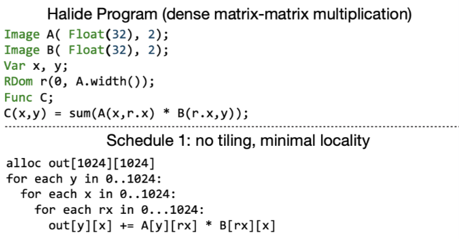
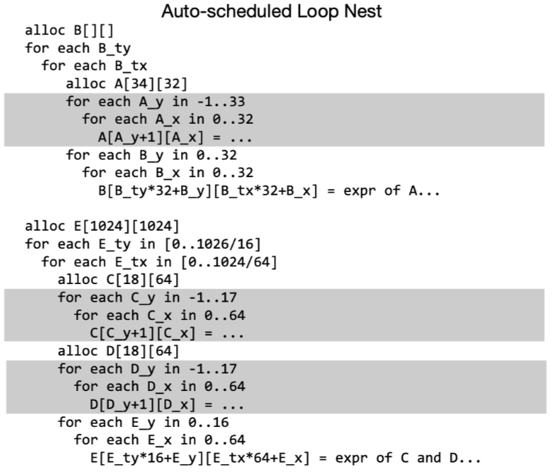
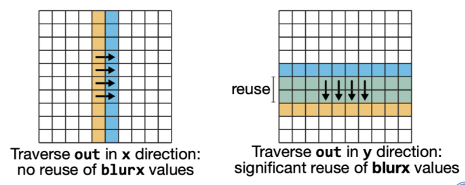
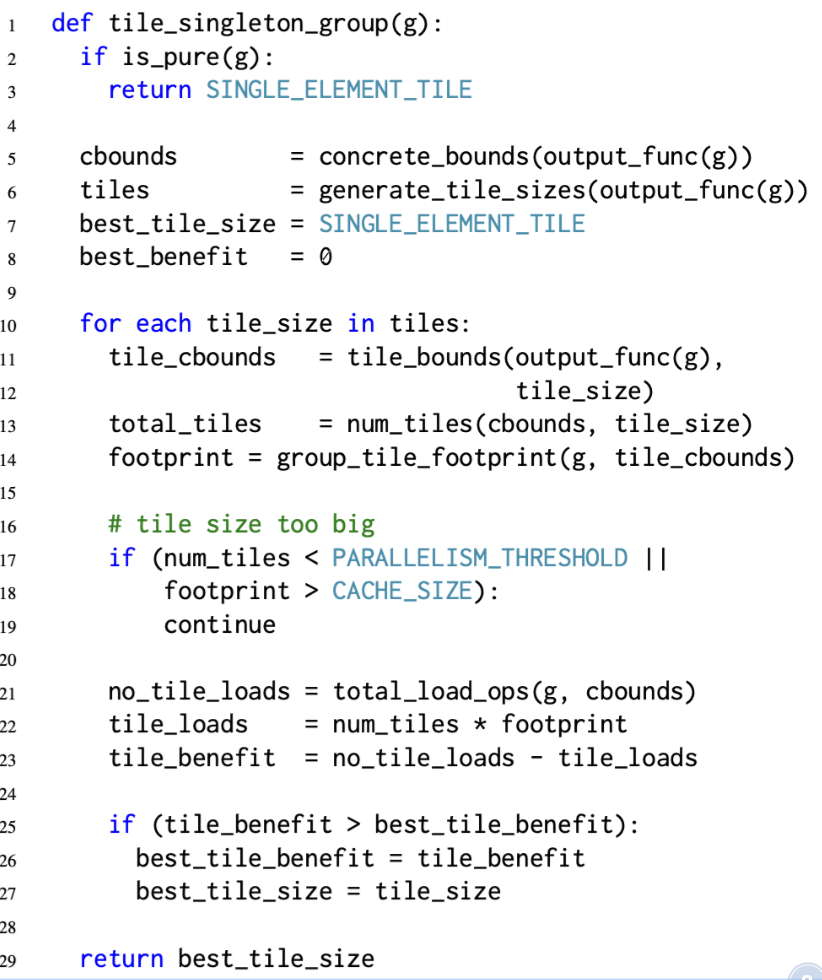

关于halide中自动调度baseline算法的论文笔记. 二作目前还在维护halide.

<!--more-->

# 0. Abstract

在本文中,提供了一种用于自动生成halide程序的高性能调度策略的算法. 此解决方案扩展了已经存在于halide编译器中的边界分析,来自动实施典型的halide的局部性转换和并行执行调度策略. 该算法不需要非常大的自动搜索空间,在几秒钟内就能为广泛的图像处理算法创造性能对标的大型图像处理库的调度结果,同时支持CPU以及GPU.

# 1. Introduction

本文的方法利用了halide自身的函数边界分析, 来自动的执行提升函数局部性的transform. 因为分析系统使用了halide内置的系统,本文算法可以支持原生的任何halide程序.

# 2. Prior Work

这篇文章的作者在2015年已经使用了polyhedral的机制去进行调度(PolyMage). 但是由于polyhedral的机制很难去对数据reuse的情况进行分析, 所以本文抛弃了组合后tiling的方式, 采用交错分析等方法. PolyMage对于输出图像上的fusion/overlapped tiling有比较好的调度结果, 它在stage fusion之后使用polyhedral分析来生成有效的嵌套循环, 但它依赖于在一系列的tiling sizes上做出stage-fusion的决策. 一些数据相关的操作(直方图/lookup table),没有仿射变换的程序,以及严重依赖数据reuse的神经网络等,受限于模板和上/下采样, 无法被PolyMage的overlapped tiling analysis比较好的支持. 因此本文吸收了PolyMage分组后tiling的方法,并且使用区间分析而不是polyhedral分析.因此这种方法不需要autotuning(需要巨大的搜索空间), 并且可以生成人类更加容易理解的调度结果. 

# 3. Representing and Scheduling Programs

Halide的算法是基于数据流的,其中DAG上每个节点都对应于在一个N-D维度上的函数.

如下的halide代码就对应了一个简单的计算图, 包含两个函数(Blurx和Out),每个函数在由变量x和y参数化的2维上进行计算. DAG中的边对应于函数之间的数据依赖性, 即有一个边从Blurx到Out,因为每个out的值是Blurx产生的三个值的总和.



一个halide的算法只关注于他在函数输出上的domain中所需要计算的每个点, 不关心这个domain上点的计算顺序或者产生这些点中间过程的顺序. 调度的目标就是调整所有的输出domain上point的计算顺序,使其得到最高的效率.

## 3.1 Scheduling for Producer-Consumer Locality

对于上面的代码, 第一个简单的调度方式如下,当需要输出一个图像时,首先计算生成blurx所有需要的元素, 将这些数据放到一个大的buffer中,然后再使用这个buffer计算最终的结果. 这种调度将会受限于带宽.


此时换一种调度方式, 将计算blurx放到不同的循环位置, 那么计算完blurx立刻被消耗, 不同的循环位置决定了不同的data reuse distance. 当前这种方式最大化了producer-consumer locality, 但是也带来了recompute的问题, 即多算了3次.



为了更好的平衡了局部性和冗余计算的问题, 可以采用新的调度. 因为中间数据量比较小,因此可以开一个大一些的local buffer,这样每次的recompute只是在tile的边界区域,减少了冗余计算的次数. 接下来就需要选择合理的tling大小, 让并行的计算提升超过冗余计算带来的开销.




即使在这个简单的例子中,全局循环reorder也对程序的性能产生了大量影响.  真实世界图像处理管道可能包含数百个function,为了有效地调度它们,我们要调整多维tiling的大小/生产者和消费者在循环中的位置, 从而在局部性/并行性/冗余计算之间的trade-off.

## 3.2 Scheduling for Input Reuse

除了调整producer的位置放到consumer里距离更近的地方来增加局部性. 当data reuse比producer-consumer locality重要时, 建议通过调整consumer的位置增加读取相同数据局部性. 

比如矩阵乘的例子, 当在尺寸$N\times N$的输入A和B上执行该程序时,计算C将每次n次访问A和B的每个元素. 如下图所示,在访问到相同的输入值之间访问输入函数的整个行或列(重用距离与输入矩阵的大小成比例).  对于大输入矩阵,输入值将不再留在在处理器的缓存中,导致低性能.  



此时可以利用tiling将问题减少到一个较小的矩阵乘法序列,这样可以把输入保存在高速cache中. 


综上, 利用循环tiling来最大化输入局部性是计算过程中的关键优化.


## 3.3 Function Bounds Analysis

Halide的一些调度原语 (compute_at, reorder, tile) 可以帮助我们做到上面那些事情,但是为了量化如何做, 编译器必须能够确定适当的loop bound和中间buffer的大小.

比如上面在计算blur的out时, 必须得先计算出blurx的(x, y-1..y+1)三个值并保存. halide通过对基于表达式的区间分析来推导出每个符号函数的边界. 

比如计算blur的function中, out是的在$(x_{min}..x_{max}, y_{min}..y_{max})$的domain上定义的. 然后halide反推出symbolic bounds expression:

$$
\begin{aligned}
&blurx: (x_{min}..x_{max}, &y_{min}-1..y_{max}+1) \\
&in: (x_{min}-1..x_{max}+1, &y_{min}-1..y_{max}+1)
\end{aligned}
$$

如果我们设置固定的输出信息, 比如设置out为$(5..10,10..20)$
那么将得到
$$
\begin{aligned}
&blurx: (5..10,&9..21)\\
&in: (4..11,&9..21)
\end{aligned}
$$


从输出函数开始,边界推理依据函数依赖关系链式传播, 然后将边界信息更新到整个DAG.如果halide无法推理整个函数的边界信息时(比如隐式依赖导致无法建立传播链), 我们也可以直接显式的为函数设置边界信息, 因为自动化的schedule是离不开边界分析所提供做决策的信息的,所以无论如何必须要可以获得它.

# 4. Algorithm

本论文自动调度方法如下图所示:


将整个halide的function,分离到多个function group然后在每个小的function group中独立的调度从而优化 producer-consumer locality和input reuse locality.

halide虽然允许我们随意的调整每个group中的循环order, 来扩大优化的解空间,但是本文考虑缩小调度的空间,只考虑在function 输出的循环上做 tiling.

因为当输出被tiling之后,当前group的其他producer function也会被放到被tiled的循环中(为所有生产者指定唯一的计算位置). 在第5节中,作者证明了可以在在这种子搜索空间中找到高性能的调度解.



在上图中展示了一种可能的schedule方案, 注意到所有的function都会在这个group的输出function中计算(灰色区域), 此时同一个group中的producer-consumer关系通过一个比较小的local buffer(A,C,D)进行管理, 实际运行时他们很容易被保存在cache上. 然后每个group之间则通过main memory进行通信(Buffer B).

本文的自动调度器可以分析当前halide所有能表达的代码, 只有一种例外:  输入程序被约束了只能为每个函数更新一次规则.(也就是没有被调度过)

到目前为止作者还没有发现这个情况会带来多少限制,至少作者验证过当前所有paper中halide程序的. (PS: 我测了直接调度整个resnet50 直接core dump 😂) 

除了需要输入halide的源程序外,还要求设定输出function的边界信息. 这种要求也是是非常合理的,如果不知道一些静态信息,就将无法通过数据依赖性访问而无法推断出界限, 也无法知道每个buffer所需要的大小。

# 4.1 Function Preprocessing

#### 1. Estimate arithmetic cost.

  即估计数学运算的cost, 比如除法等计算,cost要高于其他计算.

#### 2. Compute concrete bounds

  即利用内置的bounds analysis计算所有函数的边界.

#### 3. Compute per-direction input reuse.

  为了辅助决策, 对于每个函数需要计算它在哪一个loop order上进行迭代可以产生更高的输入数据reuse. 如下图所示, 考虑以行先的顺序计算输出out的元素, 每个元素只需要从相同的blurx的列进行取数,因此每个our所需要的元素都是一组新的input集合, 这样就没有重叠的数据reuse了. 相比之下,如果以列在先的顺序计算out, 那么每次都可以两到三个数据reuse.

  

我们可以直接通过bounds计算出输出重用率,  比如给定一个索引,经过bounds的变化之后检查是否还是同一个(取交集), 如果交集越大,那么表示多个输入得到了相同的index, 数据reuse就高, 比如计算在在 x 方向上的遍历的重用结果:
```cpp
mid = c_xmin + (c_xmin + c_xmax) / 2 
b1 = bounds(f, g, mid..mid+1, c_ymin..c_ymax, ...) 
b2 = bounds(f, g, mid+1..mid+2, c_ymin..c_ymax, ...) 
b_reuse = intersect(b1, b2)
```

其中函数bounds会返回给定边界的函数f计算时所需要的函数g的边界信息. 预处理的步骤就是计算所有迭代方向上函数f祖先的数据reuse.

## 4.2 Function Grouping and Tiling

经过预处理之后, 开始进行函数分组, 分组则是为了找到程序中有益于重组计算顺序来提升  producer-consumer locality的一个点. 这就需要确定如何tiling consumer的循环,以及在那个循环级别放置producer.

本文算法使用迭代的贪心方法将halide program进行分组.分组后, 每个组执行独立的reordering/tiling schedule. 每个组中包含多个halide的funcion, 但是每个组也只能有一个output funcion(分离出所有来自于同一函数的依赖边), 所有组中的其他函数都将在output function的循环中进行计算(也就是producer放到consumer的那层循环). 


首先将每个函数分为一个group, 对于每个单例组寻找到可以最大化input data reuse的tiling size(如果可以reuse).然后每个迭代中尝试将合并两个组来检查是否能增加producer- consumer locality. 当调度器无法再进行merge group的操作时,停止迭代. 每个function 分组迭代包含了以下几个步骤:

1. 枚举所有剩余的group合并机会
2. 对于每个可merge的机会,评估收益(merge之后tiling size是否需要修改?和前面group合并还是后面的group合并?)
3. 选择产生最大的提升的group进行合并

### 4.2.1 Initialization: Tiling for Input Data Reuse

调度器尝试查找通过每个non-pure的函数来改进输入数据访问的循环tiling。(pure-function 即不包含任何halide更新定义或reduce domain的函数,例如不用tiling直接就具备良好的input locality), 然后采用了一个单级存储层级的简单模型进行分析,其执行的伪代码如下:



主要就是检查一系列的tiling size 是不是可以满足l1 cache size等. 然后通过计算load ops检查数据重用的机会,找到满足条件的最优tiling.

这个方法假设所有的非纯函数都还没有被tiling过,所有的输入数据都是cache misses(通过total_load_op计算得到). 然后tiling所有输出需要的输入, 让这些输入可以放到cache中, 最后算法找到计算输出所需要的最少load次数时的tile size. 

为了加速tile size的搜索, 本文将tile size向着可以得到更大input data reuse的方向上增加tile size.同时自动调度器还考虑到tile size下tile的个数能不能满足最小的并行化限度.(这里默认能做parallel肯定会更快)

### 4.2.2 Enumerating Merging Opportunities

Grouping是为了增加组中函数的producer-comsumer locality. 因此, 如果两个组g1和g2, g1将被g2中的某个函数所消耗,那么将他们作为一个candidate.


由于在两个不同的loop nests中取计算同一个function将会造成重复执行, 因此grouping只会尝试合并唯一消耗g1的输出的那个组. 比如[上图](Mullapudi2016/Algorithm1.png)所示, 函数对A-B,C-E,D-E都是candidate. 但是B-C和B-D不是,因为B的输出同时被C和D所消耗了.

### 4.2.3 Evaluating Potential Merges

评估整体代码的performce收益来确定是否进行mege. 通过函数evaluate_group_merge来确定合并当前两个group的最佳schedule, 然后返回估计的benefit.


#### Generating tile sizes.

计算tile size对于性能的影响很大,但是对于一个高维的nest loop,遍历去evaluate所有的tile size来计算cost是也是不现实的. 因此本文按章节4.1中所描述的, 按照group 输出function的data reuse方向取选择潜在的tile size. 具体地,本文将tile size约束为N-D的hypercubes,并在最大的输出函数data reuse的方向上拉伸。 当tile变大时可以有效减少因为tile所引入的冗余计算。 进一步我们要求tile 在最内的循环上扩展最小的维度,同时把最小值设置为目标机器向量宽度的小倍数,保证不会超出cache size同时可以轻易的vectorize。 后面再由评估函数group_tile_footprint(行28)要求编译器通过根据候选区块大小调度group的循环顺序来确定所需临时buffer分配的大小.

#### Comparing costs.

对于每个候选的tilie size,需要估计并比较执行grouping的成本,对于不合并的cost由生产者和消费者组的算术成本(Arith_cost,加上每个组的内存载入cost(Group_loads)组成。 总的load次数(整个程序的执行)由其输出函数(11-12行)的具体边界和group当前设置的tile size给出。 其中LOAD_COST则是从mian memory中加载数据cost的系数. 

假设所有的被merge的group所产生的intermediate buffer都存储在cache上, 那么merged output的一个tile的cost则是由算数操作加上所需要的input的load(gropu_tile_loads)所组成. 总的merged cost则是每个tile cost的乘积. 

最后evaluate_group_merge 返回找到的最佳tile下的performance.


## 4.3 Function Inlining

此外将producer函数内联到consumer中可能是有利的(如果是手动编写的Halide schedule是需要显式的使用inline指令).

虽然inline的概念类似于在grouping的过程中选择tile size, 但是inline后所产生的code 会更加高效(中间计算结果不通过load store, 直接存储在寄存器中).

本文在这里描述function inling,但是其实际执行的位置是在recompute之后, merge group之前. 

内联也是通过类似的贪心迭代方法得到的, 但是有如下的区别:

1.  为了简单起见, 调度器是综合每个函数的基础上确定是否inling. 一个函数要么inline到他所有的consumer上(最终从dag上移除), 要么不做任何inline(后续在group merge中进行优化).


2. 如果当前一个函数可以被inline到consumer中, 计算cost的时候会计算把当前函数inline到每个consumer后的cost. 而不是像group merge一样只考虑当前两个group merge后的cost.


3. 自动调度器不是用边界分析来估计inline后的arithmetic cost.  相反, 他是将producer的表达式直接替换成consumer, 然后估计consumer的cost, 这样可以得到更加精确的预测结果.


## 4.4. Final Schedule Generation

当inline和merge group结束之后, 调度器返回了一堆group,每个group固定了一个loop tiling. 调度的最后一步就是为每个group生成完整的优化调度.

首先是reorder每个group的output function, 达到最高的input locality. 为了保证数据访问的空间局部性和vectorize的能力, loop reorder是不会将最内侧的循环从其起始位置进行移动.

接下来auto-scheduler unroll这些一些小循环, 最后再添加一些外部循环上的并行.

在这些操作之后,每个group都有完整的schedule。后续就是codegen了.


# Evaluation

本文使用了14个halide 的典型算法进行评估.可以发现最终结果还是不错的,在VGG/ConvLayer这种人工调优麻烦的场景下,可以取的不错的效果. 同时相比于大规模的auto-tune搜索的方式来说又节约了不少时间. 值得注意是基于polyhedral的方法polymage的表现在多个stage的算法面前就比较差了.


# 代码实现

## 0. find_transitive_calls

遍历最后输出的outputs func, 每个funcion accept 一个`FindCall visitor`. 这个`FindCall visitor`就是把所有`call {Type=Halide}`的节点全部取出来.

这里我觉得accept是个比较好的设计, 因为expr visitor只能通过visitor自己去遍历expr,但是如果你定义了一堆非expr的数据结构,然后你的visitor还得扩展visit函数,非常麻烦. 那么应该是每个扩展的数据结构中自定义accept函数,主动调用visitor进行遍历.这样就可以支持各种形式的遍历了.

## 1. topological_order

得到调用顺序

## 2. Validating no partial schedules

当前的auto schedule无法对一些已经schedule的program进行进一步调度. 需要先排除.

## 3. Checking estimates on outputs

遍历每个output的index var, 然后检查bounds的min max是否被定义, 只是单纯检查有没有定义,还没有进行边界计算

## 4. Inlining all trivial functions

把可以inline的函数都进行内敛.

## 5. realization_order

暂时不是很理解, 可能是消除了一些输入节点的函数实例化的顺序

## 6. Inlining all element-wise functions

这里是要对一些局部定义的function进行inline. 比如:
```python
f1(x) = x
f2(x) = f1(x) + 2
f3(x) = f1(x) * 2
f4(x) = f2(x) + f3(x)
f5(x) = f4(x) + 3
```
第一次inline把f3、和f2集成到f4中了,然后现在f1也可以被inline到f4中了.

## 7. Computing function value bounds

这里是正经的计算所有function 值的bounds.做法就是把所有的bound的expr推导出来,然后做一些常量消除.
NOTE 这里是推断的具体的数值区间,而不是shape.

## 8. Initializing region costs

cost中包含了数学运算以及memory的信息, 到时候利用memory去计算load store的cost. 也是利用vistor的方式收集信息,不过他这里和论文有所出入, 实际上所有的binary的cost都是1. 对于除法并没有给定额外的cost值. 

对于halide的call, cost =( arith+1, memory+ types.bytes). 然后将当前call的数据bytes存储下来,给后面需要用这个函数的地方使用.
```cpp
if (call->call_type == Call::Halide || call->call_type == Call::Image) {
    // Each call also counts as an op since it results in a load instruction.
    arith += 1;
    memory += call->type.bytes();
    detailed_byte_loads[call->name] += (int64_t)call->type.bytes();
```

下面是一个function的cost计算结果,后面的`((int64)9, (int64)16)`分别表示数学cost和 memory cost.

```sh
(((float32)repeat_edge(x, y, 2)*0.114000f) + (((float32)repeat_edge(x, y, 0)*0.299000f) + ((float32)repeat_edge(x, y, 1)*0.587000f)))
(f0, 0) -> ((int64)9, (int64)16)
(((float32)f0(x + 1, y + 1) + ((((float32)f0(x, y + 1)*2.000000f) + (((float32)f0(x, y + -1)*-2.000000f) + ((float32)f0(x + -1, y + 1) - (float32)f0(x + -1, y + -1)))) - (float32)f0(x + 1, y + -1)))*0.083333f)
(f1, 0) -> ((int64)25, (int64)28)
(let t3 = (((float32)f3(x + 1, y + 1) + ((float32)f3(x + 1, y) + ((float32)f3(x + 1, y + -1) + ((float32)f3(x, y + 1) + ((float32)f3(x, y) + ((float32)f3(x, y + -1) + ((float32)f3(x + -1, y + 1) + ((float32)f3(x + -1, y + -1) + (float32)f3(x + -1, y))))))))) + ((float32)f4(x + 1, y + 1) + ((float32)f4(x + 1, y) + ((float32)f4(x + 1, y + -1) + ((float32)f4(x, y + 1) + ((float32)f4(x, y) + ((float32)f4(x, y + -1) + ((float32)f4(x + -1, y + 1) + ((float32)f4(x + -1, y + -1) + (float32)f4(x + -1, y)))))))))) in ((let f9.t2 = ((float32)f5(x + 1, y + 1) + ((float32)f5(x + 1, y) + ((float32)f5(x + 1, y + -1) + ((float32)f5(x, y + 1) + ((float32)f5(x, y) + ((float32)f5(x, y + -1) + ((float32)f5(x + -1, y + 1) + ((float32)f5(x + -1, y + -1) + (float32)f5(x + -1, y))))))))) in ((((float32)f3(x + 1, y + 1) + ((float32)f3(x + 1, y) + ((float32)f3(x + 1, y + -1) + ((float32)f3(x, y + 1) + ((float32)f3(x, y) + ((float32)f3(x, y + -1) + ((float32)f3(x + -1, y + 1) + ((float32)f3(x + -1, y + -1) + (float32)f3(x + -1, y)))))))))*((float32)f4(x + 1, y + 1) + ((float32)f4(x + 1, y) + ((float32)f4(x + 1, y + -1) + ((float32)f4(x, y + 1) + ((float32)f4(x, y) + ((float32)f4(x, y + -1) + ((float32)f4(x + -1, y + 1) + ((float32)f4(x + -1, y + -1) + (float32)f4(x + -1, y)))))))))) - (f9.t2*f9.t2))) - ((t3*t3)*0.040000f)))
(f11, 0) -> ((int64)153, (int64)184)
(((float32)f0(x + 1, y + 1) + ((((float32)f0(x + 1, y)*2.000000f) + (((float32)f0(x + -1, y)*-2.000000f) + ((float32)f0(x + 1, y + -1) - (float32)f0(x + -1, y + -1)))) - (float32)f0(x + -1, y + 1)))*0.083333f)
(f2, 0) -> ((int64)25, (int64)28)
(let t0 = (float32)f2(x, y) in (t0*t0))
(f3, 0) -> ((int64)3, (int64)8)
(let t1 = (float32)f1(x, y) in (t1*t1))
(f4, 0) -> ((int64)3, (int64)8)
((float32)f2(x, y)*(float32)f1(x, y))
(f5, 0) -> ((int64)4, (int64)12)
(float32)f11(x + 2, y + 2)
(output1, 0) -> ((int64)4, (int64)8)
((float32)f11(x + 2, y + 2)*(float32)factor)
(output2, 0) -> ((int64)5, (int64)8)
(let lambda_0._2 = max(min(likely(_2), (input.extent.2 + input.min.2) + -1), input.min.2) in (let lambda_0._1 = max(min(likely(_1), (input.extent.1 + input.min.1) + -1), input.min.1) in (let lambda_0._0 = max(min(likely(_0), (input.extent.0 + input.min.0) + -1), input.min.0) in (float32)input(lambda_0._0, lambda_0._1, lambda_0._2))))
(repeat_edge, 0) -> ((int64)14, (int64)8)
```

## 9.  dependence analysis and Computing pipeline bounds

通过依赖分析以及给定参数的estimates推理整个pipeline的bounds. halide的var其实表示的就是index的, 这里他把输出看做一个box,我觉得可以叫tensor,每个维度上有自己的min max. 得到的结果如下:
```sh

================
Pipeline graph:
================
f0: {f1, f2}
f1: {f4, f5}
f11: {output1, output2}
f2: {f3, f5}
f3: {f11}
f4: {f11}
f5: {f11}
repeat_edge: {f0}
================

================
Pipeline bounds:
================
f0 -> {[0, 1027], [0, 1027]}
f1 -> {[1, 1026], [1, 1026]}
f11 -> {[2, 1025], [2, 1025]}
f2 -> {[1, 1026], [1, 1026]}
f3 -> {[1, 1026], [1, 1026]}
f4 -> {[1, 1026], [1, 1026]}
f5 -> {[1, 1026], [1, 1026]}
input -> {[0, 1023], [0, 1023], [0, 2]}
output1 -> {[0, 1023], [0, 1023]}
output2 -> {[0, 1023], [0, 1023]}
repeat_edge -> {[0, 1027], [0, 1027], [0, 2]}
===============
```

## 10. Initializing partitioner

