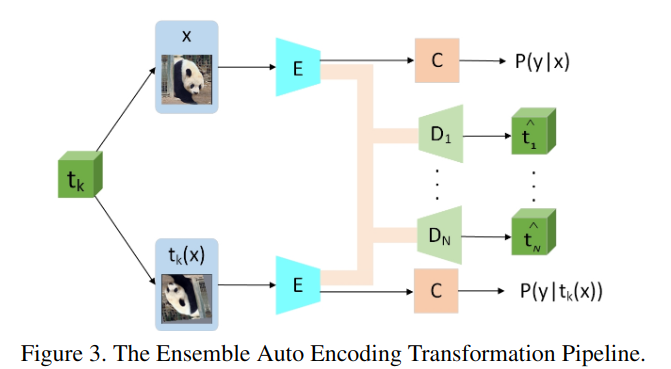

今天看两篇论文，因为只是学习一下他们的思路，所以不进行细写。

1.  RealMix: Towards Realistic Semi-Supervised Deep Learning Algorithms
2.  EnAET: Self-Trained Ensemble AutoEncoding Transformations forSemi-Supervised Learning

<!--more-->

# EnAET

`EnAET`表示的是`Ensemble AutoEncoding Transformations`。

他的初步想法是对于数据增强的样本，我们可以直接对特征进行解码从而获得对应的数据增强变化。

如上图所示，解码器实际上可以作为无监督训练的附加项附带在传统的半监督学习方法中，因此他的损失如下：
$$
\begin{aligned}
  \mathcal{L}&=\min_\Theta \mathcal{L}_\text{SSL}+\sum_{k=1}^{N}\lambda_k\mathcal{L}_{\text{AET}_k}\\
  &=\min_\Theta \mathcal{L}_\text{SSL}+\sum_{k=1}^{N}\lambda_k \mathbb{E}_{x,t_k}\parallel D[E(x),E(t_k(x))]-t_k \parallel^2
\end{aligned}
$$

其中$\mathcal{L}_\text{SSL}$他使用的是`mixmatch`的损失。我看代码中一共五种变换，他相应地构建了五个解码器模型，然后训练解码器可以解码出对应的变换，使得编码器能更好的提取特征，从而提升效果。

总体来说这个套路可以套用到各种地方，额外加个解码器模型做个信息瓶颈约束或者用别的方法做个xx相似度约束，理论上都是能稳定提升的。不过这里额外加了5个解码器着实有些太麻烦了。

# RealMix

这篇文章是2019年末的，是在`fixmatch`出来之前的，他的效果没有`fixmatch`那么好。他的思路是加入了训练退火以及根据置信度`mask`掉部分的无监督损失。

# 总结

哎😑，想不出好想法，也找不到能提供思路的文献～