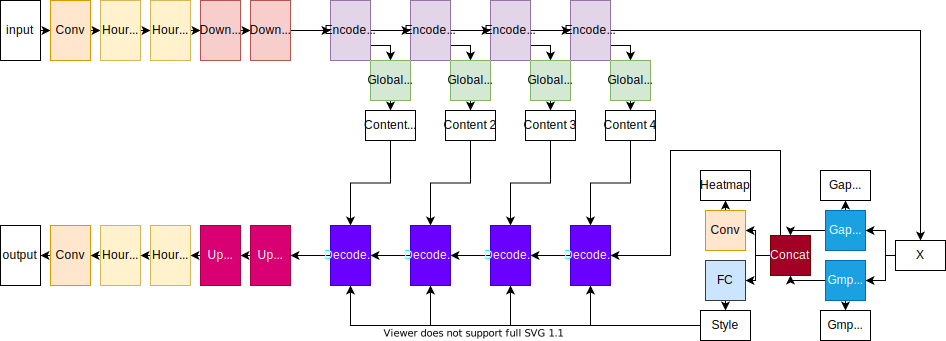
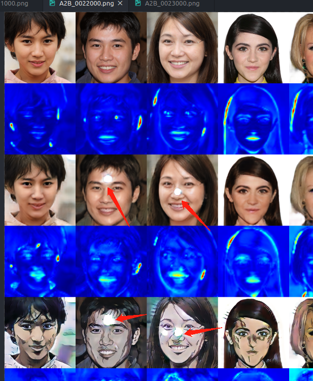

这个论文是基于`CycleGan`的一个改进，论文中的典型应用是将自拍转换为卡通风格。我参考了[小视科技开源的代码](https://github.com/minivision-ai/photo2cartoon)，这里对这个论文做一个详细描述。

我尝试用`tensorflow 2.x`复现这个项目，这个项目成功地把我从`tensorflow`劝退。。先吐槽一下，因为这个项目需要同时训练7个模型，我开启`jit`时用`tf2.X`的`tf.function`，`autograph`转换一下居然需要20分钟以上！每次启动训练得等20分钟，实在是受不了，不过转换之后的速度比`pytorch`实现快50%让我还可以接受。第二点是最不能忍受的，在`pytorch`中用8G显存即可训练，`tensorflow`中我降低了判别器的的层数还需要12G显存才能训练，直接劝退。

PS. 再提一句，他的生成器中间特征处理有两种做法，轻量级的方法是`GMP`再生成，否则直接生成。直接生成的话模型参数200MB往上了..我看了下他们po的图训练时显存需要22G..☹

<!--more-->

# 总结

1.  我使用`TF2.1`和小视科技提供的数据集,训练不完全的模型是可以达到他的效果.但是使用`JOJO`的图像很难达到效果,转换后太接近真实图像,如果有人知道怎么解决可以告诉我.
2.  我对截取动漫图像写了一个[脚本](https://github.com/zhen8838/playground/blob/master/tools/screen_crop.py),安装`wxpython`和`mss`之后即可以开始点击截屏.上下键控制截屏区域大小,`esc`退出.记得点击后停顿一秒钟再松开.这里感谢我的学弟帮我截图..
3.  图像截取好了之后去除背景最麻烦的!我在网上找了一圈没有找到免费的抠图软件,全都要收费.搞得我都想先弄个自动抠图的模型...花了30块钱处理了一百来张图像,另外几百张图像都没有处理.这个可能就是我没有成功的原因.
4.  然后我用`pytorch`的代码去训练,训练调试了接近半个月,今天想了结这个事情了,最后一次昨天到今天训练了一天半..效果也就这样.
5.  真实图像我用的是`celeba-H mask`,写了个去除背景的[脚本](https://github.com/zhen8838/playground/blob/master/tools/face_crop_and_mask.py)处理的.

截取好的动漫图像放在[这里](https://drive.google.com/file/d/1dxJCkMATwxROliNI9YG91JxwfeVXUwl4/view?usp=sharing).如果有兴趣的话,可以把背景去除后进行训练,那样效果会比较好.

# 模型结构

他的论文图画的有点难懂，所以我重新画了一下。整个模型还是比较对称的，中间有点类似于`U-Net`的结构，将编码器生成的特征进行`global Avg pool`之后称为`Content feature`。全部`Encode`之后得到的特征`X`分别进行`global Avg pool`与`global Max pool`的`CAM`层，得到新的特征后，经过卷积得到`heatmap`，同时经过一个全连接得到`Style feature`。最后将新的特征通过解码器与上采样层得到输出。

## Class Activation Map(CAM)

这个技巧是老方法了，特征经过一个全局池化层降低维度，通过全连接层后得到单个的`logit`，此时全连接层的权重体现了特征通道的对于输出`logit`的贡献大小，因此将权重乘上特征得到自注意后的新特征。这样我们的新特征就加强了部分通道特征的权重。

## Decode

原本的论文使用的是`Adaptive Layer-Instance Normalization(AdaLIN)`，他是没有考虑到编码器生成`content feature`和`style feature`的融合。

原始的`AdaLIN`：
$$
\begin{aligned}
  AdaLIN(\alpha,\gamma,\beta)&=\rho\cdot(\rho\cdot\hat{\alpha}_I+(1-\rho)\cdot\hat{\alpha}_L)+\beta\\
  \hat{\alpha}_I&=\frac{\alpha-\mu_I}{\sqrt{\sigma^2_I+\epsilon}},\hat{\alpha}_L=\frac{\alpha-\mu_L}{\sqrt{\sigma^2_L+\epsilon}}\\
  \rho&\leftarrow \text{clip}_{[0,1]}(\rho-\tau\Delta\rho)
\end{aligned}
$$

其实就是分别对特征进行通道级的归一化和层级的归一化，使用参数$\rho$控制各部分的权重，最后利用$\gamma,\beta$进行激活。`NOTE：` 他的`\gamma,\beta`是将`style feature`通过两个独立的全连接层生成的。

小视科技提出的`SoftAdaLIN`如下：

对于每一个解码器，引入了编码器生成的`content feature`，同时利用类似的方法控制`content feature`和`style feature`的权重，再生成`soft gamma`和`soft beta`，进行`AdaLIN`计算。

这些结构没有数学上的证明，主要是通过大量的消融测试证明其有效性。

# 损失函数

## 对抗损失

其中对抗损失为最小二乘`GAN`：
$$
\begin{aligned}
  L_{l s g a n}^{s \rightarrow t}=\left(\mathbb{E}_{x \sim X_{t}}\left[\left(D_{t}(x)\right)^{2}\right]+\mathbb{E}_{x \sim X_{s}}\left[\left(1-D_{t}\left(G_{s \rightarrow t}(x)\right)\right)^{2}\right]\right)
\end{aligned}
$$

## 循环一致性损失

这个是`cycleGAN`中的标配：

$$
\begin{aligned}
  \left.L_{c y c l e}^{s \rightarrow t}=\left.\mathbb{E}_{x \sim X_{s}}\left[| x-G_{t \rightarrow s}\left(G_{s \rightarrow t}(x)\right)\right)\right|_{1}\right]
\end{aligned}
$$

## 图像一致性损失

这个也是`cycleGAN`中的标配：
$$
\begin{aligned}
  L_{i d e n t i t y}^{s \rightarrow t}=\mathbb{E}_{x \sim X_{t}}\left[\left|x-G_{s \rightarrow t}(x)\right|_{1}\right]
\end{aligned}
$$

## CAM损失

这个就是对之前模型生成`CAM logit`进行判别（这里我有个地方前面忘记说明了，他的判别器中也使用的`CAM`的方法），对于判别器中的生成的`CAM logit`判别比较简单，即正样本的`logit`接近于1，负样本接近0。

生成器中的`CAM logit`使用交叉熵的使跨域的转换`logit`接近于1，同域的转换接近0。

$$
\begin{aligned}
  \begin{array}{l}
L_{c a m}^{s \rightarrow t}=-\left(\mathbb{E}_{x \sim X_{s}}\left[\log \left(\eta_{s}(x)\right)\right]+\mathbb{E}_{x \sim X_{t}}\left[\log \left(1-\eta_{s}(x)\right)\right]\right) \\
L_{c a m}^{D_{t}}=\mathbb{E}_{x \sim X_{t}}\left[\left(\eta_{D_{t}}(x)\right)^{2}\right]+\mathbb{E}_{x \sim X_{s}}\left[\left(1-\eta_{D_{t}}\left(G_{s \rightarrow t}(x)\right)^{2}\right]\right.
\end{array}
\end{aligned}
$$

## 身份ID损失

这是小视科技自己提的，因为要做接近于真人的效果转换，加上人脸识别损失比较好。

# 复现笔记

## 6.8
前面已经做了很多次实验了，动画图像我也截取了不少了。昨晚我想训练网络适合亚洲人脸，网上一下找不到好的亚洲人脸数据，然后我就找了个`stylegan`生成的亚洲人脸，训练了一晚发现很奇怪的问题，只要是用生成的数据做转换，很大概率会得到有问题的图像,如下所示。

我发现`jojo`的风格还是适合模特，用模特的照片转换之后相当有味：

不说了，我重新去找合适的数据了。明天看效果。