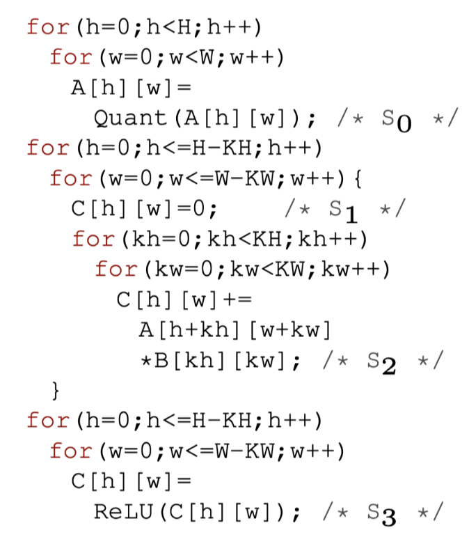
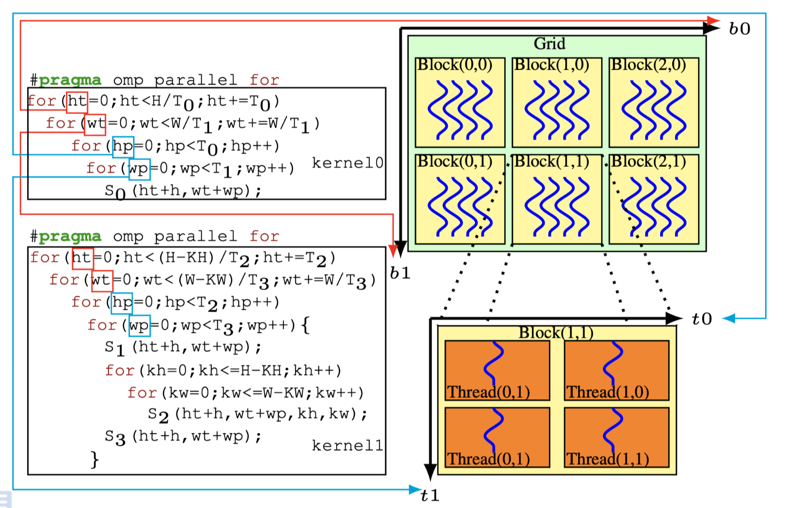
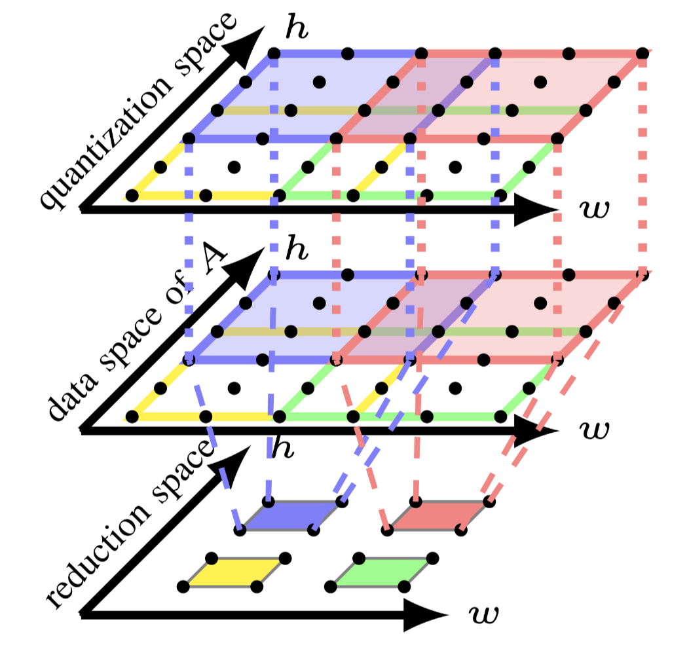
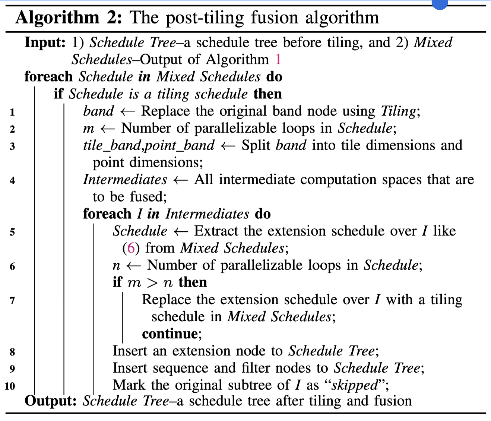
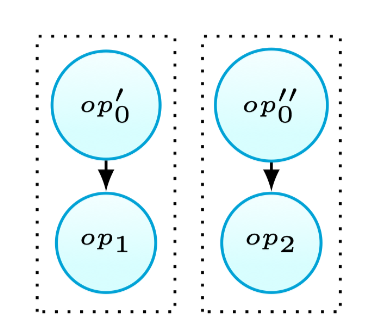
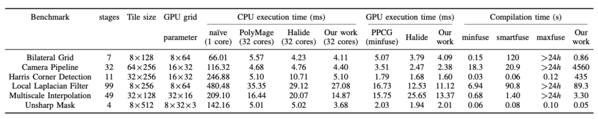
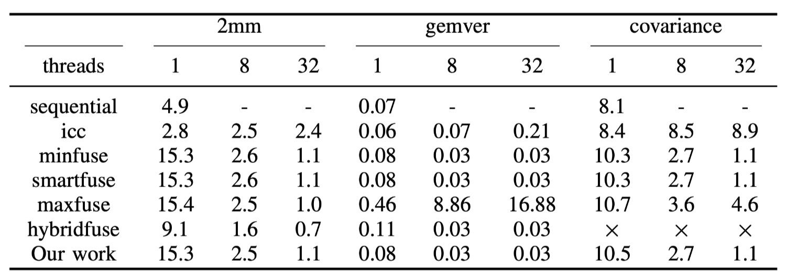
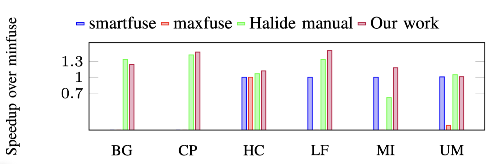

这篇文章是赵捷老师在mircro 2020上发表的论文,我觉得这篇文章对理解akg系列的工作比较重要,所以仔细阅读了一遍.

<!--more-->

# Abstract

编译器通过使用loop tiling和fusion来利用内存层次结构进行优化程序,但是由于忽略了数据在内存中的转换而导致这两种方法将会彼此冲突.本文提出一种loop tiling和fusion结合的方法.与目前的先fusion再tiling的方法不同,他们仅转换computation spaces,而本文方法首先在live-out computation space应用矩形/平行四边形tiling,以拟合内存层次结构,然后计算每个tile所需的内存足迹.从内存足迹中提取upwards exposed data用于确定中间计算空间的tile大小,从而构建任意tile形状.最后,本文实现了一种tiling后fusion的策略,以最大程度地提高数据局部性,而不会失去可分块或可并行的搜索空间,从而实现了内存的节约和重用.本文使用此方法通过在从包括神经网络,图像处理,稀疏矩阵计算和线性代数的众多领域中提取的11个基准进行实验,从而在CPU和GPU体系结构上实现优异的性能.此外,在AI加速器上的Resnet-50模型的结果表明,我们的方法可以提高16％的性能.

# Introduction

现代的内存架构为给开发者带来了便利也带来了复杂的编程问题,此问题随着dsa加速器的多样性增加更加恶化.编译器社区的研究人员设计了loop fusion[^29],[^38]和tiling[^27],[^58],以优化内存层次结构.loop tiling是将嵌套的迭代分组为较小的块,当块大小合适于在寄存器或缓存中时,沿多个循环维度最大化的重复使用.loop fusion是一种连接两个或多个嵌套循环的技术,同时维持这些循环之间的生产-消费关系,从而使更多值分配在更快的内存中,从而使内存交互减少.

这两个循环transformation的组成已被证明在许多领域中证明有效[^2],[^6],[^31],[^32],[^55],[^61].但是,优化编译器通常必须在tiling/并行和局部性之间进行建模来权衡选择.更糟糕的是,在神经网络大量使用了stencil和reduction的计算模式,要求复杂的tiling技术来计算每个tile间内存足迹的overlapp,导致对于内存层级的使用效率降低.

多面体模型以其强大的复合仿射变换的能力而被认可,并已集成到众多的通用优化器中[^11],[^21],[^57],以及领域特定的框架[^6],[^16],[^41],[^54].通常,模型给程序中每个operation分配执行顺序,并通过完全考虑并行和局部性来调度新的执行顺序.用来计算新的执行顺序的算法称为polyhedral scheduler,通常将其与基于cost-model的启发式算法集成,来实现loop fusion.Loop tiling 通常通过扩展调度器生成的computation spaces来生成,这意味着loop fusion和tiling存在先后顺序.

然而,将启发式方法与多面体调度程序整合在一起,对模型构成了一些挑战: 
1.启发式fusion很可能严重的影响可分块性/并行性/局部性.一些激进的fusion策略可以减少层级间数据搬运,但是会降低其他性能.一些保守的策略则会较多搬运数据来保证tiling机会.
2.fusion之后构建结构复杂的tiling并不简单,这可能需要引入后面的pass来重新schedule.这样就会带来过度估计的内存足迹,导致性能下降.或者利用非仿射语意建模[^60],在不考虑producer-consumer局部性的情况下可以优化tiling的overlap.

在本文中,在实施tiling之前不采用激进的fusion方法,但是通过重排loop fusion 和 tiling的顺序来优化内存层次.本文方法源于一个简单的启发式算法,仅适用于live-out computation spaces[^live-out],从而收紧了多面体模型的调度空间,降低了时间复杂度.通过计算live-out computation space的每个tile所需的内存足迹.从内存足迹中提取upwards exposed data[^upwards-exposed-data],并且无需reschedule或使用非仿射语意合成模型.然后,通过upwards exposed data以及之间的访问关系组合,从而允许构建任意的tile shape,无需付出其他代价.最后,本文引入一种tiling后的fusion算法,利用明确定义的多面体表示[^22]而不会改变live-out计算空间的可分块性和并行性.

本文的方法建模了在并行性、局部性和重计算之间没有trade-off的情况下的tiling和fusion的组合,这也是许多领域特定框架(TVM,Halide,Tensor Comprehensions)[^13],[^48],[^54],多面体优化器 [^11],[^21],[^41],[^57],[^60] 所需要的,在现代架构上最大限度地利用内存层次结构.同时设计合理的多面体表示扩展也加强了多面体编译的能力,此外,此算法还可以调整编译时间,无需限制特殊情况[^52],或者开放调度限制[^2].

本文在多个应用领域如神经网络/图像处理/稀疏矩阵乘/线性代数进行了11个benchmark实验,同时编译到通用处理器和DSA加速器上.实验结果表明了本文方法具备差异架构下的可迁移性,能得到比现有编译器更高的性能.

本文在第二章主要介绍了本文工作的背景和动机.第三章介绍了本文技术如何构造任意tile shape.第四章介绍tiling后fusion算法.第五章解释了本方法使用的代码生成策略,然后第六章中描述实验结果.第七章是相关工作讨论.最后是结论.

# Background And Motivation

现在开始介绍背景知识和多面体编译以及本文动机.

## A.Tiling and Fusion in the Polyhedral Model

多面体模型是对于自动并行化和局部性优化的抽象.它使用迭代域/访问关系/依赖与调度来表示程序.典型的,多面体模型的schedule同时表示原始的程序计算顺序,和经过调度算法优化后的结果.schedule是一个跨多个statement实例的一个affine function,(比如迭代域).一个调度算法比如考虑所有statement 实例之间的计算访问依赖关系.访问关系是statement 实例与内存位置的map.

#### Fig.1(a): The loop nests

如[图1(a)](#fig-1a-the-loop-nests)考虑一个在输入图像A和kernel B的上做2D卷积,输出buffer为C.其中 statement $S_1$表示初始化矩阵.$S_2$ 执行reduction. $S_3$执行 `RELU` 操作.使用多面体模型,最初的schedule可以被表示为多维仿射schedule如:
$$
\left[S_0\left(h,w\right)\rightarrow \left(0,h,w\right);  \\
S_1\left(h,w\right) \rightarrow \left(1,h,w,0\right); \\
S_2\left(h,w,kh,kw\right) \rightarrow \left(1,h,w,1,kh,kw\right); \\
S_3\left(h,w\right) \rightarrow \left(2,h,w\right)\right]
$$

#### Fig.1(b): The code and GPU mapping of a conservative fusion heuristic

多面体模型可以通过融合不同的启发式fusion来计算出一个新的/tiling友好的schedule结果.通过保守的启发式fusion,得到新的schedule被表示为:
$$
\left[ S_0\left(h,w\right) \rightarrow \left(0,h,w\right); \\
S_1\left(h,w\right) \rightarrow \left(1,h,w,0,0,0\right); \\
S_2\left(h,w,kh,kw\right) \rightarrow\left(1,h,w,kh,kw,1\right); \\
S_3\left(h,w\right) \rightarrow\left(1,h,w,KH − 1,KW − 1,2\right)\right]
$$

然后使用$(\{S_0\},\{S_1,S_2,S_3\})$表示整个fusion结果.现在就可以应用一个矩形tiling在fusion结果上,比如$\{S_0\}$上使用$T_0 \times T_1$的tlie size,在$\{S_1,S_2,S_3\}$使用$T_2\times T_3$的tile size.按照[图1(b)](#fig-1b-the-code-and-gpu-mapping-of-a-conservative-fusion-heuristic),将输入图像A矩阵使用$T_0\times T_1$切开后,每个维度上tile的迭代变量使用$ht,wt$来表示,$hp,wp$表示指针循环.(按照Halide中的说法,可以理解成外循环和内循环,外循环指向每个tile,内循环指向的是tile内部).⚠️tile size必须是固定的整型常量,但是为了在本文中为了解释方便,这里使用符号化的$T$来表示.

#### Fig.1(c): The code of an aggressive fusion heuristic

另一方面,如[图1(c)](#fig-1c-the-code-of-an-aggressive-fusion-heuristic)所示,激进的启发式fusion将通过合并所有的statemens来最大化数据的局部性.虽然这个策略最大化了producer-consumer局部性,但是也降低了可tile的维度以及最外层的并行度.多面体模型的内部修改transform也会导致另外的问题:在神经网络的域特的情况下由于维度的permutation引起的fused loop的维度与用户指定的tile size不匹配.

接下来本文将讨论tiling后fusion的策略在现存的多面体优化中是无法充分利用内存层级,因此需要一个其他的方式通过改变tiling和fusion的顺序来避免做可切分/可并行以及局部性之间的trade-off.为了实现reorder功能,本文使用了schedule trees[^22]的方法.

## B.Schedule Trees

多面体模型使用多维的仿射schedule来表示整个代码的计算顺序,但是这种表示方法无法简单的扩展到GPU上的自动内存管理(比如自动插入thread-level的同步指令).affine schedule可以被显式的编码到树结构[^22],这样可以简化多面体编译器中的自动内存管理建模.

根据多维仿射schedule为程序建立初始调度树,一个调度树开始于一个被称为*domain* 的节点,这个节点存储了所有的statement 实例(比如Presburger表示的迭代域),引入一个*sequence*的节点来显式的表示被使用在多维仿射schedule中的标量维度,为他的子节点定义了特别的顺序.每个*sequence*的子节点都必须是*filter*节点,他只能包含其父节点的statement与当前节点引入的statement的一个子集.*band*节点是用于将常量或变量的维度编码,来以分段线性的形式表示在迭代域上的多维仿射程序.许多多面体代码生成器[^8],[^22],[^53]输入迭代域和从多面体模型产生的新调度树,用于生成命令式代码.将迭代域和schedule放在一起,仅扫描整个树,就可以生成代码.

#### Fig.2(a): The initial schedule tree

#### Fig.2(b): The schedule tree after fusion

比如将[图1(a)](#fig-1a-the-loop-nests)转化为[图2(a)](#fig-2a-the-initial-schedule-tree)的调度树的形式,其中*domain*节点可以被表示为Presburger set:
$$
\{ S_0(h,w) : 0 \leqslant h \lt H \land 0 \leqslant w \lt W ;\\
  S_1(h,w) : 0 \leqslant h \leqslant H − KH \land 0 \leqslant w \leqslant W −KW ;  \\
  S_2(h,w,kh,kw) : 0 \leqslant h \leqslant H − KH \land 0 \leqslant w \leqslant W − KW \land 0 \leqslant kh \lt KH \land 0 \leqslant kw \lt KW ; \\
  S_3(h,w) : 0 \leqslant h \leqslant H − KH \land 0 \leqslant w \leqslant W − KW  \}
$$
初始后的调度树可以通过附加到*band*节点上的并行/tile信息来自动的transform到新的调度树.

*band*节点用于表示嵌套循环,并添加上可以指导编译器进行transformation的信息.$band_0$是一个仿射函数$[\{S_0(h,w)\rightarrow (h,w)\}]$被添加上了两个属性, 一个是bool的`permutable`,用于表示当前的嵌套循环是否可以tile. 另一个是vector的`coincident`,每一个元素都用来表示当前单个的循环的并行度(1是可并行,0是不可并行).在[图2(a)](#fig-2a-the-initial-schedule-tree)中,`permutable`和`coincident`分别是`1`和`[1,1]`,这表示这两个循环的嵌套可以被tiling也可以进行2维的并行.

这里只展示了本文工作所需要的节点类型,更加详细的内容需要参考Grosser等人的工作[^22]中关于整个调度树的描述.特别的,本文引入了一种*extension*的节点,定义为仿射函数在其外部调度维度到statement实例或数组/标量元素.*extension*节点可用于通过将自身保持在调度树中的合适位置来自动化内存管理.后面本文将利用*extension*节点来实现tiling后fusion算法.

# Constructing Tile Shapes

保守的启发式fusion的缺点是会在分离的computation space上产生不同的tile size,这就会导致不同的computation space产生不同的内存足迹.

继续考虑[图1(a)](#fig-1a-the-loop-nests)的例子,他其实是由三个嵌套循环组成的. 假设输入的H=W=6,kernel的大小为KH=KW=3.在$(\{S_0\},\{S_1,S_2,S_3\})$上的fusion结果如[图1(b)](#fig-1b-the-code-and-gpu-mapping-of-a-conservative-fusion-heuristic)所示.这种矩形tiling可以通过实施如下的仿射变换进行transform.
$$
\begin{array}{r}
\left[\left\{S_{0}(h,w) \rightarrow\left(h / T_{0},w / T_{1},h,w\right)\right\},\left\{S_{1}(h,w) \rightarrow\left(h / T_{2},w / T_{3},h,w\right)\right.\right. \\
S_{2}(h,w,k h,k w) \rightarrow\left(h / T_{2},w / T_{3},h,w,k h,k w\right) \\
\left.\left.S_{3}(h,w) \rightarrow\left(h / T_{2},w / T_{3},h,w\right)\right\}\right]
\end{array} \tag{1}
$$

其中第一组的tile size为 $T_0 \times T_1$,第二组的tile size 为$T_2 \times T_3$.每个仿射关系中的一块都表示一个tiling schedule.本文使用tiling schedules来表示这种分段的仿射关系.

#### Fig.3: Tiling computation spaces individually

多面体模型为每个fusion group构造一个computation space.本文使用`quantization space`表示第一个group,使用`reduce space`表示第一个group.tiled computation space如[图3](#fig-3-tiling-computation-spaces-individually)所示,当$T_0=T_1=4$,$T_2=T_3=2$时,可以看到quantization space被分割成了4个块,分别是 [4,4].[4,2],[2,4],[2,2].把[4,4]称为full tile,其他的称为partial tile. partial tile位于computation spcase的边沿,并于后续的进行流水.

现在两个computation spcase因为tensor A产生了依赖关系,$S_0$写入数据,$S_2$读出数据.[图3](#fig-3-tiling-computation-spaces-individually)的顶部展示了tensor A 的data space.注意两个computation spcace中的红色tile.每个红色tile和tensor A 之间的访问关系分别用点线和虚线表示.quantization space的红色tile写入tensor A的4个点,reduction space的红色tile则是读取16个点.他们在两个computation spcace之间的内存足迹之间的交互存在冲突,这就阻止了两个红色tile间的fusion.

上述这种冲突是由于在现有的多面体编译器中实现的先fusion后tiling策略没有考虑data space的转换导致的.如果仅将tiling应用到reduction space,则可以获得reduction space中每个tile的对于tensor A 的内存足迹,然后可以将其用于根据 $S_0$和tensor A 的access relation来确定quantization space的tile形状,这样从不同计算空间中具有相同颜色的tile可以融合,因为不存在内存足迹的不匹配.通过考虑data space上的transfrom来构建quantization space的tile形状,还可以降低tile尺寸空间的大小,因为用户只需要为reduction space指定tile size.

因此,本文首先使用保守的启发式fusion方法,通过设置isl提供的适当编译选项来分离computation space.然后将矩形/平行四边形tiling应用于计算live-out computation space,这些空间将用于拿来计算内存足迹.

## A.Extracting Upwards Exposed Data

reduction space中数据访问可以分为读访问和写访问.本文用upwards exposed data表示reduction space读取的数据(这个数据在quantization space中被定义).可以通过组建reduction space的依赖关系和读访问关系来轻松的构建计算tile与upwards exposed data之间的关系.tensor A的data space在[图4](#fig-4-constructing-tile-shapes-via-upwards-exposed-data)的中描述,每个数据图用相同的颜色表示,并在reduction space中表示与其相应的tile.

#### Fig.4: Constructing tile shapes via upwards exposed data

现在开始解释这个例子,以简单起见,本文仅讨论$S_2$在reduction space中读取tensor A为例.应用在reduction space上的一段transform可以被表示为如下:
$$
\left[\left\{S_{2}(h,w,k h,k w) \rightarrow\left(o_{0}=h / T_{2},o_{1}=w / T_{3}\right)\right\}\right] \tag{2}
$$
其中$o_0$和$o_1$表示tile的维度.$S_2$上与upwards exposed data的访问关系表示为如下:
$$
\begin{array}{r}
\left\{S_{2}(h,w,k h,k w) \rightarrow A(h+k h,w+k w): 0 \leq h \leq H-K H \right.\\
\wedge 0 \leq w \leq W - K W \wedge 0 \leq k h \lt K H \wedge 0 \leq k w \lt K W\} 
\end{array} \tag{3}
$$

tile维度$(o_0,o_1)$和upwards exposed data间的关系可以通过isl的交集+反转得到:

$$
\begin{array}{r}
\left\{\left(o_{0},o_{1}\right) \rightarrow A\left(h^{\prime},w^{\prime}\right): 0 \leq o_{0} \lt \left\lceil(H-K H+1) / T_{2}\right\rceil\right.\\
\wedge 0 \leq o_{1} \lt \left\lceil(W-K W+1) / T_{3}\right\rceil \wedge T_{2} \cdot o_{0} \leq h^{\prime} \lt T_{2} \cdot o_{0}+ \\
\left.K H+T_{2}-1 \wedge T_{3} \cdot o_{1} \leq w^{\prime} \lt T_{3} \cdot o_{1}+K W+T_{3}-1\right\}
\end{array} \tag{4}
$$

如[图4](#fig-4-constructing-tile-shapes-via-upwards-exposed-data)中reduction space与data space之间的虚线.它允许在两个连续计算tile之间计算重叠的内存足迹.

继续关注reduction space中的蓝色tile和红色tile,为了通用性,假设$T_2=T_3=2$,蓝色tile可以被表示为坐标$(o_0 =1,o_1 = 0)$,红色tile可以被表示为坐标$(o_0 =1,o_1 = 1)$.可以应用上述公式获得他们的内存足迹,分别表示为 $\{A(h',w'): 2\leq h' \leq 5 \land 0 \leq w' \leq 3 \} $和$\{A(h',w'):2\leq h' \leq 5 \land 2 \leq w' \leq 5 \}$. 换句话说,两个tile都可以访问它们的交集,即data space中蓝色和红色tile之间的交错区域

## B.Tiling Intermediate Computation Spaces

通过公式4获得的内存足迹可用于构建quantization space的tile shape,既写入tensor A所需要的内存.使用多面体模型,在affine map使用基本的operation就可以得到quantization space的tile shape.

多面体模型可以提供quantization space在tensor A上的访问关系. 可以通过反转写访问的relation 来获得tensor A 到$S_0$的affine map.
$$
\left\{A(h,w) \rightarrow S_{0}(h,w): 0 \leq h \lt H \wedge 0 \leq w<W\right\} \tag{5}
$$

data space与quantization space的访问关系如图4中点线所示,结合公式4和5得到另一个affine relation:
$$
\begin{array}{r}
\left\{\left(o_{0},o_{1}\right) \rightarrow S_{0}(h,w): 0 \leq o_{0}\lt \left \lceil (H-K H+1) / T_{2} \right \rceil \right.\\
\wedge 0 \leq o_{1} \lt \left\lceil(W-K W+1) / T_{3}\right\rceil \wedge T_{2} \cdot o_{0} \leq h \lt T_{2} \cdot o_{0} \\
\left.+K H+T_{2}-1 \wedge T_{3} \cdot o_{1} \leq w \lt T_{3} \cdot o_{1}+K W+T_{3}-1\right\}
\end{array} \tag{6}
$$
表示了tile $(o_0,o_1)$从reduction space到$S_0$的affine function.换句话说就是 reduction space的tile 将$S_0$分割成了多个子集,这个tile使用的并不是他本身tiling schedule.本文使用`extension schedule` 表示这种通过data space所推导出来的schedule,后续将在章节4中使用这种*extension*节点.

结合公式4和5可以看作[图4](#fig-4-constructing-tile-shapes-via-upwards-exposed-data)中的点线和虚线的结合.所有quantization space中的蓝色tile的statement可以表示为$\{S_0(h,w):2 \leq h \leq 5 \land 0 \leq w \leq 3\}$,红色tile可以被表示为$\{S_0(h,w):2 \leq h \leq 5 \land 2 \leq w \leq 5\}$.这可以使用`extension schedule`算出的quantization space中的tile相互之间有overlap,不需要建模非affine的表达式,也不需要完善调度算法.目前使用extension schedule来实施loop tiling在现有的框架中是不支持的([^6],[^11],[^21],[^54],[^57]).

## C.The Tiling Algorithm

为了总结本文构建任意tile形状的方法,假设在启动fusion后只有一个live-out computation space和多个intermediate computation spaces.[算法1](#alg-1-construct-arbitrary-tile-shapes)描述了如何构造任意的tile shape:

#### Alg.1: Construct arbitrary tile shapes

该算法采用一组仿射集*Spaces*,这些空间是由保守启发式fusion算法的计算得到,然后获取live-out computation space称为*liveout*.再将*Spaces*减去*liveout*,后者成为intermediate computation spaces.当*liveout*可以tile时,首先为他生成一系列间的矩形/并行四边形tiling的tiling schedule和extension schedule的集合,称为*Mixed Schedules*.可以使用Pluto调度器[^11]或其他变体来构造这些矩形/并行四边形tiling shape.然后5-6行计算live到upwards exposed data的关系.

第7和17行之间实现了每个intermediate computation space的tile shape的构建.该算法比较了S的可并行循环n的数量与*liveout*可并行的维度$m$.如果$m$>$n$时,表示live-out computation space比S具有更大的并行度,那么将$S$加入到*Untiled*集合中.如果没有这个限制,那么将会得到错误的tile shape.(这里的意思是不是指如果从live-out出发得到的并行度大于他本身能具备的并行度,那tiling出来可能也无法支持那种并行度).

第9-16行考虑每个S与*liveout*融合,或添加到*Untiled*集合.$S$和*liveout*的集合也被认为是live-out computation space,这保证了*Spaces*中仿射集的访问顺序不会影响tiling后fusion的正确性.

$m$和$n$之间的比较用于保证算法的正确性和有效性,以及章节4-B中的tiling后fusion.$m$大于$n$保证了具有更少的并行循环的intermediate computation space不会和具有更多并行循环的live-out computation space进行fusion.本文之前提到过`permutable`和`coincident`属性,表示是否可tiling和可并行.一个现代的多面体调度器通常倾向于外层的并行度,所以得到的n个可并行循环总是出现在最外层的循环.实际上live-out computation space的可并行层数可能大于m,比如live-out computation space有一个3维并行的属性.可以强行设置$m$=1,表示只有最外层的循环可以额并行,因为当生成CPU代码时只能1维并行,当生成GPU代码时可以生成2D并行,这样可以允许更加激进的fusion策略利用硬件的两级并行.

比较$m$和$n$保留了liveout computation space的并行性,但它可能会失去fused intermediate computation space的并行性.最坏情况时$n$>$m$=0,intermediate computation space的并行性将完全丢失.这种情况下,本文只假设live-out computation space在$m$大于0时可以对CPU进行tile,$m$大于1时可以对GPU进行tile.

10-15行计算如公式6描述的extension schedule.12-16行对schedule使用基本变换.$h$是一组extension schedule,用于建模具有多个statement的live-out computation space的tile.每个$S$可以被$h$ tile,然后加入到`Mixed Schedule`中.整个算法递归的应用于`Untiled`集合,直到它非空为止,或者`liveout`已经无法被tile.

本文的tiling算法可以计算tile shape的ouverlap,而无需完善调度算法(例如Polymage框架), 通过upwards exposed data来计算intermediate computation space上的overlapped tile shape,避免引入文献[^60]中对的仿射关系的复杂限制.更重要的是,和现在构造复杂tile shape的方法不同([^9],[^19],[^33],[^41],[^60]),本文算法提供了构造任意tile形状的能力,并且由于考虑了内存中数据的transformation,因此对更多应用域的有通用性.tile形状由upwards exposed data的访问方式确定.例如,可以通过微调$kh,kw$循环和相应的下标,将[图1(a)](#fig-1a-the-loop-nests)中例子转换为矩阵乘法代码.读者会发现,本文的fusion技术仍然可以通过构造矩形的tile形状来适用于它.

# Post-Tiling Fusion

[算法1](#alg-1-construct-arbitrary-tile-shapes)用于构建任意的tile形状,但也意味着激进的融合策略.算法1建议的fusion group的数量等于其调用次数.*Mixed Schedules*应为[图1(a)](#fig-1a-the-loop-nests)中的示例的第二个tiling schedule(1)和extension schedule(6)的结合.tiling schedule将reduction space的每个statement实例映射到执行顺序表； extension schedule将tile维度$(o_0,o_1)$映射到$S_0$的statement实例,然后在quantization space执行loop tiling.

## A.Facilitating Fusion using Schedule Trees

[图2(b)](#fig-2b-the-schedule-tree-after-fusion)中所示的调度树是保守启发式fusion的结果,其策略$(\{s_0\},\{s_1,s_2,s_3\})$使用顶部*sequence*节点的子节点表示.

根据[算法1](#alg-1-construct-arbitrary-tile-shapes),我们首先使用tiling schedule(1)的第二部分在reduction space上应用矩形tiling,该空间表示为顶部*sequence*节点的第二个子节点.[图2(b)](#fig-2b-the-schedule-tree-after-fusion)中$band_1$节点的原始多维affine schedule应替换为该tiling schedule,该schedule又分为两部分,其中一个表示为:$[\{S_1(h,w) \rightarrow (h/T_2,w/T_3); S_2(h,w,kh,kw) \rightarrow(h/T_2,w/T_3); S_3(h,w) \rightarrow (h/T_2,w/T_3)\}]$,另一个为:$[\{S_1(h,w) \rightarrow(h,w); S_2(h,w,kh,kw) \rightarrow (h,w,kh,kw); S_3(h,w) → (h,w)\}]$.这种分离的操作隔离了tile shape,因此可以在computation space之间实现tile-wise的fusion.

#### Fig.5: The schedule tree of post-tiling fusion

本文使用`tile_band`和`point_band`来表示从原始的$band_1$中分离出来的affine relation,如[图5](#fig-5-the-schedule-tree-of-post-tiling-fusion)所示.`tile_band`表示每个tile间的迭代维度,`point_band`表示每个tile内部的迭代维度.接下来将解释引入节点的意义,注意到目前还没有对quantization space进行tiling,$band_0$的第一个filter node$\{S_0{h,w}\}$还没有改变.

$S_0$可以看作是在*filter*节点 $\{S_1(h,w);S_2(h,w,kh,kw);S_3(h,w)\}$ 的外部子树的根节点.之前在章节2-B小节中提到,本文将使用*extension*节点来实现tiling后fusion.*extension*节点最初是为了添加被affine relation使用了但没有被调度树的domain节点包含的.这本文的场景下,扩展*expansion*节点的表达能力来为*filter*节点引入额外的statement.

如[图5](#fig-5-the-schedule-tree-of-post-tiling-fusion)的左侧所示,*extension*节点在`tile_band`节点下方插入,其affine relation为公式6.在调度树上的这种简单操作实现了$S_0$的tiling overlap计算和两个原始computation的 space的tile-wise fusion.注意,这种对调度树表示的扩展使得在多面体模型中实现tiling后fusion的融合是可能的,但这在现有的多面体编译框架[^54],[^57]中是不可能的,尽管他们也使用调度树.

现在,可以调度在*extension*节点下的$S_0$.为了实现期望实现tile-wise的fusion,必须在*extension*节点下方引入*sequence*节点.第一个子节点应该是原始quantization space的*filter*节点,即$\{S_0(h,w)\}$,而第二个应为原始reduction space的子节点.在新添加的*filter*节点$\{S_1(h,w); S_2(h,w,kh,kw); S_3(h,w)\}$下面再附带一个`point_band`节点.同时在*extended filter*节点$\{S_0(h,w)\}$下也引入$band_0$节点,用于指导如何调度上面那个节点.重复此类子树保证将同时调度由*extend filter*节点包裹的多个statement.在tile band下引入*sequence*节点也有利于`intra-tile distribution transformation`[^63],该变换用于提升小的scratchpad上的空间局部性.

当使用*extension*节点fusion了$S_0$时,他的原始调度(即要忽略顶部*sequence*的左子树),如[图5](#fig-5-the-schedule-tree-of-post-tiling-fusion)所示,可以通过在调度树中引入*mark*节点来实现这一点.*mark*节点用于将信息添加到调度树上,从而为代码生成的多面体模型提供了更多的灵活性.本方法将字符串`skipped`添加到*mark*节点,提示codegen绕过下面的子树.

codegen按如[图5](#fig-5-the-schedule-tree-of-post-tiling-fusion)所示的方式扫描这个调度树来生成对应的代码.红色和蓝色箭头代表*band*节点与它们代表的循环之间的关系.与[图1(b)](#fig-1b-the-code-and-gpu-mapping-of-a-conservative-fusion-heuristic)所示的代码不同,现在代码将所有三个循环融合到一个组中,从而使tensor A分配到小的spad上.此外,tiling后fusion策略不会失去fused维度上的并行性,并且在target为CPU时,可以在最外层的循环之前添加`OpenMP Pragma`.在为GPU生成CUDA代码时,可以通过启动单个内核来执行整个嵌套循环,$ht,wt$映射到线程块,每对$hp,wp$映射到线程,此时A可以被声明在shared memory上.

## B.The Fusion Algorithm

[算法2](#alg-2-the-post-tiling-fusion-algorithm)描述了tiling后fusion的策略.它需要两个输入：一个是根据多面体调度程序获得的multi-dimensional affine schedule构建的调度树,另一个是[算法1](#alg-1-construct-arbitrary-tile-shapes)的输出.

#### Alg.2: The post-tiling fusion algorithm

`Mixed Schedules`中的tiling schedule数量正好是[算法1](#alg-1-construct-arbitrary-tile-shapes)建议的fusion组数量. 对于每个组,首先使用`Tiling`来替换原始的*band*节点(第1行),然后将其分为两个部分(tile_band,point_band),如第4-A节(第3行)所述.第5-10行在intermediate computation spaces上迭代,该space与当前live-out computation space融合在一起.当$m > n$(第7行)时,不应融合当前space的extension schedule,其中m和n分别代表live-out computation space和I的可并行循环数量.比较$m$和$n$的目的已在第3-C节中解释了.第8-10行在调度树上执行各种操作.

算法2返回了$\{S_0,S_1,S_2,S_3\}$的fusion策略展示在[图5](#fig-5-the-schedule-tree-of-post-tiling-fusion)中.本文的tiling后fusion算法没有使用现有优化器[^11],[^21],[^54],[^57]使用的繁琐的激进启发式fusion方法,以最大程度地提高数据局部性.更重要的是,与[图1(c)](#fig-1c-the-code-of-an-aggressive-fusion-heuristic)所示的代码不同.Tiling后fusion算法不会丧失整个代码的并行性,保证了生成的代码可以再多个架构上根据内存层级适配从而得到好的性能.

## C.Generalization

目前为止,假设只存在一个live-out computation space,现在开始讨论多个live-out computation space的情况.为了不失通用性,假设存在两个live-out computation space,$liveout_0$和$liveout_1$.intermediate computation space可以分为三类：第一个是$liveout_0$的所有intermediate computation space,第二个是$liveout_1$使用的集合,第三个由两者共同使用的所有intermediate computation space组成.难点是如何处理第三类的intermediate computation space(可能存在左右两侧tile shape不匹配的问题.)

考虑如[图6(a)](#fig-6a-one-definition-multiple-uses)所示的场景,当$op_0$定义值后被$op_1$和$op_2$使用.使用$op’_0$代表$op_0$被$op_1$使用的子集,以及$op’’_0$表示$op_0$写入$op_2$读取的值的子集.现有的启发式方法[^10],[^28],[^40]会因为可能的冗余计算而不fusion第三种情况.本文观察到在这种情况下有时仍然可以进行fusion.使用tiling后fusion的策略,当$op’_0$和$op’’_0$不存在相交的情况时(如[图6(b)](#fig-6b-fusion-result)所示),还是可以进行fusion,因为此时不会产生冗余计算. 当$op’_0$和$op’’_0$交集非空时,本文方法不允许fusion,因为这将产生冗余计算.总之,这种融合策略永远不会引入代码的冗余.

#### Fig.6(a): One definition,multiple uses

#### Fig.6(b): Fusion result

[算法3](#alg-3-reorder-the-sequence-of-tiling-and-fusion)描述了合并tiling和fuison的方法.该使用多面体模型作为输入获得的多维仿射调度构建的调度树,并生成tiled和fused的调度树作为输出.它分为三个步骤:

1.每个live-out computation及其intermediate computation spaces都是从输入调度树的迭代域提取并保存在$Spaces$中的,然后将[算法1](#alg-1-construct-arbitrary-tile-shapes)应用于它上面(第3行).这样可以防止live-out computation space之间的fusion,因为live-out value不一定需要在spad上分配.$GroupsSet$是$Group$的集合,即每个$Spaces$应用[算法1](#alg-1-construct-arbitrary-tile-shapes)的输出.
2.处理被多个liveout computation space所使用的intermediate computation space $SharedSpace$.第四行是计算所有的*extension* schedule对于$SharedSpace$的交集,如果交集非空,使用*tiling* schedule替换*extension*节点,表示不对它进行fusion.
3.将[算法2](#alg-2-the-post-tiling-fusion-algorithm)应用于$Groups$(第7行),用于在tiling和fusion后构建调度树.如果$SharedSpace$不能与任何一个使用了它的fuse在一起,则算法将删除与调度树中与引入的相关与$SharedSpace$的节点,从而防止可能的fusion,避免冗余计算.

注意,在某些极端情况下,[算法3](#alg-3-reorder-the-sequence-of-tiling-and-fusion)也可以执行DCE.假设使用公式(6)计算的tile是$S_0$的迭代域的严格子集,同时这些tile仍然可以与reduction space的子树fusion在一起,那么代表$S_0$的原始子树被跳过.在这种情况下,DCE消除了$S_0$的死代码,同时保持了程序的语义.现有的多面体优化器[^11],[^21],[^56]还没有考虑到这种细粒度的优化.

#### Alg.3: Reorder the sequence of tiling and fusion

## D.General Applicability

现在开始讨论本文方法的通用性.首先,[算法1](#alg-1-construct-arbitrary-tile-shapes)构建的tile形状可以是矩形/平行四边形,也可以是overlepped的形式.在后一种情况下,本文算法通过最大程度地减少overlepped tile所需的冗余计算来实现tile-wise的并发启动[^33].当不存在*extension* schedule时,[算法1](#alg-1-construct-arbitrary-tile-shapes)fallback为经典的矩形/平行四边形tiling算法.

第二,使用*extension* schedule结合tiling和fusion需要提取出跨loop的producer-consumer关系,这使得本文方法无法为单个stencil模式的嵌套循环构建复杂的tile形状.但是,本文的方法非常适合具有多个嵌套循环的应用,例如神经网络,图像处理管道,有限元方法和线性代数.一是可以展开stencil kernel的时间维度,以将其转换为多个循环,由于扩展循环引入了producer-consumer关系,本文方法即可以应用于这种情况.

最后,本文方法对于最大化fusion且不失去intermediate computation spaces的并行性的情况非常有用,但是对于连续的reduce的程序,就不是最优选择,因为intermediate reductions的并行性无法保留.

# Code Generation

本文方法使用isl库[^56]实现,因为它可以通过扫描调度树来生成AST.这样能够通过先生成AST然后转为命令式代码,再生成不同体系结构的代码.PPCG 编译器[^57]是一种多面体代码生成器,它包装ISL用于操纵整数集/字典并生成AST,它最终将isl生成的AST转换为OpenMP C代码或CUDA代码.本文在PPCG编译器中实现程序,以生成用于GPU的CPU和CUDA代码的OpenMP代码.

为GPU生成CUDA代码需要能够将并行循环映射到GPU上的thread blocks和threads.PPCG编译器的CUDA后端通过利用调度树的*mark*节点建模GPU的映射.[图5](#fig-5-the-schedule-tree-of-post-tiling-fusion)中的最外面的并行*band*节点`tile_band`使用`kerenl`作为标记,表示codegen映射`tile_band`表示的$ht$和$wt$到GPU的thread blocks.在`point_band`节点和$band_0$节点之前插入了`thread`标记,标示codegen将$hp$和$wp$映射到GPU threads.

## A.Domain-Specific Code Generation

此方法已经集成到AKG编译器中,AKG可以为其用户提供 DSL 来表达算法,而无需考虑底层架构的细节,然后将DSL转换为Halide IR,然后可以操作IR进行自动或手动的调度.比如使用$tile$源语进行tiling,使用$fuse$源语进行循环合并.

本文方法其中一个编译Target是专门的加速器Ascend 910芯片,[图7](#fig-7-overview-of-the-davinci-architecture)描述了Davinci架构[^36].Cube单元是使用L0A和L0B中的数据输入来执行张量/矩阵操作的专业执行单元,其中输出存储在L0C中.L0A/L0B可以从L1 cache获取数据.L0C中的数据也可以传输到向量单元.向量/标量单元设计用于执行向量/标量操作,他们可以对unified buffer进行双向的读取/写数据,同时可以与L0C交换数据.L1 cache和unified buffer作为片上下层缓存,用于将数据与外部内存交换,这在图中未显示.其中L1 cache和unified buffer之间也可以进行数据交换.我理解整个架构的运作机制可能如下,从l1 buffer中流水的加载数据到L0A/L0B,然后Cube单元进行内积操作,输出到L0C上,此时能从Unified buffer中取激活参数等数据送到Vector单元计算,最后写回L1 buffer.

#### Fig.7: Overview of the DaVinci architecture

加速器的编程模型是通过完全考虑应用程序和基础体系结构的领域属性而设计的.比如,可以通过使用编程模型发射单个向量指令来实现卷积操作.生成的CCE代码将与芯片上的native编译器一起编译,并为实验中使用的所有版本设置相同的编译选项.

本文工作的目的不是完善多面体调度算法来建模更多的tile形状和/或激进的融合策略,而是允许更多以前错过的fusion和tiling组合.tiling后fusion在优化神经网络应用时非常有用.AKG 项目通过充分考虑DaVinci架构实现了更准确的cost model,在评估中试验不同版本时以进行公平比较.此外,还在 AKG 项目中实现了一种处理参数化的tile size的技术,但该特性在实验中被禁用.

另外,本文没有使用手动调度方法,而是在AKG项目中引入了另一个Pass将Halide IR lower到调度树,这个pass将使用本文方法进行优化.输出调度树将被转换回Halide IR,以生成后续代码.然后,从自动优化的Halide IR生成AI加速器的目标代码(CCE代码).

## B.Aggressive Memory Optimizations

本文方法最大化数据局部性而不影响可切分性或并行性,但是由于应用程序的流式传输性质,因此如果不减少层次结构存储开销,则编译优化可能不会很有效.

其中intermediate computation space产生的数据仅在tile内部使用,因此在计算完tile后可以丢弃[^28],[^41],[^60].生成OpenMP代码时,本文会自动在Spad上分配此类值.使用[算法1](#alg-1-construct-arbitrary-tile-shapes)生成的affine relation确定索引表达式.PPCG的CUDA后端提供了一个软件控制的方案,可以有效地使用GPU上的shared/private内存.PPCG对于用于复杂的tile shape计算一个过估计的矩形框,该框架访问非矩形数据块,因此可以在shared/private内存上分配中间值.现有的编译技术也使用了此策略[^19],[^60].

本文也使用调度将内存自动化分配到Davinci架构的higher-level cache上.本文利用*mark*节点,用于管理不同计算单元和*extension*节点之间的数据流以进行内存优化和分配,例如TensorComprechensions框架[^54].将isl集成到TVM中,仅通过操纵调度树来实现Ascend 910上神经网络的训练/部署.

# Experimental Evaluation

本文选择从 PolyBench [^45]、PolyMage 基准测试 [^42]、SPEC CPU2000 [^26] 进行测试.首先,基准测试由多个loop nest组成,可以测试loop funsion.其次,多面体编译器可能会使用启发式融合方法找到不同的fusion策略,不然也可能会生成与默认启发式方法的相同代码.

评估OpenMP代码的平台是一个32核工作站,每个CPU都是2.10GHz 16核Intel Xeon(R)E5-2683 V4.OpenMP 代码使用英特尔 icc 编译器 18.0.1 编译,并启用了选项 $-qopenmp -ipo -O3$.CUDA 代码由带有 $-O3$ 标志的 NVIDIA CUDA 工具链 9.1 版编译,其中的可执行文件在 NVIDIA Quadro P6000 GPU 上运行.每个基准测试执行 11 次,第一次运行用作热身执行并被丢弃.收集每个基准测试的剩余 10 次执行的平均值.通过考虑 7 种可能的tile大小,包括每个维度的 8、16、32、64、128、256 和 512,PolyMage 框架使用自动调整策略来选择切片大小.这种自动调整的图块大小也在[表1](#tab-1-results-of-the-polymage-benchmarks)中列出.

#### Tab.1: Results of the PolyMage Benchmarks

#### Fig.8: Performance of PolyMage benchmarks on CPU

## A.Performance on CPU

**Image Processing Pipelines** 图像处理pipeline在输入图像上执行给定的任务,并使用了大量复杂的的stencil和reduction操作.本文使用从PolyMage基准中提取的六个图像处理管道,在结构和复杂性方面差异很大.[表1](#tab-1-results-of-the-polymage-benchmarks)列出了PolyMage基准[^42].将性能与特定领域的编译器,Polymage [^41]和Halide的[^48]手动调度进行了比较.Polymage编译器通过将DSL作为输入来生成naive和优化后的OpenMP代码,原始版本的代码用作基线,也输入到本文方法改进过的 PPCG ,因为naive版本由 PolyMage 生成,没有包含tiling或fusion.此外,optimized版本则包含充分的fusion和tiling.

将PolyMage和Halide中关于tile size,vector length以及unroll factor等参数调整到时候本文的平台.本文使用相同的auto-tuned tile size,并保证代码生成参数与PolyMage相同,以进行公平的比较.这分离了fusion策略和tile shape的效果.还记录了不同版本的tile大小与执行时间,来获得PolyMage和Halide的不同的加速,如[图8](#fig-8-performance-of-polymage-benchmarks-on-cpu)所示,本文方法可平均提供20％和33％的提升.

本文方法为 Bilateral Grid [^12],[^44],Multiscale Interpolation, Local Laplacian Filter [^5],[^43],Unsharp Mask 提供了比PolyMage 和 Halide更加激进的fusion策略.最终发现的激进的fusion策略意味着,与overlap的tiling结合时,可以在spad上分配更多的中间值,从而获得更好的性能.PolyMage实施tiling后fusion策略； Halide只为compute space提供调度,没有考虑data space上的转换.他们俩都无法构建像(6)这样的*extension* schedule,因此未能找到与本文的方法相同的融合结果.

PolyMage和本文的工作也可以自动应用Harris Corner Detection的内连转换[^23],这是Halide的手动调度所欠缺的.本文方法生成了与PolyMage相同的代码,因此获得了相同的结果,优于Halide的手动调度2倍.

**Camera Pipeline**,本文方法产生的融合结果与PolyMage相同,但是本文可以构建由内存足迹确定的更紧密的overlapped tile shape.相反,Polymage仅通过转换computation space来应用overlap的tiling,从而过多的重计算和性能退化.

**Finite Element Method**,Equake[^7]是从SPEC CPU2000提取的基准测试.它使用3D稀疏矩阵矢量(SPMV)计算执行有限元方法.3D SPMV计算使用还原阵列更新非结构化的网格,其次是一组仿射循环,在网格上执行基本操作.3D SPMV计算的不完美循环由三个组件组成,第一个组件初始化了还原阵列,第二个使用while loop进行的reduction,第三部分收集还原变量以更新全局网格.reduction操作涉及沿第二维的动态条件,但是这是由于使用了while loop,会被由PPCG作为black box处理.

是个方法是可以手动将while loop permute到最内的维度,从而为PPCG创造fusion的机会.默认的策略被称为SmartFuse试图最大程度地fusion,而不会降低并行性或易用性.更保守的策略Minfuse不会融合任何嵌套循环.本文在PPCG中的实现来自Minfuse.

SmartFuse将3D SPMV计算的三个组件fusion在一起.相反,MaxFuse将收集组件与后续仿射循环融合在一起.本文方法发现的融合策略与MaxFuse相同.在不同融合策略的基线版本上的加速比如图9所示,X轴代表问题大小.由于只有最外面的循环是可tile的,因此所有版本均未应用tiling.[算法1](#alg-1-construct-arbitrary-tile-shapes)返回带有空域的*extension* schedule,允许无tiling的fusion.这也验证了本文的方法的适用而无tiling的fusion.

如果没有while loop的手动permutation,PPCG将由于while循环引入的动态条件而无法重复进行loop fusion.但是,这种permute转换对数据局部性有害,这使得PPCG方法的性能落后于本文的方法.本文方法不需要这样的手动排列.

**Linear Algebra and Data Mining**,从PolyBench中提取出来的结果汇总在[表2](#tab-2-cpu-execution-time-of-the-polybench-benchmarks)中.PolyBench是一组线性代数,stencil计算和物理模拟的算子集合.从一共30的测试中排除20个,因为这些case已经具备了完美的嵌套循环,无需进一步的loop fusion.本文的方法在10个case中有3个生成了和`smartfuse`相同的fusion结果. 这证明了本文的算法在最坏的情况下可以fallback到SmartFuse.由于篇幅限制,仅选择3个与SmartFuse产生不同的fustion结果的代表性kernel展示.其他的表现与此处显示的表现类似.

其中$2mm$是执行两个矩阵乘($D=A\times B; E=C \times D$)当使用不同的PPCG中的方法或本文的方法时,并没有观察到其执行时间存在显着差异,因为每个启发式fusion都可以保留并行性/可切分性.HybridFuse可以达到最佳性能,因为最大程度在最内层fusion可以受益于icc编译器的自动向量化. 未来和HybridFuse整合可能是后续的研究方向.

Gemver是向量乘和矩阵加操作,它由4个嵌套循环组成.covariance用于计算数据挖掘中不同人群的数据样本的协方差.可以观察到,由于这两个case失去了并行性,使用Maxfuse方法性能会剧烈下降.本文方法可为这些基准测试实现矩形/平行四边形tiling shape.本文的策略比SmartFuse更激进性,但并没有失去并行性或可切分性.HybridFuse对于covariance会生成出segmenttation fault的错误代码.

本文没有为这些micro kernel应用激进的存储优化.这表明本文方法利用tiling和fusion的组成也可以通过最大化数据局部性来提高程序的性能.

#### Tab.2: CPU execution time of the PolyBench benchmarks

## B.Performance on GPU

现在开始评估GPU上的性能,从PolyBench基准中提取的那些case的性能遵循与CPU案例相同的趋势.因此,在这里不重复讨论.

**Image Processing Pipelines** 由于PolyMage并没有对GPU的生成,因此只将性能与Halide的手动调度结果进行比较.baseline是由PPCG生成的,auto-tuned的tile size与[表1](#tab-1-results-of-the-polymage-benchmarks)相同,第4列中列出了自动调整的GPU grid参数.

结果如[图10](#fig-10-performance-of-polymage-benchmarks-on-gpu)所示,某些测试case缺少 smartfuse 和 maxfuse 的结果,因为它们无法在合理的时间内终止.后续将在第6节D中解释时间复杂度问题.

MinFuse不能fuse Unsharp Mask的四个阶段中的任何一个,因此没有从shared/private内存中受益.SmartFuse通过将4个阶段融合为2组来获得3D并行,MaxFuse将所有阶段组合在一起,但使用128×3作为GPU grid参数来进行2D并行.Maxfuse的并行度低因此性能也下降.PPCG的方法都无法对Harris Corner Detection进行fusion,这是因为被的内存足迹的overlap限制了.而本文的方法获得了卓越的性能,因为生成的CUDA代码由于激进的fusion结果和重叠的tile形状而最大程度地利用了shared/private内存的利用,还不会失去并行度.

Halide在Bilateral Grid 和 Unsharp Mask方面的表现略有优于本文方法,因为他可以手动的将tiling后的结果在channel维度进行unroll.这可以在指令基本进行流水并行而受益,这是将来需要研究的有趣方向.本文方法比halide平均性能提高了17％.

#### Fig.10: Performance of PolyMage benchmarks on GPU

**Finite Element Method** : PPCG由于存在while循环而无法生成有效的CUDA代码.它的一个改进[^61]是使用预处理步骤将while循环转换为所谓的动态计数循环,从而允许在多面体模型中探索loop tiling和fusion.然后,代码生成算法引入了一个goto语句,消除预处理引起的过估计的迭代次数.这可以比PPCG的默认设置上快2.3×.但本文的方法与手动方法取得了相同的结果,还可以自动化的进行tiling和fusion的组合,从而通过利用GPU上的更快内存层级来提升性能.

## C.Performance on AI Accelerator

本文使用Resnet-50,以对AI加速器上的执行效率进行实验.实验中使用的Resnet-50模型由各种运算符组成,包括前向/后向卷积,批归一化和Relu等.isl的SmartFuse发式未能融合卷积和批归一化.本文的方法将SmartFuse作为初始化方法,可以额得到overlapped tiling并允许每个正向卷积与批归一化fusion.MinFuse会将卷积的初始化和reduction部分分开,因此会让CCE代码无法向量化,因此本文不与之进行比较.[表3](#tab-3-results-of-the-resnet-50-model)显示了AI加速器上的执行时间.其中Maxfuse的编译时间太长因此不记录进去.

#### Tab.3: Results of the ResNet-50 model

其中tile尺寸由DSL的专家指定,本文没有使用框架的auto-tuner.该网络接受了不少于76％的验证准确性的训练,并报告了单个训练epoch的执行时间.首先比较所有正向卷积和批处理规范化操作的执行时,因为这和本文方法的效果中的其他优化无关.本文方法可以比SmartFuse获得72％的性能提高.这是因为片外存储延迟在Ascend 910芯片比较大,而本方法避免了此类数据传输.Resnet-50的整个执行时间提升了16％.未来可进行的工作是优化反向卷积与其他操作符的融合.

## D.Comparison of Time Complexity

本文方法还可以提升多面体模型的编译时间.比如图像处理和Resnet-50模型,这些模型挑战了激进启发式fusion方法的可扩展性.汇总结果生成OpenMP代码的编译时间； 生成CUDA代码的编译开销遵循与CPU的类似趋势,还有在Ascend 910芯片上生成CCE代码的数据,如[表1](#tab-1-results-of-the-polymage-benchmarks)和[表3](#tab-3-results-of-the-resnet-50-model)所示.

MaxFuse在大多数图像处理的case中都无法在一天之内完成,包括Bilateral Grid,Camera Pipeline,Multiscale Interpolation and Local Laplacian Filter.SmartFuse在其中两个的例子也同样.本文的方法可以在8分钟内终止(除了Camera Pipeline)

在Harris Corner Detection中本文的方法比启发式方法更长.这是因为在测试中显示的非常复杂的访问模式将导致对isl对upwards exposed data进行非常多的计算.

本文算法编译到Ascend 910利用了一种激进的fusion策略,不是SmartFuse,会产生更少的computation space,从而减少了Resnet-50的代码生成时间.

# Conclusion

编译器的优化旨在有效利用体系结构上的内存结构,但是一些优化的修改(比如tiling和fusion)通常会彼此干扰,因此无法最大程度地利用内存层次结构.本文在多面体模型的背景下提出了一个新的tiling和fusion组合方法,从而实现了激进的存储优化,并通过构建任意tiling形状并利用激进的fusion策略来优化内存层次结构.通过对从众多应用领域提取的基准进行实验来验证本方法对各种架构的有效性.特别的,考虑了对领域特定异构加速器的可移植性,例如Ascend 910芯片.本文方法还降低了现有的启发式方法编译时间开销.

[^upwards-exposed-data]: 指在tiled live-out计算空间中使用但在其他地方定义的那些数据
[^live-out]: 指写入内存地址,同时此地址会在后续的计算中被引用的computation space
[^2]: Polyhedral autotransformation with no integer linear programming
[^5]: Fast local laplacian filters: Theory and applications
[^6]: Tiramisu: A polyhedral compiler for expressing fast and portable code
[^7]: Large-scale simulation of elastic wave propagation in heterogeneous media on parallel computers
[^8]: Code generation in the polyhedral model is easier than you think
[^9]: Diamond tiling: Tiling techniques to maximize parallelism for stencil computations
[^10]: A model for fusion and code motion in an automatic parallelizing compiler
[^11]: A practical automatic polyhedral parallelizer and locality optimizer
[^12]: Real-time edge-aware image processing with the bilateral grid
[^13]: Tvm: An automated end-to-end optimizing compiler for deep learning
[^16]: Transforming loop chains via macro dataflow graphs
[^19]: Hybrid hexagonal/classical tiling for gpus
[^21]: Polly–performing polyhedral optimizations on a low-level intermediate representation
[^22]: Polyhedral ast generation is more than scanning polyhedra
[^23]: A combined corner and edge detector
[^26]: Spec cpu2000: measuring cpu performance in the new millennium
[^27]: Supernode partitioning
[^28]: An effective fusion and tile size model for optimizing image processing pipelines
[^29]: Maximizing loop parallelism and improving data locality via loop fusion and distribution
[^31]: Model-driven transformations for multiand many-core cpus
[^32]: When polyhedral transformations meet simd code generation
[^33]: Effective automatic parallelization of stencil computations
[^36]: Davinci: A scalable architecture for neural network computing
[^38]: Improving data locality with loop transformations
[^40]: Revisiting loop fusion in the polyhedral framework
[^41]: Polymage: Automatic optimization for image processing pipelines
[^42]: Polymage benchmarks
[^43]: Local laplacian filters: Edge-aware image processing with a laplacian pyramid
[^44]: Bilateral Filtering
[^45]: Polybench: The polyhedral benchmark suite
[^48]: Halide: A language and compiler for optimizing parallelism, locality, and recomputation in image processing pipelines
[^52]: Sub-polyhedral scheduling using (unit-)two-variable-per-inequality polyhedra
[^53]: Polyhedral code generation in the real world
[^54]: The next 700 accelerated layers: From mathematical expressions of network computation graphs to accelerated gpu kernels, automatically
[^55]: Loop and data transformations for sparse matrix code
[^56]: Isl: An Integer set library for the polyhedral model
[^57]: Polyhedral parallel code generation for cuda
[^58]: Loop tiling for parallelism
[^60]: Flextended tiles: A flexible extension of overlapped tiles for polyhedral compilation
[^61]: A polyhedral compilation framework for loops with dynamic data-dependent bounds
[^63]: Modeling the conflicting demands of parallelism and temporal/spatial locality in affine scheduling