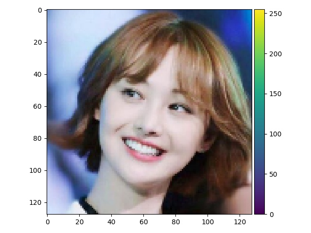

需要在`k210`中实现图像的裁剪缩放,所以就写了个双线性插值的程序进行处理.写好了记录一下.


<!--more-->

# 理论

双线性插值只涉及到邻近的4个像素点，如图:


通过一个比例系数算出最终图像的`(distI,distJ)`在源图像中的具体位置,这个位置肯定会有在两个像素点中间,这个时候就可以通过双线性插值的方式确定像素值.

$$ 
\begin{aligned}
    z_1&=(f(i,j+1)-f(i,j))*u+f(i,j) \\
    z_2&=(f(i+1,j+1)-f(i+1,j))*u+f(i+1,j) \\
    z  &=(z_2-z_1)*v+z_1 \\
    \\
    f(x,y) &: x,y对应位置的像素值 \\
    u  &: 映射像素在横向两个像素之间的位置 \\
    v  &: 映射像素在纵向两个像素之间的位置 
\end{aligned}
$$

**NOTE:** 这里其实先算$u$还是$v$都没有关系,但是要注意先算$v$的话需要纵向相减.还有放大缩小的坐标需要通过$(i+0.5)*r-0.5$来计算,这样才可以保证映射到中心对齐.


# 程序

两段小程序:

这是`resize rgb888 hwc`格式的图像
```cpp
/**
 * @brief resize rgb image, image : [old_h,old_h,3]
 *          NOTE : image have to ba rag888
 *
 * @param old_img
 * @param new_img
 * @param old_h
 * @param old_w
 * @param new_h
 * @param new_w
 */
void resize_img(uint8_t *old_img, uint8_t *new_img, int old_h, int old_w, int new_h, int new_w) {
    if (old_img == nullptr || new_img == nullptr) { return; }

    float rx= (float)old_w / new_w, ry= (float)old_h / new_h;
    float rgx[new_w], rgy[new_h];
    int fx0y0, fx0y1, fx1y0, fx1y1;
    uint x0, y0, x1, y1;
    uint z1, z2, z, cnl= 3, old_stride= old_w * cnl, new_stride= new_w * cnl;
    for (size_t i= 0; i < new_w; i++) { rgx[i]= (i + 0.5) * rx - 0.5; }
    for (size_t i= 0; i < new_h; i++) { rgy[i]= (i + 0.5) * ry - 0.5; }

    for (size_t i= 0; i < new_h; i++) {
        y0= (uint)rgy[i];
        y1= (y0 + 1) < old_h ? (y0 + 1) : old_h;
        for (size_t j= 0; j < new_w; j++) {
            x0= (uint)rgx[j];
            x1= (x0 + 1) < old_w ? (x0 + 1) : old_w;

            float u= rgx[j] - x0, v= rgy[i] - y0;
            for (size_t k= 0; k < cnl; k++) {
                fx0y0= rgb_image[old_stride * y0 + cnl * x0 + k] << 11;
                fx0y1= rgb_image[old_stride * y1 + cnl * x0 + k] << 11;
                fx1y0= rgb_image[old_stride * y0 + cnl * x1 + k] << 11;
                fx1y1= rgb_image[old_stride * y1 + cnl * x1 + k] << 11;
                z1= (uint)((fx1y0 - fx0y0) * u + fx0y0);
                z2= (uint)((fx1y1 - fx0y1) * u + fx0y1);
                z= (uint)((z2 - z1) * v + z1);
                new_img[new_stride * i + cnl * j + k]= (uint8_t)(z >> 11);
            }
        }
    }
}
```

这是`resize rgb888 CHW`格式的图像
```cpp
/**
 * @brief resize k210 ai image, image have to be CHW
 * 
 * @param old_img 
 * @param new_img 
 * @param old_h 
 * @param old_w 
 * @param new_h 
 * @param new_w 
 */
void resize_ai_img(uint8_t *old_img, uint8_t *new_img, int old_h, int old_w, int new_h, int new_w) {
    if (old_img == nullptr || new_img == nullptr) { return; }

    float rx= (float)old_w / new_w, ry= (float)old_h / new_h;
    float rgx[new_w], rgy[new_h];
    uint x0, y0, x1, y1;
    int fx0y0, fx0y1, fx1y0, fx1y1;
    uint z1, z2, z, stride, new_stride, cnl= 3;
    float u, v;

    for (size_t i= 0; i < new_w; i++) { rgx[i]= (i + 0.5) * rx - 0.5; }
    for (size_t i= 0; i < new_h; i++) { rgy[i]= (i + 0.5) * ry - 0.5; }

    for (size_t k= 0; k < cnl; k++) {
        stride= old_w * old_h * k;
        new_stride= new_w * new_h * k;
        for (size_t i= 0; i < new_h; i++) {
            y0= (uint)rgy[i];
            y1= (y0 + 1) < old_h ? (y0 + 1) : old_h;
            for (size_t j= 0; j < new_w; j++) {
                x0= (uint)rgx[j];
                x1= (x0 + 1) < old_w ? (x0 + 1) : old_w;

                u= rgx[j] - x0;
                v= rgy[i] - y0;

                fx0y0= old_img[stride + old_w * y0 + x0] << 11;
                fx0y1= old_img[stride + old_w * y1 + x0] << 11;
                fx1y0= old_img[stride + old_w * y0 + x1] << 11;
                fx1y1= old_img[stride + old_w * y1 + x1] << 11;

                z1= (uint)((fx1y0 - fx0y0) * u + fx0y0);
                z2= (uint)((fx1y1 - fx0y1) * u + fx0y1);
                z= (uint)((z2 - z1) * v + z1);
                new_img[new_stride + new_w * i + j]= (uint8_t)(z >> 11);
            }
        }
    }
}
```


# 效果

