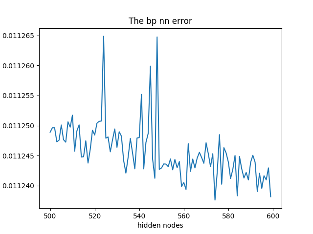
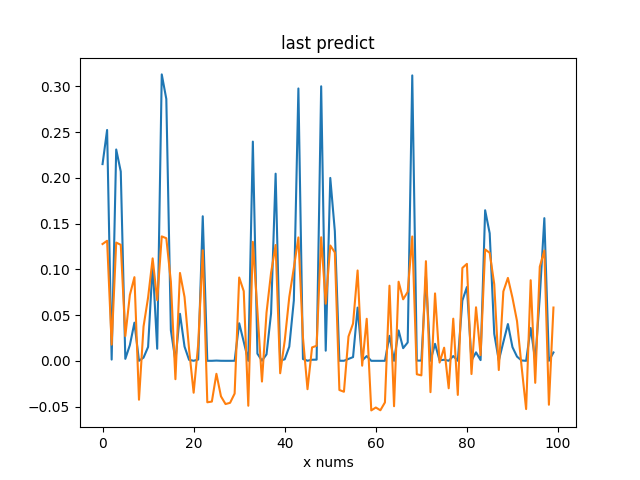

利用`BP`神经网络实现非线性回归,我用了两个方式实现,发现用库的方式没有我从吴恩达老师作业里面改过去的好用.先看题目.


已知函数$f(x)=e^{-x},1\leq x\leq 10$利用`BP`神经网络以及`sigmod`函数对上面的函数完成以下工作.

  1.  获取两组数据,一组作为训练集,一组作为测试集


  2.  利用训练集,训练一个单隐层的网络


  3.  利用测试集检验训练结果,改变单隐层神经元个数,研究它对逼近效果的影响


<!--more-->


# 利用sklean库实现

这个是利用sklean库训练隐含层`500~600`的`MSE`变化情况


```python
# coding=utf-8
from numpy.core import *
from numpy.random import *
from sklearn.svm import SVR
from sklearn.neural_network import MLPRegressor
import matplotlib.pyplot as plt
# #############################################################################
# Generate sample data
tarin_nums = 5000
test_nums = 100
tarin_x = rand(tarin_nums, 1)*9+1
tarin_y = exp(-tarin_x)  # type:ndarray
test_x = rand(test_nums, 1)*9+1
test_y = exp(-test_x)
predict = zeros_like(test_y)  # 结果矩阵
mse = zeros(100)
# #############################################################################
# Fit regression model
for i in range(100):
    print(i)
    mlp = MLPRegressor(solver='lbfgs', activation='logistic',
                       hidden_layer_sizes=(500+i,))
    predict = mlp.fit(tarin_x, tarin_y.ravel()).predict(test_x)
    mse[i] = mean((predict-test_y)**2)

# Look at the results
plt.figure()
plt.title('The bp nn error')
plt.plot(range(500, 500+100), mse)
plt.xlabel('hidden nodes')
plt.ylabel('mse')

plt.figure()
plt.title('last predict')
plt.xlabel('x nums')
plt.plot(range(100), test_y, range(100), predict)

plt.show()

```


## 效果图




# 自己实现
此代码是根据我写的吴恩达老师的作业修改而来.


```python
from numpy.core import *
from numpy.random import *
from numpy import c_, r_
import matplotlib.pyplot as plt
from scipy.io import loadmat
from scipy.optimize import fmin_cg
from fucs4 import randInitializeWeights, costFuc, gradFuc, predict


if __name__ == "__main__":

    # Generate Training Data
    print('generate Data ...')

    # training data stored in arrays X, y
    tarin_nums = 5000
    test_nums = 100
    train_x = rand(tarin_nums, 1)*9+1
    train_y = exp(-train_x)  # type:ndarray
    test_x = rand(test_nums, 1)*9+1
    test_y = exp(-test_x)
    # predict = zeros_like(test_y)  # 结果矩阵
    mse = zeros(50)

    for i in range(50):
        print('training times:{}'.format(i))

        input_layer_size = 1  # 1 input nodes
        hidden_layer_size = 50+i   # init 50 hidden units
        num_labels = 1          # 1 labels,

        initial_Theta1 = randInitializeWeights(
            input_layer_size, hidden_layer_size)
        initial_Theta2 = randInitializeWeights(
            hidden_layer_size, num_labels)

        # Unroll parameters
        initial_nn_params = r_[
            initial_Theta1.reshape(-1, 1), initial_Theta2.reshape(-1, 1)]

        MaxIter = 50

        #  You should also try different values of lamda
        lamda = 1

        nn_params = fmin_cg(costFuc, initial_nn_params.flatten(), gradFuc,
                            (input_layer_size, hidden_layer_size,
                             num_labels, train_x, train_y, lamda),
                            maxiter=MaxIter)

        # Obtain Theta1 and Theta2 back from nn_params
        Theta1 = nn_params[: hidden_layer_size * (input_layer_size + 1)] \
            .reshape(hidden_layer_size, input_layer_size + 1)
        Theta2 = nn_params[hidden_layer_size * (input_layer_size + 1):] \
            .reshape(num_labels, hidden_layer_size + 1)

        # =================  Implement Predict =================

        pred = predict(Theta1, Theta2, test_x)
        mse[i] = mean((pred-test_y)**2)

    plt.figure()
    plt.title('The bp nn error')
    plt.plot(range(50, 50+50), mse)
    plt.xlabel('hidden nodes')
    plt.ylabel('mse')

    plt.figure()
    plt.title('last predict')
    plt.xlabel('x nums')
    plt.plot(range(100), test_y, range(100), pred)

    plt.show()

```


## 执行效果


# 一点分析

大家可能也看到了上面的拟合效果差距,我认为第一是因为后面的方法中添加了正则项,并且加了`bias`节点,因此效果会好很多.