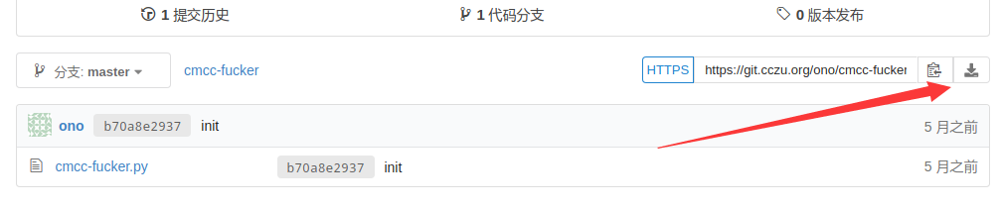
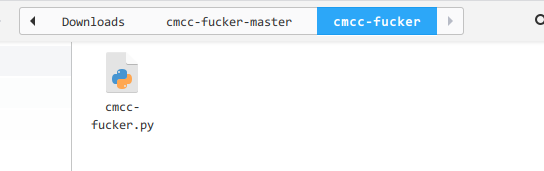
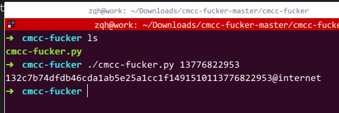

参考校园网使用指南.

<!--more-->

# 下载脚本

首先进入[此处](https://git.cczu.org/ono/cmcc-fucker)下载.点击图标选择`zip`下载


# 解压运行脚本

如果用deepin的话应该很方便,解压之后.在这个文件夹右键选择在终端打开.



打开终端列出文件


运行脚本,其中生成的就是宽带账号:
```sh
➜  cmcc-fucker ./cmcc-fucker.py 13776822953
132c7b74dfdb46cda1ab5e25a1cc1f1491510113776822953@internet
```


# 连接网络

把账号复制下来之后,点deepin的设置
右侧会出现设置栏,选择:

    网络->DSL->创建PPPoE连接


在账号栏输入刚刚生成的**账号**
密码栏输入你的**宽带密码**
点击保存连接即可~


