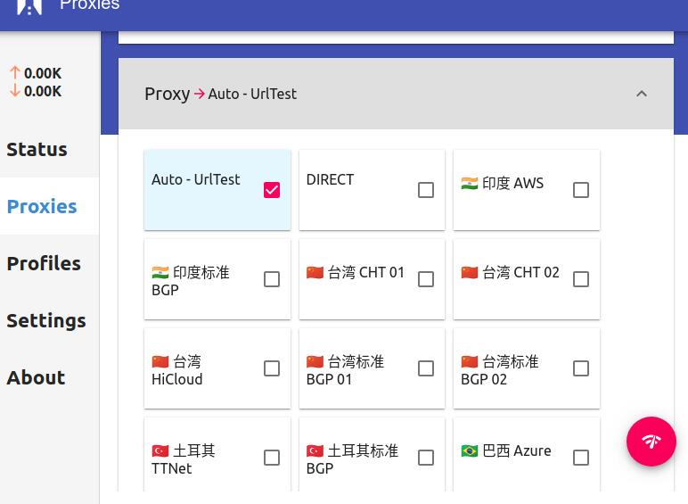

最近我开的`vultr`的`vps`好像全挂了，`ip`貌似被用滥了，所以使用机场了。现在用的这个一年`dlercloud`的一年`288`的套餐还挺贵的=_=。`window`下配置比较简单，下载官方提供的`clash-win`然后直接登陆账号密码就完事了，`Ubuntu`下面真的难倒我了，下面说下怎么配置。

<!--more-->

1.  下载[Clashy](https://github.com/SpongeNobody/Clashy/releases)

  因为`clash`配置实在麻烦，所以用这个，在`releases`下个`deb`的安装包安装即可。
  
2.  导入配置，打开网址复制`clash`的订阅连接，并黏贴到`Profiles`中。**记得保存之后要等一会，他的反应比较慢。。**

3.  设置端口

  我发现他的设置端口并不能修改`config`文件里面的内容，所以只能参考你当前使用的`config`文件进行设置。
  

4.  设置系统代理

  `Clashy`里面设置了`set as system proxy`但是好像没什么用，所以我手动给系统设置了代理地址。
  

5.  选择服务节点

  到上一步应该就没问题了，这里还可以选择一下各种节点我给好评。

# error: unsupported rule type RULE-SET

手贱更新了一下订阅地址，clashy就不支持新的配置文件了，这是因为clashy使用的clash版本较低。接着我去clash的项目主页中下载了clash v1.1也不行，最后发现原来clash作者认为RULE-SET实现的不好，主版本并没有给予支持。

1.  下载[clash Premium](https://github.com/Dreamacro/clash/releases/tag/premium)，解压
2.  从机场下载对应的订阅配置文件`config.yaml`，机场的连接一般如`https://dler.cloud/subscribe/xxxxxx?clash=ss`，点击连接即可下载。
3.  将配置文件与可执行文件放在同一个目录，终端执行`./clash-linux-amd64-2020.08.16 -d .`，将会自动下一个`Country.mmdb`文件，这个文件如果下载不下来就去网络找一个。
4.  软件启动后打开`http://clash.razord.top/`进行配置，首次进入时的外部控制设置根据我们的`config.yaml`中`external-controller`项进行设置。
5.  我们可以在`代理`中选择对应的节点，然后`设置-代理模式`我这里需要选择`脚本`才可以，以前应该不需要的。
6.  设置系统代理配置，对于`http`代理与`socks`代理，`ip`设置为`127.0.0.1`，端口号参考`config.yaml`中的`port`和`socks-port`，最后`ignoreed host`设置为 `localhost, 127.0.0.0/8, ::1`即可。
7.  应该可以正常访问外网了。