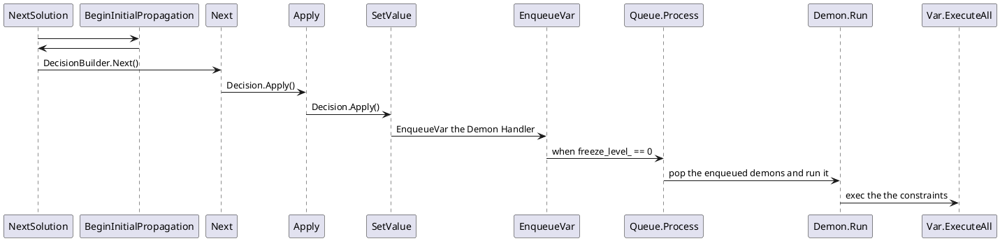

<!-- 添加介绍 -->
关于ortools中`Constraints Solver`的内部逻辑.

<!--more-->

首先是数据结构:

```plantuml
@startuml

class Decision {
  <color:green> 表示在搜索树中的一个选择点, Apply向右, Refute向左. </color>
  + void {abstract} Apply(Solver* s)<color:green> // 决策执行时调用 </color>
  + void {abstract} Refute(Solver* s) <color:green> // 回溯后调用 </color>
  + void {abstract} Accept(DecisionVisitor* visitor)
}

class Solver {
  + DefaultSolverParameters() ConstraintSolverParameters
  + AddConstraint(Constraint*)
  + Solve(DecisionBuilder*, vector<SearchMonitor*>)
}

class DecisionBuilder {
  <color:green> 构造搜索树 </color>
  + Decision* Next(Solver*)  <color:green> 返回下一步决策, 如果为空则结束. </color>
  + void AppendMonitors(Solver*, vector<SearchMonitor*>*) <color:green> 搜索开始前添加monitor. </color>
  + void Accept(ModelVisitor*)
}

class RestoreAssignment {
  <color:green> 只执行一次, 将Assignment全部恢复到Var </color>
}

DecisionBuilder <|-- RestoreAssignment

class StoreAssignment {
  <color:green> 只执行一次, 将Var当前值存储到Assignment </color>
}

DecisionBuilder <|-- StoreAssignment

DecisionBuilder *--- Decision

class Demon {
  <color:green> 传播队列的基础元素, 负责在变量值域中传播变量的约束以及删除不满足约束的值 </color>
  <color:green> 主要思想是附加到变量上监听变量的修改. </color>
  + void {abstract} Run(Solver* s) <color:green> //  </color>
  + DemonPriority {abstract} priority() <color:green> // 执行的优先级 </color>
  + void inhibit(Solver* s) <color:green> // 在当前位置抑制demon </color>
  + void desinhibit(Solver* s) <color:green> // 解除之前的抑制 </color>
}

class PropagationBaseObject {
  + Solver* solver() 
  + void FreezeQueue()
  + void UnfreezeQueue()
  + void EnqueueDelayedDemon(Demon* const d)
  + void EnqueueVar(Demon* const d)
  + void ExecuteAll(const SimpleRevFIFO<Demon*>& demons)
  + void EnqueueAll(const SimpleRevFIFO<Demon*>& demons)
}

abstract class Constraint {
  <color:green> 建模约束 </color>
  + void {abstract} Post() <color:green> // 在solve过程中将demon附加到var上. </color>
  + void {abstract} InitialPropagate() <color:green> // 初始化传播, 在Post之后调用 </color>
  void PostAndPropagate() <color:green> // 在root节点是同时做两件事 </color>
  + void {abstract} Accept(ModelVisitor* visitor)
  bool IsCastConstraint() <color:green> // 是否是cast到integer </color>
  + IntVar*{abstract} Var(); <color:green> // 返回代表约束满足的bool var, 如果为Null表示不支持 </color>
} 

PropagationBaseObject <|-- Constraint

class CastConstraint {
  <color:green> 特殊的约束 </color>
  + IntVar* target_var() 
}

Constraint <|-- CastConstraint

class IntExpr {
  <color:green> 整数表达式, 建模的基础, 可以进行如下操作 </color>
  <color:green>  1. 查询边界值 </color>
  <color:green>  2. 设定边界值 </color>
  <color:green>  3. 监听边界值改变 </color>
  <color:green>  4. 构造对应var </color>
  + int64_t  {abstract} Min();
  + void  {abstract} SetMin(int64_t m);
  + int64_t  {abstract} Max();
  + void  {abstract} SetMax(int64_t m);
  + void  {abstract} Range(int64_t* l, int64_t* u);
  + void  {abstract} SetRange(int64_t l, int64_t u);
  + void  {abstract} SetValue(int64_t v);
  + bool  {abstract} Bound();
  + bool  {abstract} IsVar();
  + IntVar* {abstract}  Var();
  + void  {abstract} WhenRange(Demon* d);
}

PropagationBaseObject <|-- IntExpr

class IntVar {
  <color:green> Var也是表达式 </color>
  + int64_t {abstract} Value()
  + void {abstract} RemoveValue(int64_t v)
  + void {abstract} RemoveInterval(int64_t l, int64_t u)
  + void {abstract} RemoveValues(const std::vector<int64_t>& values);
  + void {abstract} SetValues(const std::vector<int64_t>& values);
  + void {abstract} WhenBound(Demon* d)
  + void WhenBound(Solver::Closure closure)
  + void WhenBound(Solver::Action action)
  + void {abstract} WhenDomain(Demon* d)
  + void WhenDomain(Solver::Closure closure)
  + void WhenDomain(Solver::Action action)
  + uint64_t {abstract} Size()
  + bool {abstract} Contains(int64_t v)
  + IntVarIterator*{abstract}  MakeHoleIterator(bool reversible)
  + IntVarIterator*{abstract}  MakeDomainIterator(bool reversible)
  + int64_t {abstract} OldMin()
  + int64_t {abstract} OldMax()
  + int {abstract} VarType() const;
  + IntVar* {abstract} IsEqual(int64_t constant)
  + IntVar* {abstract} IsDifferent(int64_t constant)
  + IntVar* {abstract} IsGreaterOrEqual(int64_t constant)
  + IntVar* {abstract} IsLessOrEqual(int64_t constant)
  + int index()
}

IntExpr <|-- IntVar


abstract class SearchMonitor {
  + void {abstract} EnterSearch()
  + void {abstract} RestartSearch()
  + void {abstract} ExitSearch()
  + void {abstract} BeginNextDecision(DecisionBuilder* b)
  + void {abstract} EndNextDecision(DecisionBuilder* b, Decision* d)
  + void {abstract} ApplyDecision(Decision* d)
  + void {abstract} RefuteDecision(Decision* d)
  + void {abstract} AfterDecision(Decision* d, bool apply)
  + void {abstract} BeginFail()
  + void {abstract} EndFail()
  + void {abstract} BeginInitialPropagation()
  + void {abstract} EndInitialPropagation()
  + bool {abstract} AcceptSolution()
  + bool {abstract} AtSolution()
  + void {abstract} NoMoreSolutions()
  + bool {abstract} LocalOptimum()
  + bool {abstract} AcceptDelta(Assignment* delta, Assignment* deltadelta)
  + void {abstract} AcceptNeighbor()
  + void {abstract} AcceptUncheckedNeighbor()
  + bool {abstract} IsUncheckedSolutionLimitReached(
  + void {abstract} PeriodicCheck()
  + int {abstract} ProgressPercent()
  + void {abstract} Accept(ModelVisitor* visitor)
  + void {abstract} Install() <b><color:green> // 注册自身</color> 
}

class SolutionCollector {
  <color:green> 收集添加过的变量 </color>
  + void Add(IntVar* var)
  + void Add(const std::vector<IntVar*>& vars)
  + void Add(IntervalVar* var)
  + void Add(const std::vector<IntervalVar*>& vars)
  + void Add(SequenceVar* var)
  + void Add(const std::vector<SequenceVar*>& vars)
  + void AddObjective(IntVar* objective)
  + void AddObjectives(const std::vector<IntVar*>& objectives)
}

SearchMonitor <|-- SolutionCollector

class ObjectiveMonitor {
  <color:green> 优化目标监控基类 </color>
  + IntVar* ObjectiveVar(int index)
  + IntVar* MinimizationVar(int index)
  + int64_t Step(int index)
  + bool Maximize(int index)
  + int64_t BestValue(int index)
  + int Size()
  + void EnterSearch()
  + bool AtSolution()
  + bool AcceptDelta(Assignment* delta, Assignment* deltadelta)
  + void Accept(ModelVisitor* visitor)
}

SearchMonitor <|-- ObjectiveMonitor

class OptimizeVar {
  <color:green> 概括目标, 指定方向, 变量, 步幅即可 </color>
  + int64_t best()
  + IntVar* var()
  + void BeginNextDecision(DecisionBuilder* db)
  + void RefuteDecision(Decision* d)
  + bool AtSolution()
  + bool AcceptSolution()
  + void ApplyBound()
}

ObjectiveMonitor <|-- OptimizeVar


class SearchLimit {
  + void EnterSearch() 
  + void BeginNextDecision(DecisionBuilder* b) 
  + void PeriodicCheck() 
  + void RefuteDecision(Decision* d) 
  + void Install()
  + bool crossed() <b><color:green> // 检查limit是否已经失败 </color>  
  + bool Check() <b><color:green> // 检查limit状态 </color>  
  + bool {abstract} CheckWithOffset(absl::Duration offset) <b><color:green> // 自定义检查方法 </color>  
}

SearchMonitor <|-- SearchLimit

class RegularLimit {
  <color:green> 基于搜索时间/探索分支数/失败错误来限制搜索 </color>
  + bool CheckWithOffset(absl::Duration offset)
} 

class ImprovementSearchLimit {
  <color:green>基于目标变量的改善率或者词典序进行限制.</color>
  + int64_t wall_time()
  + int64_t branches()
  + int64_t failures()
  + int64_t solutions()
  + bool CheckWithOffset(absl::Duration offset)
} 

SearchLimit <|-- RegularLimit
SearchLimit <|-- ImprovementSearchLimit


class IntervalVar {
  <color:green>包含duration的var.</color>
}

PropagationBaseObject <|-- IntervalVar

class SequenceVar {
  <color:green>包含多个IntervalVar.</color>
  + IntervalVar* Interval(int index)
}

PropagationBaseObject <|-- SequenceVar

class AssignmentElement {

}
class IntVarElement {

}

AssignmentElement <|-- IntVarElement

class IntervalVarElement {

}

AssignmentElement <|-- IntervalVarElement

class SequenceVarElement {

}

AssignmentElement <|-- SequenceVarElement

class Assignment {
  <color:green> 包含domain到var的映射, 用于展示solution.</color>
  + void Clear();
  + bool Empty()
  + int Size()
  + int NumIntVars()
  + int NumIntervalVars()
  + int NumSequenceVars()
  + void Store()
  + void Restore()
  + bool Load(const std::string& filename)
}

PropagationBaseObject <|-- Assignment

class Pack {
  <color:green> 多个var映射到bin的约束. </color>
  + void AddWeightedSumLessOrEqualConstantDimension(const std::vector<int64_t>& weights, const std::vector<int64_t>& bounds);
  + void AddWeightedSumLessOrEqualConstantDimension(Solver::IndexEvaluator1 weights, const std::vector<int64_t>& bounds);
  + void AddWeightedSumLessOrEqualConstantDimension(Solver::IndexEvaluator2 weights, const std::vector<int64_t>& bounds);
  + void AddWeightedSumEqualVarDimension(const std::vector<int64_t>& weights,const std::vector<IntVar*>& loads);
  + void AddWeightedSumEqualVarDimension(Solver::IndexEvaluator2 weights,const std::vector<IntVar*>& loads);
  + void AddSumVariableWeightsLessOrEqualConstantDimension(const std::vector<IntVar*>& usage, const std::vector<int64_t>& capacity);
  + void AddWeightedSumOfAssignedDimension(const std::vector<int64_t>& weights,IntVar* cost_var);
  + void AddCountUsedBinDimension(IntVar* count_var);
  + void AddCountAssignedItemsDimension(IntVar* count_var);
}

Constraint <|-- Pack


Constraint <|-- DisjunctiveConstraint


@enduml
```

其中整个优化模型由IntExpr和Constraints构成. 构建好约束后通过 DecisionBuilder来生成Decision, 每个Decision会给变量进行分配值, 分配好值

<!-- DecisionBuilder -> Decision -->