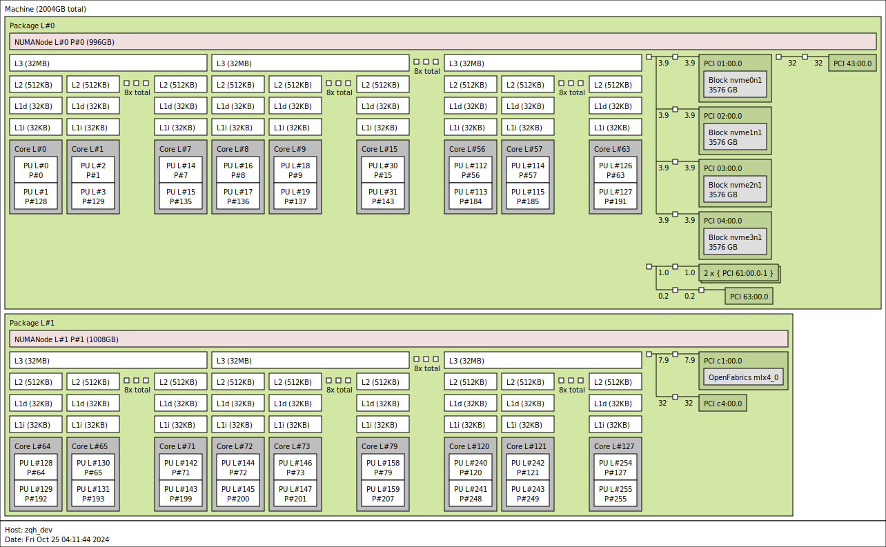

记录一些遇到的cpp新特性或者实现技巧上的问题。


<!--more-->


## 变长参数

我记得三年前我还好好学过，现在都忘光了，重新整理一下：

### 基本定义
```cpp
/**
 * @brief 获取不同长度的可变参数，打印参数的个数
 *
 * @tparam T
 * @param args
 */
template <typename... T>
void func(T... args) {
  cout << sizeof...(args) << endl;
}

TEST(test_varg, basic) {
  func();
  func(1);
  func(1, 2);
  func(1, 2, '3', vector<int>{3});
}
/**
 [ RUN      ] test_varg.basic
  0
  1
  2
  4
  [       OK ] test_varg.basic (0 ms)
 */
```
### 循环展开

#### 错误写法

参数匹配的时候需要注意，多个参数输入，最后会匹配到单参数的输入，但是单参数的时候不会调用无参数的终止函数。
```cpp
void print() { cout << " ;" << endl; }
template <typename T>
void print(T v) {
  cout << v << " ";
}
template <typename T, typename... Args>
void print(T head, Args... args) {
  print(head);
  cout << "remain size : " << sizeof...(args) << endl;
  print(args...);
}

TEST(test_varg, recursive_print_error_version) {
  print();
  print(1, 2);
  print(1, 2.3, '3');
}
/**
 [ RUN      ] test_varg.recursive_print
  ;
  1 remain size : 1
  2 1 remain size : 2
  2.3 remain size : 1
  3 [       OK ] test_varg.recursive_print (0 ms)
 */
```

#### 正确写法

所以我们通常用一个无参的函数来终止，在多参数的函数中调用单个参数的处理方式。下面的例子就展示了正确的`log`函数以及一个从任意`base`累加的函数。
```cpp
void ic() { cout << " ; " << endl; }
template <typename T, typename... Args>
void ic(T head, Args... args) {
  cout << head << " ";
  ic(args...);
}

template <typename T>
T sums() {
  return (T)(-2);
}
template <typename T, typename... Ts>
T sums(T v, Ts... vs) {
  return v + sums<T>(vs...);
}

TEST(test_varg, recursive_print_right_version) {
  ic(sums(1, 2));
  ic(sums(1, 2.3, 3.5));
  ic(sums(2.3, 1, 3.5));
}
/*
[ RUN      ] test_varg.recursive_print_right_version
1  ; 
4  ; 
4.8  ; 
[       OK ] test_varg.recursive_print_right_version (0 ms)
*/
```

### 变参模板展开


这里利用c++17中的特性方便的展开并对参数进行处理。
```cpp

template <typename T>
int toint(T t) {
  return (int)t;
}

template <typename... Args>
vector<int> toints(Args... args) {
  vector<int> arr = {toint(args)...};
  return arr;
}
// 利用if constexpr编译期间即构造出对应的输出方式。
template <typename Head, typename... Args>
void print2(Head head, Args... args) {
  cout << head;
  if constexpr (sizeof...(args) > 0) {
    cout << " , ";
    print2(args...);
  } else {
    cout << " ; " << endl;
  }
}

TEST(test_varg, expand_right_version) {
  auto arr = toints(1.2, 2.4, 3.6, 4.7);
  for (size_t i = 0; i < arr.size(); i++) { ic(arr[i]); }
  auto arr2 = countargs(1.2, 2.4, 3.6, 4.7);
  for (size_t i = 0; i < arr2.size(); i++) { ic(arr2[i]); }
  print2("hello", "word", "yes", 1, 3, 4.5);
}


```
我们可以利用一个函数对每个参数进行操作，并且结合逗号表达式可以做一些别的事情。
```sh
[ RUN      ] test_varg.expand_right_version
1  ; 
2  ; 
3  ; 
4  ; 
0  ; 
1  ; 
2  ; 
3  ; 
hello , word , yes , 1 , 3 , 4.5 ; 
[       OK ] test_varg.expand_right_version (0 ms)
```
### 折叠表达式

用折叠表达式可以把一些简单的递归写的更加简洁，但是他的运算方向和人通常认为的不同：

```cpp
template <typename... T>
auto rsub(T... t) {
  return (t - ...);
}
template <typename... T>
auto lsub(T... t) {
  return (... - t);
}

TEST(test_varg, fold_expressions) {
  cout << rsub(1, 2, 3, 4, 5) << endl;
  cout << lsub(1, 2, 3, 4, 5) << endl;
}
```

```sh
[ RUN      ] test_varg.fold_expressions
3
-13
[       OK ] test_varg.fold_expressions (0 ms)
```

###  integer_sequence

利用integer_sequence我们可以展开一些数组，并对数组中的每个元素做处理，下面就给出一段编译期展开循环去计算卷积的程序：
```cpp
template <typename T, size_t... W>
void conv1xM(float& sum, T r, T k, std::index_sequence<W...>) {
  ((sum += r[W] * k[W]), ...);
}

template <size_t Filter_W, typename T, size_t Filter_H, size_t... H>
void convNxM(float& sum, std::array<T, Filter_H>& r, std::array<T, Filter_H>& k,
             std::index_sequence<H...>) {
  (conv1xM(sum, r[H], k[H], std::make_index_sequence<Filter_W>{}), ...);
}

template <size_t Filter_W, typename T, size_t Filter_H>
void convNxM(float& sum, std::array<T, Filter_H>& r,
             std::array<T, Filter_H>& k) {
  convNxM<Filter_W>(sum, r, k, std::make_index_sequence<Filter_H>{});
}

TEST(test_tmp, conv) {
  constexpr size_t K_h = 3, K_w = 6;
  size_t I_h = 32, I_w = 64;
  float kernel[K_h * K_w];
  std::iota(kernel, kernel + K_h * K_w, 0);
  float image[I_h * I_w];
  std::iota(image, image + I_h * I_w, 0);
  IC(image[0]);

  std::array<float*, K_h> r{image, image + I_w, image + I_w * 2};
  std::array<float*, K_h> k{kernel, kernel + K_w, kernel + K_w * 2};
  float sum = 0.;
  convNxM<K_w>(sum, r, k);
  IC(sum);
}
```

输出
```sh
[ RUN      ] test_tmp.conv
ic| image[0]: 0
ic| sum: 14835
[       OK ] test_tmp.conv (0 ms)
```

总之我们利用模板传递静态时期的常量，然后利用index sequence对当前的数组进行索引从而获得展开循环的加速效果。

## 右值&左值

### 一个问题

```cpp
void dosomething(vector<int>& arr) { arr[2] = 0; }

TEST(rvalue, basic) {
  vector<int> arr{1, 3, 4};
  dosomething(arr);
  dosomething(vector<int>{1, 3, 4});
}
```


# 模板

### 获取容器内部类型

有个很蛋疼的问题就是对于传入一个array的数据，我们的模板定义需要
```cpp
template<typename T,size_t N>
```
然后我就找了一下有没有方便的办法，发现可以这样：
```cpp
template <typename Array>
using element_type_t =
    std::remove_reference_t<decltype(*std::begin(std::declval<Array&>()))>;

template <size_t N = 20, typename Array>
auto get_same_type_array(Array& a, element_type_t<Array> b) {
  std::array<element_type_t<Array>, N> c{b};
  return c;
}

TEST(test_tmp, test_get_array_type) {
  constexpr size_t K_h = 3, K_w = 6;
  size_t I_h = 32, I_w = 64;
  float kernel[K_h * K_w];
  std::iota(kernel, kernel + K_h * K_w, 0);
  float image[I_h * I_w];
  std::iota(image, image + I_h * I_w, 0);
  IC(image[0]);

  std::array<float*, K_h> r{image, image + I_w, image + I_w * 2};
  std::array<float*, K_h> k{kernel, kernel + K_w, kernel + K_w * 2};
  auto b = get_same_type_array<5>(r, image);
  IC(b);
}
```
实际上也就是静态时期的编译获得类型，然后得知输入b的类型，这样我们少输入一个模板，在多重模板迭代的过程中十分方便。

输出：
```sh
[ RUN      ] test_tmp.test_get_array_type
ic| image[0]: 0
ic| b: [0x16ceccb30, 0x0, 0x0, 0x0, 0x0]
[       OK ] test_tmp.test_get_array_type (0 ms)
```


## 编译期通过类型执行不同的代码

```cpp
class Mat {
 public:
  float* data;
  Mat() { data = new float[100]; }
  ~Mat(){};
};

template <typename T>
void make_mat(T& m) {
  if constexpr (std::is_pointer<T>()) {
    IC("is pointer");
    m[0] = 100;
  } else {
    IC("is Mat");
    m.data[0] = 100;
  }
}

TEST(test_tmp, integral_constant) {
  Mat m1;
  float* m2 = new float[10];
  make_mat(m1);
  make_mat(m2);
}
```


输出

```cpp
[ RUN      ] test_tmp.integral_constant
ic| std::string("is Mat"): "is Mat"
ic| std::string("is pointer"): "is pointer"
[       OK ] test_tmp.integral_constant (0 ms)
```


## 类型保存值

这个是我写了半天才发现c++模板的套路,其实就是把一个变量看成一个类型,下面就是把这个模板参数用两种方式表示(不过我暂时还不知道如何选择这两种方式):

```cpp
template <uint64_t mmu_item,
          uint64_t start_bank,
          MMU_CONF_WIDTH width,
          uint64_t start_depth,
          uint64_t depth>
struct inst_mmu_conf_warper
{
  using type = std::index_sequence<0x12, mmu_item,
                                   start_bank,
                                   static_cast<uint64_t>(width),
                                   start_depth,
                                   depth>;
  constexpr static auto values = std::index_sequence<0x12, mmu_item,
                                                     start_bank,
                                                     static_cast<uint64_t>(width),
                                                     start_depth,
                                                     depth>{};
};
```


## 结构体模板元函数的套路

其实一开始写模板看不懂就是因为c++的语法太多了,不过我们还是只需要掌握一些主要的语法就可以了.

我主要接触到的模板主要分以下几种表示方法.
```cpp
/* 模板元函数的写法 1 */

// 定义元函数的入参,这里表明这个结构体接收一个类型作为参数
template <typename T>
struct method_1 {};

// 我们特化上面的那个元函数,通常特化直接写值,但是由于我们当前给的参数还依赖一个未知的`Value`,因此还需要给元函数再加一个模板类型.
template <size_t Value>
struct method_1<std::integral_constant<size_t, Value>>
{
  // 同时对于这个模板元的返回值也有两种方法,可以是一个静态的变量,也可以是对应的类型(此时那个类型其实也保存了值)
  constexpr static size_t one_v = Value + 1;
  using one_t = std::integral_constant<size_t, Value + 1>;
};
```


## 模板元函数编写与匹配的几个套路

在c++17之前我们可以用`std::enable_if`来决议这个匹配是不是有效的,首先对于同一个函数,他的返回值应该是一致的(保证我们思维的一致性),所以通过`enable_if`决议当前的输入类型下是否可以匹配. 下面这个例子就是把整形和array类型通过决议分开匹配,从而实现不同的`assgin_to_array`,不然输入的`array`还是会被默认匹配到第一个函数:
```cpp
template <typename T, size_t... Is>
constexpr std::enable_if_t<std::is_integral_v<T>, void> assgin_to_array(std::array<uint8_t, sizeof(T)> &dest, const T &src, std::index_sequence<Is...>)
{
  ((dest[Is] = (src >> (Is * 8))), ...);
}

template <typename T1, typename T2, size_t N, size_t... Is>
constexpr std::enable_if_t<sizeof(T1) == sizeof(T2), void> assgin_to_array(std::array<T1, N> &dest, const std::array<T2, N> &src, std::index_sequence<Is...>)
{
  copy(dest.data(), src.data(), 0, std::index_sequence<Is...>{});
}
```

不过现在有了`constexpr if`,我们可以直接在同一个函数中不同的操作,这里要注意一个小坑,就是`std::is_array`只能检测是不是c风格的数组,但是他不能检测`std::array`,所以我这里重写了一个`is_std_array`:
```cpp
template <typename T, size_t... Is>
constexpr void assgin_to_array(std::array<uint8_t, sizeof(T)> &dest, const T &src, std::index_sequence<Is...>)
{
  if constexpr (std::is_integral_v<T>)
  {
    ((dest[Is] = (src >> (Is * 8))), ...);
  }
  else if constexpr (is_std_array<T>::value)
  {
    copy(dest.data(), src.data(), 0, std::index_sequence<Is...>{});
  }
}
```

## tuple元素进行fold expressions中重载操作符遇到的坑

我想重载`+`然后对`tuple`进行操作,但是遇到找不到重载加号的问题.最后发现这个操作必须要声明到std才有效.

## 变长模板匹配的模式

c++变长模板他不能匹配`seq<Le..., Ls>`这种模式,只能匹配`seq<Ls,Le...>`,也就是取第一个元素是方便的(或者前n个元素都是方便的),如果你想取最后一个元素那么就需要递归一次.


```cpp
template <typename T>
struct take_head
{
};

template <size_t Ls, size_t... Le>
struct take_head<seq<Ls, Le...>>
{
  constexpr static size_t value = Ls;
};

template <typename A, typename B>
struct take_two_head
{
};

template <size_t Ls, size_t... Le, size_t Rs, size_t... Re>
struct take_two_head<seq<Le..., Ls>, seq<Re..., Rs>>
{
  constexpr static size_t value_L = Ls;
  constexpr static size_t value_R = Rs;
};

TEST(test, take_two_head)
{
  take_two_head<seq<0, 1, 2, 3, 4>, seq<5, 6>> two{};
  //  auto lh = {} value;
  ic(two.value_L);
  ic(two.value_R);
}

```

## 通过隐式转换来实现零成本抽象

通过vector包

```cpp

#include <algorithm>
#include <array>
#include <cmath>
#include <cstddef>
#include <cstdint>
#include <cstring>
#include <numeric>
#include <optional>
#include <span>
#include <utility>
#include <arm_neon.h>
#include <iostream>

template <class T, size_t... Lanes> struct native_vector_type;

template <> struct native_vector_type<float, 32> {
    using type = float32x4_t[8];
};

template <> struct native_vector_type<float, 4> {
    using type = float32x4_t;
};


template <class T, size_t... Lanes> struct vector {
    using element_type = T;
    using value_type = typename native_vector_type<T, Lanes...>::type;

  private:
    alignas(sizeof(value_type)) value_type v_;

  public:
    vector() = default;

    vector(const value_type &vec) : v_(vec) {}

    constexpr operator value_type() const noexcept { return v_; }

    constexpr operator value_type &() noexcept { return v_; }

    constexpr auto buffer() noexcept {
        return std::span(reinterpret_cast<element_type *>(&v_),
                         (1 * ... * Lanes));
    }

};

int main()
{
    vector<float,4> *a = new vector<float,4>();
    a->buffer()[0] = 1.0f;
    a->buffer()[1] = 2.0f;
    vector<float,4> b;
    b.buffer()[0] = 1.0f;
    b.buffer()[1] = 2.0f;
    // float32x4_t d;
    vector<float,4> c = *a * b;
    std::cout << c.buffer()[0] << std::endl;
    std::cout << c.buffer()[1] << std::endl;   
}
```


# 类

## explicit

explicit是用于表示当前的构造函数不能进行隐式转换，比如如下代码：


```cpp
class StrBlob {
 public:
  shared_ptr<vector<string>> data;

  StrBlob() : data(make_shared<vector<string>>()){};
  StrBlob(initializer_list<string> il)
      : data(make_shared<vector<string>>(il)){};
  size_t size() { return data->size(); };
  size_t use_count() { return data.use_count(); };

  const string& front() {
    check(0, "front");
    return data->front();
  }
  const string& back() {
    check(0, "back");
    return data->back();
  }
  void push_back(const string& s) { data->push_back(s); }
  void pop_back() {
    check(0, "pop_back");
    data->pop_back();
  }

  void combine(StrBlob sb) {
    for (auto p = sb.data->begin(); p != sb.data->end(); p++)
      data->push_back(*p);
  }

 private:
  void check(size_t i, const string& msg) const {
    if (i >= data->size()) { throw out_of_range(msg); }
  }
};

TEST(test, t_12_5) {
  StrBlob b1{"1", "2", "3"};
  ic(*b1.data);
  b1.combine({"4", "5", "6"});
  ic(*b1.data);
}
```

我们在调用combine函数的时候需要的是一个StrBlob对象，但是我们实际combine的时候传入的是一个初始化列表，那么这个时候就会把隐式调用对应的构造函数，完成参数传递。这个时候如果我们给对应初始化列表的构造函数进行explicit限制，那么就会出现编译错误，要求传入一个正确的StrBlob对象。

# share_ptr

## 构造函数
这里有点奇怪，不强行指定`initializer_list<int>`是无法通过编译的，这太蛋疼了。
```cpp
make_shared<vector<int>>(initializer_list<int>{1, 2, 3})
```
同时make_shared还不支持new的方式构造shared_ptr。
## 拷贝赋值

他的赋值是直接把被赋值对象的内容给清空了，被赋值之后，q和
p其实都是q了，最后退出scope的时候，p的use_count会因为q的释放减少。
```cpp
TEST(test, shared_ptr_copy) {
  auto p = make_shared<int>(10);
  {
    auto q = make_shared<int>(11);
    p = q;
    ic(*q, q.use_count());
    ic(*p, p.use_count());
  }
  ic(*p, p.use_count());
}
```

```sh
[ RUN      ] test.shared_ptr_copy
ic| *q: 11, q.use_count(): 2
ic| *p: 11, p.use_count(): 2
ic| *p: 11, p.use_count(): 1
[       OK ] test.shared_ptr_copy (0 ms)
```

## C++: munmap_chunk(): invalid pointer

1.  通常这个问题应该是delete的内存不是被new出来的。
2.  指针运行时被修改
3.  指针越界（数组越界赋值了，但是当时不报错）


# clang编译<map>中报错 no viable overloaded '='

这个应该是clang的map头文件实现导致的,


```cpp
    _LIBCPP_INLINE_VISIBILITY
    __value_type& operator=(const __value_type& __v)
    {
        __ref() = __v.__get_value();
        return *this;
    }
```
通过clangd的类型提示发现:
```cpp
public: std::__value_type::value_type &__get_value()
no viable overloaded '='GCC
__tree(1662, 39): in instantiation of member function 'std::__value_type<const air::Var, int>::operator=' requested here
```

这个应该就是声明了一个包含`const air::Var`类型的map,然后类型特化的时候就出错了.

# ld: unknown option: -z

这个也是在mac上独有的问题,gcc ld中可以通过`-Wl,-z,relro,-z,now,-z,noexecstack`传递linker的参数,但是mac上虽然也可以给apple clang提供相同的命令行,但是真正调用`ld`的时候就会报上述错误,原因就是mac上的ld真的不支持这些选项...所以关闭即可.


# ld: unknown CoreFoundation

我想给target加上link参数,但是用cmake的写法发现有个大坑, 如果直接加Wl然后选项, 再用字符串包裹起来, 是无法编译的, 但是如果不用字符串, 编译器就会把空格后面的东西识别成另一个选项.
```cmake
target_link_options(simulator_k510 PUBLIC "-Wl,-framework CoreFoundation")
```
所以正确做法是连续的加Wl
```
target_link_options(simulator_k510 PUBLIC -Wl,-framework -Wl,CoreFoundation)
```

# m1上eigen使用fp16时的坑

在m1上eigen会检测到有fp16计算单元,此时`__half_raw`结构体中包含的就是`__fp16`类型
```c++
struct __half_raw {
#if defined(EIGEN_HAS_ARM64_FP16_SCALAR_ARITHMETIC)
  explicit EIGEN_DEVICE_FUNC EIGEN_CONSTEXPR __half_raw(numext::uint16_t raw) : x(numext::bit_cast<__fp16>(raw)) {
  }
  __fp16 x;
#else
  explicit EIGEN_DEVICE_FUNC EIGEN_CONSTEXPR __half_raw(numext::uint16_t raw) : x(raw) {}
  numext::uint16_t x;
#endif
}
```
如果没有那么就是标准的uint16类型,所以此时不能随便将`__fp16`的`x`赋值给`fp16`,需要使用`Eigen::numext::bit_cast<uint16_t>(dst_eig_f16.x)`才行.

# c语言regex使用

c里面的正则库是一个非常老的库,所以他的正则语法和其他语言有一部分正好相反,需要参考[这里](https://en.wikibooks.org/wiki/Regular_Expressions/POSIX_Basic_Regular_Expressions).


# linux下使用shared memory的坑

我是在docker中的ubuntu容器中使用shared memory, 发现虽然可以创建shm文件,但是只要进行内存写入copy的时候就会报错`Bus Error`. 参考[这篇文章](https://georgeoffley.com/blog/shared-memory-in-docker.html)才知道是docker本身限制的容器的shared memory大小只有64M.

```bash
❯ df -h | grep shm
shm                                                          64M   64M     0 100% /dev/shm
```

# 命令行调试dotnet core的dump信息

1. 安装[dotnet sos](https://github.com/dotnet/diagnostics/blob/main/documentation/installing-sos-instructions.md)
   1. 注意mac m1系列需要`dotnet-sos install --arch Arm64`
2. 然后开启core dump收集
```sh
ulimit -c unlimited
echo "core.%e.%p" > /proc/sys/kernel/core_pattern
```
1. 通过lldb挂载core file

这里我直接用vscode插件里面的lldb, 这个版本比较新,好用:

```sh
~/.vscode-server/extensions/vadimcn.vscode-lldb-1.7.2/lldb/bin/lldb -c tests/ForDebug/core..NET\ ThreadPool.298375
```
然后进去输入`bt`检查栈内容, 反正一顿调之后, 终于发现问题出在了.net过早的释放了c++的类对象. 
原因是这个.net中类是对interpreter的包装,然后再构造entry funciton的对象, entry function里面包含了interpreter, 但是在调用entry function invoke的时候.net还是会把interpreter释放掉, 然后c++中就会出现runtime function运行到一半时访问了被释放的自身.
上面这个问题也只有在.net的release中才会出现, 我怀疑是因为.net优化了


# mac中缺少gmp的问题

mac中安装clang时候默认是没有gmp.h的, 但是如果安装了python的话是可以在python的inclue中找到.
```sh
❯ ll /Users/lisa/miniforge3/envs/dl/include | grep gmp
-rw-rw-r--    1 lisa  staff    82K  5 15 18:32 gmp.h
-rw-rw-r--    2 lisa  staff   126K 11 19  2020 gmpxx.h
```

然后可以添加链接库和头文件位置:

```sh
CFLAGS=-I/Users/lisa/miniforge3/envs/dl/include
LDFLAGS=-L/Users/lisa/miniforge3/envs/dl/lib
```

# mac中编译出现libclang-cpp.dylib的问题

我这里是编译pet的lib, 然后make install的报错如下:
```sh
  Reason: tried: '/usr/local/lib/libclang-cpp.dylib' (no such file), '/usr/lib/libclang-cpp.dylib' (no such file)
```

然后发现是因为他的makefile里面调用了之前链接libclang的可执行文件extract_interface, 但是不知道为什么他的rpath没有设置对,导致还得手动设置`LD_LIBRARY_PATH`才能找到.so. 然后尝试了一下外部export环境变量,但是在makefile中并不起作用, 所以直接改了makefile:
NOTE : 我这里是mac所以使用`DYLD_LIBRARY_PATH`
```sh
isl.py: libdep.a interface/isl.py.top
	(cat $(srcdir)/interface/isl.py.top && \
		DYLD_LIBRARY_PATH=/Users/lisa/Documents/llvm-project/build/install/lib/ isl/interface/extract_interface$(EXEEXT) \
			--language=python \
			$(DEFAULT_INCLUDES) -I$(top_srcdir)/isl/include -I$(top_builddir)/isl/include \
			"./isl/all.h") \
			> $@ || (rm $@ && false)
```

找到了根本原因,其实就是他的编译器选项和clang的不同,他使用了`-R`来声明rpath, 但是clang中要使用`-Wl,-rpath,xxx`来设置rpath:
```sh
CLANG_RFLAG=`echo "$CLANG_LDFLAGS" | $SED -e 's\/-L\/-R\/g'`
# 改成如下即可.
CLANG_RFLAG=`echo "$CLANG_LDFLAGS" | $SED -e 's/-L/-Wl,-rpath,/g'`
```

# mac中'stdio.h' file not found

```sh
sudo ln -s /Library/Developer/CommandLineTools/SDKs/MacOSX.sdk/usr/include/* /usr/local/include/
```

# 动态加载的动态库无法调试的问题

对于一些链接优化的编译选项会导致这个问题, 最好是debug的时候关掉它。
```cmake
set_property(TARGET module PROPERTY INTERPROCEDURAL_OPTIMIZATION $<NOT:$<CONFIG:Debug>>)
```

# relocation R_RISCV_JAL out of range

好像是因为.a太大了的缘故,导致relocation跳转不过去.

```sh
[build] ld: error: /home/zqh/workspace/AndeSight_STD_v323/toolchains/nds64le-elf-mculib-v5d/bin/../lib/gcc/riscv64-elf/7.4.0/../../../../riscv64-elf/lib/libc.a(lib_a-memmove.o):(function memmove): relocation R_RISCV_JAL out of range: 645800 is not in [-524288, 524287]
[build] ld: error: /home/zqh/workspace/AndeSight_STD_v323/toolchains/nds64le-elf-mculib-v5d/bin/../lib/gcc/riscv64-elf/7.4.0/../../../../riscv64-elf/lib/libc.a(lib_a-memmove.o):(function memmove): relocation R_RISCV_JAL out of range: 645718 is not in [-524288, 524287]
```

# lldb 调试python/c++/csharp

1. 添加各种环境变量.
2. 用lldb启动python `❯ lldb-10 /root/miniconda3/envs/ci/bin/python`
3. 进入后通过run 启动py文件 `(lldb) run test_mobilenetv1.py `

# lldb 调试通过loadelf启动的可执行文件

首先是`image add`
```sh
Add a new module to the current target's modules.

Syntax: target modules add [<module>]

Command Options Usage:
  target modules add [-u <module-uuid>] [-s <filename>] [<path> [<path> [...]]]

       -s <filename> ( --symfile <filename> )
            Fullpath to a stand alone debug symbols file for when debug symbols
            are not in the executable.

       -u <module-uuid> ( --uuid <module-uuid> )
            A module UUID value.
     
     This command takes options and free-form arguments.  If your arguments
     resemble option specifiers (i.e., they start with a - or --), you must use
     ' -- ' between the end of the command options and the beginning of the
     arguments.

'image' is an abbreviation for 'target modules'
```
和`image load`命令:
```sh
Set the load addresses for one or more sections in a target module.

Syntax: target modules load [--file <module> --uuid <uuid>] <sect-name> <address> [<sect-name> <address> ....]

Command Options Usage:
  target modules load [-lp] [-u <module-uuid>] [-f <name>] [-s <offset>] [<filename> [<filename> [...]]]

       -f <name> ( --file <name> )
            Fullpath or basename for module to load.

       -l ( --load )
            Write file contents to the memory.

       -p ( --set-pc-to-entry )
            Set PC to the entry point. Only applicable with '--load' option.

       -s <offset> ( --slide <offset> )
            Set the load address for all sections to be the virtual address in
            the file plus the offset.

       -u <module-uuid> ( --uuid <module-uuid> )
            A module UUID value.
     
     This command takes options and free-form arguments.  If your arguments
     resemble option specifiers (i.e., they start with a - or --), you must use
     ' -- ' between the end of the command options and the beginning of the
     arguments.

'image' is an abbreviation for 'target modules'
```

# linux分布式资源分配

参考资料:
[core-pinning](https://manuel.bernhardt.io/posts/2023-11-16-core-pinning/)
[hwloc](https://www.open-mpi.org/projects/hwloc/)
这里使用hwloc输出的拓扑图:


## taskset

taskset是用于分配cpu资源, 但是在我这个物理上是128核的机器, 使用taskset是可以设定到0-255核的, 那么说明这个taskset的逻辑和物理的逻辑不一样.
但是taskset和mpi的配合好像不是很好:
```sh
❯ taskset -c 0-9 mpiexec -n 8 --bind-to core  python summa_3d.py
6 6
2 2
4 4
0 0
5 5
1 1
7 7
3 131
❯ taskset -c 0-4 mpiexec -n 8 --bind-to core  python summa_3d.py
4 4
0 0
5 5
1 1
7 7
3 131
6 134
2 130
```

## numactl

numactl 是分配内存资源的, 可以和taskset一起使用, 先使用numactl. 
是用前可以通过hardware查看自身机器状态
```sh
❯ numactl --hardware
available: 2 nodes (0-1)
node 0 cpus: 0 1 2 3 4 5 6 7 8 9 10 11 12 13 14 15 16 17 18 19 20 21 22 23 24 25 26 27 28 29 30 31 32 33 34 35 36 37 38 39 40 41 42 43 44 45 46 47 48 49 50 51 52 53 54 55 56 57 58 59 60 61 62 63 128 129 130 131 132 133 134 135 136 137 138 139 140 141 142 143 144 145 146 147 148 149 150 151 152 153 154 155 156 157 158 159 160 161 162 163 164 165 166 167 168 169 170 171 172 173 174 175 176 177 178 179 180 181 182 183 184 185 186 187 188 189 190 191
node 0 size: 1019903 MB
node 0 free: 951010 MB
node 1 cpus: 64 65 66 67 68 69 70 71 72 73 74 75 76 77 78 79 80 81 82 83 84 85 86 87 88 89 90 91 92 93 94 95 96 97 98 99 100 101 102 103 104 105 106 107 108 109 110 111 112 113 114 115 116 117 118 119 120 121 122 123 124 125 126 127 192 193 194 195 196 197 198 199 200 201 202 203 204 205 206 207 208 209 210 211 212 213 214 215 216 217 218 219 220 221 222 223 224 225 226 227 228 229 230 231 232 233 234 235 236 237 238 239 240 241 242 243 244 245 246 247 248 249 250 251 252 253 254 255
node 1 size: 1032158 MB
node 1 free: 813857 MB
node distances:
node   0   1 
  0:  10  32 
  1:  32  10 

❯ numactl --cpunodebind=0 -l --physcpubind=0-64 xxx
```

## mpi指定拓扑

这里我使用的是mpich的mpiexec, 他提供了`--bind-to`和`--map-by`两个参数, 最简单的方式是使用user的方式来设定
```sh
❯ mpiexec -n 8 --bind-to user:0,1,2,3,3,2,1,0  python summa_3d.py
6 1
5 2
1 1
2 2
4 3
7 0
0 0
3 3
```

# perf常用命令

```sh
❯ perf record -h

 Usage: perf record [<options>] [<command>]
    or: perf record [<options>] -- <command> [<options>]

    -a, --all-cpus        system-wide collection from all CPUs
    -b, --branch-any      sample any taken branches
    -B, --no-buildid      do not collect buildids in perf.data
    -c, --count <n>       event period to sample
    -C, --cpu <cpu>       list of cpus to monitor
    -d, --data            Record the sample addresses
    -D, --delay <n>       ms to wait before starting measurement after program start
    -e, --event <event>   event selector. use 'perf list' to list available events
    -F, --freq <freq or 'max'>
                          profile at this frequency
    -g                    enables call-graph recording
    -G, --cgroup <name>   monitor event in cgroup name only
    -I, --intr-regs[=<any register>]
                          sample selected machine registers on interrupt, use '-I?' to list register names
    -i, --no-inherit      child tasks do not inherit counters
    -j, --branch-filter <branch filter mask>
                          branch stack filter modes
    -k, --clockid <clockid>
                          clockid to use for events, see clock_gettime()
    -m, --mmap-pages <pages[,pages]>
                          number of mmap data pages and AUX area tracing mmap pages
    -N, --no-buildid-cache
                          do not update the buildid cache
    -n, --no-samples      don't sample
    -o, --output <file>   output file name
    -P, --period          Record the sample period
    -p, --pid <pid>       record events on existing process id
    -q, --quiet           don't print any message
    -R, --raw-samples     collect raw sample records from all opened counters
    -r, --realtime <n>    collect data with this RT SCHED_FIFO priority
    -S, --snapshot[=<opts>]
                          AUX area tracing Snapshot Mode
    -s, --stat            per thread counts
    -t, --tid <tid>       record events on existing thread id
    -T, --timestamp       Record the sample timestamps
    -u, --uid <user>      user to profile
    -v, --verbose         be more verbose (show counter open errors, etc)
    -W, --weight          sample by weight (on special events only)
        --affinity <node|cpu>
                          Set affinity mask of trace reading thread to NUMA node cpu mask or cpu of processed mmap buffer
        --aio[=<n>]       Use <n> control blocks in asynchronous trace writing mode (default: 1, max: 4)
        --all-kernel      Configure all used events to run in kernel space.
        --all-user        Configure all used events to run in user space.
        --buildid-all     Record build-id of all DSOs regardless of hits
        --call-graph <record_mode[,record_size]>
                          setup and enables call-graph (stack chain/backtrace):

                                record_mode:    call graph recording mode (fp|dwarf|lbr)
                                record_size:    if record_mode is 'dwarf', max size of stack recording (<bytes>)
                                                default: 8192 (bytes)

                                Default: fp
        --clang-opt <clang options>
                          options passed to clang when compiling BPF scriptlets
        --clang-path <clang path>
                          clang binary to use for compiling BPF scriptlets
        --dry-run         Parse options then exit
        --exclude-perf    don't record events from perf itself
        --filter <filter>
                          event filter
        --group           put the counters into a counter group
        --kernel-callchains
                          collect kernel callchains
        --mmap-flush <number>
                          Minimal number of bytes that is extracted from mmap data pages (default: 1)
        --namespaces      Record namespaces events
        --no-bpf-event    record bpf events
        --no-buffering    collect data without buffering
        --overwrite       use overwrite mode
        --per-thread      use per-thread mmaps
        --phys-data       Record the sample physical addresses
        --proc-map-timeout <n>
                          per thread proc mmap processing timeout in ms
        --running-time    Record running/enabled time of read (:S) events
        --sample-cpu      Record the sample cpu
        --strict-freq     Fail if the specified frequency can't be used
        --switch-events   Record context switch events
        --switch-max-files <n>
                          Limit number of switch output generated files
        --switch-output[=<signal or size[BKMG] or time[smhd]>]
                          Switch output when receiving SIGUSR2 (signal) or cross a size or time threshold
        --tail-synthesize
                          synthesize non-sample events at the end of output
        --timestamp-boundary
                          Record timestamp boundary (time of first/last samples)
        --timestamp-filename
                          append timestamp to output filename
        --transaction     sample transaction flags (special events only)
        --user-callchains
                          collect user callchains
        --user-regs[=<any register>]
                          sample selected machine registers on interrupt, use '--user-regs=?' to list register names
        --vmlinux <file>  vmlinux pathname
```

perf可以通过-e记录一些特定的事件, 比如page-faults, LLC-loads用于记录cache miss

调用flamegraph, 注意record的时候必须要开-g收集调用栈, 并且如果用fp记录栈，还需要在编译的时候开启`-fnoomit-frame-pointer`. 这个是linux 2.6的使用方式
```sh
git clone https://github.com/brendangregg/FlameGraph
export FlameGraph=`pwd`/FlameGraph
perf record -g your_program
perf script -i perf.data | ${FlameGraph}/stackcollapse-perf.pl | ${FlameGraph}/flamegraph.pl > flamegraph.svg
```

而linux 4.9以上只需要使用profile.py即可, 不过我在docker里面可能内核版本比较低, 安装bpfcc之后并没有相关的可执行文件, 不过现在是支持从conda安装.
```sh
❯ conda install pdrops::bcc
```

但是ebpf在容器中执行需要容器有privilege权限, 否则没法使用.

# profile python

可以使用cProfile来profiling整个python脚本
```sh
python -m cProfile --help
Usage: cProfile.py [-o output_file_path] [-s sort] [-m module | scriptfile] [arg] ...
```

然后使用`snakeviz`来可视化
```sh
❯ snakeviz program.prof
```

但是snakeviz目前基本不再维护, mpi的程序可以尝试使用`viztracer`, 可以通过`log_sparse`来设定自己感兴趣的区域:
```sh
❯ mpiexec -n 9  viztracer --pid_suffix --log_sparse --output_dir summa_prof summa.py
❯ viztracer --combine summa_prof/result_*.json -o summa_prof/result.json
❯ vizviewer summa_prof/result.json
```

