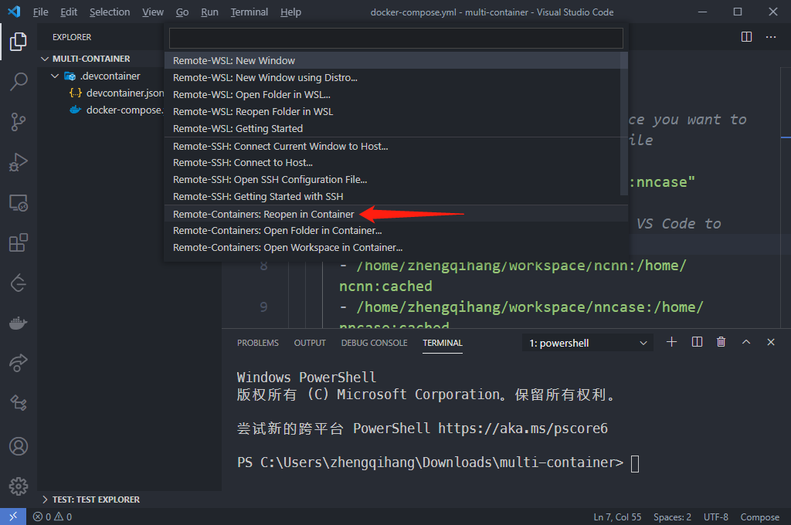

关于如何利用vscode在远程服务器中连接docker并进行开发。

<!--more-->


# 1. 在远程服务器中pull docker镜像

```sh
docker pull compilerteamer/gnne-compiler:nncase
```

# 2. 配置免密码登录，设置vscode Docker插件配置

ssh需要配置免密码登录，然后本地的vscode中需要下载插件Docker，并在vscode的`setting.json`中添加登录远程docker的配置：

```json
    "docker.host": "ssh://zhengqihang@10.8.1.12" // 可以用"ssh://zhengqihang@10.8.1.12:xx" 来指定端口
```

同时可能还需要配置`ssh-agent`

1.	设置-可选功能-添加openssh客户端
2.	服务-OpenSSH Authentication Agent-双击打开启动类型改为自动（延迟启动）
3.	cmd-输入`where ssh`显示C:\Windows\System32\OpenSSH\ssh.exe表示成功
4.	输入 `net start ssh-agent`启动服务
4.	输入 `ssh-add id_rsa`把key添加到agent中

然后再vscode中打开docker管理，可以直接在vscode中管理远程服务器中的docker了。

# 3. 将本地仓库代码上传至远程服务器

这里我将wsl中workspace文件夹全部同步到了远程服务器。
```sh
sudo scp -r workspace zhengqihang@10.8.1.12:/home/zhengqihang/
```
# 开发方法

## 方法一： 挂载多个卷组成multi-container

### 1. 新建vscode本地仓库，编辑docker配置文件

我是在Windows中建立一个`multi-container`的文件夹，用vscode打开然后建立docker配置文件：
在其中建立`.devcontainer`文件夹，`.devcontainer\devcontainer.json`与`docker-compose.yml`。


#### `.devcontainer\docker-compose.yml`

这里需要注意的就是把远程服务器上面的文件分别映射到容器中，这样才能用vscode分别打开各个文件夹。
```yaml
version: '3'
services:
  # Update this to the name of the service you want to work with in your docker-compose.yml file
  dev_remote:
    image: "compilerteamer/gnne-compiler:nncase"
    volumes:
      # Update this to wherever you want VS Code to mount the folder of your project
      - /home/zhengqihang/workspace/ncnn:/home/ncnn:cached
      - /home/zhengqihang/workspace/nncase:/home/nncase:cached
    # Overrides default command so things don't shut down after the process ends.
    command: /bin/sh -c "while sleep 1000; do :; done"
```

#### `.devcontainer\devcontainer.json`:

这里的`workspaceFolder`就是我们要打开的容器内文件夹的位置

```json
{
	"name": "Existing Docker Compose (Extend)",
	"dockerComposeFile": [
		"docker-compose.yml"
	],
	"service": "dev_remote",
	"workspaceFolder": "/home/ncnn",
	"settings": {
		"terminal.integrated.shell.linux": null
	},
	"extensions": []
}
```


### 2. 登录远程容器仓库

在`multi-container`中点击左下角的蓝色链接标志，然后选择`reopen in container`，最后当前文件夹被远程容器的repo替换掉。



我们默认打开的是`ncnn`的文件夹，如果要打开`nncase`的文件夹需要在`remote-container`插件中进行attch，然后就默认打开了下一个挂在的卷，也就是ncnn。


## 方法2：挂载一个卷，利用ssh的方式远程开发

经过一番折腾，发现上面的方法在vscode中存在巨大限制，vscode只能同时开两个文件夹，所以只能用ssh的方式进行开发了。

我已经把模板上传到[github](https://github.com/zhen8838/docker-repo-template)了，下载后修改公钥就可以直接利用vscode启动远程容器了。

进入远程容器之后启动ssh服务：
```bash
service ssh start
```

然后通过ssh即可连接远程服务器进行开发，我的模板仓库中把22端口映射到50008端口，所以ssh的连接命令如下
```bash
ssh root@xxxx -p 50008
```

## 总结

这样多个repo可以共用一个container就比较方便。不过还是需要寻找一些自动化的Dockerfile去配置容器，否则每次换一个人创建新环境又会浪费大量时间在配置上。


# FQA


## remote container 没有glibc 2.28
remote container的node使用的host 上的glibc，但是我的host又没有sudo权限，只能手动编译

```sh
wget -c https://ftp.gnu.org/gnu/glibc/glibc-2.28.tar.gz
tar -zxvf glibc-2.28.tar.gz
mkdir glibc-2.28/build
cd glibc-2.28/build
../configure --prefix=/opt/glibc
make -j
make install
```

编译安装好之后，删除`~/.vscode-remote-containers/`，然后重新连接他会下载一个新的node，然后报错得到没有glibc。但是你现在知道了具体的node路径。

```sh
/home/zhengqihang/.local/bin/patchelf --set-interpreter /data/zhengqihang/glibc-install/lib/ld-linux-x86-64.so.2 --set-rpath /data/zhengqihang/glibc-install/lib --force-rpath /home/zhengqihang/.vscode-remote-containers/bin/e249dada235c2083c83813bd65b7f4707fb97b76/node
```

## 手动下载code server

1. 首先根据remote dev启动时下载的文件路径确定commit id
2. 手动下载 :https://update.code.visualstudio.com/commit:${commit_id}/server-linux-x64/stable, 
3. 然后scp copy vscode-server-linux-x64.tar.gz到server上
4. 解压vscode-server-linux-x64.tar.gz 到 ~/.vscode-server/bin/${commit_id} ，如果是remote container需要用~/.vscode-remote-containers/bin/${commit_id}
   1. tar -xzf xx.tar.gz -C /path/to/target_directory
   2. mv /path/to/target_directory to xxx