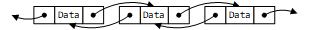

我对这个循环链表的理解是一个节点既有指向前一个元素的指针，又有指向后一个元素的指针。


<!--more-->


空链表的定义就如下：


# 程序

```c
/*
 * @Author: Zheng Qihang 
 * @Date: 2018-07-03 21:33:00 
 * @Last Modified by: Zheng Qihang
 * @Last Modified time: 2018-11-08 16:36:43
 */
#include <stdlib.h>
#include <stdio.h>
#include <stdint.h>
#include <time.h>

typedef int ElementType; //data type
#define Node ptrNode     //Node defination
#define List ptrNode     //list defination
typedef struct _Node     //node defination
{
    ElementType data;
    struct _Node *pre;
    struct _Node *next;
} * ptrNode; //Node is a pointer to _Node


void logd(const char *c, int d)
{
    printf("%s is %d\n", c, d);
}

List MakeEmpty(uint8_t Len, List L)
{
    Node tepNode = NULL;
    Node last = NULL;
    // printf("sizeof(List)=%d sizeof(Node)=%d\n ",sizeof(List),sizeof(Node));
    // Test !!! malloc(sizeof(List)) and malloc(sizeof(Node)) does have different
    L = (List)malloc(sizeof(struct _Node)); //create a list header!
    srand((unsigned int)time(0));
    L->data = rand() % 10;
    L->next = L;
    L->pre = L;
    last = L;
    while (Len--)
    {
        tepNode = (Node)malloc(sizeof(struct _Node));
        last->next = tepNode;
        tepNode->data = rand() % 10;
        // logd("tepNode->data", tepNode->data);
        tepNode->next = L;
        tepNode->pre = last;
        last = tepNode;
    }
    L->pre=last;
    return L;
}

int IsEmpty(List L)
{
    return (L->next == L->pre);
}

int IsLast(Node P, List L)
{
    return (P->next == L);
}

Node Find(ElementType x, List L)
{
    Node temnode = L->next;
    while (temnode->next != L)
    {
        if (temnode->data == x)
        {
            return temnode;
        }
        temnode = temnode->next;
    }
    return NULL;
}

void Delete(ElementType x, List L)
{
    Node temnode = L->next;
    while (temnode->next != L)
    {
        if (temnode->data == x)
        {
            temnode->pre->next = temnode->next;
            temnode->next->pre = temnode->pre;
            printf("delete the %p data is %d\n", temnode, temnode->data);
            free(temnode);
            return;
        }
        temnode = temnode->next;
    }
    printf("delete failed\n");
}

void Insert(ElementType X, List L, Node P)
{
    if (P != NULL)
    {
        Node newNode = (Node)malloc(sizeof(struct _Node));
        newNode->data = X;
        newNode->pre = P;
        newNode->next = P->next;
        P->next->pre = newNode;
        P->next = newNode;
    }
    else
    {
        printf("error:Node is null\n");
    }
}

void DeleteList(List L)
{
    if (L->next == L)
    {
        printf("List already empty!\n");
        return;
    }
    // printf("%p\n",L->pre);
    // printf("%p\n",L);
    // printf("%p\n",L->next);
    Node tmpNode = L->pre;
    do
    {
        tmpNode = tmpNode->pre;
        free(tmpNode->next);
    } while (tmpNode!=L);
    tmpNode->next=tmpNode;
    tmpNode->pre=tmpNode;
}

void PrintList(List L)
{
    Node tep = L->next;
    printf("--------------------------------------------------------\n");
    printf("|                                                      |\n");

    for (; tep != L; tep = tep->next)
    {
        printf("|preaddr=0x%lX   addr=0x%lX   data=%d   nextaddr=0x%lX  |\n",
               (unsigned long int)tep->pre & 0xFFF, (unsigned long int)tep & 0xFFF,
               tep->data, (unsigned long int)tep->next & 0xFFF);
    }

    printf("|                                                      |\n");
    printf("--------------------------------------------------------\n");
}

int main(int argc, char const *argv[])
{
    int tempint;
    List MyList = NULL;
    Node pos = NULL;
    printf("\n \
循环链表的基本操作：\n \
(a).make new linked list;\n \
(b).check the list is empty;\n \
(c).check the node is list's tail;\n \
(d).find  the data in list;\n \
(e).find  the data in list and delete it;\n \
(f).Insert the data in List(first need (d));\n \
(g).Delete the all List:\n \
(p).print the all list;\n \
(q).quit;\n \
    ");
    while (1)
    {
        switch (getchar())
        {
        case 'a':
            printf("please make sure list len:");
            scanf("%d", &tempint);
            MyList = MakeEmpty((uint8_t)tempint, MyList);

            if (MyList != NULL)
            {
                printf("Make a Len:%d List\n", tempint);
            }

            break;
        case 'b':
            if (IsEmpty(MyList))
            {
                printf("Is Empty!\n");
            }
            else
            {
                printf("Isn't Empty!\n");
            }

            break;
        case 'c':
            if (IsLast(pos, MyList))
            {
                printf("Is IsLast!\n");
            }
            else
            {
                printf("Isn't IsLast!\n");
            }
            break;
        case 'd':
            printf("please tell me which data you need find:");
            scanf("%d", &tempint);
            pos = Find(tempint, MyList);
            printf("find the data in %p\n", pos);
            break;
        case 'e':
            printf("please tell me which data you need delete:");
            scanf("%d", &tempint);
            Delete(tempint, MyList);
            break;
        case 'f':
            printf("please tell me which data you need Insert:");
            scanf("%d", &tempint);
            Insert(tempint, MyList, pos);
            break;
        case 'g':
            DeleteList(MyList);
            break;
        case 'p':
            PrintList(MyList);
            break;
        case 'q':
            exit(0);
            break;
        default:
            break;
        }
    }

    return 0;
}
``

`