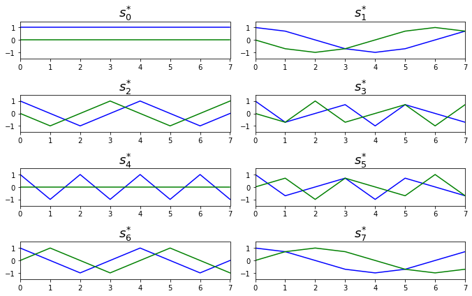
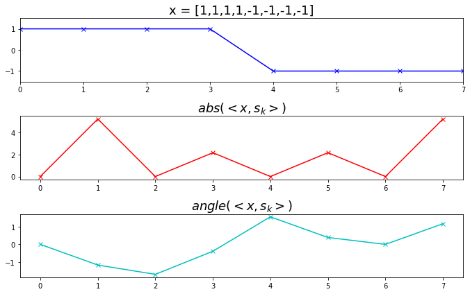
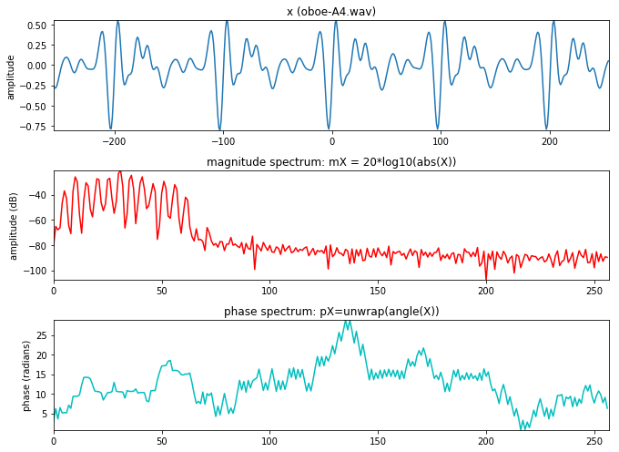
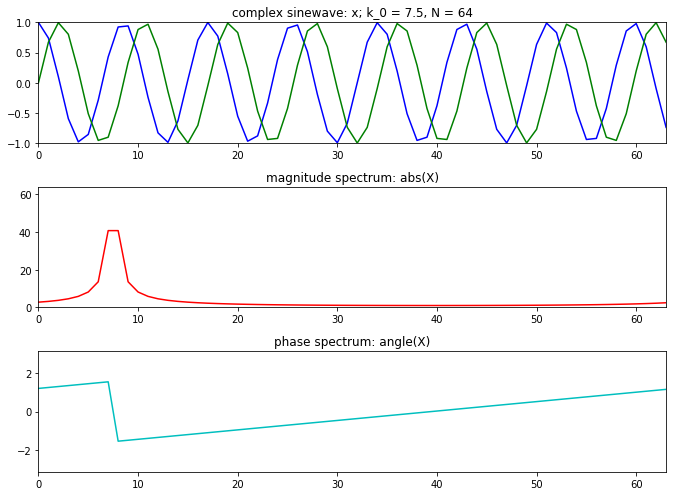
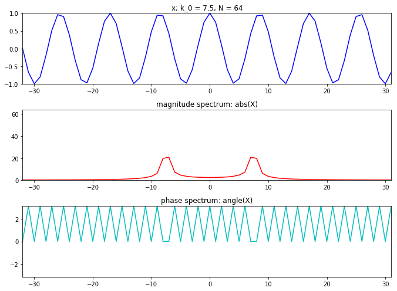
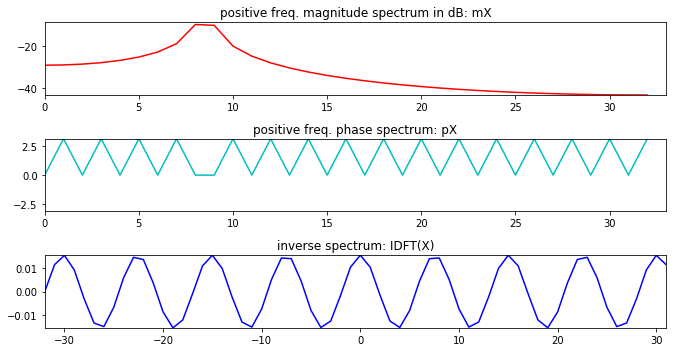
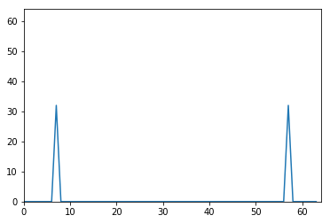
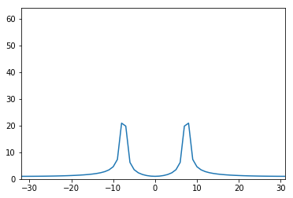

现在要做声音相关,所以先学习声音信号处理的内容,这个将会成为一个系列.

<!--more-->


# DFT变换
将长度为`N`离散的时域信号变化成两个长度为`N/2+1`的实部与虚部信号
## 标准DFT计算公式
$$
\begin{align}
X[k] & =\sum^{N-1}_{n=0}x[n]e^{-j2\pi k n / N} \ \ k=0,...,N-1 \\
n &: 离散时间索引　\\
k &: 离散频域索引 \\
\omega_k=2 \pi k /N &: 角频率 \\
f_k = f_s k / N &: 频率　(f_s : 采样率) 
\end{align}
$$

## 例子 1
$$
\begin{align}
s^*_k&=e^{-j2\pi k n / N}=cos(2 \pi k n / N)-jsin(2 \pi k n/N) \\
如果 N&=4，那么n=0,1,2,3; k=0,1,2,3 \\
s^*_0&=cos(2\pi*0*n/4)-jsin(2\pi*0*n/4)=[1,1,1,1] \\
s^*_1&=cos(2\pi*1*n/4)-jsin(2\pi*1*n/4)=[1,-j,-1,j] \\
s^*_2&=cos(2\pi*2*n/4)-jsin(2\pi*2*n/4)=[1,-1,1,-1] \\
s^*_3&=cos(2\pi*3*n/4)-jsin(2\pi*3*n/4)=[1,j,-1,-j] \\
\end{align}
$$
可以观察下面的图,实际上`DFT`就是每个频率点与不同正弦波进行內积.如果內积为`0`那么说明特定频率的正弦波不存在与此波形中.


```python
# 例子 1
N = 8
plt.figure(1, figsize=(9.5, 6))
for k in range(N):
	s = np.exp(-1j*2*np.pi*k/N*np.arange(N))
	plt.subplot(N/2, 2, k+1)
	plt.plot(np.real(s), 'b', lw=1.5)
	plt.axis([0,N-1,-1.5,1.5])
	plt.title(r"$s^{*}_{%s}$"%(k), fontsize=18)
	plt.subplot(N/2, 2, k+1)
	plt.plot(np.imag(s), 'g', lw=1.5)
	plt.axis([0,N-1,-1.5,1.5])

plt.tight_layout()
plt.show()
```





## 例子2 : 标量乘积
下面给定一个x=[1,1,1,1,-1,-1,-1,-1]进行计算


```python
x = np.array([1,1,1,1,-1,-1,-1,-1])
N = 8
mX = ()
pX = ()
plt.figure(1, figsize=(9.5, 6))

plt.subplot(3,1,1)
plt.plot(x,marker='x',color='b', lw=1.5)
plt.axis([0,N-1,-1.5,1.5])
plt.title('x = [1,1,1,1,-1,-1,-1,-1]', fontsize=18)

for k in range(8):
    s = np.exp(1j*2*np.pi*k/N*np.arange(N))
    X = sum(x*np.conjugate(s))
    mX = np.append(mX, np.abs(X))
    pX = np.append(pX, np.angle(X))

plt.subplot(3,1,2)
plt.plot(mX, marker='x', color='r', lw=1.5)
plt.title('$abs(<x,s_k>)$', fontsize=18) # 幅度谱

plt.subplot(3,1,3)
plt.plot(pX, marker='x', color='c', lw=1.5)
plt.title('$angle(<x,s_k>)$', fontsize=18) # 相位谱

plt.tight_layout()
plt.show()
```





## 例子 3
对一段音频数据进行`DFT`变换


```python
import sys
import math

sys.path.append('../software/models')
import utilFunctions as UF
import dftModel as DFT

(fs, x) = UF.wavread('../sounds/oboe-A4.wav')
w = np.hamming(511)
N = 512
pin = 5000
hM1 = int(math.floor((w.size+1)/2)) 
hM2 = int(math.floor(w.size/2))  
x1 = x[pin-hM1:pin+hM2]
mX, pX = DFT.dftAnal(x1, w, N)

plt.figure(1, figsize=(9.5, 7))

plt.subplot(311)
plt.plot(np.arange(-hM1, hM2), x1, lw=1.5)
plt.axis([-hM1, hM2, min(x1), max(x1)])
plt.ylabel('amplitude')
plt.title('x (oboe-A4.wav)')

plt.subplot(3,1,2)
plt.plot(np.arange(mX.size), mX, 'r', lw=1.5)
plt.axis([0,mX.size,min(mX),max(mX)])
plt.title ('magnitude spectrum: mX = 20*log10(abs(X))')
plt.ylabel('amplitude (dB)')

plt.subplot(3,1,3)
plt.plot(np.arange(mX.size), pX, 'c', lw=1.5)
plt.axis([0,mX.size,min(pX),max(pX)])
plt.title ('phase spectrum: pX=unwrap(angle(X))')
plt.ylabel('phase (radians)')

plt.tight_layout()
plt.show()
```





# 复数sin曲线的DFT
当输入的信号为复数`sin`曲线是如何进行`DFT`变换?
$$
\begin{align}
x_1[n] & = e^{j2\pi k_0 n / N} \ \ k=0,...,N-1 \\
X_1[k] & = \sum^{N-1}_{n=0} x_1[n]  e^{-j2\pi k_0 n / N} \\
    &=\sum^{N-1}_{n=0}e^{j2\pi k_0n/N}e^{-j2\pi kn/N} \\
    &=\sum^{N-1}_{n=0}e^{-j2\pi (k-k_0)n/N} \\
    &=\frac{1-e^{-j2\pi (k-k_0)}}{1-e^{-j2\pi (k-k_0)/N}} (一个几何序列的总和.)
\end{align}
$$
如果$k\neq k_0$,分母不为0且分子为0

如果$k=k_0$那么$X_1[k]=N$,$k\neq k_0$时$X_1[k]=0$

对于程序上来说还是没有很大的区别


```python
tol = 1e-5

plt.figure(1, figsize=(9.5, 7))
N = 64
k0 = 7.5
X = np.array([])
x = np.exp(1j*2*np.pi*k0/N*np.arange(N))

plt.subplot(311)
plt.title('complex sinewave: x; k_0 = 7.5, N = 64')
plt.plot(np.arange(N), np.real(x),'b', lw=1.5)
plt.plot(np.arange(N), np.imag(x),'g', lw=1.5)
plt.axis([0,N-1,-1,1])
for k in range(N):
	s = np.exp(1j*2*np.pi*k/N*np.arange(N))
	X = np.append(X, sum(x*np.conjugate(s)))

X.real[np.abs(X.real) < tol] = 0.0
X.imag[np.abs(X.imag) < tol] = 0.0

plt.subplot(312)
plt.title('magnitude spectrum: abs(X)')
plt.plot(np.arange(N), abs(X), 'r', lw=1.5)
plt.axis([0,N-1,0,N])

plt.subplot(313)
plt.title('phase spectrum: angle(X)')
plt.plot(np.arange(N), np.angle(X),'c', lw=1.5)
plt.axis([0,N-1,-np.pi,np.pi])

plt.tight_layout()
plt.show()
```





# 纯实sin信号的DFT
$$
\begin{align}
x_3[n] & = A_0cos(2\pi k_0 n/N)=A_0/2e^{j2\pi k_0n/N}+A_0/2e^{-j2\pi k_0n/N} \\
X_3[k]&=\sum^{N/2-1}_{n=-N/2}x_3[n]e^{-j2\pi kn/N}\\
&=\sum^{N/2-1}_{n=-N/2}(\frac{A_0}{2}e^{j2\pi k_0n/N}+\frac{A_0}{2}e^{-j2\pi k_0n/N})e^{-j2\pi kn/N} \\
&=\sum^{N/2-1}_{n=-N/2}\frac{A_0}{2}e^{j2\pi k_0n/N}e^{-j2\pi kn/N}+\sum^{N/2-1}_{n=-N/2}\frac{A_0}{2}e^{-j2\pi k_0n/N}e^{-j2\pi kn/N} \\
&=\sum^{N/2-1}_{n=-N/2}\frac{A_0}{2}e^{-j2\pi(k-k_0)n/N} + \sum^{N/2-1}_{n=-N/2}\frac{A_0}{2}e^{-j2\pi(k+k_0)n/N}\\
&=N\frac{A_0}{2} \ \ \ \ 当 k=k_0,-k_0 ; 0表示剩下的k
\end{align}
$$


```python
tol = 1e-5

plt.figure(1, figsize=(9.5, 7))
N = 64
k0 = 7.5
X = np.array([])
nv = np.arange(-N/2, N/2)
kv = np.arange(-N/2, N/2)
x = np.cos(2*np.pi*k0/N*nv)

plt.subplot(311)
plt.title('x; k_0 = 7.5, N = 64')
plt.plot(nv, x,'b', lw=1.5)
plt.axis([-N/2,N/2-1,-1,1])
for k in kv:
    s = np.exp(1j*2*np.pi*k/N*nv)
    X = np.append(X, sum(x*np.conjugate(s)))

X.real[np.abs(X.real) < tol] = 0.0
X.imag[np.abs(X.imag) < tol] = 0.0

plt.subplot(312)
plt.title('magnitude spectrum: abs(X)')
plt.plot(kv, abs(X), 'r', lw=1.5)
plt.axis([-N/2,N/2-1,0,N])

plt.subplot(313)
plt.title('phase spectrum: angle(X)')
plt.plot(kv, np.angle(X),'c', lw=1.5)
plt.axis([-N/2,N/2-1,-np.pi,np.pi])

plt.tight_layout()
plt.show()
```





# IDFT
$$
\begin{align}
x[n]=\frac{1}{N}X[k]s_k[n]=\frac{1}{N}\sum^{N-1}_{k=0}X[k]e^{j2\pi kn/N}\ \ \ \ n=0,...,N-1
\end{align}
$$

## 例子 1
$$
\begin{align}
X[k]&=[0,4,0,0];\ \ N=4 \\
x[0]&=\frac{1}{4}(X*x)[n=0]=\frac{1}{4}(0*1+4*1+0*1+0*1)=1 \\
x[1]&=\frac{1}{4}(X*x)[n=1]=\frac{1}{4}(0*1+4*1+0*(-1)+0*(-j))=j \\
x[2]&=\frac{1}{4}(X*x)[n=2]=\frac{1}{4}(0*1+4*(-1)+0*1+0*(-1))=-1 \\
x[3]&=\frac{1}{4}(X*x)[n=3]=\frac{1}{4}(0*1+4*(-j)+0*(-1)+0*j)=-j 
\end{align}
$$

## 例子 2
真实信号的逆DFT
$$X[k]=|X[k]e^{j<X[k]} and X[-K]=|X[k]|e^{-j<X[k]}\ \ \ \ k=0,1,...,N/2-1$$


```python
import sys

sys.path.append('../software/models/')
import dftModel as DFT
import math

k0 = 8.5
N = 64
w = np.ones(N)
x = np.cos(2*np.pi*k0/N*np.arange(-N/2,N/2))
mX, pX = DFT.dftAnal(x, w, N)
y = DFT.dftSynth(mX, pX, N)

plt.figure(1, figsize=(9.5, 5))
plt.subplot(311)
plt.title('positive freq. magnitude spectrum in dB: mX')
plt.plot(np.arange(mX.size), mX, 'r', lw=1.5)
plt.axis([0,mX.size, min(mX), max(mX)+1])

plt.subplot(312)
plt.title('positive freq. phase spectrum: pX')
plt.plot(np.arange(pX.size), pX, 'c', lw=1.5)
plt.axis([0, pX.size,-np.pi,np.pi])

plt.subplot(313)
plt.title('inverse spectrum: IDFT(X)')
plt.plot(np.arange(-N/2, N/2), y,'b', lw=1.5)
plt.axis([-N/2,N/2-1,min(y), max(y)])

plt.tight_layout()
plt.show()
```





# 普通的 sin函数
$$x[n]=Acos(2\pi fnT+/phi)$$

A=幅值

f=频率

n=时间索引

T=抽样周期


```python
A = .8 # 幅值
f0 = 1000 # 信号频率
phi = np.pi/2 # 初始相位
fs = 44100 # 采样频率
t = np.arange(-.002, .002, 1.0/fs)
x = A*np.cos(2*np.pi*f0*t+phi)

plt.plot(t, x)
plt.axis([-.002, .002, -.8, .8])
plt.xlabel('time')
plt.ylabel('amplitude')
plt.show()
```


# 复数形式的sin曲线
$$
\bar{x}=Ae^{j(\omega n T + \phi)}=Acos(\omega n T +\phi)+jAsin(\omega n T +\phi)
$$


```python
N = 500
k = 3
n = np.arange(-N/2, N/2)
s = np.exp(1j*2*np.pi*k*n/N)

plt.plot(n, np.real(s))
plt.plot(n, np.imag(s))
plt.axis([-N/2, N/2, -1, 1])
plt.xlabel('n')
plt.ylabel('amplitude')
plt.show()
```


# DFT
$$X[k]=\sum^{N-1}_{n=0}x[n]e^{-j2\pi kn/N}\ \ \ \ k=0,...,N-1$$

## 复数sin波形的DFT


```python
N=64 # 长度64
k0=7 # 频率7
x=np.exp(1j*2*np.pi*k0/N*np.arange(N))# 构造一个正弦信号
X=np.array([])
for k in range(N):
    s=np.exp(1j*2*np.pi*k/N*np.arange(N)) # 特定的sin曲线
    X=np.append(X,sum(x*np.conjugate(s))) # x * sin曲线的复数共轭
    
plt.plot(np.arange(N),np.abs(X))
plt.axis([0,N,0,N])
plt.show()
```


```python
# 设置一个频率是7的sin信号
N=64
k0=7
x=np.cos(2*np.pi*k0/N * np.arange(N))
X=np.array([])
for k in range(N):
    s=np.exp(1j*2*np.pi*k/N*np.arange(N))
    X=np.append(X,sum(x*np.conjugate(s))) # conjugate 复数共轭
plt.plot(np.arange(N),np.abs(X))
plt.axis([0,N,0,N])
```


    [0, 64, 0, 64]





## 实数sin波形的DFT


```python
N=64
k0=7.5 # 频率 7.5
x=np.cos(2*np.pi*k0/N * np.arange(N))
X=np.array([])
kv=np.arange(-N/2,N/2)

for k in kv:
    s=np.exp(1j*2*np.pi*k/N*np.arange(N))
    X=np.append(X,sum(x*np.conjugate(s))) # conjugate 复数共轭
    
plt.plot(kv,np.abs(X))
plt.axis([-N/2,N/2-1,0,N])
plt.show()
```





# IDFT
\begin{align}
x[n]=\frac{1}{N}\sum^{N-1}_{k=0}X[k]e^{j2\pi kn/N}\ \ \ \ n=0,...,N-1
\end{align}


```python
y=np.array([])
nv=np.arange(-N/2,N/2)
for n in nv:
    s=np.exp(1j*2*np.pi*n/N*nv)
    y=np.append(y,1/N*sum(X*s))
plt.plot(kv,y)
plt.axis([-N/2,N/2,-1,1])
plt.show()
```


