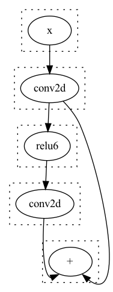
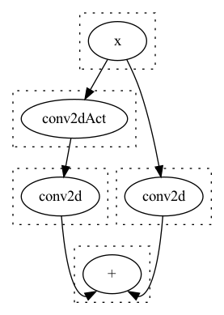
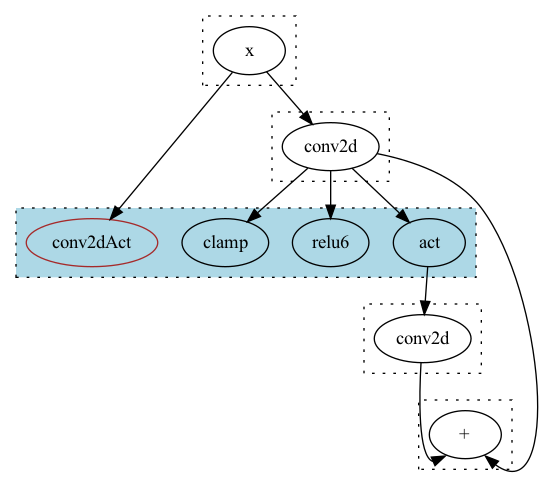

# 背景

[Egg](https://egraphs-good.github.io)是一个基于`EGraph`的程序优化框架, 作者在其中实现基于[Equality Saturation](https://docs.rs/egg/0.9.2/egg/tutorials/_01_background/index.html#equality-saturation)概念的优化方法, 简单来说就是通过将所有的表达式保存在`EGraph`这个数据结构中,可以按任意顺序实施`RBO`(基于规则的优化), 因为其中同时存储了所有可能的表达式, 所以没有传统优化中`phase ordering`的问题, 最终可通过`CostModel`提取出最优的图结构.

`Egg`在编译优化方面已经有许多应用了, 比如王润基大佬写的[SQL 优化器](https://zhuanlan.zhihu.com/p/596119553), 其中也详细解释了`Egg`的使用, 不了解的朋友可以参考一下.

在端侧AI编译中,每个阶段都需要大量的优化与`trade-off`, 比如中端的计算图优化与后端的算子`Fusion`以及后端算子的量化类型(平衡精度/速度), 如果基于传统优化方式, 可能许多模型最优的`Pass`顺序,算子`Fusion`方案都需要编译器工程师手动调试与指定. 这主要就是因为传统优化方式一旦`lower`之后就丢失了之前的信息, 失去了最优的可能性, 因此考虑采用`Equality Saturation`技术来将中端优化/后端`Fusion/Tiling`/算子精度选择都放入其中进行整体性优化,希望可以得到尽量优化的编译结果.

<!--more-->

# Egg中Cost累积机制带来的问题

## 问题描述

不论是中端优化还是后端`Fusion`, 都会涉及到算子的折叠与合并. 通常无分支的算子的合并, 那么合并后`Cost`必然减小, 可以自然的选择当前`Cost`最小的表达式. 但是如果多分支的情况下就会遇到问题.

假设我们导入的模型有卷积/激活等算子,在`Cpu`上我们支持的`Relu6/Clamp`算子,他们的`Cost`分别为`60,70`. 后端支持卷积`Conv`,通用激活`Act`,以及卷积+通用激活`ConvAct`, 设他们的`Cost`分别为`100,50,125`. 其中执行`ConvAct`肯定是快于分别执行`Conv`和`Act`.

考虑如下的模型结构:



同时我们的存在这样一个`Rule` : `rw!("fold_conv_act";  "(act (conv2d ?x))" => "(conv2dAct ?x)")`, 在经过`Egg`的`Runner`实施优化后, 得到了这样的结果:



大家可以发现, 虽然我们合并了一个`Act`, 但是反而多计算了一次`Conv`, 最终的计算时间增加了.

## 探究原因

`Egraph`中保存了展平的数据结构, 对于每一个`Eclass`选择其内部最小`Cost`的`ENode`来作为它的`Cost`. 但是因为`EGraph`中找不到入口点, 所以是反复遍历所有的`EClass`, 直到每个`Eclass`不再减小时退出.

其核心逻辑如下:
```rust
        let mut did_something = true;
        while did_something {
            did_something = false;

            for class in self.egraph.classes() {
                let pass = self.make_pass(class);
                match (self.costs.get(&class.id), pass) {
                    (None, Some(new)) => {
                        self.costs.insert(class.id, new);
                        did_something = true;
                    }
                    (Some(old), Some(new)) if new.0 < old.0 => {
                        self.costs.insert(class.id, new);
                        did_something = true;
                    }
                    _ => (),
                }
            }
        }
    .
    .
    .
    fn make_pass(&mut self, eclass: &EClass<L, N::Data>) -> Option<(CF::Cost, L)> {
        let (cost, node) = eclass
            .iter()
            .map(|n| (self.node_total_cost(n), n))
            .min_by(|a, b| cmp(&a.0, &b.0))
            .unwrap_or_else(|| panic!("Can't extract, eclass is empty: {:#?}", eclass));
        cost.map(|c| (c, node.clone()))
    }
```

问题就在于`make_pass`的时候他无法得到上下文的信息, 如下图所示:



在蓝色的`EClass`中它自然会选择当前的`conv2dAct`节点,因为它是当前`Eclass`最小`Cost`的`ENode`.


# 可能的解决方案

下面写两个我思考的方案, 也欢迎大家在评论区一起讨论.

## 方案1

简单的方案可以在编写`rule`的时候判断要折叠的算子的`user`个数,如果是会引起这种现象的情况, 就不进行折叠. 不过这样总觉得和`Equality Saturation`的思路相悖, 不是一个很完美的做法.

## 方案2

需要记录每个`ENode`可能的`Compute Sequence`, 如同上图所展示的那样, 比如对于`Add`节点左边可能存在`x -> conv2d -> relu6 -> conv2d`, `x -> conv2dAct -> conv2d`等4种情况,右边则只有`x -> conv2d`一种情况, 然后消除两边计算序列的交集, 从而算得正确的`cost`值. 不过这样存储的`Compute Sequence`在每经过一个`EClass`时,都是按`EClass.Nodes.Count`来翻倍的, 需要一种节省内存的数据结构. 同时因为计算`Cost`的时候是将所有表达式展平之后处理的, 还需要方便的从中间节点进行替换. 总之不是一个容易实现的方案.


# 附录

最小的复现代码`NN.rs`, 可以放在`egg/tests`目录下运行:
```rust
use egg::{rewrite as rw, *};
use ordered_float::NotNan;

pub type EGraph = egg::EGraph<NeuralNetwork, ()>;
pub type Rewrite = egg::Rewrite<NeuralNetwork, ()>;

pub type Constant = NotNan<f64>;

define_language! {
    pub enum NeuralNetwork {
        "+" = Add([Id; 2]),
        "-" = Sub([Id; 2]),
        "*" = Mul([Id; 2]),
        "/" = Div([Id; 2]),
        "conv2d" = Conv2D(Id),
        "act" = Act(Id),
        "relu6" = Relu6(Id),
        "clamp" = Clamp(Id),
        "conv2dAct" = Conv2DAct(Id),
        Constant(Constant),
        Symbol(Symbol),
    }
}

pub struct CostFn<'a> {
    pub egraph: &'a EGraph,
}

impl egg::CostFunction<NeuralNetwork> for CostFn<'_> {
    type Cost = f32;
    fn cost<C>(&mut self, enode: &NeuralNetwork, mut costs: C) -> Self::Cost
    where
        C: FnMut(Id) -> Self::Cost,
    {
        // let id = &self.egraph.lookup(enode.clone()).unwrap();
        let mut costs = |i: &Id| costs(*i);
        let op_cost = match enode {
            NeuralNetwork::Conv2D(..) => 100.0,
            NeuralNetwork::Act(..) => 50.0,
            NeuralNetwork::Relu6(..) => 60.0,
            NeuralNetwork::Clamp(..) => 70.0,
            NeuralNetwork::Conv2DAct(..) => 125.0,
            _ => 1.0,
        };
        let c = enode.fold(op_cost, |sum, id| sum + costs(&id));
        c
    }
}

#[rustfmt::skip]
pub fn rules() -> Vec<Rewrite> { vec![
  rw!("fold_conv_act";  "(act (conv2d ?x))" => "(conv2dAct ?x)"),
  rw!("relu6_to_clamp";  "(relu6 ?x)" => "(clamp ?x)"),
  rw!("relu6_to_act";  "(relu6 ?x)" => "(act ?x)")
]}

#[test]
fn duplicte_branch_select() {
    let expr: RecExpr<NeuralNetwork> = "(+ (conv2d x) (conv2d (relu6 (conv2d x))))"
        .parse()
        .unwrap();
    let mut egraph = EGraph::default();
    egraph.add_expr(&expr);
    egraph.dot().to_dot("target/pre.dot").unwrap();

    let runner: Runner<NeuralNetwork, ()> = Runner::default().with_expr(&expr).run(&rules());

    let extractor = Extractor::new(&runner.egraph, AstSize);
    runner.egraph.dot().to_dot("target/graph.dot").unwrap();

    let (best_cost, best_expr) = extractor.find_best(runner.roots[0]);
    println!("End ({}): {}", best_cost, best_expr.pretty(80));
    let mut egraph = EGraph::default();
    egraph.add_expr(&best_expr);
    egraph.dot().to_dot("target/post.dot").unwrap();
}
```