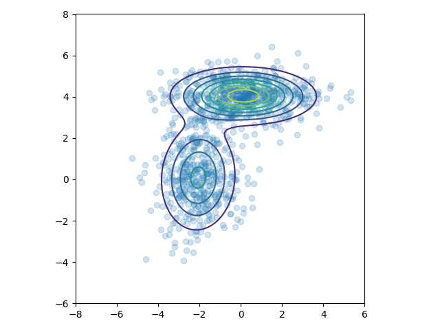

搞定了yolo，终于可以学习点新的东西了。今天就学习一波胶囊网络中的EM路由。
先推荐一个课程资料，杜克大学的[统计学课程](https://people.duke.edu/~ccc14/sta-663)，从python讲到c++，从矩阵计算讲到概率统计，从jit讲到cuda编程。看看人家本科生学的东西。。。

<!--more-->

# EM算法

## 詹森不等式

对于一个凸函数$f$,$E[f(x)]\geq f(E[x])$,将其反转获得一个凹函数。
如果一个函数$f(x)$在区间内都有$f''(x)\geq 0$，那么它是一个凸函数。例如$f(x)=log\ x$,$f''(x)=-\frac{1}{x^2}$,说明他在$x\in (0,+ \infty]$是一个凸函数，詹森不等式的直观说明如下。


其实只有当$f(x)$为常数时，詹森不等式才会相等。

这里使用概率论表述的$E$，其实际就是积分。也就是说先经过凸函数的期望值必然大于等于期望的凸函数值。

## 完整信息的最大似然

设置一个实验，硬币A向上的概率为$\theta_A$的，硬币B向上的概率为$\theta_B$,接着一共做m此实验，每次实验随机选择一个硬币，投掷n次，并记录向下和向下的次数。如果我们记录了每个样本所使用的硬币，那我们就有完整的信息可以估计$\theta_A$和$\theta_B$。

假设我们做了5次实验，每次向上的次数记录成向量$x$，并且使用的硬币顺序为$A,A,B,A,B$。他的似然函数为：
$$
\begin{aligned}
    L(\theta_A,\theta_B)&= p(x_1; \theta_A)\cdot p(x_2; \theta_A)\cdot p(x_3; \theta_B) \cdot  p(x_4; \theta_A) \cdot p(x_5; \theta_B) \\
    &=B(n,\theta_A).pmf(x_1)\cdot B(n,\theta_A).pmf(x_2)\cdot B(n,\theta_B).pmf(x_3)\cdot B(n,\theta_A).pmf(x_4)\cdot B(n,\theta_B).pmf(x_5)
\end{aligned}
$$
其中二项分布的概率计算方式为：
$$
\begin{aligned}
    \because X & \sim B(n,p)\\
    \therefore  P(X=k) &= \binom{n}{k} p^k (1-p)^{n-k} \\
        &=  C_n^k p^{k}(1-p)^{n-k}
\end{aligned}
$$

将似然函数对数化：

$$
\begin{aligned}
    L(\theta_A,\theta_B)=\log p(x_1; \theta_A) + \log p(x_2; \theta_A) +\log p(x_3; \theta_B) + \log p(x_4; \theta_A) +\log p(x_5; \theta_B)
\end{aligned}
$$

$p(x_i; \theta)$是二项式分布的概率质量函数，其中$n=m,p=\theta$。我们会使用$z_i$来表示第$i$个硬币的标签。

### 使用最小化函数求解似然


```python
from numpy.core.umath_tests import matrix_multiply as mm
from scipy.optimize import minimize
from scipy.stats import bernoulli, binom
import numpy as np
import matplotlib.pyplot as plt
np.random.seed(1234)


""" 做五次实验 """
n = 10  # 每次实验投掷10次
theta_A = 0.8
theta_B = 0.3
theta_0 = [theta_A, theta_B]
# 两个硬币对应两个不同thta的二项分布
coin_A = bernoulli(theta_A)
coin_B = bernoulli(theta_B)

zs = [0, 0, 1, 0, 1]  # 代表使用的硬币为哪个
# 得到实验结果
xs = np.array([np.sum(coin.rvs(n)) for coin in [coin_A, coin_A, coin_B, coin_A, coin_B]])
print(xs) # [7 9 2 6 0]

""" 精确求解 """
# 计算所有的硬币A朝上的比例作为概率
ml_A = np.sum(xs[[0, 1, 3]]) / (3.0 * n)
# 计算所有的硬币B朝上的比例作为概率
ml_B = np.sum(xs[[2, 4]]) / (2.0 * n)

print(ml_A, ml_B)  # 0.7333333333333333 0.1


""" 数值估计 """


def neg_loglik(thetas, n, xs, zs):
    """ 对数似然计算函数 
        这里的的二项分布是次数为n，概率可能为 theta_A 或 theta_B。
        将每个二项分布对应x的对数概率密度函数求和后取相反数，接下来就是最小化此函数即可。
    """

    logpmf = -np.sum([binom(n, thetas[z]).logpmf(x) for (x, z) in zip(xs, zs)])
    return logpmf


bnds = [(0, 1), (0, 1)]
# 使用优化策略进行最小化求解
res = minimize(neg_loglik, [0.5, 0.5], args=(n, xs, zs),
               bounds=bnds, method='tnc', options={'maxiter': 100})
print(res)
""" fun: 7.655267754139319
     jac: array([-7.31859018e-05, -7.58504370e-05])
 message: 'Converged (|f_n-f_(n-1)| ~= 0)'
    nfev: 17
     nit: 6
  status: 1
 success: True
       x: array([0.73333285, 0.09999965]) """
```

可以发现似然估计的估计值相当近似与精确计算所得到的结论。

## 当信息缺失时的最大似然

当我们没有记录实验所使用的硬币种类时，这个问题的解决就开始困难起来了。有一种解决问题的方式就是我们根据这个样本是由$A$或$B$产生的来给每个样本假设权重$\boldsymbol{w}_i$。直觉上来想，权重应该是$\boldsymbol{z}_i$的后验分布：
$$
\begin{aligned}
    w_i = p(z_i \ | \ x_i; \theta)
\end{aligned}
$$


假设我们有$\theta$的一些估计值，如果我们知道$z_i$，那我们就可以估计出$\theta$，因为我们相当于拥有了全部的似然信息。EM算法的基本思想就是先猜测$\theta$，然后计算出$z_i$，接着继续更新$\theta$再计算$z_i$，重复数次直到收敛。

非书面的表述：首先考虑一个对数似然函数作为曲线(曲面)，他的$x$轴表示$\theta$。找到另一个$\theta$的函数$\boldsymbol{Q}$，他是对数似然函数的下界，在特定的$\theta$值时对数似然函数与函数$\boldsymbol{Q}$接触。接下来找到这个$\theta$的值，并且使函数$\boldsymbol{Q}$最大化，重复这个过程，是下界函数$\boldsymbol{Q}$和对数似然函数的最大值相同，那么我们就得到了最大对数似然～

从下图可以理解，每次迭代都能找到新的下界函数$\boldsymbol{Q}$和当前最大的对数似然，等到迭代到一定程度时，就找到了全局的最大的对数似然。


当然，还有个问题就是如何找到这个对数似然函数的下界函数$\boldsymbol{Q}$，这就需要使用詹森不等式来进行数学推理。

### 推导
    
在EM算法的`E-step`中，我们确定一个函数，他是对数似然的下界。
$$
\begin{align}
l &= \sum_i{\log p(x_i; \theta)} && \text{定义对数似然函数} \\
&= \sum_i \log \sum_{z_i}{p(x_i, z_i; \theta)} && \text{在函数中加入隐变量$z$} \\
&= \sum_i \log \sum_{z_i} Q_i(z_i) \frac{p(x_i, z_i; \theta)}{Q_i(z_i)} && \text{贝叶斯定理得$Q_i$为$z_i$分布} \\
&= \sum_i \log E_{z_i}[\frac{p(x_i, z_i; \theta)}{Q_i(z_i)}] && \text{得到期望 - 就是EM中的E} \\
&\geq \sum E_{z_i}[\log \frac{p(x_i, z_i; \theta)}{Q_i(z_i)}] && \text{使用詹森不等式计算凹的对数似然函数} \\
&\geq \sum_i \sum_{z_i} Q_i(z_i) \log \frac{p(x_i, z_i; \theta)}{Q_i(z_i)} && \text{得到期望的定义}
\end{align}
$$

我们如何确定分布$\boldsymbol{Q_i}$？我们想要$\boldsymbol{Q}$函数与对数似然函数进行接触，并且也知道了詹森不等式相等的充要条件就是这个函数为常数，因此：

$$
\begin{align}
\frac{p(x_i, z_i; \theta)}{Q_i(z_i)} =& c \\
\implies Q_i(z_i) &\propto p(x_i, z_i; \theta)\\
\implies Q_i(z_i) &= \frac{p(x_i, z_i; \theta) }{\sum_{z_i}{p(x_i, z_i; \theta) } } &&\text{因为 $\boldsymbol{Q}$ 是个分布且和为1} \\
\implies Q_i(z_i) &= \frac{p(x_i, z_i; \theta) }{ {p(x_i, \theta) } } && \text{边缘化 $z_i$}\\
\implies Q_i(z_i) &= p(z_i | x_i; \theta) && \text{根据条件概率定义}
\end{align}
$$

因此得到$\boldsymbol{Q_i}$就是$z_i$的后验概率，这就完成了`E-step`。

在`M-step`中，我找到最大化对数似然函数下界时的$\theta$值，然后我们迭代`E`和`M`即可。

所以EM算法是在缺少信息的情况下最大化似然的优化算法，或者说他可以很方便的添加隐变量来简化最大似然计算。


### 例子

现在如果我们忘记记录了投掷硬币的顺序，那我们来求解一波A、B硬币向上的概率。
对于`E-step`,我们：

$$
\begin{align}
w_j &= Q_i(z_i = j) \\
&= p(z_i = j \mid x_i; \theta) \\
&= \frac{p(x_i \mid z_i = j; \theta) p(z_i = j; \phi)}  {\sum_{l=1}^k{p(x_i \mid z_i = l; \theta) p(z_i = l; \phi) } }  && \text{贝叶斯准则} \\
&= \frac{\theta_j^h(1-\theta_j)^{n-h} \phi_j}{\sum_{l=1}^k \theta_l^h(1-\theta_l)^{n-h} \phi_l} && \text{代入二项分布公式} \\
&= \frac{\theta_j^h(1-\theta_j)^{n-h} }{\sum_{l=1}^k \theta_l^h(1-\theta_l)^{n-h} } && \text{为了简单起见使 $\phi$ 为常数}
\end{align}
$$


对于`M-step`,我们需要找到最大时的$\theta$值。

$$
\begin{align}
& \sum_i \sum_{z_i} Q_i(z_i) \log \frac{p(x_i, z_i; \theta)}{Q_i(z_i)} \\
&= \sum_{i=1}^m \sum_{j=1}^k w_j \log \frac{p(x_i \mid z_i=j; \theta) \, p(z_i = j; \phi)}{w_j} \\
&= \sum_{i=1}^m \sum_{j=1}^k w_j \log \frac{\theta_j^h(1-\theta_j)^{n-h} \phi_j}{w_j} \\
&= \sum_{i=1}^m \sum_{j=1}^k w_j \left( h \log \theta_j + (n-h) \log (1-\theta_j) + \log \phi_j - \log w_j \right)
\end{align}
$$

我们使用区间的方式解决$\theta_s$导数消失的问题：
$$
\begin{align}
\sum_{i=1}^m w_s \left( \frac{h}{\theta_s} - \frac{n-h}{1-\theta_s} \right) &= 0  \\
\implies \theta_s &= \frac {\sum_{i=1}^m w_s h}{\sum_{i=1}^m w_s n}
\end{align}
$$

### 第一种直接的代码

```python
xs = np.array([(5, 5), (9, 1), (8, 2), (4, 6), (7, 3)])
thetas = np.array([[0.6, 0.4], [0.5, 0.5]])  # 初始化参数A B (向上概率，向下概率)

tol = 0.01  # 变化容忍度
max_iter = 100  # 迭代次数

ll_old = 0
for i in range(max_iter):
    exp_A = []
    exp_B = []

    ll_new = 0

    # ! E-step: 计算可能的概率分布
    for x in xs:
        # 求解当前theta下两个分布的对数似然
        ll_A = np.sum(x * np.log(thetas[0]))  # 多项式分布的对数似然函数 (忽略常数).
        ll_B = np.sum(x * np.log(thetas[1]))

        w_A = np.exp(ll_A) / (np.exp(ll_A) + np.exp(ll_B))  # 求出概率A的权重
        w_B = np.exp(ll_B) / (np.exp(ll_A) + np.exp(ll_B))  # 求出概率B的权重

        exp_A.append(w_A * x)  # 概率A权重乘上样本
        exp_B.append(w_B * x)  # 概率B权重乘上样本

        ll_new += w_A * ll_A + w_B * ll_B  # 计算当前的theta值对应的似然值

    # ! M-step: 为给定的分布更新当前参数
    thetas[0] = np.sum(exp_A, 0) / np.sum(exp_A)  # 利用更新之后的样本值计算出当前A的theta值
    thetas[1] = np.sum(exp_B, 0) / np.sum(exp_B)  # 利用更新之后的样本值计算出当前B的theta值

    # 输出每个x和当前参数估计z的分布
    print("Iteration: %d" % (i + 1))
    print("theta_A = %.2f, theta_B = %.2f, ll = %.2f" % (thetas[0, 0], thetas[1, 0], ll_new))

    if np.abs(ll_new - ll_old) < tol:
        break
    ll_old = ll_new
```
### 结果
```sh
Iteration: 1
theta_A = 0.71, theta_B = 0.58, ll = -32.69
Iteration: 2
theta_A = 0.75, theta_B = 0.57, ll = -31.26
Iteration: 3
theta_A = 0.77, theta_B = 0.55, ll = -30.76
Iteration: 4
theta_A = 0.78, theta_B = 0.53, ll = -30.33
Iteration: 5
theta_A = 0.79, theta_B = 0.53, ll = -30.07
Iteration: 6
theta_A = 0.79, theta_B = 0.52, ll = -29.95
Iteration: 7
theta_A = 0.80, theta_B = 0.52, ll = -29.90
Iteration: 8
theta_A = 0.80, theta_B = 0.52, ll = -29.88
Iteration: 9
theta_A = 0.80, theta_B = 0.52, ll = -29.87
```

**NOTE：** 他这里的对数似然函数是根据上面的公式推导之后简化而来的，所以直接对$\theta$做对数即可，下面我按最基本的思路来写了一个例程。


### 我的代码

```python
n = 10  # 实验次数
m_xs = np.array([5, 9, 8, 4, 7])  # 向上次数
theta_A = 0.6
theta_B = 0.5


tol = 0.01  # 变化容忍度
max_iter = 100  # 迭代次数
loglike_old = 0  # 初始对数似然值
for i in range(max_iter):
    cnt_A = []
    cnt_B = []
    loglike_new = 0  # 新的对数似然值
    # ! E-step
    for x in m_xs:
        pmf_A = binom(n, theta_A).pmf(x)  # 当前theta下 A的概率
        pmf_B = binom(n, theta_B).pmf(x)  # 当前theta下 B的概率

        logpmf_A = binom(n, theta_A).logpmf(x)  # 当前theta下 A的对数概率
        logpmf_B = binom(n, theta_B).logpmf(x)  # 当前theta下 B的对数概率

        weight_A = pmf_A / (pmf_A + pmf_B)  # 求得权重
        weight_B = pmf_B / (pmf_A + pmf_B)  # 求得权重

        cnt_A.append(weight_A * np.array([x, n - x]))  # 概率A权重乘上样本，得到新的硬币次数统计
        cnt_B.append(weight_B * np.array([x, n - x]))  # 概率B权重乘上样本，得到新的硬币次数统计

        loglike_new += weight_A * logpmf_A + weight_B * logpmf_B  # 计算当前的theta值对应的似然值
    # ! M-step
    theta_A = np.sum(cnt_A, 0)[0] / np.sum(cnt_A)  # 硬币A向上的次数除以总次数即为theta_A
    theta_B = np.sum(cnt_B, 0)[0] / np.sum(cnt_B)  # 硬币B向上的次数除以总次数即为theta_B

    # 输出每个x和当前参数估计z的分布
    print("Iteration: %d" % (i + 1))
    print("theta_A = %.2f, theta_B = %.2f, ll = %.2f" % (theta_A, theta_B, loglike_new))

    if np.abs(loglike_new - loglike_old) < tol:
        break
    loglike_old = loglike_new

```

### 结果

```sh
Iteration: 1
theta_A = 0.71, theta_B = 0.58, ll = -10.91
Iteration: 2
theta_A = 0.75, theta_B = 0.57, ll = -9.49
Iteration: 3
theta_A = 0.77, theta_B = 0.55, ll = -8.99
Iteration: 4
theta_A = 0.78, theta_B = 0.53, ll = -8.56
Iteration: 5
theta_A = 0.79, theta_B = 0.53, ll = -8.30
Iteration: 6
theta_A = 0.79, theta_B = 0.52, ll = -8.18
Iteration: 7
theta_A = 0.80, theta_B = 0.52, ll = -8.13
Iteration: 8
theta_A = 0.80, theta_B = 0.52, ll = -8.11
Iteration: 9
theta_A = 0.80, theta_B = 0.52, ll = -8.10
```

**NOTE：** 就是对数似然值和例程计算的不一样。。


## 混合模型

从一个简单的混合模型开始，即`k-means`，`k-means`不使用`EM`算法，但是可以结合`EM`算法帮助理解`EM`算法如何用于高斯混合模型。

### K-means

这个算法比较简单，初始化选择$k$个中心点，然后做如下：

1.  找到每个点与中心点的距离
2.  给每个点分配最近的中心点
3.  根据所分配的点来更新中心点位置


下面给出一段程序示例：

```python
from numpy.core.umath_tests import inner1d
import numpy as np
import seaborn as sns


def kmeans(xs, k, max_iter=10):
    """K-means 算法."""
    idx = np.random.choice(len(xs), k, replace=False)
    cs = xs[idx]
    for n in range(max_iter):
        ds = np.array([inner1d(xs - c, xs - c) for c in cs])
        zs = np.argmin(ds, axis=0)
        cs = np.array([xs[zs == i].mean(axis=0) for i in range(k)])
    return (cs, zs)


iris = sns.load_dataset('iris')
data = iris.iloc[:, :4].values
cs, zs = kmeans(data, 3)
iris['cluster'] = zs
sns.pairplot(iris, hue='cluster', diag_kind='kde', vars=iris.columns[:4])
plt.show()
```

### 结果


## 高斯混合模型

$k$个高斯分布混合具有以下的概率密度函数：
$$
\begin{align}
p(x) = \sum_{j=1}^k \pi_j \phi(x; \mu_j, \sigma_j)
\end{align}
$$

$\pi_j$是第$j$个高斯分布的权重，且：

$$
\begin{align}
\phi(x; \mu, \sigma) = \frac{1}{(2 \pi)^{d/2}|\sigma|^{1/2 } } \exp \left( -\frac{1}{2}(x-\mu)^T\sigma^{-1}(x-\mu) \right)
\end{align}
$$

假设我们观察$y_1, y2, \ldots, y_n$作为来自高斯混合模型的样本，那么对数似然为：
$$
\begin{align}
l(\theta) = \sum_{i=1}^n \log \left( \sum_{j=1}^k \pi_j \phi(y_i; \mu_j, \sigma_j) \right)
\end{align}
$$

其中$\theta = (\pi, \mu, \sigma)$，很难拟合这种对数似然最大值的参数，因为他们要在对数函数中求和。

### 使用EM算法

假设我们增加潜在变量$z$，它表明我们观察到的$y$来自于第$k$个高斯分布。其中`E-step`和`M-step`的推导与之前的例子类似，只是变量更多。

在`E-step`我们想要计算样本$x_i$输入第$j$个类别的后验概率，给定参数$\theta =(\pi,\mu,\sigma)$


**NOTE：** 这里后验概率有的地方使用公式$p(j|x_i)$,这里使用$w_j^i$来表示。

$$
\begin{align}
w_j^i &= Q_i(z^i = j) \\
&= p(z^i = j \mid y^i; \theta) \\
&= \frac{p(x^i \mid z^i = j; \mu, \sigma) p(z^i = j; \pi)}  {\sum_{l=1}^k{p(y^i \mid z^i = l; \mu, \sigma) p(z^i = l; \pi) } }  && \text{贝叶斯定理} \\
&= \frac{\phi(x^i; \mu_j, \sigma_j) \pi_j}{\sum_{l=1}^k \phi(x^i; \mu_l, \sigma_l) \pi_l}
\end{align}
$$

在`M-step`中，我们要找到$\theta = (w, \mu, \sigma)$来最大化$\boldsymbol{Q}$函数，对应与真实对数似然函数的下界。

$$
\begin{align}
\sum_{i=1}^{m}\sum_{j=1}^{k} Q(z^i=j) \log \frac{p(x^i \mid z^i= j; \mu, \sigma) p(z^i=j; \pi)}{Q(z^i=j)}
\end{align}
$$

通过分别取$(w, \mu, \sigma)$的导数并求解（使用拉格朗日乘数构造约束$\sum_{j=1}^k w_j = 1$来求解），我们得到：

$$
\begin{align}
\pi_j &= \frac{1}{m} \sum_{i=1}^{m} w_j^i \\
\mu_j &= \frac{\sum_{i=1}^{m} w_j^i x^i}{\sum_{i=1}^{m} w_j^i} \\
\sigma_j &= \frac{\sum_{i=1}^{m} w_j^i (x^i - \mu)(x^i - \mu)^T}{\sum_{i1}^{m} w_j^i}
\end{align}
$$

### 代码

```python
from scipy.stats import multivariate_normal


def normalize(xs, axis=None):
    """Return normalized marirx so that sum of row or column (default) entries = 1."""
    if axis is None:
        return xs / xs.sum()
    elif axis == 0:
        return xs / xs.sum(0)
    else:
        return xs / xs.sum(1)[:, None]


def mix_mvn_pdf(xs, pis, mus, sigmas):
    return np.array([pi * multivariate_normal(mu, sigma).pdf(xs) for (pi, mu, sigma) in zip(pis, mus, sigmas)])


def em_gmm_orig(xs, pis, mus, sigmas, tol=0.01, max_iter=100):

    n, p = xs.shape
    k = len(pis)

    ll_old = 0
    for i in range(max_iter):
        exp_A = []
        exp_B = []
        ll_new = 0

        # ！ E-step
        ws = np.zeros((k, n))
        for j in range(len(mus)):
            for i in range(n):
                # 遍历所有的 mu，sigma，pi 来计算概率密度
                ws[j, i] = pis[j] * multivariate_normal(mus[j], sigmas[j]).pdf(xs[i])
        ws /= ws.sum(0)  # 根据概率密度求权值

        # M-step
        # NOTE 下面的更新过程是根据公式来计算的！
        pis = np.zeros(k)
        for j in range(len(mus)):
            for i in range(n):
                pis[j] += ws[j, i]  # 使用权值更新pi
        pis /= n

        mus = np.zeros((k, p))
        for j in range(k):
            for i in range(n):
                mus[j] += ws[j, i] * xs[i]  # 使用权值更新mu
            mus[j] /= ws[j, :].sum()

        sigmas = np.zeros((k, p, p))
        for j in range(k):
            for i in range(n):
                ys = np.reshape(xs[i] - mus[j], (2, 1))
                sigmas[j] += ws[j, i] * np.dot(ys, ys.T)  # 使用权值更新sigma
            sigmas[j] /= ws[j, :].sum()

        # 更新对数似然函数
        ll_new = 0.0
        for i in range(n):
            s = 0
            for j in range(k):
                s += pis[j] * multivariate_normal(mus[j], sigmas[j]).pdf(xs[i])
            ll_new += np.log(s)

        if np.abs(ll_new - ll_old) < tol:
            break
        ll_old = ll_new

    return ll_new, pis, mus, sigmas


# 构建数据集
n = 1000
_mus = np.array([[0, 4], [-2, 0]])
_sigmas = np.array([[[3, 0], [0, 0.5]], [[1, 0], [0, 2]]])
_pis = np.array([0.6, 0.4])
xs = np.concatenate([np.random.multivariate_normal(mu, sigma, int(pi * n))
                     for pi, mu, sigma in zip(_pis, _mus, _sigmas)])

# 初始化预测值
pis = normalize(np.random.random(2))  # pi 要经过归一化
mus = np.random.random((2, 2))
sigmas = np.array([np.eye(2)] * 2)

# 使用EM算法拟合
ll1, pis1, mus1, sigmas1 = em_gmm_orig(xs, pis, mus, sigmas)

# 绘图
intervals = 101
ys = np.linspace(-8, 8, intervals)
X, Y = np.meshgrid(ys, ys)
_ys = np.vstack([X.ravel(), Y.ravel()]).T

z = np.zeros(len(_ys))
for pi, mu, sigma in zip(pis1, mus1, sigmas1):
    z += pi * multivariate_normal(mu, sigma).pdf(_ys)
z = z.reshape((intervals, intervals))

ax = plt.subplot(111)
plt.scatter(xs[:, 0], xs[:, 1], alpha=0.2)
plt.contour(X, Y, z, N=10)
plt.axis([-8, 6, -6, 8])
ax.axes.set_aspect('equal')
plt.tight_layout()
plt.show()
```

### 结果




# 胶囊网络

## 矩阵胶囊

现在的矩阵胶囊与之前的胶囊不是很一样了，因为胶囊是矩阵，就不能把模长作为激活了。所以多加一个标量$a$来表示激活值。

矩阵胶囊的主体，名字也变了一下，叫做姿态矩阵，这里是$4\times4$的矩阵。


## 胶囊投票机制

在胶囊网络中，通过寻找底层胶囊投票之间的一致性来检测一个高层特征(比如一张脸)，对于来自胶囊$i$对父胶囊$j$的投票$\boldsymbol{V}_{ij}$，通过将胶囊$i$的姿态矩阵$\boldsymbol{P}_i$和视角不变矩阵$W_{ij}$相乘得到。

$$
\begin{split}
&\boldsymbol{V}_{ij} =\boldsymbol{P}_i W_{ij} \quad 
\end{split}
$$

基于投票$\boldsymbol{V}_{ij}$和其他投票$(\boldsymbol{V}_{o_{1}j} \ldots \boldsymbol{V}_{o_{k}j})$相似度来计算胶囊$i$被分组到胶囊$j$中的概率。

## 胶囊分配

EM算法对低层的胶囊进行聚类，也计算底层胶囊与上层胶囊间分配概率$r_{ij}$。例如一个表示手的胶囊不属于脸的胶囊，他们的分配概率就被抑止到0，$r_{ij}$也受到胶囊激活的影响。


## 计算胶囊激活和姿态矩阵

在EM聚类中，我们将数据使用正态分布来表现。在EM路由中，我们也对父胶囊使用正态分布来建模，姿态矩阵$M$是$4\times4$的矩阵，即16个分量。我们对姿态矩阵建立16个$\mu$,16个$\sigma$的高斯分布，每个$\mu$就表征了姿态矩阵的每个分量。注意为了避免在概率密度函数中求逆，胶囊网络中的$\sigma$是被固定成一个对角矩阵的。

让$v_{ij}$作为底层胶囊$i$对父胶囊$j$的投票，$v^{n}_{ij}$代表着第`n`个分量。我们使用高斯概率密度函数

$$
\begin{split}
P(x) & = \frac{1}{\sigma \sqrt{2\pi } }e^{-(x - \mu)^{2}/2\sigma^{2} } \\
\end{split}
$$

来计算属于胶囊$j$正态分布的投票$v^{n}_{ij}$概率。
$$
\begin{split}
p^n_{i \vert j} & = \frac{1}{\sqrt{2 \pi ({\sigma^n_j})^2 } } \exp{(- \frac{(v^n_{ij}-\mu^n_j)^2}{2 ({\sigma^n_j})^2})} \\
\end{split} 
$$

取其对数：

$$
\begin{split}
\ln(p^n_{i \vert j}) &= \ln \frac{1}{\sqrt{2 \pi ({\sigma^n_j})^2 } } \exp{(- \frac{(v^n_{ij}-\mu^n_j)^2}{2 ({\sigma^n_j})^2})} \\
\\
&= - \ln(\sigma^n_j) - \frac{\ln(2 \pi)}{2} - \frac{(v^n_{ij}-\mu^n_j)^2}{2 ({\sigma^n_j})^2}\\
\end{split}
$$

接下来估计胶囊激活的损失值，越低的损失值，代表胶囊越有可能被激活。如果损失值较大，就代表投票与父胶囊的高斯分布不匹配，因此激活概率较小。

让$cost_{ij}$作为胶囊$i$激活胶囊$j$的损失，是负的对数似然也可以称之为**熵**(熵越小，那就意味**似然估计越准**)：
$$
cost^n_{ij} = - \ln(P^n_{i \vert j})
$$

由于胶囊$i$与胶囊$j$之间的联系并不相同，因此我们将在运行时按比例$r_{ij}$来分配$cost$，那下层胶囊的$cost$计算为：

$$
\begin{split}
cost^n_j &= \sum_i  r_{ij} cost^n_{ij} \\
&= \sum_i - r_{ij} \ln(p^n_{i \vert j}) \\
&= \sum_i r_{ij}  \big( \frac{(v^n_{ij}-\mu^n_j)^2}{2 ({\sigma^n_j})^2} + \ln(\sigma^n_j) + \frac{\ln(2 \pi)}{2} \big)\\
&= \frac{\sum_i r_{ij} (\sigma^n_j)^2}{2 (\sigma^n_j)^2} + (\ln(\sigma^n_j) + \frac{\ln(2 \pi)}{2}) \sum_i r_{ij} \\
&= \big(\ln(\sigma^n_j) + \beta_v \big) \sum_i r_{ij}  \quad \beta_v\text{是待优化参数}
\end{split}
$$

有了$cost$值，使用$a_j$来决定胶囊$j$是否被激活：
$$
a_j = sigmoid(\lambda(\beta_a - \sum_h cost^n_j))
$$

这里面的$\beta_a，\beta_v$是根据反向传播进行优化的，所以并不需要直接计算。

其中的$r_{ij},\mu,\sigma,a_j$是根据EM路由来计算的。$\lambda$是根据温度参数$\frac{1}{temperature}$来计算(退火策略)，随着$r_{ij}$越来越好，就降低`temperature`以获得更大的$\lambda$，也就是增加$sigmoid$的陡度，这样就更加在更加小的范围内微调$r_{ij}$。

## EM路由

这一块是重点，所以我要仔细看每个公式细节。并且要一步一步的渐进的看。


### 新动态路由1

首先用一个矩阵$\boldsymbol{P}_{i}， i=1,\ldots,n$来表示第$l$层的胶囊，用矩阵$\boldsymbol{M}_j， j=1,\ldots,k$来表示第$l+1$层的胶囊。在做EM路由的过程中，他将$P_i$变成长16的向量，且协方差矩阵为对角阵。

$$
\begin{aligned} 
    &p_{ij} \leftarrow N(\boldsymbol{P}_i;\boldsymbol{\mu}_j,\boldsymbol{\sigma}^2_j) && \text{计算概率密度} \\  
    &R_{ij} \leftarrow \frac{\pi_j p_{ij} }{\sum\limits_{j=1}^k\pi_j p_{ij} } && \text{计算后验概率} \\
    &r_{ij}\leftarrow \frac{R_{ij } }{\sum\limits_{i=1}^n R_{ij } } && \text{计算归一化后验概率} \\ 
    &\boldsymbol{M}_j \leftarrow \sum\limits_{i=1}^n r_{ij}\boldsymbol{P}_i && \text{计算新样本} \\ 
    &\boldsymbol{\sigma}^2_j \leftarrow \sum\limits_{i=1}^n r_{ij}(\boldsymbol{P}_i-\boldsymbol{M}_j)^2 && \text{更新}\sigma \\ 
    &\pi_j \leftarrow \frac{1}{n}\sum\limits_{i=1}^n R_{ij} && \text{更新聚类中心}\pi
\end{aligned}
$$

这里的$R_{ij}$就是后验概率，也就是在`EM`算法中使用的$w_j$。

### 新动态路由2

前面讲道理有一个激活标量$a_j$来衡量胶囊单元的显著程度，根据EM算法计算我们可以得到$\pi_j$为第$l+1$层胶囊的聚类中心，但我们不能选择$\pi$因为：

1. $\pi_j$是归一化的，就是我们只想得到他的显著程度，而不是显著程度的概率。
2. $\pi_j$不能反映出类内的元素特征是否相似。

现在再看前面所使用的激活标量$a_j$，他既考虑了似然估计值$cost_j^h$,又考虑了显著程度$\pi_j$。所以作者直接将$a_j$替换了$\pi_j$，这样虽然不完全与原始EM算法相同，但是也能收敛，得到新的动态路由：

$$
\begin{aligned} 
    &p_{ij} \leftarrow N(\boldsymbol{P}_i;\boldsymbol{\mu}_j,\boldsymbol{\sigma}^2_j) && \text{计算概率密度} \\  
    &R_{ij} \leftarrow \frac{a_j p_{ij} }{\sum\limits_{j=1}^k a_j p_{ij} } && \text{计算后验概率} \\
    &r_{ij}\leftarrow \frac{R_{ij } }{\sum\limits_{i=1}^n R_{ij } } && \text{归一化后验概率} \\ 
    &\boldsymbol{M}_j \leftarrow \sum\limits_{i=1}^n r_{ij}\boldsymbol{P}_i && \text{计算新样本} \\ 
    &\boldsymbol{\sigma}^2_j \leftarrow \sum\limits_{i=1}^n r_{ij}(\boldsymbol{P}_i-\boldsymbol{M}_j)^2 && \text{更新}\sigma \\ 
   & cost_j \leftarrow \left(\beta_v+\sum\limits_{l=1}^d \ln \boldsymbol{\sigma}_j^l \right)\sum\limits_i r_{ij} && \text{计算熵} \\ 
   & a_j \leftarrow sigmoid(\lambda(\beta_a - \sum_h cost^h_j)) && \text{更新}a_j
\end{aligned}
$$

### 新动态路由3

上面好像没什么问题。但是没有使用底层胶囊的激活值$a^{last}_i$，作者在计算归一化后验概率$r_{ij}\leftarrow \frac{R_{ij } }{\sum\limits_{i=1}^n R_{ij } }$的时候加入：


$$
\begin{aligned} 
    &p_{ij} \leftarrow N(\boldsymbol{P}_i;\boldsymbol{\mu}_j,\boldsymbol{\sigma}^2_j) && \text{计算概率密度} \\  
    &R_{ij} \leftarrow \frac{a_j p_{ij} }{\sum\limits_{j=1}^k a_j p_{ij} } && \text{计算后验概率} \\
    &r_{ij}\leftarrow \frac{a_i^{last}R_{ij } }{\sum\limits_{i=1}^n a_i^{last} R_{ij } } && \text{计算归一化后验概率} \\ 
    &\boldsymbol{M}_j \leftarrow \sum\limits_{i=1}^n r_{ij}\boldsymbol{P}_i && \text{计算新样本} \\ 
    &\boldsymbol{\sigma}^2_j \leftarrow \sum\limits_{i=1}^n r_{ij}(\boldsymbol{P}_i-\boldsymbol{M}_j)^2 && \text{更新}\sigma \\ 
   & cost_j \leftarrow \left(\beta_v+\sum\limits_{l=1}^d \ln \boldsymbol{\sigma}_j^l \right)\sum\limits_i r_{ij} && \text{计算熵} \\ 
   & a_j \leftarrow sigmoid(\lambda(\beta_a - \sum_h cost^h_j)) && \text{更新}a_j
\end{aligned}
$$

## 新动态路由4

因为$\sum\limits_i r_{ij}=1$，所以下面还可以化简。

$$
\begin{aligned} 
    &p_{ij} \leftarrow N(\boldsymbol{P}_i;\boldsymbol{\mu}_j,\boldsymbol{\sigma}^2_j) && \text{计算概率密度} \\  
    &R_{ij} \leftarrow \frac{a_j p_{ij} }{\sum\limits_{j=1}^k a_j p_{ij} } && \text{计算后验概率} \\
    &r_{ij}\leftarrow \frac{a_i^{last}R_{ij } }{\sum\limits_{i=1}^n a_i^{last} R_{ij } } && \text{计算归一化后验概率} \\ 
    &\boldsymbol{M}_j \leftarrow \sum\limits_{i=1}^n r_{ij}\boldsymbol{P}_i && \text{计算新样本} \\ 
    &\boldsymbol{\sigma}^2_j \leftarrow \sum\limits_{i=1}^n r_{ij}(\boldsymbol{P}_i-\boldsymbol{M}_j)^2 && \text{更新}\sigma \\ 
   & cost_j \leftarrow \left(\beta_v+\sum\limits_{l=1}^d \ln \boldsymbol{\sigma}_j^l \right)\sum\limits_i a_i^{last} R_{ij} && \text{计算熵} \\ 
   & a_j \leftarrow sigmoid(\lambda(\beta_a - \sum_h cost^h_j)) && \text{更新}a_j
\end{aligned}
$$

## 最终的动态路由

现在再把投票机制与视角不变矩阵加入进来,投票矩阵与上面描述一样$\boldsymbol{V}_{ij}=\boldsymbol{P}_{i}\boldsymbol{W}_{ij}$。

$$
\begin{aligned} 
    &p_{ij} \leftarrow N(\boldsymbol{V}_{ij};\boldsymbol{\mu}_j,\boldsymbol{\sigma}^2_j) && \text{计算概率密度} \\  
    &R_{ij} \leftarrow \frac{a_j p_{ij} }{\sum\limits_{j=1}^k a_j p_{ij} } && \text{计算后验概率} \\
    &r_{ij}\leftarrow \frac{a_i^{last}R_{ij } }{\sum\limits_{i=1}^n a_i^{last} R_{ij } } && \text{计算归一化后验概率} \\ 
    &\boldsymbol{M}_j \leftarrow \sum\limits_{i=1}^n r_{ij}\boldsymbol{V}_{ij} && \text{计算新样本} \\ 
    &\boldsymbol{\sigma}^2_j \leftarrow \sum\limits_{i=1}^n r_{ij}(\boldsymbol{V}_{ij}-\boldsymbol{M}_j)^2 && \text{更新}\sigma \\ 
   & cost_j \leftarrow \left(\beta_v+\sum\limits_{l=1}^d \ln \boldsymbol{\sigma}_j^l \right)\sum\limits_i a_i^{last} R_{ij} && \text{计算熵} \\ 
   & a_j \leftarrow sigmoid(\lambda(\beta_a - \sum_h cost^h_j)) && \text{更新}a_j
\end{aligned}
$$


## 代码

### 论文中的伪代码

官方的`EM路由`的顺序是和之前使用的`EM`算法不一样的，他先做`M-step`再做`E-step`，因为一开始我们是不知道父胶囊的分布，所以我们没有办法通过概率密度函数来计算后验分布，他这里比较简单粗暴，直接先把后验概率$R_{ij}$分配为1，再来算分配权重矩阵$r_{ij}$。 


在`M-step`中计算出父胶囊正态分布的$\mu,\sigma$。然后计算熵$cost$，再计算激活。

**NOTE：** 在论文或者`tensorflow`里面，$log$默认都是以$e$为底的。并且这里的`h`就是我上面用的`n`


在`E-step`中，我们有了之前的父胶囊的$\mu,\sigma$，那我们根据正态分布公式计算概率密度$p_{ij}$，然后贝叶斯公式更新后验概率$R_{ij}$。这样一个循环就形成了。


### python实现

使用`Tensorflow 1.14`直接运行即可。主要就是看`EM`算法的实现部分，当然这里在计算$a_j$的时候，用的是迂回的方式来计算，避免值溢出。我再尝试过这个算法之后，感觉真的不咋地，思路很高深，但是效果没有那些简单粗暴的算法好，我还是喜欢谷歌提出一些网络，虽然没那么多数学原理，但是很直接有效。不过这个笔记对我拿来写论文还是很有帮助的。


```python
import numpy as np
import tensorflow.python as tf
import tensorflow.contrib.slim as slim
from tensorflow.python.keras.datasets import mnist
from tensorflow.contrib.layers import xavier_initializer

epsilon = 1e-9


def conv2d(inputs, kernel, out_channels, stride, padding, name, is_train=True, activation_fn=None):
    with slim.arg_scope([slim.conv2d], trainable=is_train):
        with tf.variable_scope(name) as scope:
            output = slim.conv2d(inputs,
                                 num_outputs=out_channels,
                                 kernel_size=[kernel, kernel], stride=stride, padding=padding,
                                 scope=scope, activation_fn=activation_fn)
            tf.logging.info(f"{name} output shape: {output.get_shape()}")

    return output


def primary_caps(inputs, kernel_size, out_capsules, stride, padding, pose_shape, name):
    """This constructs a primary capsule layer using regular convolution layer.

    :param inputs: shape (N, H, W, C) (?, 14, 14, 32)
    :param kernel_size: Apply a filter of [kernel, kernel] [5x5]
    :param out_capsules: # of output capsule (32)
    :param stride: 1, 2, or ... (1)
    :param padding: padding: SAME or VALID.
    :param pose_shape: (4, 4)
    :param name: scope name

    :return: (P, a), (P (?, 14, 14, 32, 4, 4), a (?, 14, 14, 32))
    """

    with tf.variable_scope(name) as scope:
        # Generate the P matrics for the 32 output capsules
        P = conv2d(
            inputs,
            kernel_size,
            out_capsules * pose_shape[0] * pose_shape[1],
            stride,
            padding=padding,
            name='pose_stacked'
        )

        input_shape = inputs.get_shape()

        # Reshape 16 scalar values into a 4x4 matrix
        P = tf.reshape(
            P, shape=[-1, input_shape[-3], input_shape[-2], out_capsules, pose_shape[0], pose_shape[1]],
            name='P'
        )

        # Generate the activation for the 32 output capsules
        a = conv2d(
            inputs,
            kernel_size,
            out_capsules,
            stride,
            padding=padding,
            activation_fn=tf.sigmoid,
            name='activation'
        )

        tf.summary.histogram(
            'a', a
        )

    # P (?, 14, 14, 32, 4, 4), a (?, 14, 14, 32)
    return P, a


def kernel_tile(input, kernel, stride):
    """This constructs a primary capsule layer using regular convolution layer.

    :param inputs: shape (?, 14, 14, 32, 4, 4)
    :param kernel: 3
    :param stride: 2

    :return output: (?, 5, 5, 3x3=9, 136)
    """

    # (?, 14, 14, 32x(16)=512)
    input_shape = input.get_shape()
    size = input_shape[4] * input_shape[5] if len(input_shape) > 5 else 1
    input = tf.reshape(input, shape=[-1, input_shape[1], input_shape[2], input_shape[3] * size])

    input_shape = input.get_shape()
    # (3, 3, 512, 9)
    tile_filter = np.zeros(shape=[kernel, kernel, input_shape[3],
                                  kernel * kernel], dtype=np.float32)
    for i in range(kernel):
        for j in range(kernel):
            tile_filter[i, j, :, i * kernel + j] = 1.0  # (3, 3, 512, 9)

    # (3, 3, 512, 9)
    tile_filter_op = tf.constant(tile_filter, dtype=tf.float32)

    # (?, 6, 6, 4608)
    output = tf.nn.depthwise_conv2d(input, tile_filter_op, strides=[
                                    1, stride, stride, 1], padding='VALID')

    output_shape = output.get_shape()
    output = tf.reshape(output, shape=[-1, output_shape[1], output_shape[2], input_shape[3], kernel * kernel])
    output = tf.transpose(output, perm=[0, 1, 2, 4, 3])

    # (?, 6, 6, 9, 512)
    return output


# import tensorflow.python as tf


def mat_transform(inputs, output_cap_size, size):
    """Compute the vote.

    :param inputs: shape (size, 288, 16)
    :param output_cap_size: 32

    :return V: (24, 5, 5, 3x3=9, 136)
    """

    caps_num_i = int(inputs.get_shape()[1])  # 288
    P = tf.reshape(inputs, shape=[size, caps_num_i, 1, 4, 4])  # (size, 288, 1, 4, 4)

    W = slim.variable('W', shape=[1, caps_num_i, output_cap_size, 4, 4], dtype=tf.float32,
                      initializer=tf.truncated_normal_initializer(mean=0.0, stddev=1.0))  # (1, 288, 32, 4, 4)
    W = tf.tile(W, [size, 1, 1, 1, 1])  # (24, 288, 32, 4, 4)

    P = tf.tile(P, [1, 1, output_cap_size, 1, 1])  # (size, 288, 32, 4, 4)

    V = tf.matmul(P, W)  # (24, 288, 32, 4, 4)
    V = tf.reshape(V, [size, caps_num_i, output_cap_size, 16])  # (size, 288, 32, 16)

    return V


def coord_addition(V, H, W):
    """Coordinate addition.

    :param V: (24, 4, 4, 32, 10, 16)
    :param H, W: spaital height and width 4

    :return V: (24, 4, 4, 32, 10, 16)
    """
    coordinate_offset_hh = tf.reshape(
        (tf.range(H, dtype=tf.float32) + 0.50) / H, [1, H, 1, 1, 1]
    )
    coordinate_offset_h0 = tf.constant(
        0.0, shape=[1, H, 1, 1, 1], dtype=tf.float32
    )
    coordinate_offset_h = tf.stack(
        [coordinate_offset_hh, coordinate_offset_h0] + [coordinate_offset_h0 for _ in range(14)], axis=-1
    )  # (1, 4, 1, 1, 1, 16)

    coordinate_offset_ww = tf.reshape(
        (tf.range(W, dtype=tf.float32) + 0.50) / W, [1, 1, W, 1, 1]
    )
    coordinate_offset_w0 = tf.constant(
        0.0, shape=[1, 1, W, 1, 1], dtype=tf.float32
    )
    coordinate_offset_w = tf.stack(
        [coordinate_offset_w0, coordinate_offset_ww] + [coordinate_offset_w0 for _ in range(14)], axis=-1
    )  # (1, 1, 4, 1, 1, 16)

    # (24, 4, 4, 32, 10, 16)
    V = V + coordinate_offset_h + coordinate_offset_w

    return V


def conv_capsule(inputs, shape, strides, iterations, batch_size, name):
    """ This constructs a convolution capsule layer from a primary or convolution capsule layer.
        i: input capsules (32)
        o: output capsules (32)
        batch size: 24
        spatial dimension: 14x14
        kernel: 3x3
    :param inputs: a primary or convolution capsule layer with poses and a_j
           pose: (24, 14, 14, 32, 4, 4)
           activation: (24, 14, 14, 32)
    :param shape: the shape of convolution operation kernel, [kh, kw, i, o] = (3, 3, 32, 32)
    :param strides: often [1, 2, 2, 1] (stride 2), or [1, 1, 1, 1] (stride 1).
    :param iterations: number of iterations in EM routing. 3
    :param name: name.

    :return: (poses, a_j).

    """
    P, a_last = inputs

    with tf.variable_scope(name) as scope:

        stride = strides[1]  # 2
        i_size = shape[-2]  # 32
        o_size = shape[-1]  # 32
        pose_size = P.get_shape()[-1]  # 4

        # Tile the input capusles' pose matrices to the spatial dimension of the output capsules
        # Such that we can later multiple with the transformation matrices to generate the V.
        P = kernel_tile(P, 3, stride)  # (?, 14, 14, 32, 4, 4) -> (?, 6, 6, 3x3=9, 32x16=512)

        # Tile the a_j needed for the EM routing
        a_last = kernel_tile(a_last, 3, stride)  # (?, 14, 14, 32) -> (?, 6, 6, 9, 32)
        spatial_size = int(a_last.get_shape()[1])  # 6

        # Reshape it for later operations
        P = tf.reshape(P, shape=[-1, 3 * 3 * i_size, 16])  # (?, 9x32=288, 16)
        a_last = tf.reshape(a_last, shape=[-1, spatial_size, spatial_size, 3 * 3 * i_size])  # (?, 6, 6, 9x32=288)

        with tf.variable_scope('V') as scope:

            # Generate the V by multiply it with the transformation matrices
            V = mat_transform(P, o_size, size=batch_size * spatial_size * spatial_size)  # (864, 288, 32, 16)

            # Reshape the vote for EM routing
            V_shape = V.get_shape()
            V = tf.reshape(
                V,
                shape=[batch_size, spatial_size,
                       spatial_size, V_shape[-3],
                       V_shape[-2], V_shape[-1]])  # (24, 6, 6, 288, 32, 16)
            tf.logging.info(f"{name} V shape: {V.get_shape()}")

        with tf.variable_scope('routing') as scope:

            # beta_v and beta_a one for each output capsule: (1, 1, 1, 32)
            beta_v = tf.get_variable(
                name='beta_v', shape=[1, 1, 1, o_size], dtype=tf.float32,
                initializer=xavier_initializer()
            )
            beta_a = tf.get_variable(
                name='beta_a', shape=[1, 1, 1, o_size], dtype=tf.float32,
                initializer=xavier_initializer()
            )

            # Use EM routing to compute the pose and activation
            # V (24, 6, 6, 3x3x32=288, 32, 16), a_last (?, 6, 6, 288)
            # poses (24, 6, 6, 32, 16), activation (24, 6, 6, 32)
            M, a_j = matrix_capsules_em_routing(
                V, a_last, beta_v, beta_a, iterations, name='em_routing'
            )

            # Reshape it back to 4x4 pose matrix
            poses_shape = M.get_shape()
            # (24, 6, 6, 32, 4, 4)
            M = tf.reshape(
                M, [
                    poses_shape[0], poses_shape[1], poses_shape[2], poses_shape[3], pose_size, pose_size
                ]
            )

        tf.logging.info(f"{name} pose shape: {M.get_shape()}")
        tf.logging.info(f"{name} a_j shape: {a_j.get_shape()}")

        return M, a_j


def class_capsules(inputs, num_classes, iterations, batch_size, name):
    """
    :param inputs: ((24, 4, 4, 32, 4, 4), (24, 4, 4, 32))
    :param num_classes: 10
    :param iterations: 3
    :param batch_size: 24
    :param name:
    :return poses, a_j: poses (24, 10, 4, 4), activation (24, 10).
    """

    P, a_last = inputs  # (24, 4, 4, 32, 4, 4), (24, 4, 4, 32)

    P_shape = P.get_shape()
    spatial_size = int(P_shape[1])  # 4
    pose_size = int(P_shape[-1])    # 4
    i_size = int(P_shape[3])        # 32

    # P (24*4*4=384, 32, 16)
    P = tf.reshape(P, shape=[batch_size * spatial_size * spatial_size, P_shape[-3], P_shape[-2] * P_shape[-2]])

    with tf.variable_scope(name) as scope:
        with tf.variable_scope('V') as scope:
            # P (384, 32, 16)
            # V: (384, 32, 10, 16)
            V = mat_transform(P, num_classes, size=batch_size * spatial_size * spatial_size)
            tf.logging.info(f"{name} V shape: {V.get_shape()}")

            # V (24, 4, 4, 32, 10, 16)
            V = tf.reshape(V, shape=[batch_size, spatial_size, spatial_size, i_size, num_classes, pose_size * pose_size])

            # (24, 4, 4, 32, 10, 16)
            V = coord_addition(V, spatial_size, spatial_size)

            tf.logging.info(f"{name} V shape with coord addition: {V.get_shape()}")

        with tf.variable_scope('routing') as scope:
            # beta_v and beta_a one for each output capsule: (1, 10)
            beta_v = tf.get_variable(
                name='beta_v', shape=[1, num_classes], dtype=tf.float32,
                initializer=xavier_initializer()
            )
            beta_a = tf.get_variable(
                name='beta_a', shape=[1, num_classes], dtype=tf.float32,
                initializer=xavier_initializer()
            )

            # V (24, 4, 4, 32, 10, 16) -> (24, 512, 10, 16)
            V_shape = V.get_shape()
            V = tf.reshape(V, shape=[batch_size, V_shape[1] * V_shape[2] * V_shape[3], V_shape[4], V_shape[5]])

            # a_last (24, 4, 4, 32) -> (24, 512)
            a_last = tf.reshape(a_last, shape=[batch_size,
                                               V_shape[1] * V_shape[2] * V_shape[3]])

            # V (24, 512, 10, 16), a_last (24, 512)
            # poses (24, 10, 16), activation (24, 10)
            M, a_j = matrix_capsules_em_routing(
                V, a_last, beta_v, beta_a, iterations, name='em_routing'
            )

        # M (24, 10, 16) -> (24, 10, 4, 4)
        M = tf.reshape(M, shape=[batch_size, num_classes, pose_size, pose_size])

        # M (24, 10, 4, 4), activation (24, 10)
        return M, a_j


def matrix_capsules_em_routing(V, a_last, beta_v, beta_a, iterations, name):
    """The EM routing between input capsules (i) and output capsules (j).

    :param V: (N, OH, OW, kh x kw x i, o, 4 x 4) = (24, 6, 6, 3x3*32=288, 32, 16)
    :param i_activation: activation from Level L (24, 6, 6, 288)
    :param beta_v: (1, 1, 1, 32)
    :param beta_a: (1, 1, 1, 32)
    :param iterations: number of iterations in EM routing, often 3.
    :param name: name.

    :return: (pose, activation) of output capsules.
    """

    V_shape = V.get_shape().as_list()

    with tf.variable_scope(name) as scope:

        # Match R_ij (routing assignment) shape, a_last shape with V shape for broadcasting in EM routing
        # R_ij 就是后验概率
        # R_ij: [3x3x32=288, 32, 1]
        # R_ij: routing matrix from each input capsule (i) to each output capsule (o)
        R_ij = tf.constant(
            1.0 / V_shape[-2], shape=V_shape[-3:-1] + [1], dtype=tf.float32
        )

        # a_last: expand_dims to (24, 6, 6, 288, 1, 1)
        a_last = a_last[..., tf.newaxis, tf.newaxis]

        # beta_v and beta_a: expand_dims to (1, 1, 1, 1, 32, 1]
        beta_v = beta_v[..., tf.newaxis, :, tf.newaxis]
        beta_a = beta_a[..., tf.newaxis, :, tf.newaxis]

        def m_step(R_ij, V, a_last, beta_v, beta_a, inverse_temperature):
            """The M-Step in EM Routing from input capsules i to output capsule j.
            i: input capsules (32)
            o: output capsules (32)
            h: 4x4 = 16
            output spatial dimension: 6x6
            :param R_ij: routing assignments. shape = (kh x kw x i, o, 1) =(3x3x32, 32, 1) = (288, 32, 1)
            :param V. shape = (N, OH, OW, kh x kw x i, o, 4x4) = (24, 6, 6, 288, 32, 16)
            :param a_last: input capsule activation (at Level L). (N, OH, OW, kh x kw x i, 1, 1) = (24, 6, 6, 288, 1, 1)
               with dimensions expanded to match V for broadcasting.
            :param beta_v: Trainable parameters in computing cost (1, 1, 1, 1, 32, 1)
            :param beta_a: Trainable parameters in computing next level activation (1, 1, 1, 1, 32, 1)
            :param inverse_temperature: lambda, increase over each iteration by the caller.

            :return: (M, sigma, o_activation)
            """

            # 用于计算归一化后验概率的零时变量
            R_ij_a_last = R_ij * a_last
            # R_ij_a_last_sum: sum over all input capsule i
            R_ij_a_last_sum = tf.reduce_sum(R_ij_a_last, axis=-3, keepdims=True, name='R_ij_a_last_sum')

            # 计算聚类中心,也就是新样本
            M = tf.reduce_sum(R_ij_a_last * V, axis=-3, keepdims=True) / R_ij_a_last_sum

            # 计算输出方差sigma:  sigma (24, 6, 6, 1, 32, 16)
            sigma = tf.sqrt(
                tf.reduce_sum(
                    R_ij_a_last * tf.square(V - M), axis=-3, keepdims=True
                ) / R_ij_a_last_sum
            )

            # 计算每component的差异 cost_n: (24, 6, 6, 1, 32, 16)
            cost_n = (beta_v + tf.log(sigma + epsilon)) * R_ij_a_last_sum

            # cost: (24, 6, 6, 1, 32, 1)
            # 计算求和得到熵
            cost = tf.reduce_sum(cost_n, axis=-1, keepdims=True)

            # NOTE 为了数值上的稳定性 计算输出激活值a_j的时候,利用分布之间的差异来算
            cost_mu = tf.reduce_mean(cost, axis=-2, keepdims=True)
            # 这是熵的sigma
            cost_sigma = tf.sqrt(
                tf.reduce_sum(
                    tf.square(cost - cost_mu), axis=-2, keepdims=True
                ) / cost.get_shape().as_list()[-2]
            )

            # 计算激活值之间的差异性  a_cost = (24, 6, 6, 1, 32, 1)
            a_cost = beta_a + (cost_mu - cost) / (cost_sigma + epsilon)

            # 归一化激活值 (24, 6, 6, 1, 32, 1)
            a_j = tf.sigmoid(inverse_temperature * a_cost)

            return M, sigma, a_j

        def e_step(M, sigma, a_j, V):
            """The E-Step in EM Routing.

            :param M: (24, 6, 6, 1, 32, 16)
            :param sigma: (24, 6, 6, 1, 32, 16)
            :param a_j: (24, 6, 6, 1, 32, 1)
            :param V: (24, 6, 6, 288, 32, 16)

            :return: R_ij
            """

            o_p_unit0 = - tf.reduce_sum(tf.square(V - M) / (2 * tf.square(sigma)), axis=-1, keepdims=True)
            o_p_unit2 = - tf.reduce_sum(tf.log(sigma + epsilon), axis=-1, keepdims=True)

            # 求出概率 p_ij
            # (24, 6, 6, 1, 32, 16)
            p_ij = o_p_unit0 + o_p_unit2

            # R_ij: (24, 6, 6, 288, 32, 1)
            zz = tf.log(a_j + epsilon) + p_ij
            # 求出后验概率
            R_ij = tf.nn.softmax(zz, dim=len(zz.get_shape().as_list()) - 2)

            return R_ij

        # inverse_temperature schedule (min, max)
        it_min = 1.0
        it_max = min(iterations, 3.0)
        for it in range(iterations):
            inverse_temperature = it_min + (it_max - it_min) * it / max(1.0, iterations - 1.0)
            M, sigma, a_j = m_step(
                R_ij, V, a_last, beta_v, beta_a, inverse_temperature=inverse_temperature
            )
            if it < iterations - 1:
                R_ij = e_step(
                    M, sigma, a_j, V
                )

        # pose: (N, OH, OW, o 4 x 4) via squeeze M (24, 6, 6, 32, 16)
        M = tf.squeeze(M, axis=-3)

        # activation: (N, OH, OW, o) via squeeze o_activationis [24, 6, 6, 32]
        a_j = tf.squeeze(a_j, axis=[-3, -1])

    return M, a_j


def capsules_net(inputs, num_classes, iterations, batch_size, name='capsule_em'):
    """Define the Capsule Network model
    """

    with tf.variable_scope(name) as scope:
        # ReLU Conv1
        # Images shape (24, 28, 28, 1) -> conv 5x5 filters, 32 output channels, strides 2 with padding, ReLU
        # nets -> (?, 14, 14, 32)
        nets = conv2d(
            inputs,
            kernel=5, out_channels=32, stride=2, padding='SAME',
            activation_fn=tf.nn.relu, name='relu_conv1'
        )

        # PrimaryCaps
        # (?, 14, 14, 32) -> capsule 1x1 filter, 32 output capsule, strides 1 without padding
        # nets -> (poses (?, 14, 14, 32, 4, 4), activations (?, 14, 14, 32))
        nets = primary_caps(
            nets,
            kernel_size=1, out_capsules=32, stride=1, padding='VALID',
            pose_shape=[4, 4], name='primary_caps'
        )

        # ConvCaps1
        # (poses, activations) -> conv capsule, 3x3 kernels, strides 2, no padding
        # nets -> (poses (24, 6, 6, 32, 4, 4), activations (24, 6, 6, 32))
        nets = conv_capsule(
            nets, shape=[3, 3, 32, 32], strides=[1, 2, 2, 1], iterations=iterations,
            batch_size=batch_size, name='conv_caps1'
        )

        # ConvCaps2
        # (poses, activations) -> conv capsule, 3x3 kernels, strides 1, no padding
        # nets -> (poses (24, 4, 4, 32, 4, 4), activations (24, 4, 4, 32))
        nets = conv_capsule(
            nets, shape=[3, 3, 32, 32], strides=[1, 1, 1, 1], iterations=iterations,
            batch_size=batch_size, name='conv_caps2'
        )

        # Class capsules
        # (poses, activations) -> 1x1 convolution, 10 output capsules
        # nets -> (poses (24, 10, 4, 4), activations (24, 10))
        nets = class_capsules(nets, num_classes, iterations=iterations,
                              batch_size=batch_size, name='class_capsules')

        # poses (24, 10, 4, 4), activations (24, 10)
        poses, activations = nets

    return poses, activations


def spread_loss(labels, activations, iterations_per_epoch, global_step, name):
    """Spread loss

    :param labels: (24, 10] in one-hot vector
    :param activations: [24, 10], activation for each class
    :param margin: increment from 0.2 to 0.9 during training

    :return: spread loss
    """

    # Margin schedule
    # Margin increase from 0.2 to 0.9 by an increment of 0.1 for every epoch
    margin = tf.train.piecewise_constant(
        tf.cast(global_step, dtype=tf.int32),
        boundaries=[
            (iterations_per_epoch * x) for x in range(1, 8)
        ],
        values=[
            x / 10.0 for x in range(2, 10)
        ]
    )

    activations_shape = activations.get_shape().as_list()

    with tf.variable_scope(name) as scope:
        # mask_t, mask_f Tensor (?, 10)
        mask_t = tf.equal(labels, 1)      # Mask for the true label
        mask_i = tf.equal(labels, 0)      # Mask for the non-true label

        # Activation for the true label
        # activations_t (?, 1)
        activations_t = tf.reshape(tf.boolean_mask(activations, mask_t), shape=(tf.shape(activations)[0], 1))

        # Activation for the other classes
        # activations_i (?, 9)
        activations_i = tf.reshape(
            tf.boolean_mask(activations, mask_i), [tf.shape(activations)[0], activations_shape[1] - 1]
        )

        l = tf.reduce_sum(tf.square(tf.maximum(0.0, margin - (activations_t - activations_i))))
        tf.losses.add_loss(l)

        return l


def preprocess_image(image, label):
    """ Scale the image value between -1 and 1.
      :param image: An image in Tensor.
      :return A scaled image in Tensor.
    """

    image = tf.to_float(image)
    image = tf.subtract(image, 128.0)
    image = tf.div(image, 128.0)
    image = tf.reshape(image, (28, 28, 1))
    label = tf.one_hot(label, 10)
    return image, label


def load_batch(batch_size=32) -> [tf.Tensor, tf.Tensor]:
    (x_train, y_train), (x_test, y_test) = mnist.load_data()
    dataset = (tf.data.Dataset.from_tensor_slices((x_train, y_train))
               .shuffle(10000, 66)
               .repeat()
               .map(preprocess_image)
               .batch(batch_size))  # type: tf.data.Dataset
    return dataset._make_one_shot_iterator().get_next()


def main():
    tf.logging.set_verbosity(tf.logging.INFO)

    seed = 66
    batch_size = 8
    log_dir = './log/train'

    config = tf.ConfigProto()
    config.gpu_options.allow_growth = True

    np.random.seed(seed)
    tf.set_random_seed(seed)

    # Slim dataset contains data sources, decoder, reader and other meta-information
    iterations_per_epoch = 60000 // batch_size  # 60,000/24 = 2500

    # images: Tensor (?, 28, 28, 1)
    # labels: Tensor (?)
    next_images, next_labels = load_batch(batch_size)

    images = tf.placeholder_with_default(next_images, (batch_size, 28, 28, 1))
    labels = tf.placeholder_with_default(next_labels, (batch_size, 10))

    # poses: Tensor(?, 10, 4, 4) activations: (?, 10)
    poses, activations = capsules_net(images, num_classes=10, iterations=3, batch_size=batch_size, name='capsules_em')

    global_step = tf.train.get_or_create_global_step()
    loss = spread_loss(labels, activations, iterations_per_epoch, global_step, name='spread_loss')
    tf.summary.scalar('losses/spread_loss', loss)

    optimizer = tf.train.AdamOptimizer(learning_rate=0.001)
    train_tensor = slim.learning.create_train_op(loss, optimizer, global_step=global_step, clip_gradient_norm=4.0)

    slim.learning.train(
        train_tensor,
        logdir=log_dir,
        log_every_n_steps=10,
        save_summaries_secs=60,
        saver=tf.train.Saver(max_to_keep=2),
        save_interval_secs=600,
        session_config=config
    )


if __name__ == '__main__':
    main()                                       
```


# 参考 

1.  [苏建林的博客](https://kexue.fm/archives/5155)

2.  [理解胶囊网络](https://jhui.github.io/2017/11/14/Matrix-Capsules-with-EM-routing-Capsule-Network/)