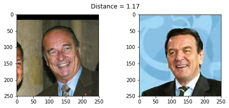
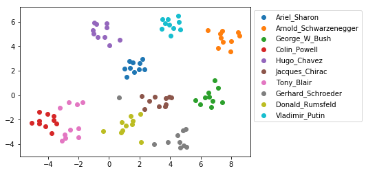

要搞个人脸识别的应用，花了半天时间浏览一下，准备基于`open face`的模型来做移植。下面是对开源库[face-recognition](https://github.com/krasserm/face-recognition)的使用指南进行一个翻译，看了一下基本知道了大致流程。不过我记得上次写过[L softmx -> A softmx -> AM softmax](https://zhen8838.github.io/2019/06/03/l-softmax/)的这些`loss`都是用在人脸识别里面的，但是如果基于`softmax loss`的话，每加一个人脸不都是要重新训练一波吗？不知道是不是这个情况，目前还没看到别的方式。

<!--more-->


## Deep face recognition with Keras, Dlib and OpenCV

面部识别识别面部图像或视频帧上的人。简而言之，人脸识别系统从输入人脸图像中提取特征，并将其与数据库中标记人脸的特征进行比较。比较基于特征相似性度量，并且最相似的数据库条目的标签用于标记输入图像。如果相似度值低于某个阈值，则输入图像标记为*unknown*。比较两个面部图像以确定它们是否显示同一个人被称为面部验证。

该笔记本使用深度卷积神经网络（CNN）从输入图像中提取特征。它遵循[1](https://arxiv.org/abs/1503.03832)中描述的方法，其修改受[OpenFace](http://cmusatyalab.github.io/openface/)项目的启发。 [Keras](https://keras.io/)用于实现CNN，[Dlib](http://dlib.net/)和[OpenCV](https://opencv.org/)用于对齐面部在输入图像上。在[LFW](http://vis-www.cs.umass.edu/lfw/)数据集的一小部分上评估面部识别性能，您可以将其替换为您自己的自定义数据集，例如：如果你想进一步试验这款笔记本，请附上你的家人和朋友的照片。在概述了CNN架构以及如何训练模型之后，将演示如何：

- 在输入图像上检测，变换和裁剪面部。这可确保面部在进入CNN之前对齐。该预处理步骤对于神经网络的性能非常重要。
- 使用CNN从对齐的输入图像中提取面部的128维表示或*嵌入*。在嵌入空间中，欧几里德距离直接对应于面部相似性的度量。
- 将输入嵌入向量与数据库中标记的嵌入向量进行比较。这里，支持向量机（SVM）和KNN分类器，在标记的嵌入向量上训练，起到数据库的作用。在此上下文中的面部识别意味着使用这些分类器来预测标签，即新输入的身份。

### Environment setup 环境设置

For running this notebook, create and activate a new [virtual environment](https://docs.python.org/3/tutorial/venv.html) and install the packages listed in [requirements.txt](requirements.txt) with `pip install -r requirements.txt`. Furthermore, you'll need a local copy of Dlib's face landmarks data file for running face alignment:

### CNN architecture and training

这里使用的CNN架构是初始架构[2](https://arxiv.org/abs/1409.4842)的变体。更确切地说，它是[1](https://arxiv.org/abs/1503.03832)中描述的NN4体系结构的变体，并标识为[nn4.small2](https://cmusatyalab.github.io/openface/models-and-accuracies/#model-definitions)。这个笔记本使用该模型的Keras实现，其定义取自[Keras-OpenFace](https://github.com/iwantooxxoox/Keras-OpenFace)项目。这里的体系结构细节并不太重要，只知道有一个完全连接的层，其中有128个隐藏单元，后面是卷积基础顶部的L2规范化层。这两个顶层被称为*嵌入层*，从中可以获得128维嵌入向量。完整模型在[model.py]（model.py）中定义，图形概述在[model.png]（model.png）中给出。可以使用`create_model（）`创建nn4.small2模型的Keras版本。


```python
from model import create_model

nn4_small2 = create_model()
```

    W0801 21:29:26.376736 140043235366720 deprecation.py:506] From /home/zqh/miniconda3/lib/python3.7/site-packages/tensorflow/python/ops/init_ops.py:1251: calling VarianceScaling.__init__ (from tensorflow.python.ops.init_ops) with dtype is deprecated and will be removed in a future version.
    Instructions for updating:
    Call initializer instance with the dtype argument instead of passing it to the constructor


模型训练旨在学习嵌入$f(x)$图像$x$，使得相同身份的所有面部之间的平方L2距离较小，并且来自不同身份的一对面部之间的距离较大。当嵌入空间中的锚图像$x^a_i$和正图像$x^p_i$（相同身份）之间的距离小于两者之间的距离时，可以实现*三元组损失* $L$。锚图像和负图像$x^n_i$（不同的身份）至少有一个边缘$\alpha$。

$$
\begin{aligned}
L = \sum^{m}_{i=1} \large[ \small {\mid \mid f(x_{i}^{a}) - f(x_{i}^{p})) \mid \mid_2^2} - {\mid \mid f(x_{i}^{a}) - f(x_{i}^{n})) \mid \mid_2^2} + \alpha \large ] \small_+
\end{aligned}
$$

$[z]_+$表示$\max(z，0)$和$m$是训练集中三元组的数量。 Keras中的三重态损失最好用自定义层实现，因为损失函数不遵循通常的“损失（输入，目标）”模式。该层调用`self.add_loss`来安装三元组丢失：


```python
from tensorflow.python.keras import backend as K
from tensorflow.python.keras.models import Model
from tensorflow.python.keras.layers import Input, Layer
import tensorflow.python as tf
config = tf.ConfigProto()
config.gpu_options.allow_growth = True
K.set_session(tf.Session(config=config))

# Input for anchor, positive and negative images
in_a = Input(shape=(96, 96, 3))
in_p = Input(shape=(96, 96, 3))
in_n = Input(shape=(96, 96, 3))

# Output for anchor, positive and negative embedding vectors
# The nn4_small model instance is shared (Siamese network)
emb_a = nn4_small2(in_a)
emb_p = nn4_small2(in_p)
emb_n = nn4_small2(in_n)

class TripletLossLayer(Layer):
    def __init__(self, alpha, **kwargs):
        self.alpha = alpha
        super(TripletLossLayer, self).__init__(**kwargs)
    
    def triplet_loss(self, inputs):
        a, p, n = inputs
        p_dist = K.sum(K.square(a-p), axis=-1)
        n_dist = K.sum(K.square(a-n), axis=-1)
        return K.sum(K.maximum(p_dist - n_dist + self.alpha, 0), axis=0)
    
    def call(self, inputs):
        loss = self.triplet_loss(inputs)
        self.add_loss(loss)
        return loss

# Layer that computes the triplet loss from anchor, positive and negative embedding vectors
triplet_loss_layer = TripletLossLayer(alpha=0.2, name='triplet_loss_layer')([emb_a, emb_p, emb_n])

# Model that can be trained with anchor, positive negative images
nn4_small2_train = Model([in_a, in_p, in_n], triplet_loss_layer)
```

在训练期间，选择正对$(x^a_i,x^p_i)$和负对$(x^a_i，x^n_i)$难以区分的三元组是很重要的，即它们在嵌入空间中的距离差异应该是低于间距$\alpha$，否则，网络无法学习有用的嵌入。因此，每次训练迭代应该基于在前一次迭代中学习的嵌入来选择一批新的三元组。假设从`triplet_generator（）`调用返回的生成器可以在这些约束下生成三元组，可以通过以下方式训练网络：


```python
from data import triplet_generator

# triplet_generator() creates a generator that continuously returns 
# ([a_batch, p_batch, n_batch], None) tuples where a_batch, p_batch 
# and n_batch are batches of anchor, positive and negative RGB images 
# each having a shape of (batch_size, 96, 96, 3).
generator = triplet_generator() 

nn4_small2_train.compile(loss=None, optimizer='adam')
nn4_small2_train.fit_generator(generator, epochs=10, steps_per_epoch=100)

# Please note that the current implementation of the generator only generates 
# random image data. The main goal of this code snippet is to demonstrate 
# the general setup for model training. In the following, we will anyway 
# use a pre-trained model so we don't need a generator here that operates 
# on real training data. I'll maybe provide a fully functional generator
# later.
```

    W0801 21:29:38.732154 140043235366720 training_utils.py:1101] Output triplet_loss_layer missing from loss dictionary. We assume this was done on purpose. The fit and evaluate APIs will not be expecting any data to be passed to triplet_loss_layer.
    W0801 21:29:38.856654 140043235366720 deprecation.py:323] From /home/zqh/miniconda3/lib/python3.7/site-packages/tensorflow/python/ops/math_grad.py:1250: add_dispatch_support.<locals>.wrapper (from tensorflow.python.ops.array_ops) is deprecated and will be removed in a future version.
    Instructions for updating:
    Use tf.where in 2.0, which has the same broadcast rule as np.where


    Epoch 1/10
    100/100 [==============================] - 19s 191ms/step - loss: 0.8117
    Epoch 2/10
    100/100 [==============================] - 5s 46ms/step - loss: 0.7971
    Epoch 3/10
    100/100 [==============================] - 5s 46ms/step - loss: 0.8035
    Epoch 4/10
    100/100 [==============================] - 5s 46ms/step - loss: 0.8018
    Epoch 5/10
    100/100 [==============================] - 5s 46ms/step - loss: 0.8049
    Epoch 6/10
    100/100 [==============================] - 5s 46ms/step - loss: 0.8009
    Epoch 7/10
    100/100 [==============================] - 5s 47ms/step - loss: 0.8003
    Epoch 8/10
    100/100 [==============================] - 5s 48ms/step - loss: 0.7995
    Epoch 9/10
    100/100 [==============================] - 5s 46ms/step - loss: 0.8004
    Epoch 10/10
    100/100 [==============================] - 5s 46ms/step - loss: 0.7998


    <tensorflow.python.keras.callbacks.History at 0x7f5cda4385c0>


上面的代码片段应该只演示如何设置模型训练。但是，我们不是从头开始实际训练模型，而是使用预先训练的模型，因为从头开始的训练非常昂贵，并且需要庞大的数据集来实现良好的泛化性能。例如，[1]（https://arxiv.org/abs/1503.03832）使用包含大约8M身份的200M图像的数据集。

OpenFace项目提供了[预训练模型](https://cmusatyalab.github.io/openface/models-and-accuracies/#pre-trained-models)，这些模型使用公共人脸识别数据集[FaceScrub](http://vintage.winklerbros.net/facescrub.html)进行训练,和[CASIA-WebFace](http://arxiv.org/abs/1411.7923)。 Keras-OpenFace项目将预先训练的nn4.small2.v1模型的权重转换为[CSV文件](https://github.com/iwantooxxoox/Keras-OpenFace/tree/master/weights)，然后进行[转换](http://vintage.winklerbros.net/facescrub.html)这里x为一个二进制格式，可由Keras用`load_weights`加载：


```python
nn4_small2_pretrained = create_model()
nn4_small2_pretrained.load_weights('weights/nn4.small2.v1.h5')
```

### Custom dataset 自定义数据集

为了演示自定义数据集上的人脸识别，使用了[LFW](http://vis-www.cs.umass.edu/lfw/)数据集的一小部分。它由[10个身份](images)的100个面部图像组成。每个图像的元数据（文件和身份名称）被加载到内存中以供以后处理。


```python
import numpy as np
import os.path

class IdentityMetadata():
    def __init__(self, base, name, file):
        # dataset base directory
        self.base = base
        # identity name
        self.name = name
        # image file name
        self.file = file

    def __repr__(self):
        return self.image_path()

    def image_path(self):
        return os.path.join(self.base, self.name, self.file) 
    
def load_metadata(path):
    metadata = []
    for i in sorted(os.listdir(path)):
        for f in sorted(os.listdir(os.path.join(path, i))):
            # Check file extension. Allow only jpg/jpeg' files.
            ext = os.path.splitext(f)[1]
            if ext == '.jpg' or ext == '.jpeg':
                metadata.append(IdentityMetadata(path, i, f))
    return np.array(metadata)

metadata = load_metadata('images')
```

### Face alignment 面部对齐

nn4.small2.v1模型使用对齐的面部图像进行训练，因此，自定义数据集中的面部图像也必须对齐。在这里，我们使用[Dlib](http://dlib.net/)进行人脸检测，使用[OpenCV](https://opencv.org/)进行图像变换和裁剪，以生成对齐的96x96 RGB人脸图像。通过使用OpenFace项目中的[AlignDlib](align.py)实用程序，这很简单：


```python
import cv2
import matplotlib.pyplot as plt
import matplotlib.patches as patches

from align import AlignDlib

%matplotlib inline

def load_image(path):
    img = cv2.imread(path, 1)
    # OpenCV loads images with color channels
    # in BGR order. So we need to reverse them
    return img[...,::-1]

# Initialize the OpenFace face alignment utility
alignment = AlignDlib('models/landmarks.dat')

# Load an image of Jacques Chirac
jc_orig = load_image(metadata[77].image_path())

# Detect face and return bounding box
bb = alignment.getLargestFaceBoundingBox(jc_orig)

# Transform image using specified face landmark indices and crop image to 96x96
jc_aligned = alignment.align(96, jc_orig, bb, landmarkIndices=AlignDlib.OUTER_EYES_AND_NOSE)

# Show original image
plt.subplot(131)
plt.imshow(jc_orig)

# Show original image with bounding box
plt.subplot(132)
plt.imshow(jc_orig)
plt.gca().add_patch(patches.Rectangle((bb.left(), bb.top()), bb.width(), bb.height(), fill=False, color='red'))

# Show aligned image
plt.subplot(133)
plt.imshow(jc_aligned)
```


如OpenFace [预训练模型](https://cmusatyalab.github.io/openface/models-and-accuracies/#pre-trained-models)中所述部分,模型nn4.small2.v1需要地标索引`OUTER_EYES_AND_NOSE`。让我们将面部检测，转换和裁剪实现为`align_image`函数，以便以后重用。


```python
def align_image(img):
    return alignment.align(96, img, alignment.getLargestFaceBoundingBox(img), 
                           landmarkIndices=AlignDlib.OUTER_EYES_AND_NOSE)
```

### Embedding vectors 嵌入向量

现在可以通过将对齐和缩放的图像馈送到预训练的网络中来计算嵌入向量。


```python
embedded = np.zeros((metadata.shape[0], 128))

for i, m in enumerate(metadata):
    img = load_image(m.image_path())
    img = align_image(img)
    # scale RGB values to interval [0,1]
    img = (img / 255.).astype(np.float32)
    # obtain embedding vector for image
    embedded[i] = nn4_small2_pretrained.predict(np.expand_dims(img, axis=0))[0]
```

Let's verify on a single triplet example that the squared L2 distance between its anchor-positive pair is smaller than the distance between its anchor-negative pair.

让我们在单个三元组示例上验证其锚定正对之间的平方L2距离小于其锚定负对之间的距离。


```python
def distance(emb1, emb2):
    return np.sum(np.square(emb1 - emb2))

def show_pair(idx1, idx2):
    plt.figure(figsize=(8,3))
    plt.suptitle(f'Distance = {distance(embedded[idx1], embedded[idx2]):.2f}')
    plt.subplot(121)
    plt.imshow(load_image(metadata[idx1].image_path()))
    plt.subplot(122)
    plt.imshow(load_image(metadata[idx2].image_path()))    

show_pair(77, 78)
show_pair(77, 50)
```





正如预期的那样，Jacques Chirac的两幅图像之间的距离小于Jacques Chirac图像与GerhardSchröder图像之间的距离（0.30 <1.12）。但是我们仍然不知道距离阈值$\tau$是在*相同身份*和*不同身份*之间作出决定的最佳边界。

### Distance threshold 距离阈值

要查找$ \tau $的最佳值，必须在一系列距离阈值上评估面部验证性能。在给定阈值处，所有可能的嵌入向量对被分类为*相同的身份*或*不同的身份*并且与基础事实进行比较。因为我们正在处理偏斜的类（比正对更多的负对），我们使用[F1得分](https://en.wikipedia.org/wiki/F1_score)作为评估指标而不是[准确度](http://scikit-learn.org/stable/modules/generated/sklearn.metrics.accuracy_score.html)


```python
from sklearn.metrics import f1_score, accuracy_score

distances = [] # squared L2 distance between pairs
identical = [] # 1 if same identity, 0 otherwise

num = len(metadata)

for i in range(num - 1):
    for j in range(1, num):
        distances.append(distance(embedded[i], embedded[j]))
        identical.append(1 if metadata[i].name == metadata[j].name else 0)
        
distances = np.array(distances)
identical = np.array(identical)

thresholds = np.arange(0.3, 1.0, 0.01)

f1_scores = [f1_score(identical, distances < t) for t in thresholds]
acc_scores = [accuracy_score(identical, distances < t) for t in thresholds]

opt_idx = np.argmax(f1_scores)
# Threshold at maximal F1 score
opt_tau = thresholds[opt_idx]
# Accuracy at maximal F1 score
opt_acc = accuracy_score(identical, distances < opt_tau)

# Plot F1 score and accuracy as function of distance threshold
plt.plot(thresholds, f1_scores, label='F1 score')
plt.plot(thresholds, acc_scores, label='Accuracy')
plt.axvline(x=opt_tau, linestyle='--', lw=1, c='lightgrey', label='Threshold')
plt.title(f'Accuracy at threshold {opt_tau:.2f} = {opt_acc:.3f}')
plt.xlabel('Distance threshold')
plt.legend()
```

    /home/zqh/miniconda3/lib/python3.7/importlib/_bootstrap.py:219: RuntimeWarning: numpy.ufunc size changed, may indicate binary incompatibility. Expected 216, got 192
      return f(*args, **kwds)
    /home/zqh/miniconda3/lib/python3.7/importlib/_bootstrap.py:219: RuntimeWarning: numpy.ufunc size changed, may indicate binary incompatibility. Expected 192 from C header, got 216 from PyObject
      return f(*args, **kwds)
    /home/zqh/miniconda3/lib/python3.7/importlib/_bootstrap.py:219: RuntimeWarning: numpy.ufunc size changed, may indicate binary incompatibility. Expected 192 from C header, got 216 from PyObject
      return f(*args, **kwds)
    /home/zqh/miniconda3/lib/python3.7/importlib/_bootstrap.py:219: RuntimeWarning: numpy.ufunc size changed, may indicate binary incompatibility. Expected 216, got 192
      return f(*args, **kwds)


$\tau$ = 0.56的面部验证准确率为95.7％。对于总是预测*不同身份*（有980个pos。对和8821个neg。对）的分类器的基线为89％，这也不错，但由于nn4.small2.v1是一个相对较小的模型，它仍然小于最先进的模型（> 99％）。

以下两个直方图显示了正负对的距离分布和决策边界的位置。这些分布明显分开，这解释了网络的辨别性能。人们也可以发现正对中的一些强异常值，但这里不再进一步分析。


```python
dist_pos = distances[identical == 1]
dist_neg = distances[identical == 0]

plt.figure(figsize=(12,4))

plt.subplot(121)
plt.hist(dist_pos)
plt.axvline(x=opt_tau, linestyle='--', lw=1, c='lightgrey', label='Threshold')
plt.title('Distances (pos. pairs)')
plt.legend()

plt.subplot(122)
plt.hist(dist_neg)
plt.axvline(x=opt_tau, linestyle='--', lw=1, c='lightgrey', label='Threshold')
plt.title('Distances (neg. pairs)')
plt.legend()
```


### Face recognition 人脸识别

给定距离阈值$ \tau $的估计，人脸识别现在就像计算输入嵌入向量与数据库中所有嵌入向量之间的距离一样简单。如果输入小于$ \tau $或标签*unknown*，则为输入分配具有最小距离的数据库条目的标签（即标识）。此过程还可以扩展到大型数据库，因为它可以轻松并行化。它还支持一次性学习，因为仅添加新标识的单个条目可能足以识别该标识的新示例。

更稳健的方法是使用数据库中的前$ k $评分条目标记输入，该条目基本上是[KNN分类](https://en.wikipedia.org/wiki/K-nearest_neighbors_algorithm)，具有欧几里德距离度量。或者，线性[支持向量机](https://en.wikipedia.org/wiki/Support_vector_machine)可以用数据库条目训练并用于分类，即识别新输入。为了训练这些分类器，我们使用50％的数据集，用于评估其他50％。


```python
from sklearn.preprocessing import LabelEncoder
from sklearn.neighbors import KNeighborsClassifier
from sklearn.svm import LinearSVC

targets = np.array([m.name for m in metadata])

encoder = LabelEncoder()
encoder.fit(targets)

# Numerical encoding of identities
y = encoder.transform(targets)

train_idx = np.arange(metadata.shape[0]) % 2 != 0
test_idx = np.arange(metadata.shape[0]) % 2 == 0

# 50 train examples of 10 identities (5 examples each)
X_train = embedded[train_idx]
# 50 test examples of 10 identities (5 examples each)
X_test = embedded[test_idx]

y_train = y[train_idx]
y_test = y[test_idx]

knn = KNeighborsClassifier(n_neighbors=1, metric='euclidean')
svc = LinearSVC()

knn.fit(X_train, y_train)
svc.fit(X_train, y_train)

acc_knn = accuracy_score(y_test, knn.predict(X_test))
acc_svc = accuracy_score(y_test, svc.predict(X_test))

print(f'KNN accuracy = {acc_knn}, SVM accuracy = {acc_svc}')
```

    KNN accuracy = 0.96, SVM accuracy = 0.98


KNN分类器在测试集上实现了96％的准确度，SVM分类器为98％。让我们使用SVM分类器来说明单个示例中的人脸识别。


```python
import warnings
# Suppress LabelEncoder warning
warnings.filterwarnings('ignore')

example_idx = 6

example_image = load_image(metadata[test_idx][example_idx].image_path())
example_prediction = svc.predict([embedded[test_idx][example_idx]])
example_identity = encoder.inverse_transform(example_prediction)[0]

plt.imshow(example_image)
plt.title(f'Recognized as {example_identity}')
```


似乎合理:-)实际上应该检查分类结果是否（预测身份的数据库条目的一个子集）的距离小于$\tau$，否则应该分配一个*未知标签*。此处跳过此步骤，但可以轻松添加。


### Dataset visualization 数据集可视化

为了将数据集嵌入到2D空间中以显示身份聚类，将[t-distributed Stochastic Neighbor Embedding](https://en.wikipedia.org/wiki/T-distributed_stochastic_neighbor_embedding)（t-SNE）应用于128维嵌入向量。除了一些异常值，身份集群很好地分开。


```python
from sklearn.manifold import TSNE

X_embedded = TSNE(n_components=2).fit_transform(embedded)

for i, t in enumerate(set(targets)):
    idx = targets == t
    plt.scatter(X_embedded[idx, 0], X_embedded[idx, 1], label=t)   

plt.legend(bbox_to_anchor=(1, 1))
```





### References

- [1] [FaceNet: A Unified Embedding for Face Recognition and Clustering](https://arxiv.org/abs/1503.03832)
- [2] [Going Deeper with Convolutions](https://arxiv.org/abs/1409.4842)
