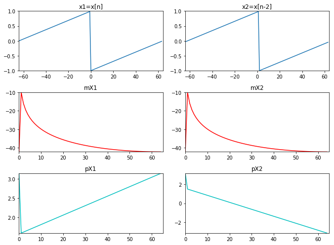
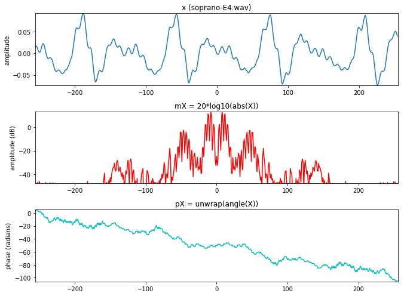
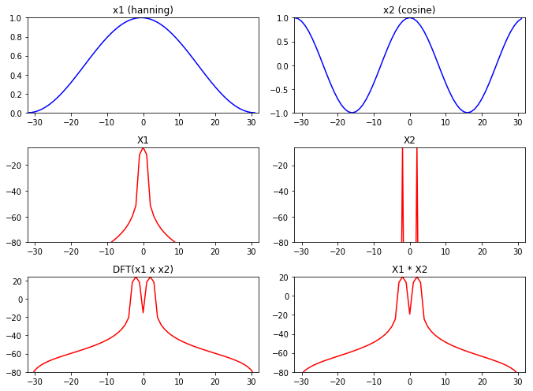
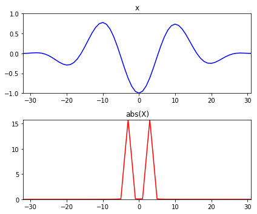
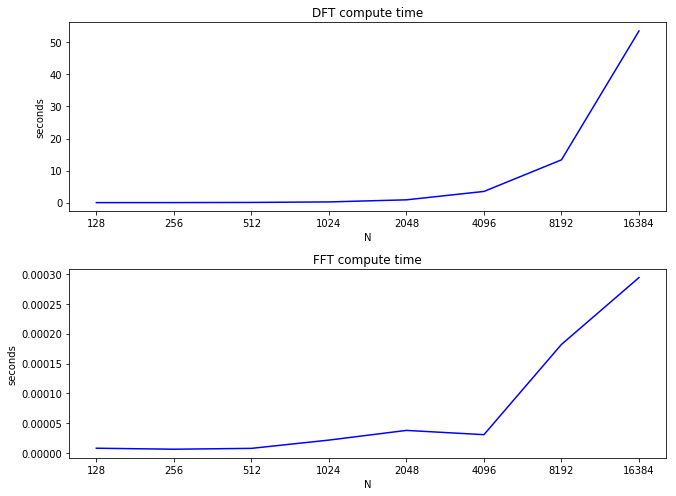
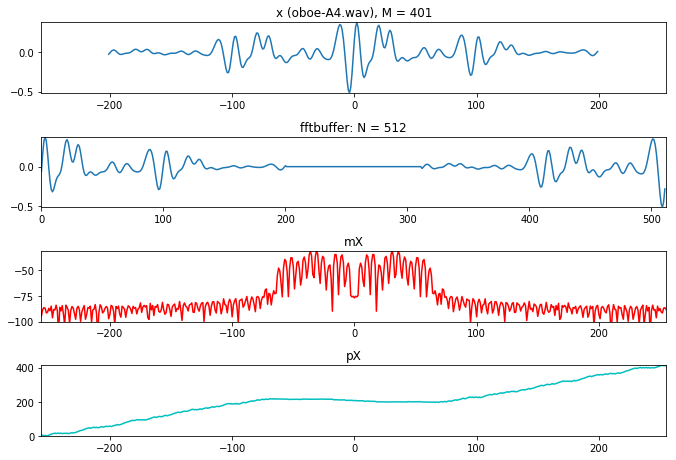

今天实践FFT的各种性质。

<!--more-->


# 傅里叶属性

首先从$x_1$,$x_2$两个信号的线性组合开始:

线性:$ \Rightarrow \ \ \ \ ax_1[n]+bx_2[n]\Leftrightarrow aX_1[n]+bX_2[n] $


$$
\begin{align}
\because DFT&(ax_1[n]+bx_2[n]) \\
&=\sum^{N-1}_{n=0}(ax_1[n]+bx_2[n])e^{-j2\pi kn/N}\\
&=\sum^{N-1}_{n=0}ax_1[n]e^{-j2\pi kn/N}+\sum^{N-1}_{n=0}bx_2[n]e^{-j2\pi kn/N}\\
&=a\sum^{N-1}_{n=0}x_1[n]e^{-j2\pi kn/N}+b\sum^{N-1}_{n=0}x_2[n]e^{-j2\pi kn/N}\\
&=aX_1[k]+bX_2[k]
\end{align}
$$
说明两个信号相加,在幅度谱上也是进行相同的相加.


```python
import matplotlib.pyplot as plt
import numpy as np
from scipy.io.wavfile import read
from scipy.fftpack import fft, ifft

a = 0.5
b = 1.0
k1 = 20
k2 = 25
N = 128
x1 = a*np.exp(1j*2*np.pi*k1/N*np.arange(N))
x2 = b*np.exp(1j*2*np.pi*k2/N*np.arange(N))

plt.figure(1, figsize=(9.5, 7))
plt.subplot(321)
plt.title('x1 (amp=.5, freq=20)')
plt.plot(np.arange(0, N, 1.0), np.real(x1), lw=1.5)
plt.axis([0, N, -1, 1])

plt.subplot(322)
plt.title('x2 (amp=1, freq=25)')
plt.plot(np.arange(0, N, 1.0), np.real(x2), lw=1.5)
plt.axis([0, N, -1, 1])
X1 = fft(x1)
mX1 = abs(X1)/N        

plt.subplot(323)
plt.title('mX1 (amp=.5, freq=20)')
plt.plot(np.arange(0, N, 1.0), mX1, 'r', lw=1.5)
plt.axis([0,N,0,1])
X2 = fft(x2)
mX2 = abs(X2)/N        

plt.subplot(324)
plt.title('mX2 (amp=1, freq=25)')
plt.plot(np.arange(0, N, 1.0), mX2, 'r', lw=1.5)
plt.axis([0,N,0,1])
x = x1 + x2

plt.subplot(325)
plt.title('mX1+mX2')
plt.plot(np.arange(0, N, 1.0), mX1+mX2, 'r', lw=1.5)
plt.axis([0, N, 0, 1])
X = fft(x)
mX= abs(X)/N        

plt.subplot(326)
plt.title('DFT(x1+x2)')
plt.plot(np.arange(0, N, 1.0), mX, 'r', lw=1.5)
plt.axis([0,N,0,1])

plt.tight_layout()
plt.show()
```


# 平移
$$x[n-n_0]\Leftrightarrow e^{-j2\pi kn_0/N}X[k]$$
证明:
$$
\begin{align}
DFT&(x[n-n_0])\\
&=\sum^{N-1}_{n=0}x[n-n_0]e^{-j2\pi kn/N}\\
&=\sum^{N-1}_{n=0}x[m]e^{-j2\pi k(m+n_0)/N}\ \ \ \ (m=n-n_0)\\
&=\sum^{N-1}_{n=0}x[m]e^{-j2\pi km/N}e^{-j2\pi kn_0/N}\\
&=e^{-j2\pi kn_0/N}\sum^{N-1}_{n=0}x[m]e^{-j2\pi km/N} \\
&=e^{-j2\pi kn_0/N}X[k]
\end{align}
$$
时域中平移,在DFT之后就相当于乘上特定的sin波形,两个信号的频谱与幅度谱都相同,但是相位谱是不同的.(因为这个是复指数,乘上不会改变幅度)


```python
import matplotlib.pyplot as plt
import numpy as np
import sys
from scipy.signal import sawtooth
sys.path.append('../software/models/')
import dftModel as DF

N = 128
x1 = sawtooth(2*np.pi*np.arange(-N/2,N/2)/float(N))
x2 = sawtooth(2*np.pi*np.arange(-N/2-2,N/2-2)/float(N))
mX1, pX1 = DF.dftAnal(x1, np.ones(N), N)
mX2, pX2 = DF.dftAnal(x2, np.ones(N), N)

plt.figure(1, figsize=(9.5, 7))
plt.subplot(321)
plt.title('x1=x[n]')
plt.plot(np.arange(-N/2, N/2, 1.0), x1, lw=1.5)
plt.axis([-N/2, N/2, -1, 1])

plt.subplot(322)
plt.title('x2=x[n-2]')
plt.plot(np.arange(-N/2, N/2, 1.0), x2, lw=1.5)
plt.axis([-N/2, N/2, -1, 1])

plt.subplot(323)
plt.title('mX1')
plt.plot(np.arange(0, mX1.size, 1.0), mX1, 'r', lw=1.5)
plt.axis([0,mX1.size,min(mX1),max(mX1)])      

plt.subplot(324)
plt.title('mX2')
plt.plot(np.arange(0, mX2.size, 1.0), mX2, 'r', lw=1.5)
plt.axis([0,mX2.size,min(mX2),max(mX2)])  

plt.subplot(325)
plt.title('pX1')
plt.plot(np.arange(0, pX1.size, 1.0), pX1, 'c', lw=1.5)
plt.axis([0,pX1.size,min(pX1),max(pX2)])  

plt.subplot(326)
plt.title('pX2')
plt.plot(np.arange(0, pX2.size, 1.0), pX2, 'c', lw=1.5)
plt.axis([0,pX2.size,min(pX2),max(pX2)]) 

plt.tight_layout()
plt.show()
```





# 对称性
如果一个偶对称的实信号做DFT,那么他的复数谱也是偶对称的,复数谱的虚部是奇对称的.
幅度谱为偶对称,相位谱为奇对称.


```python
import matplotlib.pyplot as plt
import numpy as np
import sys
from scipy.fftpack import fft, ifft, fftshift
import math

sys.path.append('../software/models/')

import utilFunctions as UF
import dftModel as DF
(fs, x) = UF.wavread('../sounds/soprano-E4.wav')
w = np.hamming(511)
N = 512
pin = 5000
hM1 = int(math.floor((w.size+1)/2)) 
hM2 = int(math.floor(w.size/2)) 
fftbuffer = np.zeros(N)  
x1 = x[pin-hM1:pin+hM2]
xw = x1*w
fftbuffer[:hM1] = xw[hM2:]
fftbuffer[N-hM2:] = xw[:hM2]        
X = fftshift(fft(fftbuffer))
mX = 20 * np.log10(abs(X))       
pX = np.unwrap(np.angle(X))

plt.figure(1, figsize=(9.5, 7))
plt.subplot(311)
plt.plot(np.arange(-hM1, hM2), x1, lw=1.5)
plt.axis([-hM1, hM2, min(x1), max(x1)])
plt.ylabel('amplitude')
plt.title('x (soprano-E4.wav)')

plt.subplot(3,1,2)
plt.plot(np.arange(-N/2,N/2), mX, 'r', lw=1.5)
plt.axis([-N/2,N/2,-48,max(mX)])
plt.title ('mX = 20*log10(abs(X))')
plt.ylabel('amplitude (dB)')

plt.subplot(3,1,3)
plt.plot(np.arange(-N/2,N/2), pX, 'c', lw=1.5)
plt.axis([-N/2,N/2,min(pX),max(pX)])
plt.title ('pX = unwrap(angle(X))')
plt.ylabel('phase (radians)')

plt.tight_layout()
plt.show()
```





# 卷积
$$x_1[n] \ast x_2[n]\Leftrightarrow X_1[n] \times X_2[n]$$
证明:
$$
\begin{align}
DFT&(x_1[n] \ast x_2[n]) \\
&=\sum^{N-1}_{n=0}(x_1[n] \ast x_2[n])e^{-j2\pi kn/N}\\
&=\sum^{N-1}_{n=0}\sum^{N-1}_{m=0}x_1[m]x_2[n-m])e^{-j2\pi kn/N}\\
&=\sum^{N-1}_{m=0}x_1[m]\sum^{N-1}_{n=0}x_2[n-m])e^{-j2\pi kn/N}\\
&=(\sum^{N-1}_{m=0}x_1[m]e^{-j2\pi km/N})X_2[k] \\
&=X_1[k]X_2[k]
\end{align}
$$
时域的卷积相当于频域的乘法.


```python
import matplotlib.pyplot as plt
import numpy as np
from scipy.fftpack import fft, fftshift

plt.figure(1, figsize=(9.5, 7))
M = 64
N = 64
x1 = np.hanning(M)
x2 = np.cos(2*np.pi*2/M*np.arange(M))
y1 = x1*x2
mY1 = 20 * np.log10(np.abs(fftshift(fft(y1, N))))

plt.subplot(3,2,1)
plt.title('x1 (hanning)')
plt.plot(np.arange(-M/2, M/2), x1, 'b', lw=1.5)
plt.axis([-M/2,M/2,0,1])

plt.subplot(3,2,2)
plt.title('x2 (cosine)')
plt.plot(np.arange(-M/2, M/2),x2, 'b', lw=1.5)
plt.axis([-M/2,M/2,-1,1])

mX1 = 20 * np.log10(np.abs(fftshift(fft(x1, M)))/M)
plt.subplot(3,2,3)
plt.title('X1')
plt.plot(np.arange(-N/2, N/2),mX1, 'r', lw=1.5)
plt.axis([-N/2,N/2,-80,max(mX1)])

mX2 = 20 * np.log10(np.abs(fftshift(fft(x2, M)))/M)
plt.subplot(3,2,4)
plt.title('X2')
plt.plot(np.arange(-N/2, N/2),mX2, 'r', lw=1.5)
plt.axis([-N/2,N/2,-80,max(mX2)])

plt.subplot(3,2,5)
plt.title('DFT(x1 x x2)')
plt.plot(np.arange(-N/2, N/2),mY1, 'r', lw=1.5)
plt.axis([-N/2,N/2,-80,max(mY1)])

Y2 = np.convolve(fftshift(fft(x1, M)), fftshift(fft(x2, M)))
mY2 = 20 * np.log10(np.abs(Y2)) - 40


plt.subplot(3,2,6)
plt.title('X1 * X2')
plt.plot(np.arange(-N//2, N//2),mY2[M//2:M+M//2], 'r', lw=1.5)
plt.axis([-N/2,N/2,-80,max(mY2)])

plt.tight_layout()
plt.show()
```





我们可以利用卷积来进行滤波~


```python
import matplotlib.pyplot as plt
import numpy as np
import time, os, sys
from scipy.fftpack import fft, ifft, fftshift
import math

import utilFunctions as UF
import dftModel as DF
(fs, x) = UF.wavread('../sounds/ocean.wav')
(fs, x2) = UF.wavread('../sounds/impulse-response.wav')
x1 = x[40000:44096]
N = 4096

plt.figure(1, figsize=(9.5, 7))
plt.subplot(3,2,1)
plt.title('x1 (ocean.wav)')
plt.plot(x1, 'b')
plt.axis([0,N,min(x1),max(x1)])

plt.subplot(3,2,2)
plt.title('x2 (impulse-response.wav)')
plt.plot(x2, 'b')
plt.axis([0,N,min(x2),max(x2)])

mX1, pX1 = DF.dftAnal(x1, np.ones(N), N)
mX1 = mX1 - max(mX1)
plt.subplot(3,2,3)
plt.title('X1')
plt.plot(mX1, 'r')
plt.axis([0,N/2,-70,0])

mX2, pX2 = DF.dftAnal(x2, np.ones(N), N)
mX2 = mX2 - max(mX2)
plt.subplot(3,2,4)
plt.title('X2')
plt.plot(mX2, 'r')
plt.axis([0,N/2,-70,0])

y = np.convolve(x1, x2)
mY, pY = DF.dftAnal(y[0:N], np.ones(N), N)
mY = mY - max(mY)
plt.subplot(3,2,5)
plt.title('DFT(x1 * x2)')
plt.plot(mY, 'r')
plt.axis([0,N/2,-70,0])

plt.subplot(3,2,6)
plt.title('X1 x X2')
mY1 = 20*np.log10(np.abs(fft(x1) * fft(x2)))
mY1 = mY1 - max(mY1)
plt.plot(mY1[0:N//2], 'r')
plt.axis([0,N//2,-84,0])

plt.tight_layout()
plt.show()
```


# 能量卷积
能量被定义为信号的绝对平方根之和,在频域中需要除以N.
$$\sum^{N/2-1}_{n=-N/2}|x[n]|^2=\frac{1}{N}\sum^{N/2-1}_{n=-N/2}|X[k]|^2$$
例如:
$$\sum^{N/2-1}_{n=-N/2}|x[n]|^2=11.81182$$
$$\frac{1}{N}\sum^{N/2-1}_{n=-N/2}|X[k]|^2=11.81182$$


```python
import numpy as np
import matplotlib.pyplot as plt
from scipy.signal import hamming
from scipy.fftpack import fft, fftshift

plt.figure(1, figsize=(6, 5))
M= 64
N = 64
x = np.cos(2*np.pi*3/M*np.arange(M)) * np.hanning(M)

plt.subplot(2,1,1)
plt.title('x')
plt.plot(np.arange(-M/2.0,M/2), x, 'b', lw=1.5)
plt.axis([-M/2,M/2-1,-1,1])

powerx = sum(np.abs(x)**2)
print (powerx)

mX = np.abs(fftshift(fft(x, N)))
plt.subplot(2,1,2)
plt.title('abs(X)')
plt.plot(np.arange(-N/2.0,N/2), mX, 'r', lw=1.5)
plt.axis([-N/2,N/2-1,0,max(mX)])

powerX = sum(mX**2) / N
print (powerX)

plt.tight_layout()
plt.show()
```

    11.811824035647202
    11.811824035647192





# 分贝
与能量相关的概念是振幅,所以定义分贝为信号绝对值的20倍log10.


```python
import numpy as np
import matplotlib.pyplot as plt
from scipy.signal import hamming
from scipy.fftpack import fft, fftshift

plt.figure(1, figsize=(9.5, 6))
M= 64
N = 256
x = np.cos(2*np.pi*3/M*np.arange(M)) * np.hanning(M)

plt.subplot(3,1,1)
plt.plot(np.arange(-M/2.0,M/2), x, 'b', lw=1.5)
plt.axis([-M/2,M/2-1,-1,1])
plt.title('x')


mX = np.abs(fftshift(fft(x, N)))
plt.subplot(3,1,2)
plt.plot(np.arange(-N/2.0,N/2), mX, 'r', lw=1.5)
plt.axis([-N/2,N/2-1,0,max(mX)])
plt.title('abs(X)')

mX = 20 * np.log10(mX)
plt.subplot(3,1,3)
plt.plot(np.arange(-N/2.0,N/2), mX, 'r', lw=1.5)
plt.axis([-N/2,N/2-1,-50,max(mX)])
plt.title('20*log10(abs(X))')

plt.tight_layout()
plt.show()
```


# FFT变换
因为DFT计算量较大,FFT则是利用DFT的对称性来达到加速计算的效果.

首先我们看看时间对比:

DFT运算会达到2分钟,成指数级增长.

FFT则快多了,是$nlogn$的增长


```python
import numpy as np
from scipy.fftpack import fft
import matplotlib.pyplot as plt
import time

timeDFT = np.array([])
timeFFT = np.array([])
Ns = 2**np.arange(7,15)
for N in Ns:
	x = np.random.rand(N)
	X = np.array([])
	str_time = time.time()
	for k in range(N):
		s = np.exp(1j*2*np.pi*k/N*np.arange(N))
		X = np.append(X, sum(x*np.conjugate(s)))
	timeDFT = np.append(timeDFT, time.time()-str_time)

x = np.random.rand(120)
X = fft(x)
for N in Ns:
	x = np.random.rand(N)
	str_time = time.time()
	X = fft(x)
	timeFFT = np.append(timeFFT, time.time()-str_time)

plt.figure(1, figsize=(9.5, 7))
plt.subplot(2,1,1)
plt.plot(timeDFT, 'b', lw=1.5)
plt.title('DFT compute time')
plt.xlabel('N')
plt.ylabel('seconds')
plt.xticks(np.arange(len(Ns)), Ns)
plt.subplot(2,1,2)
plt.plot(timeFFT, 'b', lw=1.5)
plt.title('FFT compute time')
plt.xlabel('N')
plt.ylabel('seconds')
plt.xticks(np.arange(len(Ns)), Ns)

plt.tight_layout()
plt.show()
```





为了使用FFT,我们需要让输入信号具有两个长度的功率.但是我们想要计算任何长度信号的频谱.所以我们需要先做零填充然后使用零相位窗口的方法.看看下面这个例子:

一个401个样本的声音片段.我们需要使用2的幂次,正好下一个2的幂次是512,所以fftbuffer为512,接着给fftbuffer零填充,然后把正样本放到左侧,中间空出,负样本放到右侧.接下来做fft变化


```python
import matplotlib.pyplot as plt
import numpy as np
from scipy.fftpack import fft, fftshift
import sys

sys.path.append('../software/models/')
import utilFunctions as UF

(fs, x) = UF.wavread('../sounds/oboe-A4.wav')
N = 512
M = 401
hN = N//2 
hM = (M+1)//2     
start = int(.8*fs)
xw = x[start-hM:start+hM-1] * np.hamming(M)

plt.figure(1, figsize=(9.5, 6.5))
plt.subplot(411)
plt.plot(np.arange(-hM, hM-1), xw, lw=1.5)
plt.axis([-hN, hN-1, min(xw), max(xw)])
plt.title('x (oboe-A4.wav), M = 401')

fftbuffer = np.zeros(N)                         
fftbuffer[:hM] = xw[hM-1:] 
fftbuffer[N-hM+1:] = xw[:hM-1]        
plt.subplot(412)
plt.plot(np.arange(0, N), fftbuffer, lw=1.5)
plt.axis([0, N, min(xw), max(xw)])
plt.title('fftbuffer: N = 512')

X = fftshift(fft(fftbuffer))
mX = 20 * np.log10(abs(X)/N)        
pX = np.unwrap(np.angle(X)) 
plt.subplot(413)
plt.plot(np.arange(-hN, hN), mX, 'r', lw=1.5)
plt.axis([-hN,hN-1,-100,max(mX)])
plt.title('mX')

plt.subplot(414)
plt.plot(np.arange(-hN, hN), pX, 'c', lw=1.5)
plt.axis([-hN,hN-1,min(pX),max(pX)])
plt.title('pX')

plt.tight_layout()
plt.show()
```





# FFT 编程

## 对三角波进行fft


```python
import numpy as np
from scipy.signal import triang
from scipy.fftpack import fft
import matplotlib.pyplot as plt

x=triang(15) # 生成一个15点三角波
plt.figure(1, figsize=(9.5, 6.5))
plt.subplot(4,1,1)
plt.plot(x)
plt.title('triang')
x=fft(x)
mX=np.abs(x)
pX=np.angle(x)

plt.subplot(4,1,2)
plt.plot(x)
plt.title('triang after fft')
plt.subplot(4,1,3)
plt.plot(mX)
plt.title('triang after fft abs')
plt.subplot(4,1,4)
plt.plot(pX)
plt.title('triang after fft angle')
plt.tight_layout()
plt.show()
```


## 位移三角波再进行fft


```python
x=triang(15) # 生成一个15点三角波
fftbuffer=np.zeros(15)
fftbuffer[:8]=x[7:]
fftbuffer[8:]=x[:7]
plt.figure(1, figsize=(9.5, 6.5))
plt.subplot(4,1,1)
plt.plot(fftbuffer)
plt.title('fftbuffer')
x=fft(fftbuffer)
mX=np.abs(x)
pX=np.angle(x)

plt.subplot(4,1,2)
plt.plot(x)
plt.title('triang after fft')
plt.subplot(4,1,3)
plt.plot(mX)
plt.title('triang after fft abs')
plt.subplot(4,1,4)
plt.plot(pX)
plt.title('triang after fft angle')
plt.tight_layout()
plt.show()
```


## 读取真实信号进行fft
取fftbuffer N=511


```python
import utilFunctions as UF

M=501 # 输入信号长度
hM1=int(math.floor((M+1)/2)) # 计算窗宽
hM2=int(math.floor(M/2))
fs,x=UF.wavread('../sounds/soprano-E4.wav') 
x1=x[5000:5000+M]*np.hamming(M) # 加窗

N=511
fftbuffer=np.zeros(N) # 零填充
fftbuffer[:hM1]=x1[hM2:] # 
fftbuffer[N-hM2:]=x1[:hM2]

plt.figure(1, figsize=(9.5, 6.5))
plt.subplot(4,1,1)
plt.plot(fftbuffer)
plt.title('fftbuffer')
x=fft(fftbuffer)
mX=np.abs(x)
pX=np.angle(x)
plt.subplot(4,1,2)
plt.plot(x)
plt.title('after fft')
plt.subplot(4,1,3)
plt.plot(mX)
plt.title('after fft abs')
plt.subplot(4,1,4)
plt.plot(pX)
plt.title('after fft angle')
plt.tight_layout()
plt.show()
```


## 读取真实信号进行fft
取fftbuffer N=1024


```python
import utilFunctions as UF

M=501 # 输入信号长度
hM1=int(math.floor((M+1)/2)) # 计算窗宽
hM2=int(math.floor(M/2))
fs,x=UF.wavread('../sounds/soprano-E4.wav') 
x1=x[5000:5000+M]*np.hamming(M) # 加窗

N=1024
fftbuffer=np.zeros(N) # 零填充
fftbuffer[:hM1]=x1[hM2:] # 
fftbuffer[N-hM2:]=x1[:hM2]

plt.figure(1, figsize=(9.5, 6.5))
plt.subplot(4,1,1)
plt.plot(fftbuffer)
plt.title('fftbuffer')
x=fft(fftbuffer)
mX=20*np.log10(np.abs(x))
pX=np.unwrap(np.angle(x))
plt.subplot(4,1,2)
plt.plot(x)
plt.title('after fft')
plt.subplot(4,1,3)
plt.plot(mX)
plt.title('after fft abs (db)')
plt.subplot(4,1,4)
plt.plot(pX)
plt.title('after fft angle (unwrap)')
plt.tight_layout()
plt.show()
```


