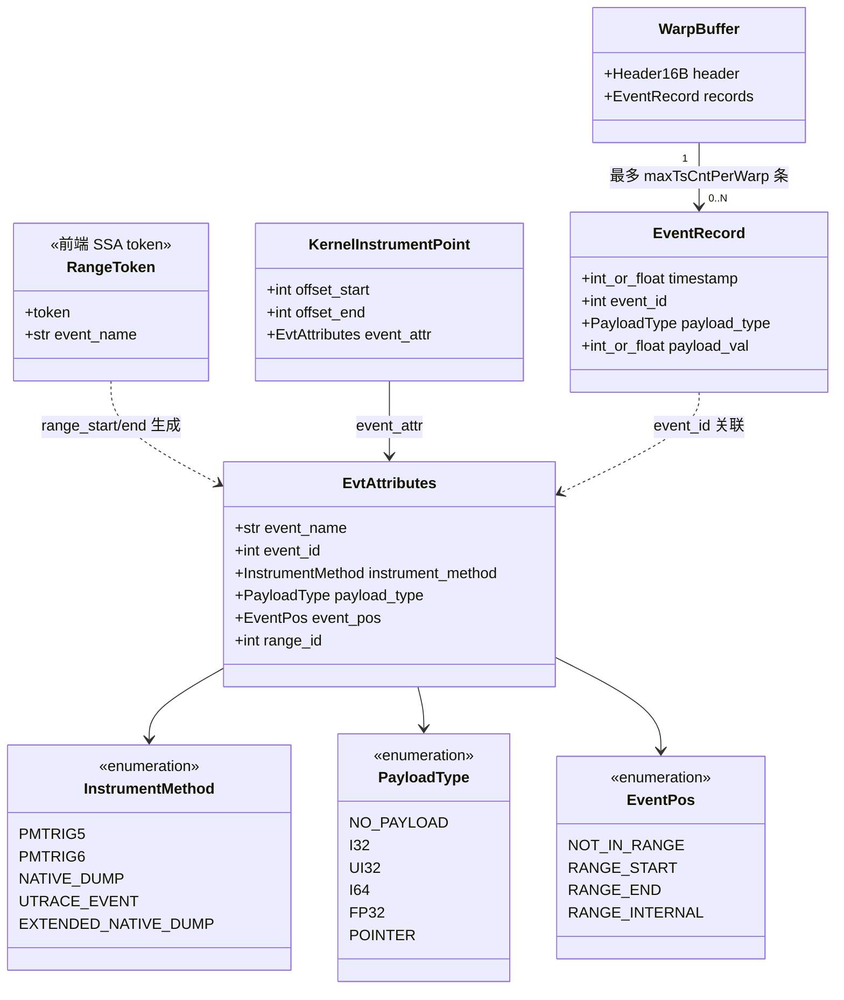
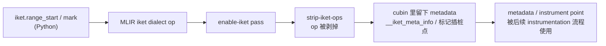
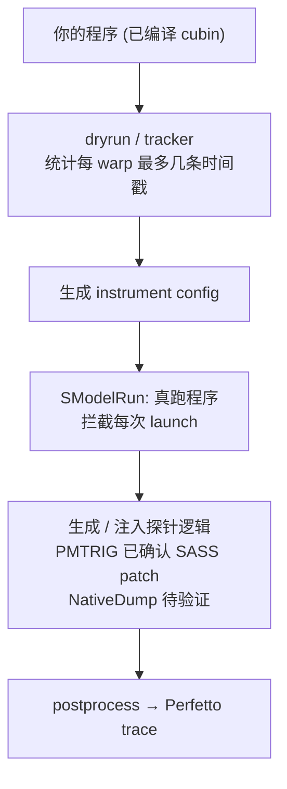
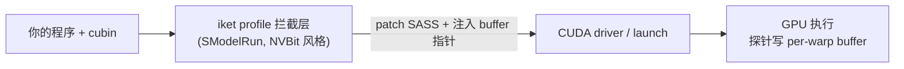
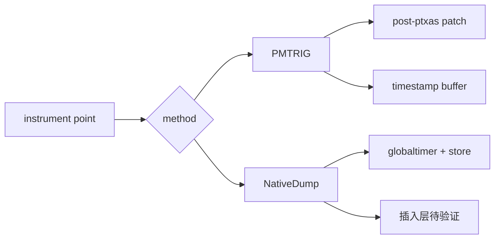
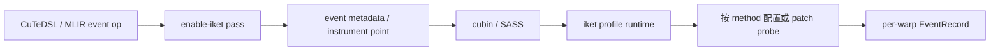

最近看了一下 CuTeDSL 4.6 里的 IKET（In-Kernel Event Tracing）。这个东西表面上只是“在 kernel 里打点”，但继续往下看，会发现它想解决的不是读一次 `clock64()` 这么简单的问题，而是怎么把 kernel 内部事件稳定地收集、组织、导出成一条能看的 timeline。

这篇文章主要按它自己的机制来拆：前端 API 怎么写，MLIR 里怎么表示，运行时 buffer 怎么分，PMTRIG / NativeDump 这两条后端大概怎么工作。最后再回到手写 `clock64()` / `globaltimer`：普通 clock 不是不能用，我们这次也没复现所谓“必然 reorder”的问题；IKET 更像是把这些零散的手工打点做成一套 profiling infrastructure。

> 说明：本文结论来自对 `nvidia-cutlass-dsl 4.6.0.dev0` 的二进制反编译（符号表 + Python 层）。凡是「实测」无法在手头机器完成的地方，文末都标了证据边界——尤其后端那部分有「已确认」和「推测」之分，正文里会随时点明。

<!--more-->

# 1. IKET 是什么

IKET 在 `cutlass.cute.experimental.iket` 下面。最直接的理解是：你在 kernel 里标几个点，或者标一段 range，运行时把每个 warp 经过这些位置的时间戳收集出来，最后导成 Perfetto 之类的 timeline。

它给你两类语义原语：

- **mark**：单点事件。warp 跑到这一行，记一个时间戳，可带 payload。
- **range**：区间。`range_start` / `range_end` 配对，量「这一段花了多久」。

这里容易误解的一点是：IKET 不是因为“能指定位置”才特殊。手写 `clock64()` 也能指定位置。它真正不一样的地方在于，`iket.mark / range_start / range_end` 是 CuTeDSL 认识的 MLIR op，不是普通函数调用，也不是一段 inline asm。也就是说，这些点从一开始就带着事件语义进入编译流程，后面才能自然地生成 metadata、插桩点、buffer record 和 trace。否则每写一个 kernel 都要手工维护一套 `Log[wg, slot]`，很快就会变成后处理地狱。

# 2. IKET 的数据模型：从 token 到 buffer

先看前端怎么写：

```python
from cutlass.cute.experimental import iket

tok = iket.range_start("MMA_mainloop")   # 区间开始, 返回 SSA token
# ... 一段计算 ...
iket.range_end(tok)                      # 区间结束
iket.mark("checkpoint", payload=x)       # 单点事件, 可带 payload
```

`range_start` 返回一个 SSA `!iket.range.token`，`range_end` 必须吃这个 token 才能配对——靠 SSA value 配对而不是名字字符串匹配，所以嵌套、跨 `scf.for` 都能正确闭合。

API 只是入口。IKET 真正有意思的是后面这串东西：前端的 token 和事件属性，怎么变成 cubin 里的插桩点，再怎么落到运行时 buffer 里的一条条 record。下面这张图是我从 `4.6.0.dev0` 的 Python 包和 C++ 符号里对出来的主干结构：



顺着这张图读一遍，数据流大概是这样：

- **`RangeToken`**：`range_start` 返回的 SSA token，用来把 `range_start` / `range_end` 配对。本质是 MLIR 层的 SSA 值，编译后不留下。
- **`mark`**：单点事件，没有 token，只生成一条 event metadata / instrument point。两者最终都把属性沉淀成 `EvtAttributes`。
- **`EvtAttributes`**：一个事件的全部静态属性——名字、`event_id`、用哪种 `instrument_method`、`payload_type`、它在区间里的位置 `event_pos`（start / end / internal）、属于哪个 `range_id`。这是连接前端语义和后端插桩的枢纽。
- **`KernelInstrumentPoint`**：cubin 里的插桩点，就是一段 SASS 指令偏移区间 `[offset_start, offset_end]` + 一个 `EvtAttributes`。后端要 patch / lower 的位置由它定。
- **`EventRecord`**：运行时真正写进 buffer 的一条记录——`timestamp + event_id + payload`。`timestamp` 按 `TimestampType` 可以是 u64 / u32 / f32。
- **`WarpBuffer`**：每个 warp 一块 slot，`16B header + 若干 EventRecord`。

另外还有一层 `iket.dag`。它不改 IR，只是保存一张依赖图：哪个区间依赖哪个区间，中间经由什么 barrier / buffer。这个信息对画 timeline 很关键，因为单看时间戳其实很难判断“谁在等谁”。

```python
dag = iket.dag("gemm")
dag.edge("prologue", "MMA_mainloop", label="smem[0]", via="mbarrier")
dag.edge("MMA_mainloop", "epilogue", label="acc", via="tcgen05_commit")
```

## buffer 是怎么定形的

`WarpBuffer` 不是 IR 里写死的全局符号，而是一块**运行时按每次 launch 分配的 context buffer**，按 warp 切片，每个 warp 一块独立 slot——写时间戳不需要跨 warp 原子，零争用。slot 大小的约定（来自 `iket/profiler/utils.py` 的 `compute_warp_buffer_size_bytes` / `compute_required_buffer_size`，对应 C++ `IketKernelPatchRecipeImpl::getWarpBufferSizeInBytes`）：

```text
warp_slot = align8(16B header + maxTsCntPerWarp × bytes_per_event)
header    = u32 + u8 + u8 + u16 + u64 = 16B (packed)

bytes_per_event:
  NativeDump / PMTrig:  payload < 8B → 4 + payload_size   (无 payload = 4B)
                        payload ≥ 8B → 16B
  ExtendedNativeDump:   无 payload 8B, 有 payload 16B
  UTraceEvent:          0 (走 HWPM, 不用这块 buffer)

total ≈ Σ_launch( grid_cta_count × warps_per_cta × warp_slot ) × 1.15
        warps_per_cta = ceil(block_threads / 32)
```

这里有几个细节值得单独拎出来：

- `maxTsCntPerWarp` 是每 warp 的时间戳条数上限，来自 dryrun tracker（或手动 `--max-ts-cnt-per-warp`）。超了会丢，对应 `getMissedInstrumentPoints`，不是静默截断。
- 总大小**启动期才定**：要等拿到每次 launch 的 grid / block 维度才能算 warp 数，再乘 1.15 留余量。
- buffer 基址通过注入的 launch 参数 + trampoline 传进 kernel。

所以它不是简单在 kernel 里塞一个全局数组。slot 大小、偏移和插桩点在编译 / dryrun 阶段就能算出来；真正的内存到 launch 时再按 grid / block 分配；buffer 基址则靠注入参数传进 kernel。

# 3. 编译和运行流程

因为 `iket.*` 是 MLIR op，NVVM / PTX / ptxas 都不认识它，所以 CuTeDSL 必须在进入 NVVM 之前就把这些 op 处理掉。它的下降路径大致是 `Python → MLIR → NVVM → PTX → ptxas → SASS`，IKET 相关的消化主要由 `enable-iket` 这个 pass 完成：



关键点是：`iket` op 活不到 PTX。lower 完之后，IR 里已经没有“我是 trace 点”的 op，cubin 里留下的是 metadata 和 instrument point。真正怎么记录，要等 `iket profile` 这层 profiling runtime 按 metadata / config 去处理。



这里的 runtime 不是 CUDA runtime，而是 `iket profile` / `libsmodel_injection.so` 这一层宿主侧工具。它更像 NVBit / CUPTI 那类东西：程序已经编译好了，但每次 kernel launch 之前，它有机会看到 cubin / SASS，按 metadata 和 config 做 patch / trampoline / buffer 参数注入，然后再让 kernel 真正下发。



所以这套东西不是单纯的编译期 pass，也不是 CUDA runtime 自动给你 trace。编译期负责把“哪里要插桩”这件事讲清楚；launch 时的 profiling runtime 负责真正补探针、分 buffer、把结果拿回来。

再具体一点，从 `libsmodel_injection.so` 的符号看，它大概率走的是 CUDA driver 工具链里的进程内注入 + 回调：

- `iket profile your_program` 大概率就是设好 `CUDA_INJECTION64_PATH=.../libsmodel_injection.so`（外加一个 config 环境变量）再启动你的程序——你的代码一行不用改。
- 这个 .so 带 `InitializeInjection` 入口，说明它走的是 CUDA driver 官方的 injection 机制被加载进目标进程（CUPTI / Nsight 同源），而不是预加载一个普通库。
- 进去后它注册成 driver 的 tools 回调订阅者，于是能在 **module 加载**、**kernel launch** 这些事件点被 driver 回调。
- module 加载时做 cubin / metadata 解析、SASS patch、设 trampoline；每次 launch 时（`AppendLaunchRecord`）按 grid/block 算并分配 buffer、把 buffer 基址作为参数注入、记录这次 launch。执行完再异步把 buffer D2H 拷回 host 做 postprocess。

所以这里可以把它理解成 driver tools 层面的注入 + 回调，而不是“编译器已经把所有记录代码都塞好了”。

# 4. 推测后端实现方式

后端探针主要有两条路。这里要分清楚哪些是能从符号和流程里确认的，哪些还只是推测。

- **PMTRIG**（硬件 perfmon trigger）：patch 进一条硬件性能监视器触发指令，几乎零开销，扰动最小。符号 `Pmtrig5Machine` / `Is_PMTRIG` / `Read_PMTRIG_Imm`。**这条路已确认是 ptxas 之后 patch SASS**（`IketKernelPatchRecipe::patchKernel`、`driver_patch_offset`、`Set LaunchPc to Trampoline`），探针是 inline SASS、不是函数调用，唯一的 call/jump 是入口 trampoline。注意：从 4.6 的 sizing 逻辑看，PMTRIG 仍然要分配 per-warp timestamp buffer（和 NativeDump 同一类 `bytes_per_event` 计算），真正不需要这块 buffer 的是 UTraceEvent（走 HWPM）。
- **NativeDump**：产生 / 注入「读 `SR_GLOBALTIMER` + 把时间戳 / event_id / payload 写进 buffer」的记录逻辑，数据自带、拿取方便。符号 `SassInstrUtils::Get_SR_GlobalTimerLo`。它深度接入了同一套运行时（buffer / config / trampoline 都有迹），**强暗示**也是 post-patch；但「那几条 `globaltimer + store` 到底是 ptxas 前 lower 进 kernel，还是 ptxas 后 patch 进 SASS」，没有最终 SASS dump 还**不能下死结论**（见第 6 节）。所以「inline SASS、非函数调用」这个描述目前只确定适用于 PMTRIG / SASS-patch 路径，不强行套到 NativeDump 上。



两条路的时间戳源都指向 `SR_GLOBALTIMER`，不是 per-SM 的 `clock64`。这点很重要：跨 warp、跨 SM 画 timeline 时，`globaltimer` 天然比 `clock64` 好对齐。

# 5. IKET 相比手写 clock，到底多做了什么

看完 IKET 的流程后，可以回到一个很现实的问题：既然我自己也能在 kernel 里写 `clock64()` / `globaltimer`，那 IKET 到底多做了什么？

我的理解是：手写 timer 在很多小实验里完全够用，但它只解决“拿到几个时间戳”这件事。IKET 解决的是另一件事：怎么把事件定义、记录格式、buffer 分配、依赖关系、后处理导出都收进同一套机制里。

如果把两条路径放在一起，大概是这个差别：

```mermaid
flowchart TB
    subgraph manual["手写 clock / globaltimer"]
        m0["源码里写 clock + store"]
        m1["手写 Log[wg, slot]"]
        m2["手写后处理脚本"]
        m3["人工解释 slot / handoff"]
        m0 --> m1 --> m2 --> m3
    end

    subgraph iket["IKET"]
        i0["DSL/MLIR event op"]
        i1["EvtAttributes / event_id"]
        i2["KernelInstrumentPoint"]
        i3["runtime buffer sizing / injection"]
        i4["EventRecord + DAG metadata"]
        i5["Perfetto / trace export"]
        i0 --> i1 --> i2 --> i3 --> i4 --> i5
    end
```



这里真正的差别不是时间戳来自 `clock64` 还是 `globaltimer`，而是谁来维护事件语义。手写版本里，语义散在代码、slot 编号、runner 和 plot 脚本里；IKET 试图把它们收成一份 metadata。

## 手写 clock 的能力边界

手写方式通常很朴素：

```cpp
if (lane == 0) Log[wg][slot0] = clock64();
// ... wait / mma / tma / softmax ...
if (lane == 0) Log[wg][slot1] = clock64();
```

这种写法很直接，也确实能工作。我们在 CUDA 12.9 + H200 上做过几个最小实验，也看过 TileLang FA3 那个 `prof_clock()` kernel 的 final SASS，没有看到 `CS2R SR_CLOCKLO` 跨关键 wait / barrier / WGMMA / TMA 边界移动。所以这里不能再把“clock 一定会被重排”当成 IKET 的动机。

问题更多出在工程维护上。

首先它侵入 kernel。你要改源码、加 log buffer 参数、加 global store，这些东西都有可能改变寄存器压力、调度和 memory traffic。

其次是 schema 靠人维护。`Log[wg, slot]` 的每个 slot 是什么意思，要在 kernel、runner、plot 脚本里手动对齐。前面 FA3 timeline 里那个 `wait peer` 依赖线画错，本质上就是后处理把 named-barrier handoff 配错了：时间戳本身没问题，但 `arrive` 和 `sync release` 不是同一轮，被脚本硬连到了一起。

再往后，跨 kernel 复用也麻烦。每个 kernel 都要重新定义事件表、buffer layout、decode 逻辑。能改源码时还好；如果想看第三方库或者编译器生成的 kernel，手写 clock 就不太现实。

所以我更愿意把手写 clock 看成 baseline：快速、透明、适合验证局部假设，但它不是一套长期可维护的 trace 基础设施。

## IKET 把哪些东西系统化了

IKET 做的事情，是把“这里发生了一个事件”变成编译器和运行时都认识的对象：

```python
tok = iket.range_start("MMA_mainloop")
# ...
iket.range_end(tok)
iket.mark("checkpoint", payload=x)
```

后面跟着的就不只是两个孤立时间戳，而是一组可以被统一处理的信息：

- **event id**：稳定标识每个事件，不靠人工 slot 编号猜含义。
- **range token**：用 SSA token 配对 start / end，避免字符串或 slot 配错。
- **payload type**：事件可以带 i32 / u32 / i64 / fp32 / pointer 等 payload。
- **instrument method**：同一套 event 语义可以选择 PMTRIG、NativeDump、ExtendedNativeDump、UTraceEvent。
- **warp-local buffer layout**：运行时按 launch 维度分配 per-warp slot，避免每个 kernel 手写 buffer schema。
- **DAG metadata**：可以把 `arrive -> wait release`、`producer -> consumer`、`mainloop -> epilogue` 这种依赖关系作为元数据导出，而不是在画图时靠人工配对。

所以 IKET 的价值不是“读时间戳”这个动作本身，而是这条完整链路：event schema、placement metadata、runtime buffer、postprocess / export。单独看每一步都不神秘，但组合起来，就比每个 kernel 手写一套 trace 可靠得多。

## 插在哪一层仍然重要，但不是唯一重点

IKET 仍然从 DSL / MLIR 出发，也要经过 MLIR → PTX → SASS。它不是魔法地绕开编译器。更准确的拆法是：



PMTRIG 这条路目前比较清楚：编译期留下 metadata / instrument point，运行时在 cubin / SASS 层 patch probe。NativeDump 也接入了同一套 runtime，但那几条 `globaltimer + store` 最终到底是在 ptxas 前 lower 进去，还是 ptxas 后 patch 进去，还需要真正 dump SASS 才能下结论。

这件事有价值，但它不是 IKET 的全部价值。即使 source-level clock 在某些 kernel 里完全可靠，IKET 仍然解决了这些麻烦：

- 不手写 buffer；
- 不手写 event table；
- 不手写 DAG/handoff 配对；
- 不为每个 kernel 写 decode 脚本；
- 可以在 profiling runtime 里统一开关和采集；
- 可以把最终 trace 稳定导出成 Perfetto / timeline。

所以这篇文章最后想表达的不是“普通 clock 不行”，而是：普通 clock 是一个可用的、透明的 baseline；IKET 则是在这个基础上，把 kernel 内 tracing 做成更结构化、更可复用、更接近工具链的一套系统。
