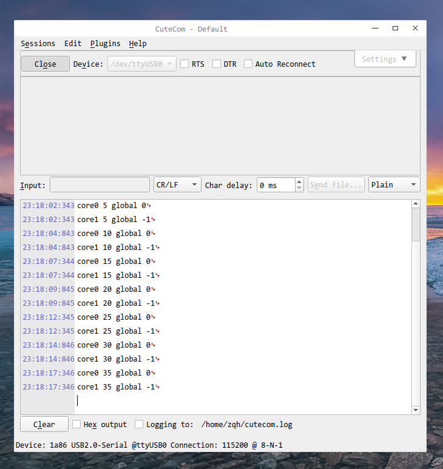

我昨天在做k210的双核测试的时候，想给大家看看两个核`printf`的时间差，以此作为对比。但是我发现只要打开`cutecom`进行串口通信，就会导致单片机**死机**，所以我寻找了方法对他进行解决。

<!--more-->

# 方法1 

我在群里面问了大佬，简单粗暴的方式就是直接吧`ch340`上面的两个跳线帽拔掉，即可解决，但是这也会导致一个问题，就是无法一键下载程序了。

# 方法2 

安装最新的`cutecom`
```sh
➜  ~ cd Downloads/
➜  Downloads git clone https://gitlab.com/cutecom/cutecom.git
➜  cutecom git:(master) ✗ mkdir build
➜  cutecom git:(master) ✗ cd build   
➜  build git:(master) ✗ sudo apt-get install libqt5serialport5-dev 
➜  build git:(master) ✗ sudo apt-get install qtbase5-dev
➜  build git:(master) ✗ cmake ..
➜  build git:(master) ✗ make
➜  build git:(master) ✗ ./cutecom
```


# 解决后

可以看到两个核几乎是同时输出：


