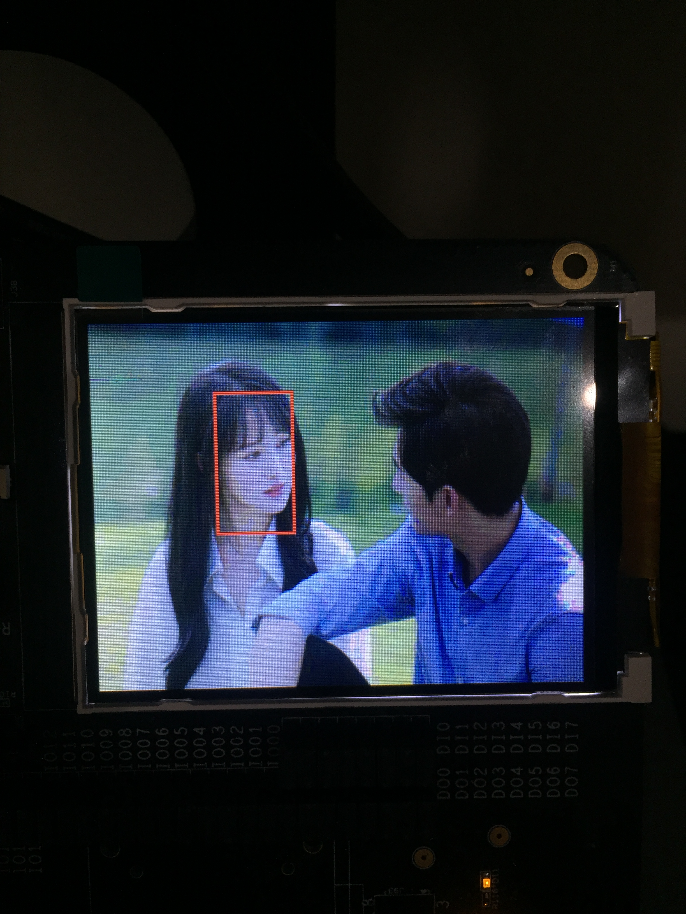

马上要开始移植模型到k210中,首先我需要知道k210中的图像数据是如何排列的.所以需要做一个测试.

<!--more-->

# 介绍

k210中的lcd所显示的`buf`为`rgb565`排列.对应`numpy`中的`hwc`顺序.

k210中送入`kpu`的`ai_buf`为`rgb888`排列,对应`numpy`中的`chw`顺序.

# 图片转c数组

因为两个`buf`的排列顺序不同,所以需要两个不同的程序:

## jpg转img_buf

这里发现要把两个`rgb`拼成一个32位的数据,图片的显示效果会更好.

```Python
def test_jpg_to_array():
    img = fddb._read_img('data/2.jpeg', True)
    img = img.astype('uint8')
    with open('tmp/img.h', 'w') as f:
        f.write('#ifndef _IMG_H_ \n\
#define _IMG_H_ \n\
#include <stdint.h> \n\
uint32_t rgb_image[38400] __attribute__((aligned(64))) = {')
        for i in range(img.shape[0]):
            for j in range(0, img.shape[1], 2):
                rR = img[i, j, 0] >> 3
                rG = img[i, j, 1] >> 2
                rB = img[i, j, 2] >> 3
                rrgb = (rR << 11) | (rG << 5) | rB
                lR = img[i, j+1, 0] >> 3
                lG = img[i, j+1, 1] >> 2
                lB = img[i, j+1, 2] >> 3
                lrgb = (lR << 11) | (lG << 5) | lB
                f.write(str(hex(rrgb << 16 | lrgb))+',')
            f.write('\n')
        f.write('};\n\
#endif')
```

## jpg转ai_buf

这里就是把`hwc`移动成`chw`数据,然后写入即可.

```Python
def test_jpeg_to_ai_array():
    img = fddb._read_img('data/2.jpeg', True)
    img = img.astype('uint8')
    img = np.rollaxis(img, 2, 0)
    with open('tmp/aiimg.h', 'w') as f:
        f.write('#ifndef _AIIMG_H_ \n\
#define _AIIMG_H_ \n\
#include <stdint.h> \n\
uint8_t ai_image[] __attribute__((aligned(64))) = {')
        for c in range(img.shape[0]):
            for i in range(img.shape[1]):
                for j in range(img.shape[2]):
                    f.write(str(hex(img[c, i, j]))+',')
                f.write('\n')
        f.write('};\n\
#endif')

```

# 修改kpu程序

## 显示图片部分
只需要修改成对应的`buf`即可

```c
    lcd_draw_picture(0, 0, 320, 240, rgb_image);
```

## kpu部分

只需要把`task.src`改成对应的`buf`即可.

```c
    /* init face detect model */
    kpu_task_gencode_output_init(&task);
    task.src= (uint64_t *)ai_image;
    task.dma_ch= 5;
    task.callback= ai_done;
    kpu_single_task_init(&task);
```


# 效果

有了这个方法,我就可以去测试我的模型输出是否正确.

