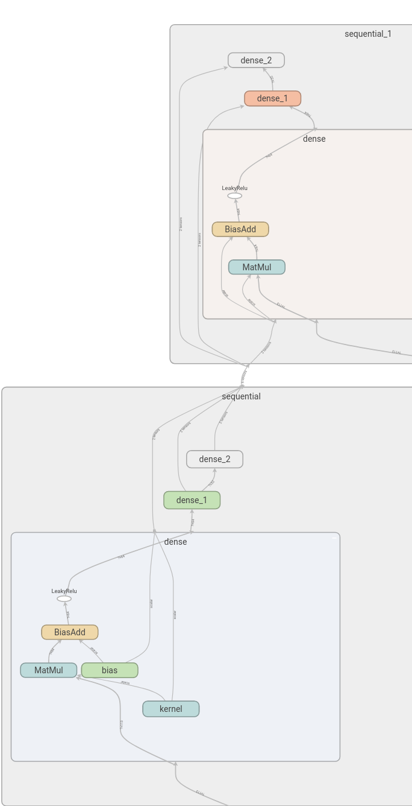

以后这篇文章就来记录`tensorflow`中遇到的问题与解决方式。

<!--more-->


#### 1. 自定义loss中的reshape问题

我想在`loss`函数中对`tensor`进行`reshape`，在`model.compile`的时候，`keras`会生成两个虚`placeholder`来进行尺寸检查，比如我的`yolo`中的`y_true`会生成为`(?, ?, ?, ?, ?)`，`y_pred`会按照`tf.dataset`来生成`(?, 7, 10, 5, 16)`。

这个时候我对标签`reshape`给的参数为`tf.TensorShape(None, 7, 10, 5, 8, 2)`，但是报错如下：

    ValueError: Tried to convert 'shape' to a tensor and failed. Error: Cannot convert a partially known TensorShape to a Tensor: (?, 7, 10, 5, 5, 2)
    
解决方式：

咋一看这个出错好像很蠢，但其实是因为在尺寸检查的时候不接受未知的尺寸`None`，所以把上面修改为：`tf.TensorShape(batch_size, 7, 10, 5, 8, 2)`即可。

#### 2. Map_fn或者While_Loop速度很慢


这个问题的确很蛋疼，我看了`github`的[issue](https://github.com/tensorflow/tensorflow/issues/24774)，这两个函数都不能有效的进行`GPU`加速，但是我又需要对一个`batch`中的每个样本对进行单独处理，这就很难受。

解决方式：

还好`tensorflow`的构建可以是静态图的方式，像我这样知道`batch size`的情况下，就可以使用在构建`graph`的时候循环构建一波。如：
```python
masks = []
for bc in range(helper.batch_size):
    vaild_xy = tf.boolean_mask(t_xy_A[bc], obj_mask[bc])
    vaild_wh = tf.boolean_mask(t_wh_A[bc], obj_mask[bc])
    iou_score = tf_iou(pred_xy[bc], pred_wh[bc], vaild_xy, vaild_wh)
    best_iou = tf.reduce_max(iou_score, axis=-1, keepdims=True)
    masks.append(tf.cast(best_iou < iou_thresh, tf.float32))
tf.parallel_stack(masks)
```

#### 3. 使用tf.keras构建模型时Tensorboard无法显示graph

之前我写`yolo`的时候，使用`Tensorboard`去查看图形时，一直显示如下

    Graph visualization failed
    Error: The graph is empty. This can happen when TensorFlow could not trace any graph. Please refer to https://github.com/tensorflow/tensorboard/issues/1961 for more information.

然后我看了`issue`，全是因为`tf2`的`eager`的原因，我这里又没有用这个模式，怎么会出这个问题呢。

解决方式：

找了半天解决方式，就是没找到，我本来想按照以前的方式做，忽然发现就可以了，在`callback`之后加一句话即可，如下：

```python
cbs.append(TensorBoard(str(log_dir), update_freq='batch', profile_batch=3))
file_writer = tf.summary.FileWriter(str(log_dir), sess.graph)  # NOTE avoid can't write graph, I don't now why..
```

#### 4. tf.keras中Model复用

这个其实不算问题，只不过我不太清楚，就做了个测试来验证一下。就是比如我们用`Sequential`构建了一个`body`部分，然后用这个`body`产生多个输出，我一开始不知道他这样使用是否是公用参数了，然后我就写了个函数测试了下：

```python
input_sim = k.Input((113))
input_measre = k.Input((113))

bodymodel = k.Sequential([
    kl.Dense(64, activation=tf.nn.leaky_relu),
    kl.Dense(32, activation=tf.nn.leaky_relu),
    kl.Dense(1),
])

out_1 = bodymodel(input_sim)
out_2 = bodymodel(input_measre)

model = k.Model([input_sim, input_measre], [out_1, out_2])
k.utils.plot_model(model, show_shapes=True, to_file='two_in.png')
fwriter = tf.summary.FileWriter('logs', graph=sess.graph)
```

结果：

这样的复用方式是共享参数的，可以看到，两个`sequential`，一个含有`kernel`，另一个没有，或者说他们公用一个`kernel`。




#### 5. Error while reading resource variable xxx from Container: localhost. This could mean that the variable was uninitialized.

我想在`tf.keras`里面使用苏神的`Lookahead`，他的代码是用于纯`keras`的，但是我现在用`tf.keras`，虽然表层使用看起来差不多，但是核心代码我发现还是很多都不一样。我的问题出现在这里:

```python
fast_params = model._collected_trainable_weights

with K.name_scope('training'):
    with K.name_scope(model.optimizer.__class__.__name__):
        training_updates = model.optimizer.get_updates(
            params=fast_params,
            loss=model.total_loss)
        slow_params = [K.variable(p) for p in fast_params]
```
使用`K.variable`转换参数的时候出错了，说我的变量没有被初始化。
```python
tensorflow.python.framework.errors_impl.FailedPreconditionError: Error while reading resource variable batch_normalization/gamma from Container: localhost. This could mean that the variable was uninitialized. Not found: Resource localhost/batch_normalization/gamma/N10tensorflow3VarE does not exist.
         [[{{node training/RAdam/Variable_274/Initializer/ReadVariableOp}}]]
```

解决方案：

`google`了一下也没看到有人有相同的问题，我抱着试试看的心态写了如下代码：

```python
sess.run([tf.global_variables_initializer(), tf.local_variables_initializer()])
train_model.compile(optimizer, loss=losses, metrics=metrics)
```

在`model.compile`之前全局初始化，然后就完事了？然后就可以用上最新的优化算法`RAdam`和`Lookahead`咯。


#### 6. tf.data对于多输入多输出模型时的操作

我现在的模型是3输入,2输出的,`tf.data`输出的应该为( (a,b,c) , (label_a,label_b) ),然后我原本代码如下:

```python
return [a_img, p_img, n_img], [1., 1.]
```
然后`dataset`对象就是这样:
```
<DatasetV1Adapter shapes: ((32, 3, 96, 96, 3), (32, 2)), types: (tf.float32, tf.float32)>
```

解决方案:

用元组即可,不然默认是一个张量对象,会把我们的结构破坏掉.
```python
return (a_img, p_img, n_img), (1., 1.)
```
然后`dataset`对象就是这样:
```
<DatasetV1Adapter shapes: (((32, 96, 96, 3), (32, 96, 96, 3), (32, 96, 96, 3)), ((32,), (32,))), types: ((tf.float32, tf.float32, tf.float32), (tf.float32, tf.float32))>
```
