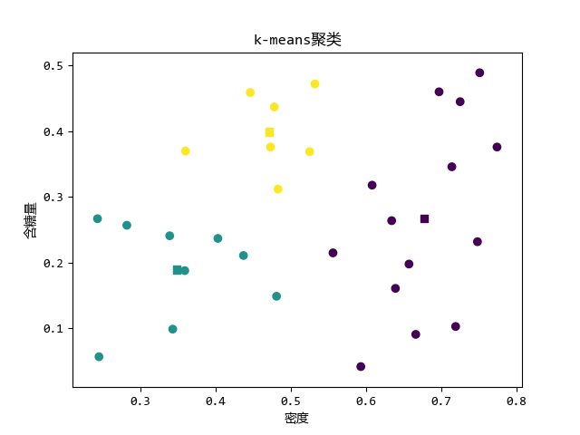

kmeans是最基础的聚类算法,我这里写一下流程就直接上我写的代码了.


<!--more-->

# 流程

1.  从`n`个数据中随机选择`k`个点作为聚类中心
2.  遍历`n`个数据,此点离哪一个聚类中心**最近**就分配到哪一类中
3.  求出每一类的均值,作为新的聚类中心
4.  重复**第2步**直到新的聚类中心与之前聚类中心之差小于阈值`e`
5.  输出

# 程序

```Python
import math
import matplotlib.pyplot as plt
import numpy as np


def createDataSet():
    """
    创建测试的数据集，里面的数值中具有连续值
    :return:
    """
    dataSet = [
        [0.697, 0.460], [0.774, 0.376], [0.634, 0.264],
        [0.608, 0.318], [0.556, 0.215],
        [0.403, 0.237], [0.481, 0.149], [0.437, 0.211],
        [0.666, 0.091], [0.243, 0.267],
        [0.245, 0.057], [0.343, 0.099], [0.639, 0.161],
        [0.657, 0.198], [0.360, 0.370],
        [0.593, 0.042], [0.719, 0.103], [0.359, 0.188],
        [0.339, 0.241], [0.282, 0.257],
        [0.748, 0.232], [0.714, 0.346], [0.483, 0.312],
        [0.478, 0.437], [0.525, 0.369],
        [0.751, 0.489], [0.532, 0.472], [0.473, 0.376],
        [0.725, 0.445], [0.446, 0.459],
    ]

    # 特征值列表

    labels = ['密度', '含糖率']

    # 特征对应的所有可能的情况
    labels_full = {}

    for i in range(len(labels)):
        labelList = [example[i] for example in dataSet]
        uniqueLabel = set(labelList)
        labels_full[labels[i]] = uniqueLabel

    return dataSet, labels, labels_full


# 计算一个点与所有聚类中心的欧式距离
def dist_eclud(sample, centers):
    # sample=[1 x n] n是特征数
    sample = np.array(sample)
    # 将sample复制k次 与 centers 矩阵维度相同
    samples = np.tile(sample, (centers.shape[0], 1))
    # 矩阵相减然后平方，对每一列求和　distances＝[1 x k]
    distances = np.power(samples - centers, 2).sum(axis=1)
    return distances


class Kmeans():
    """Kmeans聚类算法.

    Parameters:
    -----------
    k: int
        聚类的数目.
    max_iterations: int
        最大迭代次数.
    varepsilon: float
        判断是否收敛, 如果上一次的所有k个聚类中心与本次的所有k个聚类中心的差都小于varepsilon,
        则说明算法已经收敛
    """
    # 从所有样本中随机选取self.k样本作为初始的聚类中心

    def __init__(self, k=2, max_iterations=500, varepsilon=0.0001):
        self.k = k
        self.max_iterations = max_iterations
        self.varepsilon = varepsilon

    def init_rand_center(self, data)->np.ndarray:
        # 生成k行的中心点
        centroids = np.zeros((self.k, np.shape(data)[1]))
        # 从data中随机选择一个
        row = np.random.choice(np.shape(data)[0], size=self.k)
        # print('初始随机点坐标为:', row)
        for i in range(self.k):
            centroids[i] = data[row[i]]
        return centroids

    # 返回距离该样本最近的一个中心索引[0, k)
    def _closest_centroids(self, sample, centroids):
        # 计算点sample 到 几个聚类中心的距离
        distance = dist_eclud(sample, centroids)
        # 找的最小的距离下标 并返回
        closest_i = np.argmin(distance)
        return closest_i

    # 分类,将样本分类到距离他最近的中心
    def create_clusters(self, centroids, X):
        # 生成 [k x 1] 的二维list
        clusters = [[] for i in range(self.k)]
        # 获得X中的每一个元素及其下标
        for index, sample in enumerate(X):
            # 求得距离sample最近的距离中心
            centroid_i = self._closest_centroids(sample, centroids)
            # 将sample的下标放入对应的簇中
            clusters[centroid_i].append(index)
        # 返回该簇
        return clusters

    # 对中心进行更新
    def update_centroids(self, clusters, X):
        # 获得特征数
        n_features = np.shape(X)[1]
        # 新的聚类中心
        centroids = np.zeros((self.k, n_features))
        # 遍历簇
        for i, cluster in enumerate(clusters):
            # 将每一簇的元素提出,并按行求平均  x平均  y平均
            centroid = np.mean(X[cluster], axis=0)
            # 平均值就作为新的聚类中心
            centroids[i] = centroid
        return centroids

    # 将所有样本进行归类，其所在的类别的索引就是其类别标签
    def get_cluster_labels(self, clusters, X):
        y_pred = np.zeros(np.shape(X)[0])
        # 遍历簇 构造标签矩阵
        for cluster_i, cluster in enumerate(clusters):
            for sample_i in cluster:
                y_pred[sample_i] = cluster_i
        return y_pred


if __name__ == "__main__":
    # 步骤一（替换sans-serif字体）
    plt.rcParams['font.sans-serif'] = ['YaHei Consolas Hybrid']
    # 步骤二（解决坐标轴负数的负号显示问题）
    plt.rcParams['axes.unicode_minus'] = False

    dataset, labels, label_full = createDataSet()
    X = np.array(dataset)  # type:np.ndarray

    km = Kmeans(3, 100, 0.001)  # 设置参数
    center = km.init_rand_center(X)  # 随机初始聚类中心
    # 迭代到最大次数或聚类中心不变
    for _ in range(km.max_iterations):
        clusters = km.create_clusters(center, X)
        # 存放上一次中心点值
        former_centroids = center
        # 计算新的聚类中心
        center = km.update_centroids(clusters, X)
        diff = center - former_centroids
        # 如果聚类中心几乎没有变化，说明算法已经收敛，退出迭代
        if diff.any() < km.varepsilon:
            break
    y_pred = km.get_cluster_labels(clusters, X)

    C = np.c_[X, y_pred]
    # 画出聚类
    plt.scatter(C[:, 0], C[:, 1], c=C[:, 2])
    # 画出当前聚类中心
    c = [float(i) for i in range(center.shape[0])]
    plt.scatter(center[:, 0], center[:, 1], c=c, marker='s')
    plt.xlabel('密度')
    plt.ylabel('含糖量')
    plt.title('k-means聚类')
    plt.show()

```


# 运行效果

