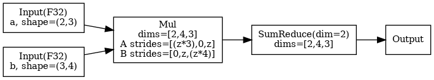

最近跑了一下 Luminal 的 `gemma-3-4b` 例子， 顺便把它的 IR 设计和搜索机制梳理了一遍。

<!--more-->


# Overview

[Luminal](https://github.com/luminal-ai/luminal) 的编译流程大致分六步：

1. **Frontend** ： 用户用 `GraphTensor` API 写算子 (`matmul`， `softmax` 之类)。 前端里 `expand_dim` / `permute` 这些只动张量挂的 `ShapeTracker` 元数据， 不会产生新 op， 所以最后 HLIR 上的 op 数比用户写的表达式节点少得多。
2. **HLIR** ： 前端操作最终凝成一张由 20 个 primop 组成的张量 DAG， 这就是 Luminal 自己的高层 IR。
3. **Partition / Group** ： 按前端插入的 `graph_break` 把整张 HLIR 切成若干 chunk， 再把结构相同的 chunk 合并成 unique group。 后面几步都以 group 为单位推进。
4. **Egglog saturation** ： 每个 group 序列化成 egglog 程序， 跑等价关系 saturation 。 4B 模型单核 CPU 大约要 30 分钟， 这是编译代价的大头。
5. **Extraction / LLIR** ： 从saturation 后的 egraph 里先抽 candidate， 然后lower 到 LLIR。
6. **Codegen / Runtime** ： 每个 LLIR 节点先 Codegen 成 CUDA kernel (或 cuBLAS 调用)， 再由 Runtime 把它们串进 CUDA Graph 跑推理。 整体更像 JIT： kernel 编译在 Codegen 阶段即时发生， buffer 分配在 Runtime 启动时完成， 不是提前全编好的 AOT。

# HLIR

HLIR 是 Luminal 的高层张量 IR，只有 20 个 primop，代表最小的原子运算。一个 Gemma 3 4B 模型的 HLIR 大概包含 5000 个 primop。

20 个 primop 分七类：

|  | Ops |
|---|---|
| I/O | `Input`, `Output`, `Constant` |
| DType / Range | `Cast`, `Iota` |
| Unary | `Exp2`, `Log2`, `Sin`, `Recip`, `Sqrt` |
| Binary | `Add`, `Mul`, `Mod`, `LessThan` |
| Reduction | `SumReduce`, `MaxReduce`, `Softmax` |
| Indexing | `Gather`, `Scatter` |
| Fallback | `CustomOpKind` |


举一个matmul的例子，对 `a: [M, K] @ b: [K, N] -> [M, N]`， HLIR 不写 `for k` 循环， 前端代码是这样：

```rust
// src/frontend/matmul.rs
let mul = self.expand_dim(1, n) * rhs.permute((1, 0)).expand_dim(0, m);
let ret = mul.sum(2);
```

带入一个具体的shape，所构造出来的 HLIR 真的只有 5 个节点：



它的设计很类似 `Jittor`，通过扩展 layout 的方式表示循环区域。观察上面的 `Mul` 和 `SumReduce` 节点：input 节点的 rank 是 2 维，但是 `Mul` 使用 `dims=[2, 4, 3]`，两个输入的 `strides` 分别是 `[(z*3), 0, z]` 和 `[0, z, (z*4)]`（其中 `z` 是 `sizeof(dtype)`）。stride 里那个 `0` 就是 `expand_dim` 制造出来的 broadcast 维度。没有单独的 Shape 操作 op，基本都由 `ShapeTracker` 来表达。

值得注意的是，`Softmax` 并没拆成 `Exp2 + SumReduce + Div`， 应该为了后面 rewrite 和 pattern match 所做的一个妥协。

## ShapeTracker

`ShapeTracker` 的工作主要是为了取代没有 `Expand` / `Reshape` / `Permute`等op的。可以直接理解成通过先记录Layout而后再处理的方式来表达这些操作。它的工作流程大致是：

1. 每个 `GraphTensor` 都挂着一个 `ShapeTracker`， 里面记当前的 `dims`， `strides`， `offset`， `mask` 这些影响访问顺序的信息。
2. `expand_dim`， `permute`， `reshape`， `slice` 这类前端函数先只改这个 `ShapeTracker`， 不会往 HLIR 图里插一个新节点。
3. 等真正创建计算 op (`Mul`， `Add`， `SumReduce`) 时， 当前 `ShapeTracker` 会被读出来， 固化进这个 op 的输入签名。

所以上面的例子中，HLIR 包含的是一个带着 `shape` / `stride` 信息的 `Mul`，不是 `Expand -> Permute -> Mul` 。

具体到几种常见操作：

- `expand_dim`： 往 `dims` 里插一维， 对应的 stride 置成 `0`， 表示广播。
- `permute`： 重排 `dims` 和 `strides`， 表示只是换了观察顺序， 没有搬数据。
- `reshape` / `slice`： 更新 `dims`， `offset`， `mask` 这些视图信息， 仍然不新建 HLIR op。

# Partition / Group

HLIR 建完整张图后， 直接对整图跑 egg 搜索代价太贵， 特别是对于Transformer这种结构高度重复的模型， 也没必要。 所以 Luminal 这一步做两件事：

1. **Partition**： 把整张 HLIR 切成若干 **chunk**， 也就是 "一整块子图， 内部一起搜索 / 编译"。 切分点由前端显式决定 (`graph_break`)， 典型放在 transformer 每层边界或 KV cache 更新处这种天然的分界。
2. **Group**： 再把结构完全一致的 chunk 合并成同一个 **group**。 每个 group 只做一次 egraph 搜索， 结果给所有 member chunk 共用。

规模参考 (Gemma 3 4B on H200)：

| 层级 | 数量 | 说明 |
|------|------|------|
| chunk | 35 | 整张图切出 35 块, 每块 ~140 个 HLIR op |
| group | 5 | 35 块按结构去重剩 5 类模板 |

把这 5 个 group 对应回模型结构，分别是：

- **1 个 decoder layer group**： 34 层 decoder layer 全部共享这一套模板， 这是去重收益的主要来源。
- **1 个 embedding group**： 处理 token lookup 这一块。
- **1 个 final norm + logits group**： 处理模型最后的输出头。
- **2 个辅助 group**： 对应 prefill / decode 入口， RoPE / mask 这类不属于主干 decoder layer 的块。

# Egglog saturation

这里采用egraph的saturation技术，对HLIR进行等价变换/优化，生成大量等价的候选实现。搜索做四件事：

**1. 单个 HLIR primop 匹配 kernel op**

每个 HLIR op (`Add`， `Mul`， `SumReduce`， `Exp2`。。。) 都有对应的 `kernel_rewrite<HLIR, Kernel>` 规则， 把它扩成 dialect 级 `KernelOp` (CUDA `KernelAdd`， Metal 对应 op 等)。 17 个 HLIR 计算 op 都有一条这样的 rewrite (`crates/luminal_cuda_lite/src/kernel/hlir.rs`)。 这一步把纯 HLIR op 变成 "可以真执行的候选"。

最小的那类 rewrite， 在代码里其实就是一个通用 helper：

```rust
pub fn kernel_rewrite<H: Default + EgglogOp, L: Default + EgglogOp>() -> Rule {
    ...
    rule(union(hlir_op.clone(), llir_op)).fact(eq(dt, dtype(hlir_op)))
}
```

它的做法很直接： 看到一个 HLIR op， 就把它和对应的 `KernelOp` union 到同一个 eclass 里。 例如 `Mul` 可以 rewrite 成 `KernelMul`， `Add` 可以 rewrite 成 `KernelAdd`。

**2. 多个 HLIR primop 对应高效库调用**

类似`Mul + SumReduce` 这个 pattern (也就是 matmul) 被单独识别， lower 到 cuBLAS / cuBLASLt 的 sgemm 变体。 规则名例： `cublas sgemm row-major x column-major`， `cublaslt batched column-major x row-major` (`crates/luminal_cuda_lite/src/host/cublas/` + `cublaslt/`)。 同一个 pattern 根据 shape / stride 可以匹配到不同的库变体。

这类高阶 pattern 的 rewrite 大致长这样：

```cpp
(rewrite
  (Op (SumReduce ...) (ICons (Op (Mul ...) ...) (INil)))
  (Op (CuBlasSGemm ...) ...)
  :name "cublas sgemm row-major × column-major")
```

**3. Batch 和 shape 展平**

然后基于Layout做一些化简， `src/egglog_utils/matmul_flattening/*.egg` (三条规则)：

- `batch_merge_a_contig.egg` / `batch_merge_b_contig.egg`：把 “batch x matmul，其中一侧 contiguous，另一侧 broadcast” 展平成 2D matmul。
- `squeeze.egg`： 把无效维度压缩。

**4. In-place 候选 + aliasing 检查**

`Scatter` 会被 rewrite 成 `ScatterNoCopy(ConsumedBuffer(dest), ...)`。这里的 `ConsumedBuffer` 并不对应具体操作， 他是一种搜索阶段的所有权标记。设计他的目的是因为，egraph中的节点可能会呈现环状依赖，并且很难收集user的个数， 所以 `ConsumedBuffer` 的作用其实就是把 usage analysis 这件事显式放进搜索空间里，如果这个 `dest` buffer 从这里开始就不再被别人读， 那我可以把它原地拿来写回去。

后面的 `cleanup` / `base_cleanup` ruleset 就是在检查这件事：

- 如果 `dest` 后面**没有**别的 reader， 就保留 `ConsumedBuffer(dest)`， 最终允许走 `ScatterNoCopy`， 也就是原地写。
- 如果 `dest` 后面**还有**别的 reader， 就把这个候选删掉， 退回普通 `Scatter`。


## Saturation

Luminal 没有把所有 rewrite rules 放一起去执行， 他分成 4 个 ruleset 做分阶段搜索，这样可以缩小每轮 rewrite 的匹配空间，降低编译代价：

- `expr`： 主 rewrite， HLIR 对应 kernel 候选， batch matmul 展平， ConsumedBuffer 注入之类全在这。
- `dtype_prop`： 侧函数 `(function dtype (IR) DType :merge new)` 沿 dataflow 传 dtype 的规则。
- `cleanup`： 如果 `dest` 被别的 op 读到， 删掉 `ConsumedBuffer`， 级联把 ScatterNoCopy 候选一起清掉。
- `base_cleanup`： 独立 ruleset 放最后， 专做 `(union ?cb ?dest)` 这种不可逆操作， 必须等前面都saturation 才安全。 代码里有 admitted TODO 承认这是脆弱点。

实际执行顺序长这样：

```lisp
(repeat 10 (saturate expr) (saturate dtype_prop) (run))
(saturate expr) (saturate cleanup) (saturate base_cleanup)
```

在我的实验中 (Gemma 3 4B on H200， 34 层 transformer)： 34 层切成 35 个 chunk， 压成 5 个结构等价的 group， 每个 group 的 egraph saturation 到 ~5076 enode / 3633 eclass， 单 CPU 核全程 30 min。

# Extraction

egglog saturation 后，Luminal 直接通过执行测时间来获得真正的cost：

1. **随机选择**。 对每个 eclass 随机选一个 enode， 然后 lower 成 LLIR， NVRTC 编译， 真跑一次测 latency (默认跑 10 次取平均)， 顺便查一下结果有没有 NaN。 编不过或者算出 NaN 就换一套重来， 最多试 100 次， 全挂就直接 panic (`src/graph.rs:653`)。
2. **变异**。 拿当前跑得最快的一套做种子 (默认只留 1 套)， 每代生成 30 个变异： 在 `有多个 enode 可选` 的 eclass 里随机挑几个换成别的选择， hash 去重避免重复测。
3. **评估**。 每个变异同样 lower + 编译 + 执行 + 测量。 跑得比种子快就顶替种子。
4. **预算**。 **每个 group** 最多评估 `options.limit` 个候选 (Gemma 3 4B 有 5 group， `GEMMA_SEARCH_GRAPHS=3` 就对应每 group 3 个 candidate， 全模型一共 5 × 3 = 15 次 NVRTC + profile)。 官方默认 500， 搜的时间会比较久。

这一步就是代替了传统的分析建模没办法准确预测的 cost model，但也只能在稳定的硬件上能这么玩，设计阶段就不行了。

# LLIR

代码里把 LLIR 定义成：

```rust
pub type LLIRGraph = StableGraph<LLIROp, ()>;
```

这里的 `StableGraph` 不用想太复杂， 就把它理解成一个“节点编号稳定的图容器”就行。 `LLIROp` 是节点内容， 边表示依赖关系。 真正 dump 出来会长成这样：

```cpp
LLIROp(DialectOp(KernelMul { out_shape: [4, s, 256], ... }))
LLIROp(DialectOp(KernelSumReduce { out_shape: [s], ... }))
LLIROp(DialectOp(CuBlasLt { m: 1024, n: s, k: 2560, ... }))
```

其中每个节点直接对应一个具体的执行单元，比如：

- CUDA kernel 源码 (之后由 NVRTC 实时编译成 GPU 可执行码)
- Metal kernel (Apple backend)
- host 上的库调用 (cuBLAS， cuBLASLt 这种现成的 sgemm)

同时还带一些给 Runtime 用的元信息： 

- 输出 buffer 多大 (符号表达式， 支持动态 shape)， 
- 读写多少 bytes， 算多少 FLOPs
- 输出是否复用某个输入 buffer (in-place 写) 等等

在 LLIR 这层， 可以理解成节点之间都是通过 **global memory** 传递数据的， 至于`shared memory`， `register` 这些更细的层级不会体现在 LLIR 的上。

## Gemma 3 4B 的 LLIR

Gemma 3 4B 编译生成的 LLIR 约 7250 个节点，其中：

```cpp
KernelMul          2043        KernelGather        205
KernelAdd           810        KernelSin            68
KernelIota          648        KernelScatter        66
KernelCast          438        KernelLessThan       63
KernelConstant      409        KernelExp2           35
KernelRecip         378        KernelExp            35
KernelSumReduce     375        KernelMaxReduce      34
KernelSqrt          205        KernelSigmoid        32
                               KernelScatterNoCopy   2
```

其中 elementwise 占绝对多数。 这里只有 2 个 `KernelScatterNoCopy`， 其实全都是 KV cache 的原地写。 这就是之前 `ConsumedBuffer` 所做的事情，在buffer没有多user地情况下， egglog 才会把普通 `Scatter` 留成 `ScatterNoCopy`。 

# Code Generation

上一节 LLIR 本身只是一段数据， GPU 没法直接执行。 Luminal 做法是：

## 模板 + 参数

每种 kernel op 自己维护一份 C++ kernel 模板， Codegen 时把节点里的 shape， stride， dtype 这些参数填进去， 生成一段具体的 CUDA 源码， 然后把这段源码交给 NVRTC 做 JIT 编译， 得到 GPU 真正能执行的 kernel。 没有 loop-level IR/schedule pass/tiling， 模板长什么样， kernel 就长什么样。

比如一个 `KernelAdd` 节点， codegen实际做的就是模板替换， 最后拼成一整段源码：

```cpp
LLIROp(DialectOp(KernelAdd {
  out_shape: [s, 4],
  a_stride: [(z*4), z],
  b_stride: [0, 0],
  out_stride: [(z*4), z],
  dtype: F32
}))
```

```cpp
extern "C" {
    __global__ void add_k(float *C, const float *A, const float *B, const int* dyn_dims) {
        long long const_z = (long long)blockIdx.x * blockDim.x + threadIdx.x;
        if (const_z >= /* n_elements */) return;
        C[/* out_idx */] = A[/* a_idx */] + B[/* b_idx */];
    }
}
```

为避免同样的 kernel 反复编译， Luminal 会按生成出来的源码做进程内缓存，当两个节点最后拼出的源码完全相同， 就直接复用已编好的 function。

2. 库调用

当然也不是所有 LLIR 节点都要生成源码。前面搜索那节提到 `Mul + SumReduce` 被 rewrite 为 `matmul`，最后对应的其实是 cuBLAS / cuBLASLt 入口的 wrapper。这类节点 Codegen 只是选一个合适的库入口，把 stride / leading dimension 填成 cuBLAS 可以支持的格式，执行时直接调 `cublasSgemm` 这种 host 函数。

## 库调用

# Runtime

因为代码在上一个阶段就已经编译好了， 给到 Runtime 的是一堆互相独立的 kernel / 库调用。 Runtime 做的事其实就两阶段：

- `load_llir`：先把每个 group 的 LLIR 装配好，设 input / output 指针，分配中间 buffer，捕获成 CUDA Graph。
- `execute`： 每步推理按 chunk 顺序 replay 对应的那张图， 取输出。

## Load 阶段

是先读取每个 group 的 LLIR，然后

**1. 分配 buffer**：

Runtime 遍历 LLIR 每个节点， 读出它计算输出大小的表达式， 得代入当前 `dyn_map` (比如 `M=1024, N=4096`) 算出实际字节数。 然后对比已有 buffer： 够大就复用， 不够就 `cudaMalloc`。

同时节点还可以带一个关于buffer 地址复用的信息。 这时 Runtime 直接把可复用的 output pointer 指向 input pointer， 不再分配。 比如前面讲过的 `KernelScatterNoCopy` (KV cache 原地写) 就是这样处理。

**2. 打包 CUDA Graph**：

每个 group 单独处理，Runtime 按 LLIR 顺序排好这个 group 里的 kernel， 调 CUDA Graph API 把整段 launch 序列捕获成一张图。 我在 Gemma 3 4B 上总共构建了 **5 张 CUDA Graph** (每个 group 一张)， 每张图内部封装 12-180 个 kernel。 执行时一次 `cuGraphLaunch` 就把一段序列发出去， 减少 launch overhead。

## Execute 阶段

到这一步只需要：

1. 给定输入数据指针。
2. 按 chunk 顺序发射每个 chunk 所属 group 的 CUDA Graph。
3. 读 output buffer 回 host (如果有必要)。

# 总结

先把我最后跑出来的数据放在一起：

| 框架 | dtype | TTFT | TPOT | TPS |
|---|---|---:|---:|---:|
| vLLM | bf16 | — | 3.71 ms | 269 |
| vLLM | fp32 | — | 5.81 ms | 172 |
| Luminal main | fp32 | 202 ms | 37.42 ms | 26.7 |
| Luminal fusion | fp32 | 250 ms | 48.13 ms | 20.8 |

再对照一下 Luminal 官方自己在 `README.md` 里的宣传：

- 性能上， 它写的是 **Q8 Llama 3 8B 在 H100 上能到 ~80% theoretical max performance**
- 技术上， 它写的是这套搜索 **可以自动导出 FlashAttention**

但至少从我这次 Gemma 3 4B fp32 在 H200 上的实测看，这两句都很难成立：

- 实际的 TPS 和 vLLM 差距还很大
- 当前代码里也没有真正把 attention 融成 FlashAttention 的路径，他的egraph saturation中并没有任何 rule 能跨过 `Softmax` Op 然后 rewrite 得到 FlashAttention。

我想评的几点是：

1. 缺少 Bufferization / Memory Hierarchy 的描述
2. 缺少 fusion / tiling / scheduling 的优化
3. 早期宣传自动生成 FlashAttention，但实际上 [输入与规则](https://github.com/luminal-ai/luminal/blob/0ccd344a69226205f1992f43f0dc3ef590bd56b2/flash_attention_demo/src/code.lisp) 都是精心设计好的。 并且之前的IR设计也和目前的大相径庭，之前带有`LoopOut, Let`等，可以表示复杂的程序但问题在于rule难写/搜索空间更大。现在他又退回到类似linalg的纯算子IR， 这就很难支持之前宣传的自动生成 FlashAttention 了。

至少截止我写这篇文章，他最新的 PR 还是 [elementwise fusion](https://github.com/luminal-ai/luminal/pull/274)。以这种程度的开发进度，显然是很难匹配他自己的宣传目标和[投资](https://techcrunch.com/2025/11/17/luminal-raises-5-3-million-to-build-a-better-gpu-code-framework/)，我怀疑挂编译器的羊头做手动优化的狗肉。
