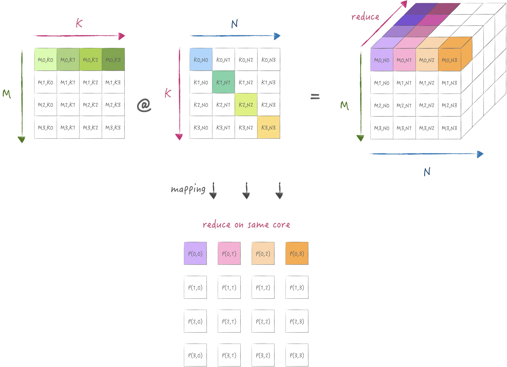

分布式内存计算机的出现主要是为了满足大规模计算任务对计算能力和内存容量的需求, 但是由于物理限制与成本考虑, 单处理器的性能提升存在极限, 而分布式内存计算机通过使用多个相对简单/成本较低的处理器组成集群, 可以在不突破物理限制的情况下, 以较低的成本实现更高的计算性能.

<!--more-->

分布式内存架构是一个多处理器计算机系统, 其中每个处理器都有自己的私有内存, 以及处理器之间某种形式的互联. 计算任务只能对本地数据进行操作, 如果需要远程数据, 则计算任务必须与一个或多个远程处理器通信. 


在分布式内存架构下, 数据可以静态分布, 也可以通过节点移动; 既可以按需移动数据, 也可以提前将数据推送到新节点. 因此他的编程模型更复杂, 实现高性能计算任务时, 除了通常数据局部性还需要考虑通信开销, 也就是需要在考虑拓扑结构的同时设计数据的存储,通信的策略等. 仅仅是矩阵乘的计算就有非常多种方式, 接下来我将逐一介绍.

# 1. 目前常用的分布式矩阵乘方法

目前大家对于大模型分布式可能比较熟悉, 因此我从大模型中的TP开始举例, 首先原始的TP是在一维拓扑上切分模型的权重, 也就是每个处理器节点存储`A[M,K], B[K,N/P]`大小的数据:


套用[oneflow](https://arxiv.org/abs/2110.15032)中sbp的表示方式, 这里的切分逻辑可以表示为:
$$
\begin{aligned}
  (broadcast) \times (split(1)) = (split(1))
\end{aligned}
$$

那么假设扩展到二维拓扑下, 我们可以自然的想到对K维度进行切分, 那么每个阶段存储`A[M,K/P], B[K/P,N/P]`大小的数据:


当然这里别忘记K维度切分后需要做Core间reduce, 使用sbp可以按如下描述
$$
\begin{aligned}
  (broadcast, split(1)) \times (split(1), split(0)) = (split(1), partialsum)\\
  (split(1), partialsum) \xrightarrow{\text{boxing}} (split(1), broadcast)
\end{aligned}
$$

同样还可以切分M和N:

$$
\begin{aligned}
  (split(0), broadcast) \times (broadcast, split(1)) = (split(0), split(1))
\end{aligned}
$$

不知道大家有没有发现, 在sbp的表示方法下, 它所指示的切分代表实际存储的数据分片, 并且计算的数据完全来自本地数据, 那么在它的表示下, 矩阵乘总是有一个维度是无法被切分的, 因为在M,K,N同时被二维拓扑切分时, 按他的逻辑所计算出的结果会不完整. 这带来的第一个问题即是每个节点的内存占用较高.

# 2. Cannon算法

## 2.1 原理

Cannon算法来自于1969年的论文[A cellular computer to implement the Kalman Filter Algorithm](https://dl.acm.org/doi/book/10.5555/905686), 它适用在均匀的2D mesh上实现分布式矩阵乘, 他的优势在于完全对三个维度进行切分, 不会增加内存占用:


它将K维度的reduce依旧放在同一个core上执行, 但是同时需要把K维度进行切分, 通过时间上的迭代逐渐`shift`需要的k到目标core上. 因此需要对矩阵A,B进行预先分布, 并且此时的切分状态就无法使用类似SBP的形式表示, 需要用映射的方式来表示:
$$
\begin{aligned}
  [j, (i+j) \% \sqrt{P}] \rightarrow [m,k] \\
  [(i+j) \% \sqrt{P}, i] \rightarrow [k,n] \\
\end{aligned}
$$

下图展示了在二维mesh的第一行处理器上所分布的数据状态:



接下来分别是`矩阵乘累加`以及`shift`, `shift`表示在x和y方向上对A,B的数据分片进行ring的传输, 下图展示的是`shift`后数据分片变化情况:


## 2.2 实现

下面是一个基于mpi4py实现的cannon算法实例:

```python
from mpi4py import MPI
import numpy as np
from viztracer import log_sparse
np.set_printoptions(suppress=True)

def matmul(c: np.ndarray, a, b):
  c += a @ b

@log_sparse(stack_depth=3)
def cannon(A: np.ndarray, B: np.ndarray, C: np.ndarray, P, comm2d: MPI.Cartcomm):
  (M, K) = A.shape
  N = B.shape[1]
  (mTile, nTile, kTile) = (M // P, N // P, K // P)

  (j, i) = comm2d.Get_coords(rank)  # topology is row major
  # align data
  k = (i + j) % P
  a = np.ascontiguousarray(A[j * mTile:(j + 1) * mTile, k * kTile:(k + 1) * kTile].copy())
  b = np.ascontiguousarray(B[k * kTile:(k + 1) * kTile, i * nTile:(i + 1) * nTile].copy())

  # compute and shift
  c = np.empty([mTile, nTile], np.float32)
  for t in range(P):
    matmul(c.view(), a, b)
    if t == P - 1: continue
    # top right is (0,0)
    right, left = comm2d.Get_cart_rank([j, (i + 1) % P]), comm2d.Get_cart_rank([j, (i - 1) % P])
    comm2d.Sendrecv_replace(a, dest=left, source=right)
    top, down = comm2d.Get_cart_rank([(j - 1) % P, i]), comm2d.Get_cart_rank([(j + 1) % P, i])
    comm2d.Sendrecv_replace(b, dest=top, source=down)

  # compare result
  ref = C[j * mTile:(j + 1) * mTile, i * nTile:(i + 1) * nTile]
  assert np.allclose(c, ref)


if __name__ == '__main__':
  A, B, C = np.load('A.npy', 'r'), np.load('B.npy', 'r'), np.load('C.npy', 'r')
  P = 3
  comm = MPI.COMM_WORLD
  rank = comm.Get_rank()
  comm2d = comm.Create_cart([P, P], [False, False])
  cannon(A, B, C, P, comm2d)
```

我这里构造了`M:11520,K:7680,N:12288`大小的矩阵, 并使用9个处理器执行:
```sh 
mpiexec -n 9 python cannon.py               
```

此代码的profiling结果如下:


## 2.3 分析

首先我们使用[此处](https://www.cs.utexas.edu/~pingali/CSE392/2011sp/lectures/Conc_Comp.pdf)所提出的alpha-beta模型分析代价:


对于Cannon算法, 假设处理器个数为$P$, 并且矩阵三个维度均为$n$, 在忽略初始分布开销的情况下, 通信代价下限为:
$$
\begin{aligned}
  Cost = 2(\sqrt{P}-1)(\alpha + \frac{n^2}{P} \beta)
\end{aligned}
$$

# 3. SUMMA算法

SUMMA算法来源于1995年的论文[Scalable Universal Matrix Multiplication Algorithm](https://dl.acm.org/doi/10.5555/899248), 他克服了cannon算法限制处理器阵列必须为方形的缺点, 提出了一种更加通用以及便于实现的算法:


## 3.1 原理

他是典型的计算的存储分离的模式, 他同样将数据进行了完全切分, 每个节点上没有重复存储, 此时可以使用类似SBP的方式来表示:
$$
\begin{aligned}
    (split(0), split(1)) \times (split(0), split(1)) = (split(0), split(1))
\end{aligned}
$$

对应的示意图如下:


计算和使用SIMD指令进行外积形式的矩阵乘一致, 在K维度迭代, 只是数据需要从存储它的节点broadcast到其他节点:


## 3.2 实现

为了简单起见, 依旧使用`M:11520,K:7680,N:12288`大小的矩阵, 并使用9个处理器执行:
```python
from mpi4py import MPI
from viztracer import log_sparse
import numpy as np
np.set_printoptions(suppress=True)

def matmul(c: np.ndarray, a, b):
  c += a @ b

@log_sparse(stack_depth=5)
def summa(A: np.ndarray, B: np.ndarray, C: np.ndarray, P, comm2d: MPI.Cartcomm):
  col_comm = comm2d.Sub([True, False])
  row_comm = comm2d.Sub([False, True])

  (M, K) = A.shape
  N = B.shape[1]
  (mTile, nTile, kTile) = (M // P, N // P, K // P)
  (j, i) = comm2d.Get_coords(rank)  # topology is row major
  # align data
  a = np.ascontiguousarray(A[j * mTile:(j + 1) * mTile, i * kTile:(i + 1) * kTile].copy())
  b = np.ascontiguousarray(B[j * kTile:(j + 1) * kTile, i * nTile:(i + 1) * nTile].copy())

  # compute and broadcast
  c = np.empty([mTile, nTile], np.float32)
  for k in range(P):
    Atemp = a if k == i else np.empty_like(a)
    Btemp = b if k == j else np.empty_like(b)
    row_comm.Bcast(Atemp, root=k)
    col_comm.Bcast(Btemp, root=k)
    matmul(c.view(), Atemp, Btemp)

  # compare result
  ref = C[j * mTile:(j + 1) * mTile, i * nTile:(i + 1) * nTile]
  assert np.allclose(c, ref)


if __name__ == '__main__':
  A, B, C = np.load('A.npy', 'r'), np.load('B.npy', 'r'), np.load('C.npy', 'r')
  P = 3
  comm = MPI.COMM_WORLD
  rank = comm.Get_rank()
  comm2d = comm.Create_cart([P, P], [False, False])
  summa(A, B, C, P, comm2d)
```

此代码的profiling结果如下:


## 3.3 分析

同样保持与之前类似的假设, 计算得通信代价下界为: 

$$
\begin{aligned}
  Cost =  2 \sqrt{P} (\alpha\log \sqrt{P} + \frac{n^2}{P}\beta)
\end{aligned}
$$

# 4. 3D SUMMA算法

3D SUMMA算法来自于论文[A three-dimensional approach to parallel matrix multiplication](
https://ieeexplore.ieee.org/document/5389455), 主要用于三维拓扑结构下进行矩阵乘计算, 他的优点是通信量比2d summa更小:


## 4.1 原理

它首先把处理器节点构造为一个立方体拓扑结构, 然后将数据尽量切分映射到不同的节点上:


使用SBP的表示方式来描述:
$$
\begin{aligned}
  &(split(1), split(1), split(0)) \times  (split(1), split(0), split(0)) = (split(1), split(1), split(0)) \\
  &A:[i,j+l] \rightarrow [m,k]\\
  &B:[l,j+i] \rightarrow [k,n]\\
  &C:[i,j+l] \rightarrow [m,n]
\end{aligned}
$$

为了尽量减少存储开销, 对于A,B都在三个维度进行了切分, 同时其中两个维度切的是同一个轴. 先通过`Allgather`将A,B收集并广播,然后计算矩阵乘得到$D_{ijl}$, 然后通过一个`Alltoall`将z轴的k换成了n的切分, 然后每个core单独执行reduce操作即可:  


## 4.2 实现

为了简单起见, 依旧使用`M:11520,K:7680,N:12288`大小的矩阵, 并使用8个处理器执行:
```python
import sys
from mpi4py import MPI
from viztracer import log_sparse
import numpy as np
np.set_printoptions(suppress=True)

@log_sparse(stack_depth=3)
def summa_3d(A: np.ndarray, B: np.ndarray, C: np.ndarray, p, comm3d: MPI.Cartcomm):
  x_comm = comm3d.Sub([False, False, True])
  y_comm = comm3d.Sub([False, True, False])
  z_comm = comm3d.Sub([True, False, False])

  (M, K) = A.shape
  N = B.shape[1]
  (MTile, NTile, KTile) = (M // p, N // p, K // p)
  (mTile, nTile, kTile) = (MTile // p, NTile // p, KTile // p)
  (l, j, i) = comm3d.Get_coords(rank)  # topology is row major
  # align data
  a = np.ascontiguousarray(A[i * MTile:(i + 1) * MTile, l * KTile:(l + 1) * KTile]
                           [:, j * kTile: (j + 1) * kTile].copy())
  b = np.ascontiguousarray(B[l * KTile:(l + 1) * KTile, j * NTile:(j + 1)
                           * NTile][:, i * nTile: (i + 1) * nTile].copy())

  # compute and passing data
  c = np.zeros([MTile, nTile], np.float32)
  Atemp = np.empty([p, MTile, kTile], np.float32)
  Btemp = np.empty([p, KTile, nTile], np.float32)
  y_comm.Allgather(a, Atemp)
  x_comm.Allgather(b, Btemp)
  Atemp = Atemp.transpose([1, 0, 2]).reshape(MTile, KTile)
  Btemp = Btemp.transpose([1, 0, 2]).reshape(KTile, NTile)
  Dl = np.dot(Atemp, Btemp)  # [MTile, NTile]
  Dr = np.empty([p, MTile, nTile], np.float32)
  # Note that mpi4py will send data sequentially. So, we want to resplit on N. We had to split it first.
  Dsend = np.ascontiguousarray(np.stack(np.split(Dl, p, axis=-1)))
  z_comm.Alltoall(Dsend, Dr)
  c += np.sum(Dr, axis=0, keepdims=False)

  # compare result
  ref = C[i * MTile:(i + 1) * MTile, j * NTile:(j + 1) * NTile][:, l * nTile:(l + 1) * nTile]
  assert np.allclose(c, ref)


if __name__ == '__main__':
  A, B, C = np.load('A.npy', 'r'), np.load('B.npy', 'r'), np.load('C.npy', 'r')
  p = 2
  comm = MPI.COMM_WORLD
  rank = comm.Get_rank()
  comm3d = comm.Create_cart([p, p, p], [False, False, False])
  summa_3d(A, B, C, p, comm3d)
```
注意由于`mpi4py`所提供一些接口限制, 中间引入了一些必要的数据重排操作来保证通信的正确性, 此代码的profiling结果如下:


## 4.3 分析

同样保持与之前类似的假设, 计算得通信代价下界为:
$$
\begin{aligned}
  Cost &= 2(\alpha\log\sqrt[3]{P} + \frac{(\sqrt[3]{P}-1)}{\sqrt[3]{P}}\frac{N^2}{P}\beta) + (\alpha\log\sqrt[3]{P} + \frac{(\sqrt[3]{P}-1)}{\sqrt[3]{P}} \frac{N^2}{P^{\frac{2}{3}}} \beta ) \\
      &= 3\alpha\log\sqrt[3]{P} + \frac{(\sqrt[3]{P}-1)}{\sqrt[3]{P}}(\frac{2N^2}{P} + \frac{N^2}{P^{\frac{2}{3}}})\beta
\end{aligned}
$$

总的来说, 3D算法可以比2D算法少传输$P^{\frac{1}{6}}$倍的数据.


# 5. 2.5D SUMMA 算法

实际上2.5D算法有两种, 一种是[基于Cannon改进版](https://link.springer.com/chapter/10.1007/978-3-642-23397-5_10), 另一种是[基于SUMMA改进版](https://ieeexplore.ieee.org/document/6114461).不过他们都是在$p \times p \times d,1 \leq  d  \leq p  $的拓扑结构下执行的一种泛化算法:


其中Cannon改进版还有存在拓扑结构为方阵的约束, 并且计算逻辑复杂:


后来作者提出SUMMA改进版, 可以推广到非方阵拓扑, 计算过程简单, 并且和上面的算法有相同的理论下限:


## 5.1 原理

支持可以变化的拓扑结构, d可以降低到1退化为2D并行, 也可以提高到p进化为3d并行. 使用SBP的表示方式来描述:
$$
\begin{aligned}
  &(broadcast, split(1), split(0)) \times (broadcast, split(1), split(0)) = (partialsum, split(1), split(0)) \\
  &A:[i,j] \rightarrow [m,k]\\
  &B:[i,j] \rightarrow [k,n]\\
  &C:[i,j,l] \rightarrow [m,n,k^*]
\end{aligned}
$$

首先在z轴为0处分布A,B矩阵, 然后broadcast到整个阵列. 接着是横向纵向重新分布a,b, 实现在z轴重新切分K, 最后矩阵乘并在z轴reduce得到结果: 


## 5.2 实现

为了简单起见, 依旧使用`M:11520,K:7680,N:12288`大小的矩阵, 并使用18个处理器执行:
```python
import math
from mpi4py import MPI
from viztracer import log_sparse
import numpy as np
np.set_printoptions(suppress=True)

@log_sparse(stack_depth=3)
def summa_2_5d(A: np.ndarray, B: np.ndarray, C: np.ndarray, p, d, comm3d: MPI.Cartcomm):
  x_comm = comm3d.Sub([False, False, True])
  y_comm = comm3d.Sub([False, True, False])
  z_comm = comm3d.Sub([True, False, False])

  (M, K) = A.shape
  N = B.shape[1]
  (MTile, NTile, KPTile, KDTile) = (M // p, N // p, K // p, K // d)
  (l, j, i) = comm3d.Get_coords(rank)  # topology is row major
  # align data
  a = np.ascontiguousarray(A[i * MTile:(i + 1) * MTile, j * KPTile:(j + 1)
                           * KPTile]) if l == 0 else np.ones([MTile, KPTile], np.float32)
  b = np.ascontiguousarray(B[i * KPTile:(i + 1) * KPTile, j * NTile:(j + 1)
                           * NTile]) if l == 0 else np.ones([KPTile, NTile], np.float32)
  c = np.zeros([MTile, NTile], dtype=float)
  # compute and passing data

  z_comm.Bcast(a, root=0)
  z_comm.Bcast(b, root=0)
  ktile = math.gcd(KPTile, KDTile)
  for k in range((l * KDTile) // ktile, ((l + 1) * KDTile) // ktile):
    aroot = ((k * ktile) // KPTile)
    Atemp = np.copy(a[:, (k * ktile) - (aroot * KPTile):
                      ((k + 1) * ktile) - (aroot * KPTile)]) if aroot == j else np.empty([MTile, ktile], np.float32)
    y_comm.Bcast(Atemp, root=aroot)

    broot = ((k * ktile) // KPTile)
    Btemp = np.copy(b[(k * ktile) - (broot * KPTile):
                      ((k + 1) * ktile) - (broot * KPTile), :]) if broot == i else np.empty([ktile, NTile], np.float32)
    x_comm.Bcast(Btemp, root=broot)
    np.add(c, np.dot(Atemp, Btemp), out=c)

  cr = np.empty([MTile, NTile], dtype=float) if l == 0 else None
  z_comm.Reduce(c, cr)

  # compare result
  if l == 0:
    ref = C[i * MTile:(i + 1) * MTile, j * NTile:(j + 1) * NTile]
    assert np.allclose(cr, ref)


if __name__ == '__main__':
  A, B, C = np.load('A.npy', 'r'), np.load('B.npy', 'r'), np.load('C.npy', 'r')
  p = 3
  d = 2
  comm = MPI.COMM_WORLD
  rank = comm.Get_rank()
  comm3d = comm.Create_cart([d, p, p], [False, False, False])
  summa_2_5d(A, B, C, p, d, comm3d)
```

实现的时候需要考虑跟多的细节, 因为他这里实际上重新对K进行了切分, 所以迭代k的时候需要按更小的块来广播, 此代码的profiling结果如下:


## 5.3 分析

假设处理器维度为$p,p,d$, 并且忽略第一次的分布的代价, 计算通信代价为:
$$
\begin{aligned}
  Cost & = 2\alpha \log p  + 2\frac{n^2}{pd} \beta +  \alpha \log d+ 2\frac{(d-1)n^2}{d}  \beta \\
\end{aligned}
$$

注意到SUMMA 2.5D实际上在d上多存储A,B矩阵.


# 6. 大模型中的2.5D与3D并行

## 6.1 [Tesseract](https://arxiv.org/pdf/2105.14500)

Tesseract实际上就是在大模型训练中被大家所熟知的2.5D并行, 他注意到了SUMMA 2.5D算法额外的内存开销问题, 提出进一步切分A矩阵:

| A                                  | B                                  | C                                  |
| ---------------------------------- | ---------------------------------- | ---------------------------------- |
|  |  |  |

并且把拓扑结构构造为$p,p,d$的形式来更有效的分配数据和计算.

可以在结果中发现2.5D在进化到3D并行时取得了最好的效果.


## 6.2 [NUS版3D并行](https://arxiv.org/pdf/2105.14450)

这篇论文有三个改进, 分别是负载均衡, 优化矩阵矩阵乘, 优化矩阵向量乘. 但他这里的提到原始的3D并行只在两个维度切分A,B矩阵这是不对的, 本文第四节严格按照3D并行原论文进行了实现, 实际上是对于A矩阵的K是在`j,l`,以及B矩阵的N在`j,i`都做了进一步的切分的.


不过NUS版对于A矩阵的进一步切分维度确实与原论文不同:
$$
\begin{align}
  A:[i+j,l] \rightarrow [M,K]\\
  B:[l, j+i] \rightarrow [K,N]
\end{align}
$$


最终取得了良好的效果, 但是他这里并没有和Tesseract来对比:


# 7. [T10: Inter-core Connected Compiler](https://arxiv.org/abs/2408.04808)

T10是针对核间互联架构IPU所提出的专用编译器, 对于不太了解的读者可以先参考[冯Jungle​的解读](https://zhuanlan.zhihu.com/p/1899480206), 本文就直接分析T10所提出的rTensor抽象的底层逻辑. 首先T10提出了在核间互联架构上有一种内存高效的计算模式:


即多个core之间切分矩阵, 计算后通过ring的方式交换子矩阵, 再计算得下一部分的结果, 这样可以在空间和时间的角度同时切分矩阵, 从而最小化内存的使用量.

## 7.1 rTensor抽象

为了在编译器中表达这样一种计算模式, 因此他提出了rTensor的抽象:

```cpp
class RotatingTensor {
  vector < size_t > shape ; 
  DataType type ;
  vector < size_t > spatial_partition_factor ;
  vector < size_t > temporal_partition_factor ; 
  vector < size_t > rotating_pace ;
};
```

rTensor中的参数解释:

$$
\begin{aligned}
  &f_s^X : \textbf{Spatial Partition Factor},\ \text{Spatially partitions a tensor X into sub-tensors.} \\
  &f_t^X : \textbf{Temporal Partition Factor},\ \text{Temporally partitions a sub-tensor of X into sub-tensor partitions.} \\
  &rp : \textbf{Rotating Pace},\ \text{Specifies how sub-tensor partitions are shifted among cores.}\\
  &F_{op}:  \textbf{ Operator Partition Factor},\ \text{Spatially partitions an entire operator into sub-operators.}
\end{aligned}
$$

下面给定一个rTensor具体实例, 通过执行示意图来理解每个参数的含义:


上图中首先通过$f_s$在空间上切分矩阵, 然后由于矩阵在计算上的数据依赖, 是无法再使用空间上的并行, 因此采用$f_t$在时间维度上切分矩阵, 最后使用$rp$选择每次传输的数据块大小. 并且看到右下角的例子中$rp$可以小于时间上的分块, 对应到实际计算中就可以用于平衡计算和通信的时间.

## 7.2 自动搜索rTensor

目前有了形式化的描述方法, 那么就可以考虑如何构造搜索域并自动化搜索最优执行方式. T10并没有采用随机添加rTensor的配置来构造搜索域, 而是通过对原始计算语义上的切分来先行构造rTensor可选的配置域. 这也就是上一小节中$F_{op}$的作用, 他根据当前op的计算定义来**对矩阵计算进行切分**:

$$
\begin{aligned}
  &C[M,N] \mathrel{+}= A[M,K] * B[K,N] \\
  \text{if } &F_{op}[m,k,n] :\\
  \text{each core: } &C[\frac{M}{m},\frac{N}{n}] \mathrel{+}= A[\frac{M}{m},\frac{K}{k}] * B[\frac{K}{k},\frac{N}{n}] \\
  &\text{total cores} = \prod_{i=0}^{2} F_{op}[i]
\end{aligned}
$$


假设$F_{op}$确定时, 就可以确定总core数, 以及每个core上的子任务所依赖的数据量:
$$
\begin{aligned}
  &  C[2,3] \mathrel{+}= A[2,6] * B[6,3] \\
  &F_{op} = [2,1,3] :\\
  \text{each core: } & C[1,1] \mathrel{+}= A[1,6] * B[6,1] \\
  &\text{total cores} = 6
\end{aligned}
$$

通过子任务的数据量, 就可以**推导出三个矩阵的空间切分参数**:
$$
\begin{aligned}
\begin{matrix}
   & \textbf{m} & \textbf{k} & \textbf{n} \\
  F_{op} & 2 & 1 & 3 \\
  f_s^A & 2 & 1 & \\
  f_s^B &  & 1 & 3 \\
  f_s^C & 2 &  & 3
\end{matrix}
\end{aligned}
$$

观察上表可以发现A,B,C矩阵都有一个维度不参与他们的空间切分, 但实际上为了计算出最终结果, 这个不参与空间切分的维度是被当前矩阵完全依赖的, T10称这个维度为`missing axis`, 因此采用时间切分来分割`missing axis`. 比如当前一共6个core, B矩阵在空间上被切分了3组, 那么还剩下$P = \frac{6}{3} = 2$组可以用于切分, 因此按这个逻辑**推导时间切分**:

$$
\begin{aligned}
\begin{matrix}
   & \textbf{m} & \textbf{k} & \textbf{n} \\
  F_{op} & 2 & 1 & 3 \\
  f_s^A & 2 & 1 & \\
  f_t^A & \color{blue}1 & \color{red}3 & \\
  f_s^B &  & 1 & 3 \\
  f_t^B & & \color{red}2 & \color{blue}1 \\
  f_s^C & 2 &  & 3 \\
  f_t^C & \color{blue}1 & & \color{blue}1 \\
\end{matrix}
\end{aligned}
$$

注意, T10限制了$\frac{P}{\prod f_t}$必须是整数, 因为它其实就是ring的圈数, 如果非整数就无法支持. 当$\frac{P}{\prod f_t}$大于1时, 则表明ring的圈不止一个, 那么为了保证每个圈都可以得到正确的数据, 就需要把子张量复制$\frac{P}{\prod f_t}$次.

最后进行**旋转参数对齐**, 按照上面的切分, 可以发现A的K维度在分为3组, 而B的K维度被分为2组, 那么每个节点上所拥有的K分块大小并不一样, 这个时候只能按小的K分块进行计算和旋转:

$$
\begin{aligned}
  rp^A &= [0,k^A]\\
  rp^B &= [k^B,0] \\
  k^A , k^B &\in [1,\min(2,3)]
\end{aligned}
$$

整体的流程如图所示:


## 7.3 算子内与算子间trade-off

对于每个算子,都存在大量涉及不同空间和时间以及旋转因子确定的执行计划. 此外一个端到端的模型由众多算子组成, 这就产生了一个巨大的组合优化空间. T10采用的是两级权衡, 首先对每个算子搜索执行时间和内存消耗的最优平衡, 再在不同算子间最优计划之上优化全局内存分配, 这里就不进一步展开了.

## 7.4 子张量放置

优化内存分配之后, 还需要考虑数据放置问题, 因为ring shift只能在相邻节点之间传输数据, 如果初始数据放置的位置不合理, 会导致计算错误, 这在Cannon算法中称为`align data`过程. 而T10可以从编译器的角度, 看到上下算子的执行计算, 这给他们提供了全局张量放置优化机会. 比如一个算子的计算依赖于另一个算子的输出, T10会将这些相关的子张量放置在合适的核上, 减少数据准备过程的开销. 并且T10还总是按照阵列轴的方向升序排列数据, 避免出现乱序带来的错误.

在这个3x3阵列上, T10所放置的子张量如图所示:


可以回到第一节查看Cannon算法的初始放置, 两者是一模一样的. 

## 7.5 分析

因此T10的本质是形式化与泛化了Cannon算法, 并将其用于核间互联架构. 那么他的问题也与Cannon一样, 即通信量会比SUMMA 3D等方法大, 比SUMMA 2D方法少$\frac{1}{\sqrt{P}}$.

$$
\begin{aligned}
  Cost = 2(\sqrt{P}-1)(\alpha + \frac{n^2}{P} \beta)
\end{aligned}
$$


# 8. [Parallel Matrix Multiplication: A Systematic Journey](https://epubs.siam.org/doi/10.1137/140993478) 

这篇文章是blis作者Flame等人所写, 他通过系统性分析, 提出一种形式化的描述推导出SUMMA 2D/3D矩阵乘, 并分析不同的尺寸的矩阵下如何选择不同的数据广播策略.

首先他通过一种类似$x[(0,1),()]$来表示数据在节点上的切分状态, 这里表示的是x的M在阵列的行列均切分, N没有切分, 然后基于mpi的通信原语对切分状态进行转换:


而后基于切分状态描述不同的算法, 并且根据不同的输入尺寸设计不同的计算方法, 下图左侧是Stationary C算法, 右侧是Stationary A算法:


Stationary C 算法, 在$m=n$, 且方阵的情况对于任意的k值都有较好的弱可扩展性. Stationary A 算法, 虽然其通信开销相对较大, 但在$m$和$k$较大而$n$较小时, 该算法能够实现较好的并行性, 因为在这种情况下通信量减少. 

最终, 总结在二维阵列上计算矩阵乘的通信量下限为$\Omega(\frac{n^2}{\sqrt{P}}$, 在二维阵列上计算矩阵乘的通信量下限为$\Omega(\frac{n^2}{\sqrt[3]{P^2}})$, 但是具体的场景还需要根据矩阵乘的尺寸带来的不同的通信量, 来选择不同的计算方法.

# 9. 总结

1. 传统分布式矩阵乘的论文所计算的通信量通常假设矩阵大小相同, 但实际上需要分析当前场景下不同尺寸的通信开销.
2. T10是一个好的例子, 但是他的计算模式还在固定在Cannon算法, 如何推广到SUMMA?
3. 如何推广更高维度阵列下的矩阵乘切分和映射?
4. 如何对于一个支持RMA(Remote Memory Access)的架构, 是直接读取远端数据还是通过broadcast的方式把计算模式回落到SUMMA或Cannon?
   1. 理论上RMA所需要读取的数据量与SUMMA是一致的, 但实现性能可能需要进一步测试.
