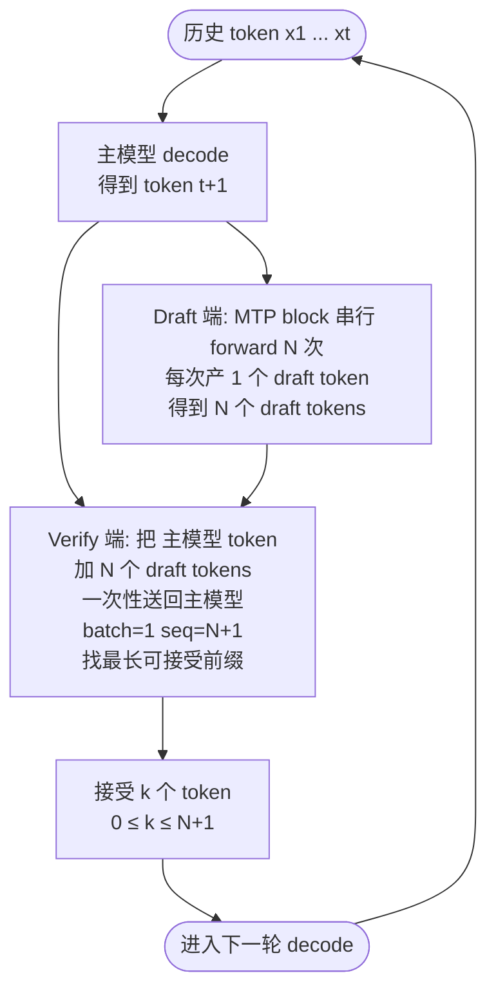
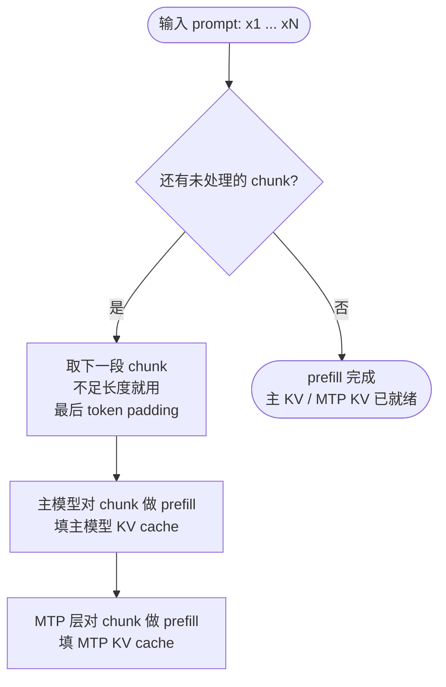
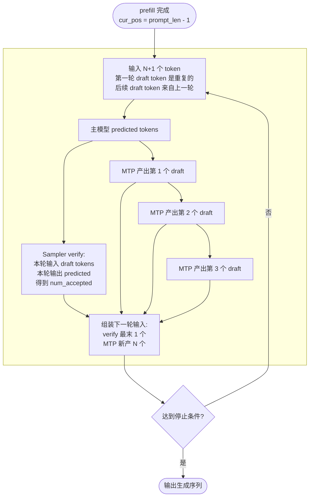

把 MTP（Multi-Token Prediction）推测解码的大致实现逻辑过一遍，主要覆盖整体思路与工作流程，以及一些遇到的坑。

<!--more-->

# 原理

由于传统的单 token 预测解码在每一步都要等模型前向完成才能知道下一个 token 是什么，这导致了推理的串行瓶颈。MTP-style speculative decoding 的核心思想是**先大胆地预测多步 token，然后再一次性验证这些预测是否正确**，从而减少每一步的等待时间。那么整个事情现在分两个部分：

1. 如何「大胆地预测多步 token」，因为原来的预测是需要进行一次完整的前向过程的，如果还是这样预测，那么肯定没有加速效果，需要有一个更轻量级的预测过程，这就是 MTP 中的 draft 端。

2. 如何「一次性验证这些预测是否正确」，这就是 MTP 中的 verify 端。

在实现方案上对于上面两部分是这样做：

1. 采取少量的、和原模型相同结构的 decode layer 作为一个新的 MTP model，它带有自己的 KV cache 以及 Head Sampling。MTP model **连续串行** forward `N` 次，每次产 1 个 draft token，把对应的 K/V 追加到 MTP 自己那一份 KV cache 里。

2. 输入 `token + N 个 draft token` 一段共 `N+1` 个 token 到 target model 做**一次** prefill-style 前向（`batch=1, seq=N+1`），逐位置 verify，找出「最长可接受前缀」，然后将 target model / MTP model 的 KV cache 相关状态都**回退到「已接受前缀」的位置**，避免影响下一轮 decode。

下图展示他的核心思想：**主模型给出 1 个 token，draft 端串行展开 N 个候选，target 端一次性 verify，按接受前缀进入下一轮**：

在上图中，verify 端的输入至少有主模型的 1 个 token，最多有 `N+1` 个 token（draft 端的 N 个），因此 MTP 的加速比取决于对于 draft token 的接受率（accept rate）。并且由于第一个 token 一定是主模型的输出，所以最坏状态下，模型输出的正确性不会被破坏，只是会有反加速效果（多执行了 MTP 层）。

# 工程实现

工程上 prefill 和 decode 两个阶段的数据流并不对称。

## Prefill 阶段

prefill 阶段需要让 MTP 层把它自己的 KV 填上，否则进入 decode 第一步时 MTP KV 是空的，draft 出来全是噪声，加速效果归零。prompt 被切成多个 chunk，每个 chunk 都同时过主模型和 MTP 层，**两边各自把自己那段 KV 填上**。这一阶段 verifier 不参与（没有上一轮 draft 可以对照）。

## Decode 阶段

进入 decode 后，**每一轮的输入永远是 `N+1` 个 token**，并且注意一个细节：

- **第一轮**：之前还位于 prefill 阶段，MTP 层还未产生 draft tokens，因此用 `prompt 最后一个 token` 重复 `N+1` 次作为输入（相当于 padding）；
- **后续每一轮**：输入 = `上一轮主模型预测的下一个 token` + `上一轮 MTP 串行预测的 N 个 draft token`。

加上我们的 `N = 3`，那么工作数据流图如下所示：

可以看到 decode 阶段并没有分化出两个分支，输入都是「主模型预测 + MTP 预测」，这一次 decode 的 sampler 所 verify 的是上一轮「MTP 预测」的 draft tokens。

# 实现细节

- **MTP 的权重**。不同的模型有区别，比如 DSv3.2 `MTP = 3` 对应 3 套独立权重；而 Qwen3.5 只有 1 套，要做多次 draft 预测就得复用同一份权重多次。
- **MTP 的 KV cache**：DSv3.2 的 3 个 MTP layer 是复用 KV cache 的。
- **MTP 的 Sampler**：MTP 层的采样策略和主模型并不一定一致，至少在 DSv3.2 和 Qwen3.5 里面 sglang 的实现中，他的采样策略是固定 `Top 1` 的。
