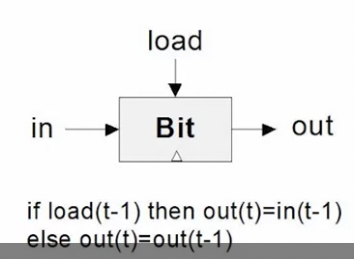
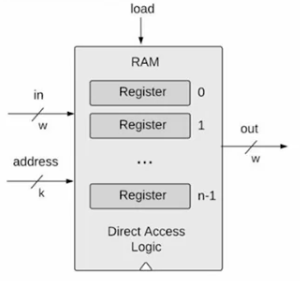

第三周，目标是构建`main memory unit`，也就是`ram`。而内存逻辑需要基于时钟循序，所以与之前的逻辑门电路不同。

<!--more-->

# Sequential Logic

1.  使用相同的硬件做同样的事情

2.  需要记录历史状态

利用一个波形去记录时间是非常直观的想法。


所以序列函数的输入是上个时间步的结果
$$
\begin{aligned}
  out[t]=function(in[t-1])
\end{aligned}
$$

# Flip Flop

我们需要一个硬件去记录上一个时间步的状态。这个硬件被称为D Flip Flop,DFF的公式为`out[t]=in[t-1]`，他仅仅就是单纯的保留状态，然后需要利用DFF来构建出一个1bit的寄存器:



Bit的逻辑也比较简单，通过上一时刻的`load`与`in`的状态来决定当前时刻的输出：
```cpp
if (load(t-1)){
    out = in(t-1);
}else{
    out = out(t-1);
}
```
不过这门课程是没有教如何从`NAND`去构建`D Flip Flop`门。

# Memory Units

这一课主要介绍的RAM的实现。

首先将1bit寄存器进行泛化可以得到多位的寄存器，可以把多个bit看作一个word，此课程主要讨论16bit的cpu构建。


1.  寄存器的读取

读取就直接检查当前时间节点的输出。

2.  寄存器的写入

```vhdl
set in = v;
set load = 1;
```
接下来寄存器内部就存储了v，然后下一个周期的输出即为v。


3.  RAM的读取

RAM就是由一系列的寄存器构成的，通过一个address去索引对应位置的寄存器，然后进行寄存器读写操作。



# Counters

Counters就是一种硬件，他支持重置为0，自增以及随机设置值。实际中我们把他当作PC来使用，用于读取代码并执行。

# Project


```vhdl
// This file is part of www.nand2tetris.org
// and the book "The Elements of Computing Systems"
// by Nisan and Schocken, MIT Press.
// File name: projects/03/a/Bit.hdl

/**
 * 1-bit register:
 * If load[t] == 1 then out[t+1] = in[t]
 *                 else out does not change (out[t+1] = out[t])
 */

CHIP Bit {
    IN in, load;
    OUT out;

    PARTS:
    // Put your code here:
    Mux(a=gayout,b=in,sel=load,out=a);
    DFF(in=a,out=out,out=gayout);
}
// This file is part of www.nand2tetris.org
// and the book "The Elements of Computing Systems"
// by Nisan and Schocken, MIT Press.
// File name: projects/03/a/PC.hdl

/**
 * A 16-bit counter with load and reset control bits.
 * if      (reset[t] == 1) out[t+1] = 0
 * else if (load[t] == 1)  out[t+1] = in[t]
 * else if (inc[t] == 1)   out[t+1] = out[t] + 1  (integer addition)
 * else                    out[t+1] = out[t]
 */

CHIP PC {
    IN in[16],load,inc,reset;
    OUT out[16];

    PARTS:
    // Put your code here:
    Inc16(in=gayout, out=add);
    Mux16(a=gayout, b=add, sel=inc, out=incout);
    Mux16(a=incout, b=in, sel=load, out=loadout);
    Mux16(a=loadout, b=false, sel=reset, out=resetout);
    Register(in=resetout, load=true, out=out, out=gayout);
}
// This file is part of www.nand2tetris.org
// and the book "The Elements of Computing Systems"
// by Nisan and Schocken, MIT Press.
// File name: projects/03/a/RAM64.hdl

/**
 * Memory of 64 registers, each 16 bit-wide. Out holds the value
 * stored at the memory location specified by address. If load==1, then 
 * the in value is loaded into the memory location specified by address 
 * (the loaded value will be emitted to out from the next time step onward).
 */

CHIP RAM64 {
    IN in[16], load, address[6];
    OUT out[16];

    PARTS:
    // Put your code here:
    DMux8Way(in=load, sel=address[3..5], a=load0, b=load1, c=load2, d=load3, e=load4, f=load5, g=load6, h=load7);
    RAM8(in=in, load=load0, address=address[0..2], out=out0);
    RAM8(in=in, load=load1, address=address[0..2], out=out1);
    RAM8(in=in, load=load2, address=address[0..2], out=out2);
    RAM8(in=in, load=load3, address=address[0..2], out=out3);
    RAM8(in=in, load=load4, address=address[0..2], out=out4);
    RAM8(in=in, load=load5, address=address[0..2], out=out5);
    RAM8(in=in, load=load6, address=address[0..2], out=out6);
    RAM8(in=in, load=load7, address=address[0..2], out=out7);
    Mux8Way16(a=out0, b=out1, c=out2, d=out3, e=out4, f=out5, g=out6, h=out7, sel=address[3..5], out=out);
    
}

// This file is part of www.nand2tetris.org
// and the book "The Elements of Computing Systems"
// by Nisan and Schocken, MIT Press.
// File name: projects/03/a/RAM8.hdl

/**
 * Memory of 8 registers, each 16 bit-wide. Out holds the value
 * stored at the memory location specified by address. If load==1, then 
 * the in value is loaded into the memory location specified by address 
 * (the loaded value will be emitted to out from the next time step onward).
 */

CHIP RAM8 {
    IN in[16], load, address[3];
    OUT out[16];

    PARTS:
    // Put your code here:
    DMux8Way(in=load, sel=address, a=load0, b=load1, c=load2, d=load3, e=load4, f=load5, g=load6, h=load7);
    Register(in=in, load=load0, out=out0);
    Register(in=in, load=load1, out=out1);
    Register(in=in, load=load2, out=out2);
    Register(in=in, load=load3, out=out3);
    Register(in=in, load=load4, out=out4);
    Register(in=in, load=load5, out=out5);
    Register(in=in, load=load6, out=out6);
    Register(in=in, load=load7, out=out7);
    Mux8Way16(a=out0, b=out1, c=out2, d=out3, e=out4, f=out5, g=out6, h=out7, sel=address, out=out);
}

// This file is part of www.nand2tetris.org
// and the book "The Elements of Computing Systems"
// by Nisan and Schocken, MIT Press.
// File name: projects/03/a/Register.hdl

/**
 * 16-bit register:
 * If load[t] == 1 then out[t+1] = in[t]
 * else out does not change
 */

CHIP Register {
    IN in[16], load;
    OUT out[16];

    PARTS:
    // Put your code here:
    Bit(in=in[0], load=load, out=out[0]);
    Bit(in=in[1], load=load, out=out[1]);
    Bit(in=in[2], load=load, out=out[2]);
    Bit(in=in[3], load=load, out=out[3]);
    Bit(in=in[4], load=load, out=out[4]);
    Bit(in=in[5], load=load, out=out[5]);
    Bit(in=in[6], load=load, out=out[6]);
    Bit(in=in[7], load=load, out=out[7]);
    Bit(in=in[8], load=load, out=out[8]);
    Bit(in=in[9], load=load, out=out[9]);
    Bit(in=in[10], load=load, out=out[10]);
    Bit(in=in[11], load=load, out=out[11]);
    Bit(in=in[12], load=load, out=out[12]);
    Bit(in=in[13], load=load, out=out[13]);
    Bit(in=in[14], load=load, out=out[14]);
    Bit(in=in[15], load=load, out=out[15]);
}
```


