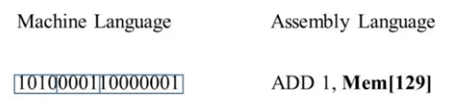
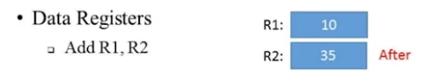

上周我不知道自己在做什么，好像很忙，但是啥东西都没做出来，太难受了。这周得改改自己的生活节奏了。这周的课程是Machine Language，应该是要讲如何设计ISA了。

<!--more-->

# Overview

汇编是最能贴近的Machine Language的描述方式，同时还具备一定的可读性，如下图，这里的机器指令的汇编化表述方法就如下：


# Machine Languages: Elements

## 他是特定的软硬件接口

1.  他定义了硬件支持怎样的操作（数学操作、逻辑操作、控制流）
2.  定义操作执行的对象


## 内存层次化

1.  访问内存地址开销是昂贵的
    1.  需要支持长地址，那么位数需要大
    2.  从内存中取数需要时间

这也就是为什么要设计多个cache，越接近cpu的内存块越小，速度越快。

其中最靠近cpu内存块就是registers，其主要存储一些cpu操作时的参数，比如做加法时，所操作的数据就存放在寄存器中：


# Hack Cpu architecture

```
 -----                    -----------------                 ------------------
|     |                  | [A register]    | = data out => |                  |
| rom | = instruction => |    cpu          |               | ram              |
|     |                  | [D register]    | <= data in =  | [M register]     |
 -----                    -----------------                 ------------------
```

rom中存储了代码指令，cpu加载指令然后对ram中的数据进行读取、计算、写入等操作。
Hack cpu中设置了两种指令集，A-instruction和C-instruction。设置了三种寄存器A,D,M.
A 与 D中存储了16bit的值，而M寄存器中存储的是A作为地址时对应的寄存器（即把A作为指针，M=*A）

1.  A instruction

  语法： `@value`
  含义： 将A寄存器设置为`value`，同时意味着M寄存器指向了`RAM[A]`

2.  C instruction

  语法：`dest= comp; jump`
  含义：将comp的值设置到dest中，如果满足跳转的操作，那么跳转到`ROM[A]`开始继续执行。
  comp的命令可以是任何有意义的运算操作，dest可以是三种寄存器中任意一个，jump也可以是任意一种跳转方式。
  
# input / output

在底层的操作中，所有的命令或者交互方式都是通过bit流的方式操作的，但是每次传输数据的开销是很大的，hack computer的设计就是把ram中的一块作为screen memory map。


```
 -----                    -----------------                 ------------------
|     |                  | [A register]    | = data out => |                  |
| rom | = instruction => |    cpu          |               | ram              |
|     |                  | [D register]    | <= data in =  | [M register]     |
 -----                    -----------------                |                  | 
                                                           |------------------|
                                                           | screen memory map| 
                                                            ------------------
```

通过直接向对应内存写入即可有效的操作屏幕。

输入呢也类似，直接映射一块内存区域去读取当前键盘的keycode即可。

# hack programing, part 1

我们有以下三个寄存器：
```
D: data 寄存器
A: address 寄存器
M: 当前选中内存寄存器 M=RAM[A]
```
相当于我们有一个指针(A),一个临时变量(D),一个快速取数据操作(M=*A). 有了这三板斧,我们就进行一些计算啦, 举个🌰:
```c
// D = 10
@10 
D=A

// D++
D=D+1

// D=RAM[17]
@17
D=M

// RAM[17]=0
@17
M=0

// RAM[17] = 10
@10
D=A
@17
M=D

// RAM[5] = RAM[3]
@3
D=M
@5
M=D
```

我们的`asm`代码会被加载到`rom`区被执行.因此对于简单的代码,也需要在后面加上无限循环,避免执行了未知的指令.
最后还介绍了为了便于编程,`hack assembly`提供了内置的符号:
```
symbol  value
R0      0
R1      1
  ....
R15     15

SCREEN  16384
KBD     24576

SP      0
LCL     1
ARG     2
THIS    3
THAT    4
```
这样在代码中应该编写`@R15`用于表示虚拟寄存器. `SCREEN`等用于寻址外部`IO`.