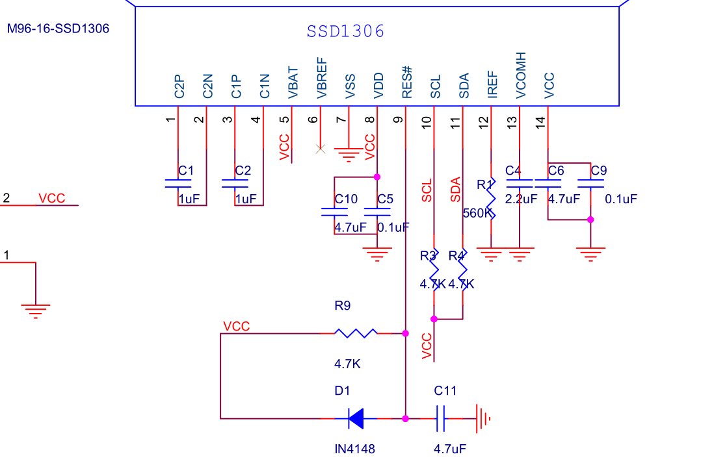
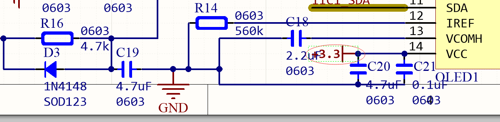

这几天画的板子，画的是0.91寸的oled裸屏。但是我写好了驱动程序，对ssd1306写入是没有问题的，但是我的屏幕亮不起来。

<!--more-->

# 发现问题

我对比了中景园电子的原理图，我感觉我自己很难受。
看下面的图：

我的原理图：

# 解决问题

我看了这个屏幕的datasheet发现。这个屏幕的vcc引脚是使能作用，不接或者接地是使能，接高不使能。
所以我把将我的3.3v线割掉了，就成功解决了问题。