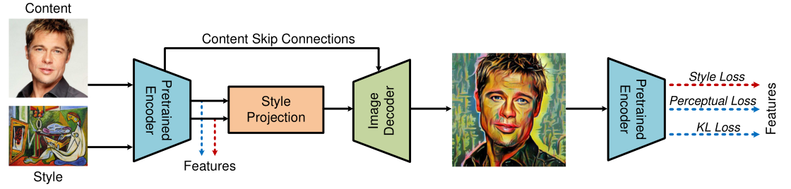
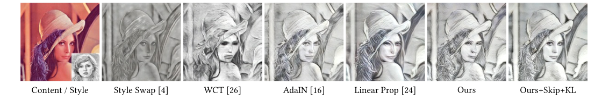

这是一篇来自百度的风格迁移论文，提出了一种无参数的风格特征投影方法对原始图像进行风格迁移。下面来读读吧：

<!--more-->

# 方法

虽然说此文章提出的无参数的风格迁移方法，但是还是需要深度学习模型的..具体可以看下面的模型结构图。他利用一个预训练的`VGG19`作为`Encoder`去提取原始图像的`content feature`和参考图像的`style feature`，然后利用了`Style Projection`将`style feature`和`content feature`巧妙的合成最终利用训练的`Decoder`生成新图像，并且添加了`KL散度`损失提升鲁棒性，最终达到了一定的效果。不过这个效果吧，风格迁移这块都没有什么实际的指标，只能说观感上挺好，我觉得他的方法能很好的保留原始`content`信息。

## Style Projection Algorithm

其实这个方法就是将`style feature`对`content feature`做一个投影，所以起这个名字。首先我们提取到源图像的`content feature`为$C\cdot H\cdot W$，参考图像的`style feature`也为$C\cdot H\cdot W$，然后分别`Flatten`为$C \cdot V,V=H*W$，得到了`content vector`，`style vector`。然后根据数值大小对刚刚两个向量进行升序排列，得到了`content sorting index`和`style sorting index`。接下来最重要的`Style Projection`操作，用`content sorting index`把`style vector`重新索引一下得到$z$就完事了。

作者还提了一下`Style Projection`和传统的`Gram`的区别，说`Gram`是用于测量纹理的表征，并且通过实验发现`Style feature`的重组并不影响`Gram`，也就是说`Style Projection`更好，并且因为是`style feature`按`content feature`重组所以内空不会被丢失(当然我觉得内容不丢失主要还是他的模型直接将`content`跳跃连接到了`decoder`)。下面还做了一下几种方法的区别，意思就是不加入原图信息，投影后的`style feature`也能体现原图的结构：

## The Learning of Style Transfer Model

这个方法的`Decoder`还是得训练的，流程如下面模型结构图所示，损失主要分为三部分：

1. style loss

将参考风格图像$s$和风格化图像$\hat{c}$，输入值预训练的`Encoder`中，提取每一层的输出并统计均值和方差，均值和方差的一致性即为`style loss`

$$
\begin{aligned}
\mathcal{L}_{s}=& \sum_{i=1}^{N}\left\|\mu\left(E_{i}(s)\right)-\mu\left(E_{i}(\hat{c})\right)\right\|_{2} \\
&+\sum_{i=1}^{N}\left\|\sigma\left(E_{i}(s)\right)-\sigma\left(E_{i}(\hat{c})\right)\right\|_{2}
\end{aligned}
$$

其中$\mu,\sigma$分别是均值和方差。

2. content perceptual loss

为了保存更加完备的原图细节，利用风格化图像的和原图的像素插值作为内容损失。

$$
\begin{aligned}
\mathcal{L}_{p}=\|E(c)-E(\hat{c})\|_{2}
\end{aligned}
$$

3. KL loss

作者认为之前NSF的不自然生成结果可能是缺乏语义信息，所以来点分布匹配。不过我觉得这种损失就是加了一般是有用的，但是很难解释这个到底是不是语义信息。

$$
\begin{aligned}
\mathcal{L}_{K L}=\mathcal{K} \mathcal{L}[E(c) \| E(\hat{c})]
\end{aligned}
$$

总损失即为求和：

$$
\begin{aligned}
\mathcal{L}=\mathcal{L}_{p}+\lambda \mathcal{L}_{s}+\kappa \mathcal{L}_{K L}
\end{aligned}
$$

# 实验结果

他这里有个`Skip`前面没有提到，我看了两遍论文也没有看到哪里讲具体怎么操作的，不过他的`Skip`就是指`Content Skip Connection`，我猜可能是编码器每一层阶段的输出都输入到解码器中融合一下，和`Unet`差不多，最终可以很好的保存内容信息同时做到风格化。（话说有没有人用动画图像真实化来做景物动漫化？感觉反着做可能会得到看起来更受欢迎的结果）

同时作者还提出了一个控制风格化程度的方法，即特征投影的结果和原图输出`content feature`加权相加一下：

$$
\begin{aligned}
z_{\alpha}=\alpha z+(1-\alpha) x
\end{aligned}
$$

效果如下：

