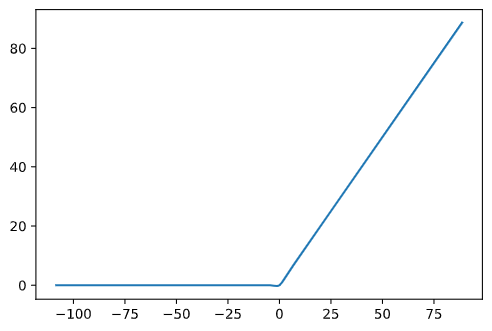

分段线性拟合算法,即将一段y关于x的函数进行分段,每个区间用一个更加简单的函数进行拟合.

<!--more-->

分段线性拟合在npu中是很常见的,主要是因为近年来设计的各种激活函数都是各种函数的组合形式,或者说大多类似relu的派生,这些激活函数的在数值是很容易被分段拆分为多个小段的,然后利用硬件加速对多个段进行执行,下面就是一个真实的模型在量化时输出的范围:



可以看到他特别类似`Swish`激活,虽然网络中没有使用这个激活方式,但是量化后还是统计出这样的激活,可能也表明了`Swish`激活是有一定道理的.

代码:

```python
# 先删除nan的数据
arr = np.array([a for a in arr if not np.isnan(a[1])])

# 1 首先分n-1个段,构造出 kx+b 的标准形式
x = np.concatenate([arr[:-1, 0:1], arr[1:, 0:1]], 1)
k = (arr[1:, 1:2] - arr[:-1, 1:2]) / (arr[1:, 0:1] - arr[:-1, 0:1])
b = arr[:-1, 1:2]


while len(x) != 15:
    # 找到当前最小的差值位置
    i = np.argmin(np.abs(k[:-1] - k[1:]))
    # 合并他和下一项
    y0 = x[i, 0] * k[i] + b[i]
    y1 = x[i + 1, 1] * k[i + 1] + b[i + 1]
    k[i] = (y1 - y0) / (x[i + 1, 1] - x[i, 0])
    x[i, 1] = x[i + 1, 1]
    x = np.delete(x, i + 1, axis=0)
    k = np.delete(k, i + 1)
    b = np.delete(b, i + 1)

```