关于[Polyhedral Tutorials](http://playground.pollylabs.org)的一个中文翻译归档,其中所有章节原文位于我的[仓库](https://github.com/zhen8838/isl_learn)中.

<!--more-->


```python
import islpy as isl
import islplot
from islplot.plotter import plot_set_points
```

# (Quasi) Affine Expressions 


Quasi-affine表达式, 即通过常量、变量以及对应基础操作构成的表达式.

**Base** 
- Constants ($(c_i)$) 
- Parameters ($(p_i)$) 
- Variables ($(v_i)$) 

**Operations** 
- Unary negation $( (-e) )$ 
- Addition $( ( e\_0 + e\_1 ) )$ 
- Multiplication by a constant $( (c * e) )$ 
- Constant division $( (e / c) )$ 
- Constant remainder $( (e \mod c) )$ 

### Examples 

#### Valid Expressions 

- 42 
- n, m 
- i, j 
- -i, 3 * i + 4 
- i / 2, i % 3 ****

#### Invalid Expressions 

- i * n, n * m 
- 5 / n, i % j 


# Presburger Formula 


Presburger 公式就是affine表达式进行二元关系组合:

**Base** 
- Boolean constants (&#8868;, &#8869;) 

**Operations** 
- Comparisions between quasi-affine expressions 
  
  $(e0 \oplus e1, \oplus \in)$ $\{(<, \le, =, \ne, \ge, >) \}$ 

- Boolean operations between Presburger Formulas 
  
  $(e0 \otimes e1, \otimes \in)$ $\{(\land, \lor, not, \Rightarrow, \Leftarrow, \Leftrightarrow ) \}$ 

- Quantified variables 
  
  $( \exists x: p(x, ...) )$  
  
  $( \forall x: p(x, ...) )$  

### Examples 
#### Valid Expressions 

- $1 < 0$
- $(j + 3 \le 0 \land 0 \le n)$  

#### Invalid Expressions 
- 42 

# Presburger Sets 


Presburger 集合S, 是一个通过Presburger公式定义的整数向量集合. 通常$p$作为Presburger公式会被执行为true, 然后$(\vec{v})$则是集合包含的所有元素.

## Basic Set 


Basic Set 是 Presburger Set的最简单形式,仅允许描述单个凸（但可能是稀疏）集的 Presburger 公式.


集合的**space**被tuple的维度定义.一个集合包含pair被称为2维space. 


### Examples 


以下两个基本集合 **Triangle** 和 **Square** :

- Triangle: $(\{A[i,j] \mid 0 < i < j < 10\})$ 

- Square: $(\{ A[i,j] \mid 5 < i < 10 \land 0 < j < 5 \})$


```python
Triangle = isl.BasicSet("{A[i,j] : 0 < i < j < 10}")
Square = isl.BasicSet("{A[i,j] : 5 < i < 10 and 0 < j < 5}")
plot_set_points(Triangle,color='blue')
plot_set_points(Square,color='orange')
```


    
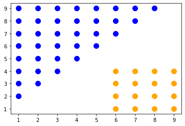
    


## Sparse Basic Sets 


这个例子中展示了集合中存在取模约束,这样集合元素会变成稀疏的.

### Example 


basic set **Sparse** 是排除某些对角线的正方形.


```python
Sparse = isl.BasicSet("{A[i,j] : 0 < i,j < 10 and (i + j) % 3 != 0}")
plot_set_points(Sparse,color='blue')
```


    
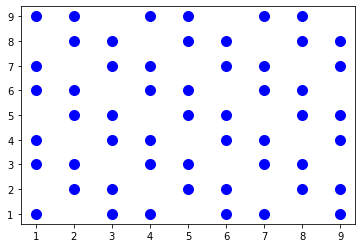
    


## Exercises

a) Plot a set **UpperTriangle** with a base of width 7. 

```
       x
     x x x
   x x x x x
 x x x x x x x
```


```python
s = isl.BasicSet("{A[x,y] : 0 <= x < 7 and 0 <= y < 4 and y <= x < 7-y }")
plot_set_points(s,color='blue')
```


    
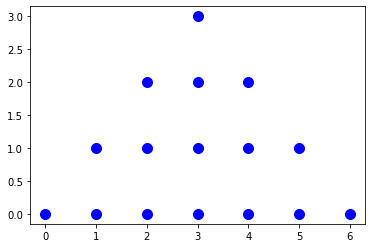
    


b) Plot a set **LowerTriangle** with a base of width 7 
```
x x x x x x x
  x x x x x
    x x x
      x
```


```python
s = isl.BasicSet("{A[x,y] : 0 <= x < 7 and -4 < y <= 0 and  (-y) <= x < 7+y }")
plot_set_points(s,color='blue')
```


    
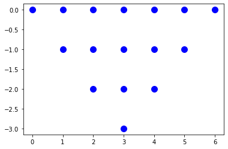
    


c) Plot a set **Diamond** with a width and height of 7. 
```
       x
     x x x
   x x x x x
 x x x x x x x
   x x x x x
     x x x
       x
```


```python
s = isl.BasicSet("{A[x,y] : 0 <= x < 7 and -4 < y < 4 and (-y) <= x < 7+y and y <= x < 7-y }")
plot_set_points(s,color='blue')
```


    

    


d) Plot a set **Parallelogram** with a height of 4 and a width of 7 with a slope of 1/2. 
```
      x x x x x x x
    x x x x x x x  
  x x x x x x x
x x x x x x x
```


```python
s = isl.BasicSet("{A[x,y] : 0 <= y < 4 and y <= x < y + 7 }")
plot_set_points(s,color='blue')
```


    
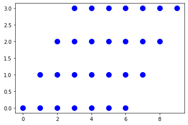
    


# Sets 


集合是有限的基础集合的联合, 他们都属于相同的named space中, 也就是他们的标识维度名都相同.


```python
Combined = Triangle.union(Square)
print("Combined: " + str(Combined))
plot_set_points(Combined,color='blue')
```

    Combined: { A[i, j] : i > 0 and j <= 9 and (j > i or (6 <= i <= 9 and 0 < j <= 4)) }


    

    


# Union Set 


不同named spaces的有限集合组成的是union set.


```python
u = isl.UnionSet("{A[i,j] : 0 < i,j and  j + i < 10; B[i,j] : 5 <= i,j < 10 }")
plot_set_points(u,color='blue')
```


    
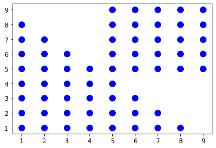
    


# Presburger Relations


Presburger Relations 是一种映射关系, 将多个Presburger formula描述的set映射起来.

通常可以表示为M = $( \{ \vec{v_1} \rightarrow \vec{v\_2} \mid \vec{v\_1}, \vec{v\_2} \in \mathbb{Z}^n : p (\vec{v\_1}, \vec{v\_2}, \vec{p})\} )$,其中`p`是一个 Presburger 公式, 如果元组对 $(\vec{v\_1})$ 和 $(\vec{v\_2})$ 是 M 的元素, 则计算结果为真.

## Basic Map 


basic map关联了basic set.

### Example


比如下面关联set A和position X.

Translate = $(\{A[i,j] \rightarrow X[i+10,j+1]\})$

To visualize this set, we use it to translate the earlier defined set **Triangle**. Without constraining **Translate** to **Triangle** the map is infinite and cannot be rendered.


```python
from islplot.plotter import *
Translate = isl.BasicMap("{A[i,j] -> X[i+10,j+1]}")
b  = Triangle.apply(Translate)
Translate = Translate.intersect_domain(Triangle)

plot_map(Translate)
plot_set_points(Triangle,color='blue')
plot_set_points(b,color='orange')
```


    
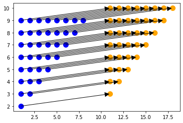
    

# Polyhedral Representation

将一个命令式语言的statement作为identifer, 加上loop的约束, 将其转化为Union Set :

<br>
<center>
<table>
<tr>
<td>
<center>
<b>Imperative Program</b>
</center>
</td>
<td>
</td>
<td>
<center>
<b>Iteration Domain</b>
</center>
</tr>

<tr>
<td>

```c
const int N = 100; 
double X[N], Y[N], Z[2*N]; 
for (int i = 0; i &lt;= 2*N; ++i) 
S:  Z[i] = 0.; 
  for (int i = 0; i &lt;= N; ++i) 
    for (int j = 0; j &lt;= N; ++j) 
T:    Z[i + j] += A[i] * B[j]; 
```

</td>
<td>

$ \rightarrow $

</td>

<td>
<center>
<br>

$( \{ T[i,j] \mid 0 < i \le j < 10; S[i,0] \mid 0 < i \le 20 \})$

</td>
</tr>
</table>
</center>

<br>


## Statement instances

考虑以下计算多项式乘积的代码片段
每个多项式都由其系数数组表示

```c
const int N = 100;
double X[N], Y[N], Z[2*N];

for (int i = 0; i <= 2*N; ++i)
S:  Z[i] = 0.;
for (int i = 0; i <= N; ++i)
    for (int j = 0; j <= N; ++j)
T:      Z[i + j] += A[i] * B[j];
```

为其中一些statement添加label作为identifier.

Statement `S` 初始化数组`Z`的元素,statement `T`计算它们.
Statement `S` 被包含在循环中,他将会按以下顺序被执行 $((2\mathtt{N} + 1))$ 次:

* `Z[0] = 0.; /* i = 0 */`
* `Z[1] = 0.; /* i = 1 */`
* ...
* `Z[2*N] = 0. /* i = 2*N */;`

把循环中每个单独执行的statement称为 **statement instances**
这样每个instance可以通过语句label和封闭循环迭代器的值来标识, 例如：

* $(\mathtt{S}(0))$
* $(\mathtt{S}(1))$
* ...
* $(\mathtt{S}(2 \mathtt{N}))$

如果一个statement包含在多个循环中, 其instance由所有迭代器的值按循环的顺序来标识, 比如statement `T` 会包含以下这些例子:

* $(\mathtt{T}(0,0))$ for `Z[0] += A[0] * B[0] /* i = 0, j = 0 */`,
* $(\mathtt{T}(0,1))$ for `Z[1] += A[0] * B[1] /* i = 0, j = 1 */`,
* ...
* $(\mathtt{T}(\mathtt{N},\mathtt{N}))$ for `Z[2*N] += A[N] * B[N] /* i = N, j = N */`.

## Iteration domain

一个statement的所有instance的集合被称为 *(iteration) domain*.


迭代域可以使用 set-builder 表示法来表示:

比如, $( \mathcal{D}_\mathtt{S} = \{ \mathtt{S}[i] : 0 \leq i \leq \mathtt{N} \}. )$
表达式 $( 0 \leq i \leq \mathtt{N} )$ 被循环起始(`i=0`)到结束(`i<=N`)所约束.


注意, 这里 $( \mathtt{N} )$ 被看作是符号常量. 在多面体模型中,这些符号常量通常被称为 *(structure) parameters*:

$( \mathcal{D}\_\mathtt{S} = [N] \rightarrow \{ \mathtt{S}[i] : 0 \leq i \leq N \} )$,
本质上是将其转换为从参数值到domain set的具体instance的映射.
这样的参数集可以在 *isl* 中如下定义:


```python
import islpy as isl
D_S = isl.Set("[N] -> {S[i] : 0 <= i <= N}")
print(D_S)
```

    [N] -> { S[i] : 0 <= i <= N }


同样, 我们可以为statement `T`定义iteration domain,
$( \mathcal{D}_\mathcal{T} = [N] \rightarrow \{ \mathtt{T}(i,j) : 0 \leq i,j \leq N \} )$.


这个domain被定义为一组二维向量, 向量的每个分量都以嵌套顺序对应于一个封闭循环.

### Question


使用 *isl* 表示定义变量 `D_T` 使其包含 `T` 的迭代域, 然后打印它.


```python
D_T = isl.Set("[N] -> { T[i,j] : 0 <= i, j <= N }")
print(D_T)
```

    [N] -> { T[i, j] : 0 <= i <= N and 0 <= j <= N }


如上所示, *isl* 输出使用连词(logical *and*)来组合不同迭代器周围的不等式,
这可以很方便循环边界不同的情况.

### Question
使用 `and` operator 分离 `i` 和 `j`的bounds来重新定义`D_T` .


```python
D_T = isl.Set(" [N] -> { T[i, j] : 0 <= i <= N and 0 <= j <= N }")
print(D_T)
```

    [N] -> { T[i, j] : 0 <= i <= N and 0 <= j <= N }


注意, print的输出不一定再现输入的文本形式
相反, 它表示简化后的同一集合, 比如消除了多余的不等式, 并使用更简单的方程来表示出现在第一位的分量.
比如下面这个例子:


```python
print(isl.Set("{[i,j]: i+j >= 0 and i >= 0 and j > 0 and j >= 1}"))
```

    { [i, j] : i >= 0 and j > 0 and j >= -i }


## Handling Non-Unit Strides


考虑以下代码片段, 它取数组中的每个奇数元素的负数.
```c
const int N;
double A[2*N];

for (int i = 1; i < 2*N; i += 2)
R:  A[i] = -A[i];
```

如果数组`A`存储的是复数的实部和虚部, 那么上面的代码操作计算复共轭.

`R` 的迭代域现在应该限制为 `i` 的奇数值, 这可以使用模运算符来实现: 

$( \mathcal{D}_\mathtt{R}: [N] \rightarrow \{ [i] : 0 \leq i < N \wedge i\mod 2 = 1 \} $)


```python
D_R = isl.Set("[N] -> {R[i]: (i mod 2) = 1 and 0 <= i < N}")
print(D_R)
```

    [N] -> { R[i] : (1 + i) mod 2 = 0 and 0 <= i < N }


*isl* 将模运算转换为带底舍入的除法, 这种转换是模运算的两个属性的组合

$( a \mod b = c \Leftrightarrow (a + c) \mod b = 0 )$,

$( a \mod b \equiv a - b \lfloor a/b \rfloor )$.


### Question

在下面的代码中定义代表`Q`的迭代域的集合, 然后打印出来
```c
const int N;
double A[2*N];

for (int i = 1; i < 2*N; i += 2)
Q:  A[i] = -A[i];
```


```python
D_Q = isl.Set("[N] -> {Q[i]: (i mod 2) = 1 and 0 <= i < N}")
print(D_Q)
```

    [N] -> { Q[i] : (1 + i) mod 2 = 0 and 0 <= i < N }


## Handling Conditions

循环内的条件构造也限制了它们所包含的语句的迭代域,
复共轭计算也可以使用单位步长循环内的分支语句来重写.
```c
const int N;
double A[2*N];

for (int i = 1; i < 2*N; ++i)
    if (i % 2 == 1)
P:    A[i] = -A[i];
```

迭代域的定义还应该包括语句周围的分支所施加的约束.

### Question

定义代表`P`的迭代域的集合并打印它.


```python
D_P = isl.Set("[N] -> {P[i]: (i mod 2) = 1 and 0 <= i < N}")
print(D_P)
```

    [N] -> { P[i] : (1 + i) mod 2 = 0 and 0 <= i < N }


即使 `P` 和 `R` 的语句实例集是相同的, 这些域也会被认为是不同的因为是不同的*statement name*.

### Question
如何修改`D_P`, 让他等价于`D_R`?


```python
D_P = isl.Set("[N] -> {R[i]: i mod 2 = 1 and 0 <= i < N}")
print(D_P.is_equal(D_R))
```

    True


## Iteration Domains as Presburger Sets


由于*isl*在Presburger Sets上运行, 因此它可以编码任何可以使用Presburger公式表示的迭代域,
这通常涉及由具有所谓的*static control flow*的循环和分支包围的语句.

也就是说, loop bounds和分支条件是外部边界和参数的Presburger公式,
其中参数的值未知, 但在整个执行过程中必须保持不变.

作为推论, 控制流不能依赖于被计算的*value*, 
因此, 适合多面体建模的程序部件被称为*static control parts*或*SCoPs*.

### Question


定义包含在两个循环和一个具有析取约束的分支中的statement的迭代域.

Hint: 如果有必要, 请使用运算符`or`和括号来确保优先级
```c
for (int i = 0; i < 10; ++i)
  for (int j = 0; j < 10; ++j)
    if (i < j - 1 || i > j + 1)
      Z[i][j] = 0.;
```


```python
D_Z = isl.Set(" { Z[i,j] : 0 <= i,j < 10 and (i < j - 1 or i > j + 1) } ")
print(D_Z)
```

    { Z[i, j] : (i >= 0 and 2 + i <= j <= 9) or (i <= 9 and 0 <= j <= -2 + i) }


### 

也可以使用Presburger公式表达某些常见的数学运算:

* `i >= max(a,b)` $( \Leftrightarrow i \geq a \wedge i \geq b )$ (lower bound only)
* `i <= min(a,b)` $( \Leftrightarrow i \leq a \wedge i \leq b )$ (upper bound only)
* `a = ceil(b/c)` $( \Leftrightarrow a = \lfloor (b - 1)/c \rfloor + 1 )$


## Putting Domains Together


总之, statement的迭代域是一组受仿射表达式约束的多维向量, 仿射表达式出现在statement周围的循环边界和分支条件下.

由于statement名称不同, 多个语句的迭代域存在于不同的*Spaces*中, 即使它们被相同的循环包围,
通过将它们放入*Union set*中可以统一操作, 比如组合domain:
```c
for (int i = 0; i < 10; ++i)
  for (int j = 0; j < 10; ++j) {
    if (i < j - 1)
S1:   Z[i][j] = 0.;
    if (i > j + 1)
S2:   Z[i][j] = 0.;
  }
```

被定义为:
$( \mathcal{D} = 
    \{\mathtt{S1}[i,j]: 0 \leq i,j < 10 \wedge i < j - 1 \} \cup 
    \{\mathtt{S2}[i,j]: 0 \leq i,j < 10 \wedge i > j + 1 \},
$)

*isl*表示如下:


```python
D = isl.UnionSet("{S1[i,j]: 0 <= i,j <= 10 and i < j - 1; S2[i,j]: 0 <= i,j <= 10 and i > j + 1}")
print(D)
```

    { S2[i, j] : 0 <= i <= 10 and 0 <= j <= 10 and j <= -2 + i; S1[i, j] : 0 <= i <= 10 and j >= 2 + i and 0 <= j <= 10 }


## Plotting Iteration Domains
可以绘制1D/2D的非参数迭代域集合:


```python
from islplot.plotter import *
plot_set_points(D,color='blue')
```


    
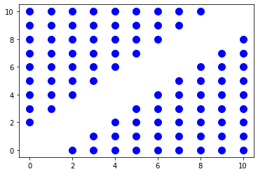
    


可视化可以有效的检查domain的size或者独立的domain交集.

这里例子中,domain完全不相交,意味他们可以被分离的循环所穿过.


如果domain是参数化的,我们首先需要*fix*所有的参数到constant, 通过以下几种方法:

* 创建一个参数集, 其中域值是固定的;
* 将domain与这个新set相交;
* 映射所有参数.


下面是对第一个例子的`T` statement 的操作方法:


```python
fixer = isl.Set("[N] -> {T[i,j]: N = 5}")
D_T = D_T.intersect(fixer)
D_T = D_T.project_out(isl.dim_type.param, 0, 1)
plot_set_points(D_T)
```


    
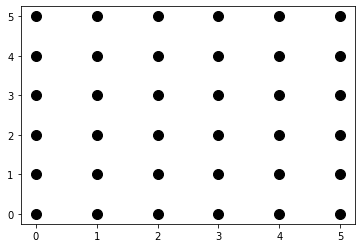
    


`isl.dim_type.param`表示你想映射的参数, 后面两个数据分别是第一个参数的位置和将要映射的连续参数的数量.

为了plot出来, 因此把所有维度都映射出来.注意, 如果忘记*fix*参数大小, 该集将变得unbounds, 无法plot. 


与参数类似, 在plot之前可以投影domain dimensions获得两个维度.
使用'isl.dim_type.set'来获取这些

### Question

下面执行LU分解的代码:

```c
for (i = 0; i < N; i++) {
  for (j = 0; j < i; j++) {
    for (k = 0; k < j; k++) {
Sa:    A[i][j] -= A[i][k] * A[k][j];
    }
Sb: A[i][j] /= A[j][j];
  }
  for (j = i; j < N; j++) {
    for (k = 0; k < i; k++) {
Sc:   A[i][j] -= A[i][k] * A[k][j];
    }
  }
}
```


1.  为所有的iteration domain定义union set.
2.  检查iteration domain `Sa` 和 `Sc` 是否有overlap
3.  绘制domain在(i,j)和(j,k)


Hint: 不能*直接*从union set中映射出domain dimension,因为他们可能存在不同的space中, 但是可以从set中做union得到他.


```python
D_Sa = isl.Set("[N] -> { Sa[i,j,k] :0 <= k < j < i < N }")
D_Sb = isl.Set("[N] -> { Sb[i,j] :0 <= j < i < N }")
D_Sc = isl.Set("[N] -> { Sc[i,j,k] :0 <= k < i <= j < N }")
D = isl.UnionSet(D_Sa).union(D_Sb).union(D_Sc)
print(D)
```

    [N] -> { Sc[i, j, k] : i <= j < N and 0 <= k < i; Sa[i, j, k] : i < N and j < i and 0 <= k < j; Sb[i, j] : i < N and 0 <= j < i }


```python
# NOTE 这里需要去掉标识名再做交集.
D_Sa_ = isl.Set("[N] -> { [i,j,k] :0 <= k < j < i < N }")
D_Sc_ = isl.Set("[N] -> { [i,j,k] :0 <= k < i <= j < N }")
D_Sa_.intersect(D_Sc_).is_empty()
```


    True


```python
D_Sa = D_Sa.intersect(isl.Set("[N] -> { Sa[i,j,k]: N = 8}"))
D_Sb = D_Sb.intersect(isl.Set("[N] -> { Sb[i,j]: N = 8}"))
D_Sc = D_Sc.intersect(isl.Set("[N] -> { Sc[i,j,k]: N = 8}"))
D_Sa = D_Sa.project_out(isl.dim_type.param, 0, 1)
D_Sb = D_Sb.project_out(isl.dim_type.param, 0, 1)
D_Sc = D_Sc.project_out(isl.dim_type.param, 0, 1)
```


```python
D_Sa_ = D_Sa.project_out(isl.dim_type.set, 2, 1)
D_Sc_ = D_Sc.project_out(isl.dim_type.set, 2, 1)
D_ij = isl.UnionSet(D_Sa_).union(D_Sb).union(D_Sc_)
print(D_ij)
plot_set_points(D_ij)
```

    { [i, j] : (i <= 7 and 0 < j < i) or (i > 0 and i <= j <= 7); Sb[i, j] : i <= 7 and 0 <= j < i }


    

    


```python
D_Sa_ = D_Sa.project_out(isl.dim_type.set, 0, 1)
D_Sc_ = D_Sc.project_out(isl.dim_type.set, 0, 1)
D_jk = isl.UnionSet(D_Sa_).union(D_Sc_)
print(D_jk)
plot_set_points(D_jk)
```

    { [j, k] : j <= 7 and 0 <= k < j }


    

    


# Schedules

$ \{ (i,j,k) \rightarrow (i+j, k, i) \}$


## Definition

statement的iteration domain给出了*instances*的执行信息,但是并没有指定执行顺序.

实际上, 我们可以通过为每个statement instance分配逻辑执行顺序来指定分段 quasi-linear 的顺序.

简而言之, 此*schedule*可以表示为statement instance和逻辑顺序之间的Presburger映射.


## Identity Schedule

默认情况下, statement instances按照循环迭代顺序执行.
这可以使用*identity* schedule relation来表示.


比如一个简单的循环初始化:
```c
for (i = 0; i < N; ++i)
S:  A[i] = 0.0;
```

iteration domain:

$( \mathcal{D}\_\mathtt{S} = [N] \rightarrow \{ \mathtt{S}(i) : 0 \leq i < N \} )$

对应的identity schedule:

$( \mathcal{T}\_\mathtt{S} = [N] \rightarrow \{ \mathtt{S}(i) \rightarrow (t_0) : t_0 = i \} )$.

In *isl* notation:


```python
import islpy as isl
D_S = isl.Set("[N] -> { S[i]: 0 <= i < N }") # 迭代域
T_S = isl.Map("[N] -> {S[i] -> [t0]: t0 = i}") # schedule
print(T_S)
```

    [N] -> { S[i] -> [t0 = i] }


## Multidimensional Schedules


如果一个statement instance由多个元素的向量标识, 则表示这个statement包含在多个嵌套循环中, 它通常映射到*multidimensional*逻辑顺序.


下面的例子中, statement instances以逻辑顺序的*lexicographical order*进行执行.


比如$((0,42))$在$((100,0))$之前, 写作$((0,42) \prec (100,0))$.


lexicographical order通常扩展到比较不同大小的向量.


短的的向量, 是和较长向量的前缀比较, 例如$((0,42) \prec (0,42,0))$.


比如, 多维下的初始化:
```c
for (i = 0; i < N; ++i)
  for (j = 0; j < N; ++j)
S:  A[i][j] = 0.0;
```

iteration domain:

$( \mathcal{D}_\mathtt{S} = [N] \rightarrow \{ \mathtt{S}(i): 0 \leq i,j < N \} )$


identity schedule:

$( \mathcal{T}_\mathtt{S} = [N] \rightarrow \{ \mathtt{S}(i,j) \rightarrow (t_0, t_1) : t_0 = i \wedge t_1 = j \} )$.

In *isl* notation:


```python
D_S = isl.Set("[N] -> {S[i,j]: 0 <= i,j < N}")
T_S = isl.Map("[N] -> {S[i,j] -> [t0,t1]: t0 = i and t1 = j}")
print(T_S)
```

    [N] -> { S[i, j] -> [t0 = i, t1 = j] }


即使理论上schedule可以用单维度来表示:

$( \mathcal{T}_\mathtt{S} = [N] \rightarrow \{ \mathtt{S}(i,j) \rightarrow (t_0) : t_0 = Ni + j \} )$


但由于存在变量的乘法, 这种表达式是不能表示为Presburger映射的.

不过当使用实际常量而不是常量参数时, 是可以构建这样的schedule的.

### Question

写出三维数组循环初始化的identity schedule
```c
for (i = 0; i < N; ++i)
  for (j = 0; j < N; ++j)
    for (k = 0; k < N; ++k)
T:    A[i][j] = 0.0;
```


```python
D_T = isl.Set("[N] -> { A[i,j,k] : 0 <= i,j,k < N }")
T_T = isl.Map("[N] -> { A[i,j,k] -> [t0 = i,t1 = j,t2 = k] }")
T_T
```

    Map("[N] -> { A[i, j, k] -> [t0 = i, t1 = j, t2 = k] }")


### Question

尝试为同一域定义一个具有乘法的一维计划（会出现错误）.


```python
try:
  T_T_err = isl.Map("[N] -> {S[i,j,k] -> [t0]: t0 = N*N*i + N*j + k}")
except:
  print("got error")
```

    got error


## Representing Lexical Order

考虑一个循环中包含两个statement:
```c
for (i = 0; i < 10; ++i) {
P:  A[i] = 0.0;
Q:  B[i] = 1.0;
}
```

对两个statement使用简单的identity schedule将导致他们具有*相同的*执行顺序.


然而, 从代码中可以清楚地看出, `Q`的是在`P`之后执行的, statement的*lexical order*可以使用*auxiliary*维度在schedule中编码.


他分配一个常量, 以便在`Q`之前强制执行`P`的statement, 即`P`的常数小于`Q`的常数.


由于顺序存在于循环中*内部*, 因此辅助维度放置在循环维度之后.

$( \mathcal{T} = 
  \{ P(i) \rightarrow (t\_0, t\_1) : t\_0 = i \wedge t\_1 = 0 \} \cup
  \{ Q(i) \rightarrow (t\_0, t\_1) : t\_0 = i \wedge t\_1 = 1 \} )$


这个map会将顺序$((i,0))$分配到`P`, 然后$((i,1))$分配到`Q`.


从而清晰的表示$( \forall i, (i,0) \prec (i,1) )$


*isl*中, 不同的 statements的schedules 可以被结合为 union map.


```python
D = isl.UnionSet("{P[i]: 0 <= i < 10; Q[i]: 0 <= i < 10}") # 首先列出两个statement的set
S = isl.UnionMap("{P[i] -> [t0,t1]: t0 = i and t1 = 0; Q[i] -> [t0,t1]: t0 = i and t1 = 1}") # 为他们分别分配额外的执行顺序, P = 0, Q = 1
print(S)
```

    { Q[i] -> [t0 = i, t1 = 1]; P[i] -> [t0 = i, t1 = 0] }


### 

考虑两个循环组成的`SCoP`

```c
for (i = 0; i < 10; ++i) {
U:  A[i] = 0.0;
}
for (i = 0; i < 10; ++i) {
V:  B[i] = 1.0;
}
```

这个例子中,*所有的*`U`的实例都在*所有的*`V`的实例之前执行,


因此辅助维度会在循环维度之前加入:

$( \mathcal{T} =
  \{ \mathtt{U}(i) \rightarrow (t_0, t_1) : t_0 = 0 \wedge t_1 = i \} \cup
  \{ \mathtt{V}(i) \rightarrow (t_0, t_1) : t_0 = 1 \wedge t_1 = i \}.
)$

Or, in *isl* notation:


```python
D2 = isl.UnionSet("{U[i]: 0 <= i < 10; V[i]: 0 <= i < 10}") # 两个statement分别的set
S2 = isl.UnionMap("{U[i] -> [t0,t1]: t0 = 0 and t1 = i; V[i] -> [t0,t1]: t0 = 1 and t1 = i}") # 这里把t1作为loop 维度, t0作为辅助维度, 也就是表示两个statement执行循环顺序相同,但是执行整个循环的顺序不同.
print(S2)
```

    { U[i] -> [t0 = 0, t1 = i]; V[i] -> [t0 = 1, t1 = i] }


绘制两个*scheduled domain*可以发现不同:


```python
from islplot.plotter import *
plot_set_points(D.apply(S))
print(D.apply(S)) # t0表示是外部循环的顺序, t1 表示的内部statement的执行顺序, 此时外部循环0~9, 内部执行顺序0~1
```

    { [t0, t1 = 1] : 0 <= t0 <= 9; [t0, t1 = 0] : 0 <= t0 <= 9 }


    
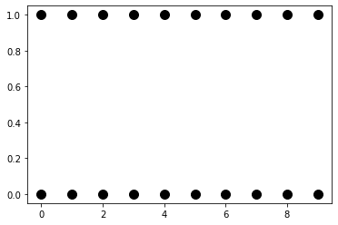
    


```python
plot_set_points(D2.apply(S2))
print(D2.apply(S2)) # t0表示是循环外部的顺序, t1表示循环内statement的执行顺序, 此时循环外部有先后顺序, 循环内顺序 0~9
```

    { [t0 = 1, t1] : 0 <= t1 <= 9; [t0 = 0, t1] : 0 <= t1 <= 9 }


    

    


注意, 因为上面将logical dates和所有statement的实例绘制在同一个space中,所以比较难辨认.


### Question

通常,如果auxiliary dimension被statement共享, 那么定义在循环的最内部, 

如果没有被任何loop共享, 那么放到最前面.


为下面的schedule定义auxiliary dimension:

```c
for (i = 0; i < 10; ++i) {
  for (j = 0; j < 5; ++j)
S1: A[i][j] = 0.;
  for (j = 0; j < 5; ++j)
S2: B[i][j] = 0.;
}
```


```python
D = isl.UnionSet("{ S1[i,j] : 0 <= i < 10 and 0 <= j < 5 ; S2[i,j] : 0 <= i < 10 and 0 <= j < 5 }")
S = isl.UnionMap("{ S1[i,j] -> [t0 = i,t1 = 0,t2 = j]; S2[i,j] -> [t0 = i,t1 = 1,t2 = j]; }")
print(S) # t0 作为共享循环i, t1 控制循环j外部的顺序, t2 分别为每个循环j的顺序.
```

    { S1[i, j] -> [t0 = i, t1 = 0, t2 = j]; S2[i, j] -> [t0 = i, t1 = 1, t2 = j] }

# Modeling memory accesses

## Access Relations

每个statement instance可能会访问一个或多个的variables/ scalars/ arrays.


如果数组的下标索引是loop iterators 和 structure parameters的仿射形式,
那么可以定义Presburger relation来将statement instances和他们访问的数组元素关联起来.
为了简单起见,在polyhedral model中将scalar作为0维数组来表示.


考虑一个矩阵乘的算子:
```c
double X[100], Y[100], Z[200];
double zero = 0.;

for (int i = 0; i <= 200; ++i)
S:  Z[i] = zero;
for (int i = 0; i <= 100; ++i)
    for (int j = 0; j <= 100; ++j)
T:      Z[i + j] += A[i] * B[j];
```


如果只使用句法术语, 可以称为statement `S` 访问 array `Z`.


但是,对于每一个独立的*instance*$( \mathtt{S}(i) )$ 只访问其中的一个元素`Z[i]`.


这可以被编码为 $( \{ \mathtt{S}(i) \rightarrow \mathtt{Z}(a): a = i \} )$.

进一步, 我们知道array `Z`的size,因此可以定义额外的约束来避免index out of range.

$( \{ \mathtt{Z}(a): 0 \leq a \leq 200 \} )$.


同时`S`的iteration domain为:

$( \{ \mathtt{S}(i): 0 \leq i \leq 200 \} )$.


在access relation中加入了以上约束后, 我们可以将上述set和statement domain进行intersect.


```python
import islpy as isl
A_S_Z = isl.Map("{S[i] -> Z[a]: a = i}") # s访问数组z的映射
D_S = isl.Set("{S[i]: 0 <= i <= 200}") # S的迭代域
C_Z = isl.Set("{Z[a]: 0 <= a <= 200}") # 数组Z的domain
A_S_Z = A_S_Z.intersect_domain(D_S).intersect_range(C_Z) # 对schedule添加instance domain和数组的range.
print(A_S_Z)
```

    { S[i] -> Z[a = i] : 0 <= i <= 200 }


 

上面最终加入约束后的例子中并没有显式对$(a)$的范围约束,因为存在了隐式的约束$(a = i)$,所以isl会简化最终的表示.


scalar不存在下标索引, 因此他们表示为0维的向量.


但是这个range依旧存在一个name, 比如用`zero`来表示.

$( \{ \mathtt{S}(i) \rightarrow \mathtt{zero}(): 0 \leq i \leq 200 \} )$.


此时额外的$(i)$的约束将从iteration domain `S`中获取.


```python
A_S_zero = isl.Map("{S[i] -> zero[]:}") # s访问zero的映射
A_S_zero = A_S_zero.intersect_domain(D_S) # 因为zero没有range,所以这里只需要添加domain信息即可.
print(A_S_zero)
```

    { S[i] -> zero[] : 0 <= i <= 200 }


最终, 可以将不同数组的访问关系组合成一个描述语句所有访问的联合映射.


```python
A_S = isl.UnionMap(A_S_Z).union(A_S_zero)
print(A_S) # 这里表示的初始化循环中, S访问了浮点值0和Z[i]的relation
```

    { S[i] -> Z[a = i] : 0 <= i <= 200; S[i] -> zero[] : 0 <= i <= 200 }


因为我们想要区分*reads* 和 *writes*的顺序, 因此我们可以分离不同的access relations的unions.


有时候他们会同时触发, 在这里例子中就是一个statement同时读写相同的variable.


### Question


定义map `A_T_Z`并联合statement `T`和array `Z`:


```python
A_T_Z = isl.Map(" { T[i,j] -> Z[a = i + j]} ") # T访问Z的relation.
print(A_T_Z)
```

    { T[i, j] -> Z[a = i + j] }


### Question


分别定义`A_T_reads` and `A_T_writes`的union map:


```python
A_T_reads = isl.UnionMap(" { T[i,j] -> Z[a = i + j] ; T[i,j] -> A[a = i] ; T[i,j] -> B[a = j]} ")
print(A_T_reads)
```

    { T[i, j] -> A[a = i]; T[i, j] -> Z[a = i + j]; T[i, j] -> B[a = j] }


```python
A_T_writes = isl.Map("{ T[i,j] -> Z[a = i + j] }")
print(A_T_writes)
```

    { T[i, j] -> Z[a = i + j] }


## Detecting Out-of-Bounds Accesses

通过将iteration domain和array size 约束set进行结合,就可以检测出越界访问,

考虑如下代码:

```c
double A[99];
for (int i = 0; i <= 99; i++)
X:  A[i+1] = 0.;
```

其中的access relation表示为$( a = i + 1 )$

首先将 `S`的iteration domain 和他的数组`A`的range约束进行intersect.


返回的access relation中包含了所有的*access instances*, 也就是所有的statement instance和array 元素的pair.


从domain约束过的relation中减去这个relation得到的结果就是*invalid accesses*,

表示了所有越界访问的statement instance.


```python
A_X_A = isl.Map("{X[i]->A[a]: a = i+1}") # X的access relation
C_A = isl.Set("{A[i]: 0 <= i <= 99}") # 添加数组range信息
D_X = isl.Set("{X[i]: 0 <= i <= 99}") # 添加statement domain信息
correct = A_X_A.intersect_domain(D_X).intersect_range(C_A) # 同时约束domain和range的则是可以执行的statement.
incorrect = A_X_A.intersect_domain(D_X).subtract(correct) # 只约束domain的情况下,他的statement set将会大于等于 correct
print(correct)
print(incorrect)
```

    { X[i] -> A[a = 1 + i] : 0 <= i <= 98 }
    { X[i = 99] -> A[a = 100] }


在上面的例子中,statement instance $X(99)$ 就对数组`A`执行了越界的访问, 
这个可以通过将循环上界修改为`i < 99`来完成修复.

### Question


验证修复后的结果是正确的, 即检查subtract后的集合为空.


```python
A_X_A = isl.Map("{X[i]->A[a]: a = i+1}") # 首先定义访问关系
C_A = isl.Set("{A[i]: 0 <= i <= 99}") # 添加数组range信息
D_X = isl.Set("{X[i]: 0 <= i < 99}") # 添加statement domain信息
correct = A_X_A.intersect_domain(D_X).intersect_range(C_A) # 同时约束domain和range的则是可以执行的statement.
incorrect = A_X_A.intersect_domain(D_X).subtract(correct) # 只约束domain的情况下,他的statement set将会大于等于 correct
assert incorrect.is_empty() == True
```


公式$(1 = 0)$为false.


在Presburger sets表示中, 这被用于表示一个空的集合,但不丢失name和维度信息.


## Potentially Dependent Instances

现在来定义*inverse* access relation, 即映射数组元素到每个访问了这个元素的statement instance.


首先获取原始的access relation:

$( \mathcal{A}\_{\mathtt{S} \rightarrow \mathtt{Z}} = \{ \mathtt{S}(i) \rightarrow \mathtt{Z}(a):
    a = i \wedge 0 \leq a,i \leq 200 \} )$,


*inverse* access relation被*相同的约束*定义的,但是交换了其中的`domain`和`range`.

$( \mathcal{A}\_{\mathtt{S} \rightarrow \mathtt{Z}}^{-1} = \{ \mathtt{Z}(a) \rightarrow \mathtt{S}(i):
    a = i \wedge 0 \leq a,i \leq 200 \} )$.

*isl* can compute inverse relations using:


```python
A_S_Z_inv = A_S_Z.reverse()
print(A_S_Z)
print(A_S_Z_inv)
```

    { S[i] -> Z[a = i] : 0 <= i <= 200 }
    { Z[a] -> S[i = a] : 0 <= a <= 200 }


如果两个statement instances访问了*相同的*array element, 他们可能会互相干扰.


比如,第一个instance写入了值,然后后面第二个instance去读取他.

在没有`volatile`限定符的情况下,两个statement*读取*相同的元素是不会被干扰的.


将此定义转换为relations, 我们需要在访问相同数组元素的statement instances之间定义一个映射.


通过access relation, 我们知道statement instance访问了哪些元素.


使用inverse access relation,我们能知道哪些其他的 statement instances访问了数组元素.


结合这两个access relation和数组下标索引, 可以为我们提供潜在的statement instances之间的依赖关系(potentially dependent).


这可以通过access relation之间的组合来完成:

$( \mathcal{X} \circ \mathcal{Y} = \{ \pmb{x} \rightarrow \pmb{y} \mid
    \exists \pmb{z} : (\pmb{x},\pmb{z}) \in \mathcal{X} \wedge (\pmb{z},\pmb{y}) \in \mathcal{Y} \} )$.
    

*isl*中可以使用`apply range`操作来进行access relation之间的组合.

比如计算statement `S`访问相同元素`Z`的关系:


```python
dep_S_Z = A_S_Z.apply_range(A_S_Z.reverse()) # A_S_Z 表示S访问数组Z的关系, A_S_Z_inv表示数组Z被S访问的关系.
print(dep_S_Z) # 得到了potentially dependent
```

    { S[i] -> S[i' = i] : 0 <= i <= 200 }


得到了statement instances集合`S`的map结果.


在这个例子中,本质上是一个恒等的关系, 因为$(i^\prime = i)$是相等的.


这表示不同的`S`的instance实际访问的是不同的数组元素.

### Question


定义关于instance `S`访问标量`zero`的映射`dep_S_zero`:


```python
dep_S_zero = A_S_zero.apply_range(A_S_zero.reverse())
print(dep_S_zero)
```

    { S[i] -> S[i'] : 0 <= i <= 200 and 0 <= i' <= 200 }


上面就可以发现`S`的每个实例都是相关关联的, 因为他们访问的都是同一个标量值.


不过目前他们只读取这个值, 并没有修改他, 因此是不会与其他的statement instance产生干扰.

## Reads and Writes

通常,只有至少一次访问为*write*的时候才会被看作是潜在依赖.

因此,还是需要将read/write分离为不同的relation.


现在用一个更小的数据范围的例子来说明问题:
```c
double X[10], Y[10], Z[20];

for (int i = 0; i <= 20; ++i)
S:  Z[i] = 0.;
for (int i = 0; i <= 10; ++i)
    for (int j = 0; j <= 10; ++j)
T:      Z[i + j] += A[i] * B[j];
```


NOTE 在*isl*中,复杂度取决于依赖的数量,而不是集合中的数据量.


由于union中的map可以存在于不同的空间中, 因此可以通过组合来自不同语句的单个access (union) map来定义所有读取和写入的映射.

### Question

下面给出了每个单独的access relations, 定义整个*SCoP*的`reads` and `writes` union map.


```python
A_S_Z = isl.Map("{S[i]->Z[a]: a = i and 0 <= a,i <= 20}") # S 访问数组Z的 access relation
A_T_Z = isl.Map("{T[i,j]->Z[a]: a = i + j and 0 <= i,j <= 10 and 0 <= a <= 20}") # T 访问数组Z的access relation
A_T_A = isl.Map("{T[i,j]->A[a]: a = i and 0 <= a <= 20 and 0 <= i,j <= 10}") # T 访问数组A的access relation
A_T_B = isl.Map("{T[i,j]->B[a]: a = j and 0 <= a <= 20 and 0 <= i,j <= 10}") # T 访问数组B的access relation
```


```python
writes = isl.UnionMap(A_S_Z).union(A_T_Z) # S写入Z[i], T写入Z[i+j]
reads = isl.UnionMap(A_T_Z).union(A_T_A).union(A_T_B) # T读Z[i+j], A[i], B[j]
print(reads)
print(writes)
```

    { T[i, j] -> A[a = i] : 0 <= i <= 10 and 0 <= j <= 10; T[i, j] -> Z[a = i + j] : 0 <= i <= 10 and j >= 0 and -i <= j <= 20 - i and j <= 10; T[i, j] -> B[a = j] : 0 <= i <= 10 and 0 <= j <= 10 }
    { T[i, j] -> Z[a = i + j] : 0 <= i <= 10 and j >= 0 and -i <= j <= 20 - i and j <= 10; S[i] -> Z[a = i] : 0 <= i <= 20 }


## Selecting one Write


为了避免将read access与read access组合的情况, 我们必须确保`reads`不会同时出现在组合的两边:

$( (\mathtt{reads} \circ \mathtt{writes}^{-1}) \cup 
    (\mathtt{writes} \circ \mathtt{reads}^{-1}) \cup
    (\mathtt{writes} \circ \mathtt{writes}^{-1}) )$


注意 `writes`在右边出现了两次, 因此可以将表达式简化为:

$( ((\mathtt{reads} \cup \mathtt{writes}) \circ \mathtt{writes}^{-1}) \cup (\mathtt{writes} \circ \mathtt{reads}^{-1}) )$.


现在来计算union的第一部分:


```python
reads_writes = reads.union(writes)
left_part = reads_writes.apply_range(writes.reverse())
print(left_part)
```

    { S[i] -> S[i' = i] : 0 <= i <= 20; T[i, j] -> S[i' = i + j] : 0 <= i <= 10 and j >= 0 and -i <= j <= 20 - i and j <= 10; T[i, j] -> T[i', j' = i + j - i'] : 0 <= i <= 10 and j >= 0 and -i <= j <= 20 - i and j <= 10 and i' >= -10 + i + j and 0 <= i' <= 10 and i' <= i + j; S[i] -> T[i', j = i - i'] : 0 <= i <= 20 and i' >= -10 + i and 0 <= i' <= 10 and i' <= i }


### Question

计算整个union的第二部分:


```python
right_part = writes.apply_range(reads.reverse()) # (writes ∘ reads⁻¹)
union = left_part.union(right_part) # 再进行union
print(union)
```

    { S[i] -> T[i', j = i - i'] : i' >= -10 + i and 0 <= i' <= 10 and i' <= i; T[i, j] -> S[i' = i + j] : 0 <= i <= 10 and j >= 0 and -i <= j <= 20 - i and j <= 10; S[i] -> S[i' = i] : 0 <= i <= 20; T[i, j] -> T[i', j' = i + j - i'] : 0 <= i <= 10 and 0 <= j <= 10 and i' >= -10 + i + j and 0 <= i' <= 10 and i' <= i + j }


### Question:

现在单独计算连接读取相同元素的statement instances的`two_reads`的relation:


```python
two_reads = reads.apply_range(reads.reverse())
print(two_reads)
```

    { T[i, j] -> T[i', j' = i + j - i'] : 0 <= i <= 10 and 0 <= j <= 10 and i' >= -10 + i + j and 0 <= i' <= 10 and i' <= i + j; T[i, j] -> T[i' = i, j'] : 0 <= i <= 10 and 0 <= j <= 10 and 0 <= j' <= 10; T[i, j] -> T[i', j' = j] : 0 <= i <= 10 and 0 <= j <= 10 and 0 <= i' <= 10 }


### 

比较以上这些relation, 即使它们以不同的顺序打印, `union`和`left_part`也完全相同.


```python
print(union.is_equal(left_part))
```

    True


这里是因为在这个例子中`left_part`实际上就是`right_part`的一个子集,

因为`T`读写的都是相同的元素, 因此pair $( \mathtt{S}(i) \rightarrow \mathtt{T}(i',j=i-i') )$ 


```python
print(right_part.is_subset(left_part))
```

    True


因此,我们不能只计算潜在依赖statement pair的整体集合,然后减去那些有两次reads的集合. 如果其中出现两次相同的write的关系,就会被抵消.

### Question


使用read和write的statement instance pair之间的relation, 
从中减去 `two_reads` 并检查它确实只是 `union` 的一个子集.


```python
all_pairs = reads_writes.apply_range(reads_writes.reverse())
all_pairs = all_pairs.subtract(two_reads)
print(all_pairs.is_equal(union))
print(all_pairs.is_subset(union))
```

    False
    True


## Visualizing Potentially Dependent Instances


现在把限制只放在`T`的实例上


```python
T_only = isl.Map("{ T[i,j] -> T[i',j']: }") # 过滤出访问点.
new_union = union.intersect(T_only)
from islplot.plotter import *
import matplotlib.pyplot as plt
plt.figure(figsize=(10, 7), dpi=80)
plot_map(new_union)
print(new_union)
```

    { T[i, j] -> T[i', j' = i + j - i'] : 0 <= i <= 10 and 0 <= j <= 10 and i' >= -10 + i + j and 0 <= i' <= 10 and i' <= i + j }


    

    


 

如上图所示, 每个statement instance都与 *他自己* 以及同一对角线上的一个或多个instance相关.

### Question 


定义一个map `left_42` 只包含 $(\mathtt{T}(4,2) )$ 在左边的pair,
和一个map `right_42`, 它只包含它在右边的pair

*提示*：map domain和range是集合, 可以对其进行操作


```python
left_42 = union.intersect_domain(isl.Set("{ T[i = 4,j = 2] }"))
print(left_42)
right_42 = union.intersect_range(isl.Set("{ T[i = 4,j = 2] }"))
print(right_42)
```

    { T[i = 4, j = 2] -> S[i' = 6]; T[i = 4, j = 2] -> T[i', j' = 6 - i'] : 0 <= i' <= 6 }
    { T[i, j = 6 - i] -> T[i' = 4, j' = 2] : 0 <= i <= 6; S[i = 6] -> T[i' = 4, j = 2] }


从图上比较这些relation:


```python
plt.figure(figsize=(10, 7))
plot_map(left_42)
```


    

    


```python
plt.figure(figsize=(10, 7), dpi=80)
plot_map(right_42)
```


    
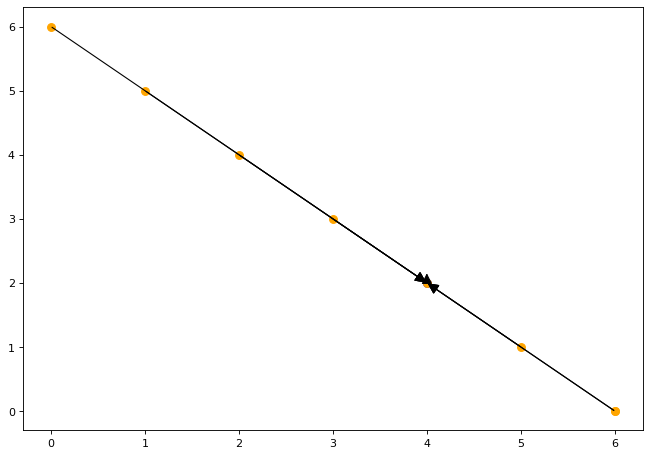
    


 

从上图可以看出, 两个relation是相同的.

这又是因为对 `Z[i+j]` 的唯一访问是read和write.

statement instance被连接到了访问相同数据的所有其他statement instance.


但是, 它并不一定会创建*依赖*. 例如, 依赖于自身并不完全有意义.
对于两个*依赖*的statement instance, 其中一个应该在另一个*之前*执行.
也就是说, 第一个statement要么生成第二个statement所需的一些数据, 要么使用一些将被第二个statement覆盖的数据.
依赖计算需要知道statement执行的*顺序*.

### Question

给定以下代码, 计算和可视化访问相同数组元素的statement pair, 并且至少其中一个访问是write.


*Hint:* 使用disjunction对同一数组的不同引用中的不同下标进行编码.

```c
for (i = 0; i < 6; ++i)
  for (j = 0; j < 5; ++j)
S1: X[i][j] = i * j;
for (i = 8; i < 13; ++i)
  for (j = 11; j < 15; ++j)
S2: Y[i][j] = X[i - 8][j - 10] - X[i - 7][j - 11];
```


```python
# step 1. 定义每个statement instance的domain
domain = isl.UnionSet(" { S1[i,j] : 0 <= i < 6 and 0 <= j < 5 ; S2[i,j] : 8 <= i < 13 and 11 <= j < 15 } ")
# S1写入X ; S2写入Y
writes = isl.UnionMap(" { S1[i,j] -> X[a = i, b = j]; S2[i,j] -> Y[a = i, b = j] }")
# S2读取X
reads = isl.UnionMap(" { S2[i,j] -> X[a,b] : (a = i-8 and b = j-10) or ( a= i-7 and b = j - 11) }")

# 添加domain约束
writes = writes.intersect_domain(domain)
reads = reads.intersect_domain(domain)

# 依赖计算
deps = writes.apply_range(reads.reverse())
print(deps)
```

    { S1[i, j] -> S2[i' = 7 + i, j' = 11 + j] : 0 < i <= 5 and 0 <= j <= 3; S1[i, j] -> S2[i' = 8 + i, j' = 10 + j] : 0 <= i <= 4 and 0 < j <= 4 }


```python
plt.figure(figsize=(10, 7), dpi=80)
plot_map(deps)
```


    

    


### Question

选择 `S1` 和 `S2` 的 *sample* 实例, 并绘制访问同一数组元素的其他语句的实例.


```python
point_22 = isl.Set("{S1[i,j]: i = 2 and j = 2}") # S1 写入X[2,2]
point_1012 = isl.Set("{S2[i,j]: i = 10 and j = 12}") # S2 读取 X[2][2] 和 X[3][1];
sinks = deps.intersect_domain(point_22)
sources = deps.intersect_range(point_1012)
plt.figure(figsize=(10, 7), dpi=80)
plot_map([sinks,sources])
```


    

    

# Dependence Analysis

当程序被转换时,保留程序语义的关键在于确保相同的值以相同的顺序写入和读取内存.


传统上,这是使用*data dependences*来表示的, 它对程序施加了部分执行顺序约束.
多面体模型的强大之处在于它能够在statement instance级别计算精确的data dependences.


如果一个statement instances在另一个statement instances之前执行, 则两个语句实例被称为*依赖*, 它们访问相同的数组元素, 并且至少一个访问权限写入该元素.


在`Schedules`章节中, 我们学习了如何定义statement instance的执行顺序.
在`Memory Access`章节中, 我们定义了*potentially dependent*的statement instance的关系, 即访问了相同的数组元素并且至少一个访问是写入.


最简单的依赖分析就是将两部分结合起来, 首先我们给出一个多项式乘积的kernel:
```c
double A[10], B[10], Z[20];

for (int i = 0; i <= 20; ++i)
S:  Z[i] = 0.;
for (int i = 0; i <= 10; ++i)
    for (int j = 0; j <= 10; ++j)
T:      Z[i + j] += A[i] * B[j];
```

然后定义对应的domain/schedule/access relations:


```python
import islpy as isl
domain = isl.UnionSet("{S[i]: 0 <= i <= 20; T[i,j]: 0 <= i,j <= 10}")
# t0是最外层的辅助维度, 用于标记外部的执行顺序. t1/t2则是内部循环的执行顺序.
schedule = isl.UnionMap(
    "{S[i]->[t0,t1,t2]: t0 = 0 and t1 = i and t2 = 0; T[i,j]->[t0,t1,t2]: t0=1 and t1=i and t2=j}")
A_S_Z = isl.Map("{S[i]->Z[a]: a = i and 0 <= a,i <= 20}")  # S 写入Z[i]
A_T_Z = isl.Map("{T[i,j]->Z[a]: a = i + j and 0 <= i,j <= 10 and 0 <= a <= 20}")  # T写入Z[i+j]
A_T_A = isl.Map("{T[i,j]->A[a]: a = i and 0 <= a <= 20 and 0 <= i,j <= 10}")  # T读取A[i]
A_T_B = isl.Map("{T[i,j]->B[a]: a = j and 0 <= a <= 20 and 0 <= i,j <= 10}")  # T读取B[i]
writes = isl.UnionMap(A_S_Z).union(A_T_Z) 
reads = isl.UnionMap(A_T_Z).union(A_T_A).union(A_T_B)
```


我们还可以计算访问相同数组元素的statement instance pair集合.

## Plugging in Schedule Information

因为statement instances是按照它们各自词典序执行的, 因此我们需要一种在relation中表达它的方法.


最简单的例子就是强制所有的statements的schedule都在相同的*space*中, 比如我们添加一个辅助维度$(t\_2)$到schedule `S`的statement `T`中

*isl* 允许我们定义`lexicographic less-than`的映射:


```python
schedule_space = isl.Set("{[t0,t1,t2]:}").get_space()
precedes = isl.Map.lex_lt(schedule_space)
print(precedes)
```

    { [t0, t1, t2] -> [t0', t1', t2'] : t0' > t0; [t0, t1, t2] -> [t0' = t0, t1', t2'] : t1' > t1; [t0, t1, t2] -> [t0' = t0, t1' = t1, t2'] : t2' > t2 }


上面的map按照词典序的定义执行, 先比较第一对元素,如果一个在另一个之前, 则顺序成立. 否则假设它们相等并比较第二对, 继续直到最后一对.

`precedes` relation 即前一个词典上在后一个之前成对元组的集合.

### Question


将 `schedule` 应用到 `domain` 以便将其映射到调度空间,
将结果保存为 `scheduled_domain`.


```python
scheduled_domain = domain.apply(schedule)
print(scheduled_domain)
```

    { [t0 = 1, t1, t2] : 0 <= t1 <= 10 and 0 <= t2 <= 10; [t0 = 0, t1, t2 = 0] : 0 <= t1 <= 20 }


现在我们知道如何将relation从domain空间移动到schedule空间: 将schedule relation apply到domain空间中的所有内容上.

### Question

检查 $( \mathtt{S}(2) )$ 在 $( \mathtt{T}(0,0) )$ 之前执行. 


*Hint 1*: 在两个instances之间定义映射.


*Hint 2*: 在schedule space中,可以检查relation是否是precedes的子集.


```python
rel = isl.UnionMap("{S[i] -> T[a,b]: i = 2 and a = 0 and b = 0}") # 构造出对应循环点的instance.
rel = rel.apply_domain(schedule).apply_range(schedule) # 为instance添加约束.
print(rel)
print(rel.is_subset(precedes))
```

    { [t0 = 0, t1 = 2, t2 = 0] -> [t0' = 1, t1' = 0, t2' = 0] }
    True


## Memory-based Dependence Analysis

### Flow Dependences


当数组元素首先由一个statement instance 写入然后由另一个statement instance 读取时, 就会出现数据流依赖性,
必须首先执行`writer` instance.


因此, 我们首先将左侧的 `writes` union map与右侧的反向 `reads` union map组合在一起,
$( \mathtt{writes} \circ \mathtt{reads}^{-1} )$.


然后我们将其转换为schedule space, 并将结果与schedule space中的词典序relation相交, 从而
只保留依赖 *source*(第一个时间点)在其 *sink*(第二个时间点)之前执行的对.


```python
dep_flow = writes.apply_range(reads.reverse()) # 获取潜在依赖
dep_flow = dep_flow.apply_domain(schedule).apply_range(schedule) # 添加约束.
dep_flow = dep_flow.intersect(precedes) # 和词典序做交集.
print(dep_flow) # 这里得到了执行顺序的交集
```

    { [t0 = 1, t1, t2] -> [t0' = 1, t1', t2' = t1 + t2 - t1'] : 0 <= t1 <= 10 and 0 <= t2 <= 10 and t1' >= -10 + t1 + t2 and t1' > t1 and 0 <= t1' <= 10 and t1' <= t1 + t2; [t0 = 0, t1, t2 = 0] -> [t0' = 1, t1', t2' = t1 - t1'] : t1' >= -10 + t1 and 0 <= t1' <= 10 and t1' <= t1 }


由此产生的relation是在*执行时间点*之间,而不是在点之间.
要将其转换回domain space,重新调用一下relation可以很容易地反转.
即反向schedule relation将执行时间点映射到statement instances.


```python
dep_flow = dep_flow.apply_domain(schedule.reverse()).apply_range(schedule.reverse()) # 再将其反向映射到数据点上, 
print(dep_flow)
```

    { T[i, j] -> T[i', j' = i + j - i'] : 0 <= i <= 10 and 0 <= j <= 10 and i' >= -10 + i + j and i' > i and 0 <= i' <= 10 and i' <= i + j; S[i] -> T[i', j = i - i'] : i' >= -10 + i and 0 <= i' <= 10 and i' <= i }


现在得到了 `T` 的不同instance之间的依赖关系, 我们可以分析它并与 *potentially* 依赖语句关系进行比较.


```python
dep_flow_T = dep_flow.intersect(isl.UnionMap("{T[i,j]->T[i',j']:}"))
potential = writes.apply_range(reads.reverse())
potential = potential.intersect(isl.UnionMap("{T[i,j]->T[i',j']:}"))
```


```python
from islplot.plotter import *
import matplotlib.pyplot as plt
plt.figure(figsize=(10,7))
plot_map(dep_flow_T)
```


    

    


```python
plt.figure(figsize=(10,7))
plot_map(potential)
```


    
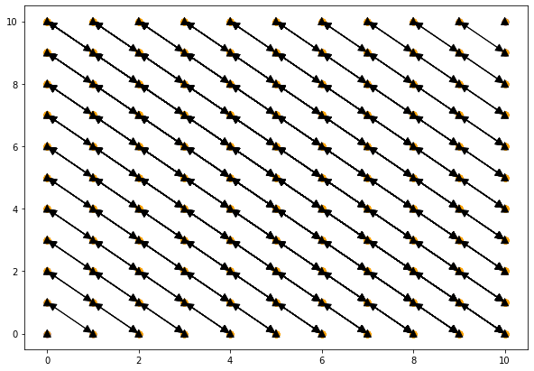
    


 


实际上每个statement instance是不能在其自身之前被执行, 因此观察到statement instances的self-dependences消失了.

### Question

绘制instance $ \mathtt{T}(4,2) $ instance 的依赖 *samples*, 即它所依赖的statement instances和依赖它的statement instances.


```python
point = isl.Set("{T[i,j]: i = 4 and j = 2}") # 添加instance point约束
sources = dep_flow_T.intersect_range(point) 
sinks = dep_flow_T.intersect_domain(point)
print(sources)
print(sinks)
```

    { T[i, j = 6 - i] -> T[i' = 4, j' = 2] : 0 <= i <= 3 }
    { T[i = 4, j = 2] -> T[i', j' = 6 - i'] : 5 <= i' <= 6 }


```python
# sources : 4 + 2 = 6, 他依赖于 [0,6], [1,5], [2,4], [3,3] 这些instance.
# sinks: [5,1],[6,0]依赖于[4,2]
plt.figure(figsize=(10,7))
plot_map([sources, sinks], marker_size=10)  
```


    

    


现在可以看到依赖于给定statement instances的实例都是访问相同数组元素并在它之前执行的实例,
类似地, 在给定statement instances之后执行的语句实例依赖于它.

### Anti and Output Dependences


Anti-dependences是flow dependencs的reverse,即先读后写,
考虑Anti-dependences意味着在读取之前不覆盖他的值,
Output dependences,或写后再写,需要保留写的顺序.

这些通常都被称为 *false* dependences,因为 *sink* 实例实际上并不 **依赖** *source* 语句实例产生的 *data*,
而是需要在后面执行以避免干扰其他实例.


false dependences的 *sink* 通常是写访问,而*source*可以是读或写,
因此我们将左侧的读写union与右侧的reverse写组合:

$( (\mathtt{reads} \cup \mathtt{writes}) \circ \mathtt{writes}^{-1} )$.


```python
dep_false = writes.union(reads).apply_range(writes.reverse())
dep_false = dep_false.apply_domain(schedule).apply_range(schedule)
dep_false = dep_false.intersect(precedes)
dep_false = dep_false.apply_domain(schedule.reverse()).apply_range(schedule.reverse())
print(dep_false)
```

    { T[i, j] -> T[i', j' = i + j - i'] : 0 <= i <= 10 and 0 <= j <= 10 and i' >= -10 + i + j and i' > i and 0 <= i' <= 10 and i' <= i + j; S[i] -> T[i', j = i - i'] : i' >= -10 + i and 0 <= i' <= 10 and i' <= i }


在这个例子中,false dependences与flow dependences完全对应,因为`S`只写入,而`T`只读取和写入相同的元素.
实际上一般情况并非如此.


```python
print(dep_false.is_equal(dep_flow))
```

    True


### Question: Input Dependences


即使*input* 或连续读取通常不被强制执行, 但这个得到他们的依赖关系在程序优化中也很有用.
因此与前两种情况类似地计算input dependences:


```python
dep_input = reads.apply_range(reads.reverse()) # 获得reads after reads的map
dep_input = dep_input.apply_domain(schedule).apply_range(schedule) # 添加约束.
dep_input = dep_input.intersect(precedes) # 和词典序做交集.
dep_input = dep_input.apply_domain(schedule.reverse()).apply_range(schedule.reverse()) # 再将其反向映射到数据点上, 
print(dep_input)
```

    { T[i, j] -> T[i', j' = i + j - i'] : 0 <= i <= 10 and 0 <= j <= 10 and i' >= -10 + i + j and i' > i and 0 <= i' <= 10 and i' <= i + j; T[i, j] -> T[i' = i, j'] : 0 <= i <= 10 and 0 <= j <= 10 and j' > j and 0 <= j' <= 10; T[i, j] -> T[i', j' = j] : 0 <= i <= 10 and 0 <= j <= 10 and i' > i and 0 <= i' <= 10 }


Input dependence看起来和flow dependence/false dependence不同,
其中只出现了`T`的实例, 这是因为`S`从来没有读过任何值.

### Question

绘制input dependence的*samples*:


```python
point = isl.Set("{T[i,j]: i = 4 and j = 2}")
# sources 其中竖线表示B[0,1,2]时多次读取A[4]的依赖, 横线表示B[2]时多次读取A[0,1,2,3]的依赖, 斜线表示Z[4,2]对Z[(0+6),(1+5),(2+4),(3+3)]的依赖
sources = dep_input.intersect_range(point) 
sinks = dep_input.intersect_domain(point)
plt.figure(figsize=(10,7))
plot_map([sources, sinks], marker_size=5)
```


    

    


复杂的依赖pattern会导致同一个statement instance从多个不同的array读取数据.

## Value-based Analysis


可以观察到每个statement instance依赖了*所有*访问相同数组元素的实例,但是其实并不是必要的.
比如`T(4,2)`和`T(5,1)`的flow dependence:


```python
point1 = isl.Set("{T[i,j]: i = 4 and j = 2}")
point2 = isl.Set("{T[i,j]: i = 5 and j = 1}")
sources1 = dep_flow_T.intersect_range(point1)
sources2 = dep_flow_T.intersect_range(point2)
plt.figure(figsize=(10,7))
plot_map([sources1, sources2],marker_size=10)
```


    
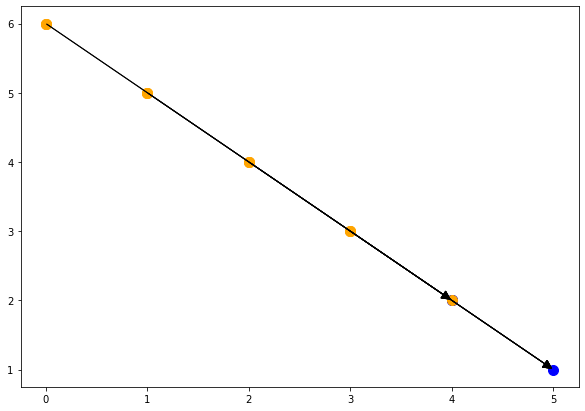
    


其中`T(5,1)` 依赖`T(4,2)`所依赖的所有实例以及`T(4,2)`本身.


```python
print(sources2.domain().subtract(point1).is_equal(sources1.domain())) # 检查是否是子集.
```

    True


如果将`T(4,2)`调度到`T(3,3)`之后, 那么`T(5,1)`也需要被调度到`T(4,2)`之后, 然后`T(5,1)`也需要调度到`T(3,3)`之后. 所以这两个实例之间的依赖关系*transitively covered(传递地覆盖)*其他实例之间的依赖.


我们可以安全地移除传递覆盖的flow dependence.
通过计算词典序最大的source instance对于任意sink instance的依赖,然后删除其他的source instance来完成.


但以上的计算是non- trivial的,并且可能涉及到线性优化问题的求解, *isl*提供了*value-based*分析的功能.
但是,它会使用更加精确的树结构来调度, 对于这个例子, 我们将直接提供这个schedule:


```python
schedule = isl.Schedule('{ domain: "{ T[i, j] : 0 <= i <= 10 and 0 <= j <= 10; S[i] : 0 <= i <= 20 }", child: { sequence: [{ filter: "{ S[i] }", child: { schedule: "[{S[i] -> [(i)]}, {S[i] -> [(0)]}]" }}, { filter: "{ T[i, j] }", child: { schedule: "[{T[i, j] -> [(i)]}, {T[i, j] -> [(j)]}]" }} ] } }')
```


现在可以来进行*value-based*的依赖分析:


```python
uai = isl.UnionAccessInfo.from_sink(reads)
uai = uai.set_must_source(writes)
uai = uai.set_schedule(schedule)
flow = uai.compute_flow()
dep_flow_precise = flow.get_may_dependence()
print(dep_flow_precise)
```

    { S[i] -> T[i' = -10 + i, j = 10] : 10 <= i <= 20; S[i] -> T[i' = 0, j = i] : 0 <= i <= 9; T[i, j] -> T[i' = 1 + i, j' = -1 + j] : 0 <= i <= 9 and 0 < j <= 10 }


现在依赖关系已经不再包含transitively covered的例子了.

### Question

将依赖关系限制在`T`上, 然后绘制`T(4,2)` 和 `T(5,1)`的samples, 并将他们*memory-based*的分析结果进行比较.


```python
dep_flow_precise_T = dep_flow_precise.intersect(isl.UnionMap("{T[i,j]->T[i',j']:}"))
sources1 = dep_flow_precise_T.intersect_range(point1)
sources2 = dep_flow_precise_T.intersect_range(point2)
plt.figure(figsize=(10,7))
plot_map([sources1, sources2], marker_size=10)
```


    
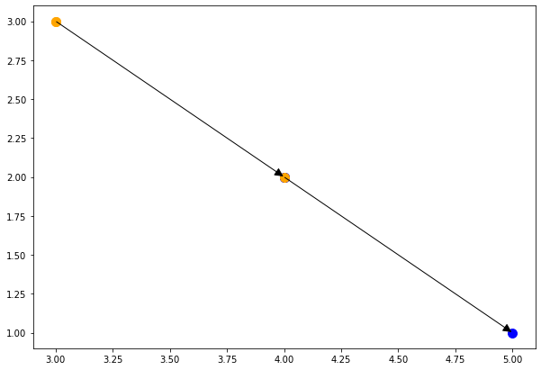
    


### 

可以发现,每个`T`的实例限制只依赖一个其他`T`的实例.


*Memory-based* dependences可以通过计算依赖关系的transitive closure来从*value-based* dependences恢复出来:


### Question

使用*value-based*的过程计算input dependences, 并且可视化:


```python
uai = isl.UnionAccessInfo.from_sink(reads)
uai = uai.set_must_source(reads)
uai = uai.set_schedule(schedule)
flow = uai.compute_flow()
dep_input_precise = flow.get_may_dependence()
print(dep_input_precise)
```

    { T[i, j] -> T[i' = i, j' = 1 + j] : 0 <= i <= 10 and 0 <= j <= 9; T[i, j] -> T[i' = 1 + i, j' = j] : 0 <= i <= 9 and 0 <= j <= 10; T[i, j] -> T[i' = 1 + i, j' = -1 + j] : 0 <= i <= 9 and 0 < j <= 10 }


```python
dep_flow_precise_T = dep_flow_precise.intersect(isl.UnionMap("{T[i,j]->T[i',j']:}"))
sources1 = dep_flow_precise_T.intersect_range(point1)
sources2 = dep_flow_precise_T.intersect_range(point2)
plt.figure(figsize=(10,7))
plot_map([sources1, sources2], marker_size=10)
```


    

    

# Classical Loop Transformations

### Setup AST generation infrastructure


```python
import islpy as isl


class CSource():
  def __init__(self, ast):
    self.source = ast

  def _repr_html_(self):
    return "<pre class='code'><code class=\"cpp hljs\">" + self.source.to_C_str() + "</code></pre>"


class CSourceComparer():
  def __init__(self, before: CSource, after: CSource):
    self.before = before
    self.after = after

  def _repr_html_(self):
    s = "<b>Before Transform:</b>\n"
    s += self.before._repr_html_()
    s += "<b>After Transform:</b>\n"
    s += self.after._repr_html_()
    return s


def print_before_after(domain, schedule_original, schedule_new):
  context = isl.Set("{ : }")
  build = isl.AstBuild.from_context(context)
  schedule_original = schedule_original.intersect_domain(domain)
  schedule_new = schedule_new.intersect_domain(domain)
  return CSourceComparer(CSource(build.node_from_schedule_map(schedule_original)),
                         CSource(build.node_from_schedule_map(schedule_new)))
  # print("<b>Before Transform:</b>")
  # ast = build.node_from_schedule_map(schedule_original)
  # print_code(ast)
  # print("<b>After Transform:</b>")
  # ast = build.node_from_schedule_map(schedule_new)
  # print_code(ast)

```

## Loop Reversal


循环反转可以改变循环元素被访问的方向, 反转之后, 之前迭代的第一个元素将会被最后执行, 最后一个元素将会被第一个执行.

**Benefits**:

- 可以被用来缩短依赖


```python
domain = isl.UnionSet("[n] -> {S[i] : 0 <= i < n}") # 原始迭代域
original = isl.UnionMap("{S[i] -> [i]}") # 原始schedule
transformation = isl.UnionMap("{[i] -> [-i]}")

transformed = original.apply_range(transformation) # 实施transform.
print_before_after(domain, original, transformed) # i \in [0,n-1] => [-n+1,0]
```


<b>Before Transform:</b>
<pre class='code'><code class="cpp hljs">for (int c0 = 0; c0 < n; c0 += 1)
  S(c0);
</code></pre><b>After Transform:</b>
<pre class='code'><code class="cpp hljs">for (int c0 = -n + 1; c0 <= 0; c0 += 1)
  S(-c0);
</code></pre>


# Loop Fusion


之前分离在两个不同循环的中的statement将会被放到同一个循环中.

**Benefits:**
  
  - 提高数据局部性


```python
domain = isl.UnionSet("[n] -> {S[i] : 0 <= i <= n; T[i] : 0 <= i <= n}") # 原始两个循环, S和T
original = isl.UnionMap("{S[i] -> [0, i]; T[i] -> [1, i]}") # 原始schedule, 是在循环外部安排顺序
transformation = isl.UnionMap("{[0, i] -> [i,0]; [1, i] -> [i, 1]}") # 将顺序安排在同一个循环内部.
transformed = original.apply_range(transformation) # NOTE 现实中要考虑是否存在数据依赖问题.
print_before_after(domain, original, transformed)
```


<b>Before Transform:</b>
<pre class='code'><code class="cpp hljs">{
  for (int c1 = 0; c1 <= n; c1 += 1)
    S(c1);
  for (int c1 = 0; c1 <= n; c1 += 1)
    T(c1);
}
</code></pre><b>After Transform:</b>
<pre class='code'><code class="cpp hljs">for (int c0 = 0; c0 <= n; c0 += 1) {
  S(c0);
  T(c0);
}
</code></pre>


# Loop Fission (Loop Distribution)


Loop fission 是指将在同一个循环中执行的statement分配到两个不同的循环中去.

**Benefits:**
 
 
  - 减少寄存器压力(在同一个循环中就意味着使用更多的寄存器存储数组地址/索引等)
  - 可以开启其他的优化, 比如一个循环中只有一个statement可以进行`SIMDization`,此时可以将其分离出去单独进行并行化.


```python
domain = isl.UnionSet("[n] -> {S[i] : 0 <= i <= n; T[i] : 0 <= i <= n}")
original = isl.UnionMap("{S[i] -> [i, 0]; T[i] -> [i, 1]}")
transformation = isl.UnionMap("{[i, 0] -> [0, i]; [i, 1] -> [1, i]}")

transformed = original.apply_range(transformation)
print_before_after(domain, original, transformed)
```


<b>Before Transform:</b>
<pre class='code'><code class="cpp hljs">for (int c0 = 0; c0 <= n; c0 += 1) {
  S(c0);
  T(c0);
}
</code></pre><b>After Transform:</b>
<pre class='code'><code class="cpp hljs">{
  for (int c1 = 0; c1 <= n; c1 += 1)
    S(c1);
  for (int c1 = 0; c1 <= n; c1 += 1)
    T(c1);
}
</code></pre>


# Loop Interchange

循环顺序交换


```python
domain = isl.UnionSet("[n,m] -> {S[i,j] : 0 <= i <= n and 0 <= j <= m }")
original = isl.UnionMap("{S[i,j] -> [i, j]}")
transformation = isl.UnionMap("{[i, j] -> [j, i]}")

transformed = original.apply_range(transformation)
print_before_after(domain, original, transformed)
```


<b>Before Transform:</b>
<pre class='code'><code class="cpp hljs">for (int c0 = 0; c0 <= n; c0 += 1)
  for (int c1 = 0; c1 <= m; c1 += 1)
    S(c0, c1);
</code></pre><b>After Transform:</b>
<pre class='code'><code class="cpp hljs">for (int c0 = 0; c0 <= m; c0 += 1)
  for (int c1 = 0; c1 <= n; c1 += 1)
    S(c1, c0);
</code></pre>


# Strip Mining


Strip mining是将单个循环按chunk分离为两个循环, 外循环在每个blocks上迭代, 内循环在每个block内部进行迭代.


**Benefits:**
 
 - 构建loop tiling和unroll-and-jam的block


```python
domain = isl.UnionSet("{S[i] : 0 <= i < 1024 }")
original = isl.UnionMap("{S[i] -> [i]}")
transformation = isl.UnionMap("{[i] -> [floor(i/4), i % 4]}")

transformed = original.apply_range(transformation)
print_before_after(domain, original, transformed)
```


<b>Before Transform:</b>
<pre class='code'><code class="cpp hljs">for (int c0 = 0; c0 <= 1023; c0 += 1)
  S(c0);
</code></pre><b>After Transform:</b>
<pre class='code'><code class="cpp hljs">for (int c0 = 0; c0 <= 255; c0 += 1)
  for (int c1 = 0; c1 <= 3; c1 += 1)
    S(4 * c0 + c1);
</code></pre>


# Loop Tiling


loop tiling是将多维循环切分为group,即tile. 首先一组外部循环在外部循环在所有的tile上迭代, point loops则在每个tile的points上迭代.

**Benefits:**
 
 - 增加数据局部性
 - 更加粗粒度的并行


```python
domain = isl.UnionSet("{S[i,j] : 0 <= i,j < 1024 }")
original = isl.UnionMap("{S[i,j] -> [i,j]}")
transformation = isl.UnionMap("{[i,j] -> [floor(i/4), i % 4, floor(j/4), j % 4]}") # 和strip mining类似.

transformed = original.apply_range(transformation)
print_before_after(domain, original, transformed)
```


<b>Before Transform:</b>
<pre class='code'><code class="cpp hljs">for (int c0 = 0; c0 <= 1023; c0 += 1)
  for (int c1 = 0; c1 <= 1023; c1 += 1)
    S(c0, c1);
</code></pre><b>After Transform:</b>
<pre class='code'><code class="cpp hljs">for (int c0 = 0; c0 <= 255; c0 += 1)
  for (int c1 = 0; c1 <= 3; c1 += 1)
    for (int c2 = 0; c2 <= 255; c2 += 1)
      for (int c3 = 0; c3 <= 3; c3 += 1)
        S(4 * c0 + c1, 4 * c2 + c3);
</code></pre>


# Unroll-and-jam


Unroll-and-jam是将外部循环进行strip-mining分离为tile和point 循环,然后交换point loop和最内层的循环.

**Benefits:**
 
 - 使得外部循环向量化.


```python
domain = isl.UnionSet("{S[i,j] : 0 <= i,j < 1024 }")
original = isl.UnionMap("{S[i,j] -> [i,j]}")
transformation = isl.UnionMap("{[i,j] -> [floor(i/4), j, i % 4] }")

transformed = original.apply_range(transformation)
print_before_after(domain, original, transformed)
```


<b>Before Transform:</b>
<pre class='code'><code class="cpp hljs">for (int c0 = 0; c0 <= 1023; c0 += 1)
  for (int c1 = 0; c1 <= 1023; c1 += 1)
    S(c0, c1);
</code></pre><b>After Transform:</b>
<pre class='code'><code class="cpp hljs">for (int c0 = 0; c0 <= 255; c0 += 1)
  for (int c1 = 0; c1 <= 1023; c1 += 1)
    for (int c2 = 0; c2 <= 3; c2 += 1)
      S(4 * c0 + c2, c1);
</code></pre>


# Skewing

倾斜迭代域

**Benefits:**
 - 使得部分无依赖的statement得以并行化.


```python
domain = isl.UnionSet("[n] -> {S[i,j] : 0 <= i,j < n }")
original = isl.UnionMap("{S[i,j] -> [i,j]}")
transformation = isl.UnionMap("{[i,j] -> [i, i + j]}")

transformed = original.apply_range(transformation)
print_before_after(domain, original, transformed)
```


<b>Before Transform:</b>
<pre class='code'><code class="cpp hljs">for (int c0 = 0; c0 < n; c0 += 1)
  for (int c1 = 0; c1 < n; c1 += 1)
    S(c0, c1);
</code></pre><b>After Transform:</b>
<pre class='code'><code class="cpp hljs">for (int c0 = 0; c0 < n; c0 += 1)
  for (int c1 = c0; c1 < n + c0; c1 += 1)
    S(c0, -c0 + c1);
</code></pre>


# AST Generation

<br>
<center>
<table>
<tr>
<td>
<center>
<b>Polyhedral Model</b>
</center>
</td>
<td>
</td>
<td>
<center>
<b>Imperative Program</b>
</center>
</tr>

<tr>
<td>

<b>Iteration Domain</b>  
<br>

$ \{ T[i,j] \mid 0 < i \le j < 10; S[i,0] \mid 0 < i \le 20 \}$   

<br>
<br>

<b>Schedule</b>  <br>

$ \{ T[i,j] \rightarrow [i,j]; S[i,0] \rightarrow [i,j] \}$   

</td>
<td>

&nbsp; &nbsp; &nbsp; $ \rightarrow $ &nbsp; &nbsp; &nbsp; 

</td>
<td>
<center>
<br>

```c
const int N = 10;
double X[N], Y[N], Z[2*N];

for (int i = 0; i <= 2*N; ++i)
S:  Z[i] = 0.;
for (int i = 1; i <= N; ++i)
    for (int j = i; j <= N; ++j)
T:      Z[i + j] += A[i] * B[j];
```

</td>
</tr>
</table>
</center>

<br>

[Polyhedral AST generation is more than scanning polyhedra](https://dl.acm.org/doi/10.1145/2743016)


## Generate an AST
### Define a simple polyhedral program description


```python
import islpy as isl
from islplot.plotter import *
import matplotlib.pyplot as plt
context = isl.Set("{ : }")
domain = isl.Set("{ S[t,i] : 1 <=t<=5 and 1<=i<=10 }")
schedule = isl.Map("{ S[t,i] -> T[t+1,i+t+10] }")

schedule_domain = schedule.intersect_domain(domain)
plt.figure(figsize=[10, 7])
plot_set_points(domain)
plot_map(schedule_domain)
```


    
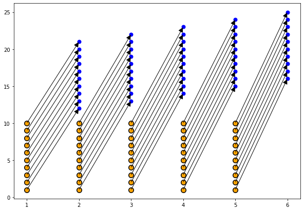
    


## Translate polyhedral program description to an AST


最终生成的AST是实际的AST, 可以通过树操作对其进行遍历和检查.


```python

class CSource():
  def __init__(self, ast):
    self.source = ast

  def _repr_html_(self):
    return "<pre class='code'><code class=\"cpp hljs\">" + self.source.to_C_str() + "</code></pre>"


class CSourceComparer():
  def __init__(self, before: CSource, after: CSource):
    self.before = before
    self.after = after

  def _repr_html_(self):
    s = "<b>Before Transform:</b>\n"
    s += self.before._repr_html_()
    s += "<b>After Transform:</b>\n"
    s += self.after._repr_html_()
    return s

def print_code(ast):
  return CSource(ast)
```


```python
build = isl.AstBuild.from_context(context) 
ast = build.node_from_schedule_map(schedule.intersect_domain(domain))
print_code(ast) # 这里生成的domain实际上被isl进行了优化.
```


<pre class='code'><code class="cpp hljs">for (int c0 = 2; c0 <= 6; c0 += 1)
  for (int c1 = c0 + 10; c1 <= c0 + 19; c1 += 1)
    S(c0 - 1, -c0 + c1 - 9);
</code></pre>


## AST Generation for Constraint Sets


通常只有当满足特定条件时才可以使用一些transformation优化程序, 要始终实施这种优化方式的话, 那么需要将代码分为不同版本, 当满足特定条件时执行优化后的代码, 否则执行非优化的代码.


一个简单的例子:
    
```c
void foo(long n, A[][100]) {
  for (i = 0; i < n; i++)
    for (j = 0; j < n; j++)
      A[i][j] += i+j;
}
```


这个代码代码当j小于100时会有更简单的依赖, 也就是要求`n<100`. 那么就可以使用如下的方法来保证优化后不出错误.

```c
void foo(long n, A[][100]) {
  if (n < 100)
    // optimized code
  else
    // otherwise
}
```


isl的AST generator允许生成任意来自isl的约束bool条件集合.


## A simple constraint set


```python
condition = isl.Set("[n] -> {: n < 100}")
expr = build.expr_from_set(condition)
print(expr.to_C_str())
```

    n <= 99


## Recovery of modulo expressions


```python
condition = isl.Set("[n, m] -> {: n % 100 = 2}")
expr = build.expr_from_set(condition)
print(expr.to_C_str())
```

    (n - 2) % 100 == 0


## Verification of complex conditions


```python
condition = isl.Set("[n, m] -> {: (n != 0 implies m = 5) or n + m = 42}")
expr = build.expr_from_set(condition)
print(expr.to_C_str())
```

    m == 5 || n == 0 || n + m == 42


# Parse C Code
需要手动编译安装pet库.


```python
import pet
import sys
import tempfile


def parse_code(source: str, func_name: str):
  with open("/tmp/parse_code.c", "w") as f:
    f.write(source)
  scop = pet.scop.extract_from_C_source("/tmp/parse_code.c", func_name)
  context = scop.get_context()
  schedule = scop.get_schedule()
  reads = scop.get_may_reads()
  writes = scop.get_may_writes()
  return (context, schedule, reads, writes)


context, schedule, reads, writes = parse_code("""
void rotate(int N, int A[N], int B[N])
{
#pragma scop
	for (int i = 0; i < N; ++i)
		A[i] = i == 0 ? B[N - 1] : B[i - 1];
#pragma endscop
}
""", "rotate")

```

    [N] -> {  : -2147483648 <= N <= 2147483647 }
    { domain: "[N] -> { S_0[i] : 0 <= i < N }", child: { schedule: "[N] -> L_0[{ S_0[i] -> [(i)] }]" } }
    [N] -> { S_0[i] -> B[-1 + i] : 0 < i < N; S_0[i = 0] -> B[-1 + N] : N > 0 }
    [N] -> { S_0[i] -> A[i] : 0 <= i < N }


```python
print(context)
```

    [N] -> {  : -2147483648 <= N <= 2147483647 }


```python
print(schedule)
```

    { domain: "[N] -> { S_0[i] : 0 <= i < N }", child: { schedule: "[N] -> L_0[{ S_0[i] -> [(i)] }]" } }


```python
print(reads)
```

    [N] -> { S_0[i] -> B[-1 + i] : 0 < i < N; S_0[i = 0] -> B[-1 + N] : N > 0 }


```python
print(writes)
```

    [N] -> { S_0[i] -> A[i] : 0 <= i < N }


