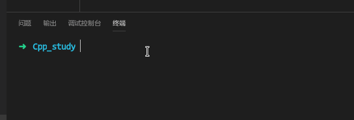

为了使程序变得美观大方,所以我写了一个命令行进度条的库,用c语言写的.下面介绍一下库的用法.

<!--more-->
# 源代码
`probar.c`:

```c
/*
 * @Author: Zheng Qihang
 * @Date: 2018-11-16 17:06:20
 * @Last Modified by: Zheng Qihang
 * @Last Modified time: 2018-11-16 17:10:58
 */
#include <stdarg.h>
#include <stdio.h>
#include <stdlib.h>
#include <string.h>
#include <unistd.h>

struct PrograssBar_S {
    int len;
    int delta;
    int cnt;
    char background;
    char foreground;
    char label[200];
    char *pbar;
};
/* @brief 全局变量用于保存参数
 *
 * */
static struct PrograssBar_S g_probar= {};
/* @brief 初始化
 * @ len          : 进度条长度
 * @ delta        : 进度条步进长度
 * @ background   : 进度条背景
 * @ foreground   : 进度条前景
 * @ label        : 进度条左侧图形  不可超过200!
 * */
void probar_init(int len, int delta, char backgroud, char foreground,
                 const char *label) {
    g_probar.cnt= 0;
    g_probar.len= len;
    g_probar.delta= delta;
    g_probar.background= backgroud;
    g_probar.foreground= foreground;
    char *pg_label= g_probar.label;
    for (const char *p= label; *p != '\0'; ++p) { *pg_label++= *p; }
    *pg_label= '\0';
    g_probar.pbar= (char *)malloc(sizeof(char) * g_probar.len);
    memset((void *)g_probar.pbar, 0x20, g_probar.len);
    printf("%s  [%-*s]   [%05.2f%%]   %s\r", g_probar.label, g_probar.len,
           g_probar.pbar, g_probar.cnt * (100 / (float)g_probar.len), "");
    fflush(stdout);
    g_probar.cnt++;
}

/* @brief 绘制进度条
 * @    show_str  : 用于描述进度
 *      最后一个字符传入后缀\r使进度条消失,\n使进度条保留
 * */
void probar_show(const char *show_str) {
    if (g_probar.cnt == g_probar.len) { /* end */
        printf("%s  [%-*s]   [%05.2f%%]   %s", g_probar.label, g_probar.len,
               g_probar.pbar, g_probar.cnt * (100 / (float)g_probar.len), show_str);
        g_probar.cnt++;
        return;
    } else if (g_probar.cnt > g_probar.len) {
        return;
    }
    printf("%*c\r", 80, ' ');
    fflush(stdout);
    printf("%s  [%-*s]   [%05.2f%%]   %s\r", g_probar.label, g_probar.len,
           g_probar.pbar, g_probar.cnt * (100 / (float)g_probar.len), show_str);
    fflush(stdout);
    if (g_probar.cnt > 0) { g_probar.pbar[g_probar.cnt - 1]= g_probar.background; }
    g_probar.pbar[g_probar.cnt]= g_probar.foreground;
    g_probar.pbar[g_probar.cnt + 1]= '\0';
    g_probar.cnt++;
}

/* @brief 清空变量
 *
 * */
void probar_delete() {
    g_probar.cnt= 0;
    g_probar.len= 0;
    g_probar.delta= 0;
    g_probar.background= '=';
    g_probar.foreground= '>';
    free(g_probar.pbar);
    printf("%*c\r", 80, ' ');
    fflush(stdout);
}
```


`probar.h`:

```c
/*
 * @Author: Zheng Qihang 
 * @Date: 2018-11-16 17:06:22 
 * @Last Modified by:   Zheng Qihang 
 * @Last Modified time: 2018-11-16 17:06:22 
 */
#ifndef __PROBAR_H
#define __PROBAR_H

extern void probar_init(int len, int delta, char backgroud, char foreground,
                        const char *label);
extern void probar_delete();
extern void probar_show(const char *show_str);

#endif
```


# 用法
`main.c`

```c
#include "probar.h"
#include <unistd.h>
int main(int argc, char const *argv[]) {
    /* 传入 总长度 步进长度 背景字符 前景字符 显示字 即可 */
    probar_init(12, 1, '=', '>', "\e[0;33m[  WAIT  ] \e[0m");
    for (int i= 0; i < 12; ++i) {
        /* 最后一个字符传入后缀\r使进度条消失 */
        char *s[12]= {"这", "是", "进", "度", "条", "库",
                      "的", "简", "单", "示", "例", "!\r"};
        probar_show(s[i]);
        usleep(1000 * 300);
    }
    probar_delete();

    probar_init(12, 1, '=', '>', "\e[0;33m[  WAIT  ] \e[0m");
    for (int i= 0; i < 12; ++i) {
        /* 最后一个字符传入后缀\n使进度条保留 */
        char *s[12]= {"这", "是", "进", "度", "条", "库",
                      "的", "简", "单", "示", "例", "!\n"};
        probar_show(s[i]);
        usleep(1000 * 300);
    }
    probar_delete();
    return 0;
}
```


# 编译运行

```sh
➜  Cpp_study gcc probar.c test.c
➜  Cpp_study ./a.out -s
```

效果如下:
