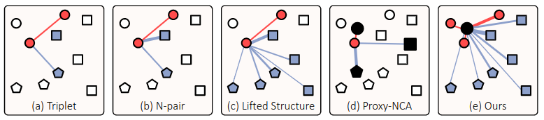
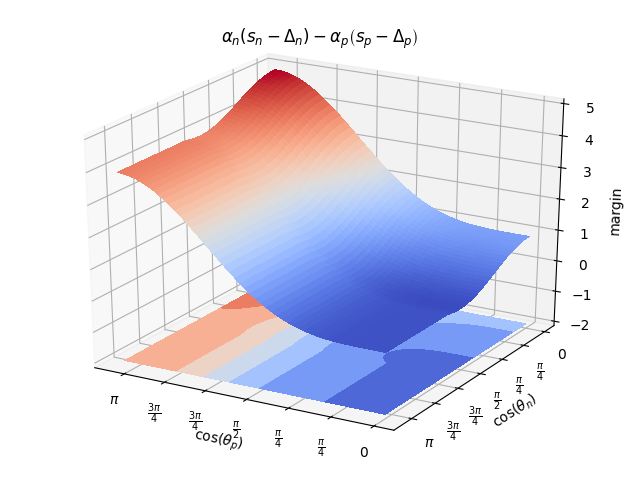

这是`CVPR2020`的一篇度量学习的论文.来自韩国.我觉得还蛮有意思的,因此学习一番.

他的图画的是真好看,虽然做的事情其实就是把`amsoftmax`换个皮...

<!--more-->

# 原理

论文主要提出了一个名为`Proxy Anchor`的损失函数.他相比于上图中`a,b,c,d`的方法.同时考虑了间距的大小作为损失的系数,且利用了整个`batch`中所有的数据,并用`anchor`作为`proxy`使得聚类中心更加明确.

### 基于pair的损失

对于一些没有利用整个`batch`所有数据的方法,那就需要依赖采样来取得`triplet pair`,`N-pair`等等,这样实际上引用了额外的复杂度.因此使用基于`proxy`的方法,不需要`pair`采样的方式.

### 基于proxy的损失

基于`proxy`的度量学习是一种相对较新的方法，可以解决基于`pair`的损失的复杂性问题。`proxy`表示训练数据子集的代表，并被估计为嵌入网络参数的一部分。此类别中方法的共同思想是推断一小组的`proxy`，这些`proxy`捕获嵌入空间的全局结构，并将每个数据点与`proxy`相关联，而不是训练过程中的其他数据点。由于`proxy`的数量明显少于训练数据的数量，因此可以大大减少训练的复杂性.

第一个基于`proxy`的方法为`Proxy-NCA`,他使用`proxies`的`Neighborhood Component Analysis`作为一种近似,首先为每个类别设置一个`proxy`,将数据点与`proxy`关联,拉近正类的距离,拉开负类的距离.

使用`proxy`有助于极大地提高训练的收敛性，但有一个固有的局限性：由于每个数据点仅与`proxy`相关联，因此基于`pair`的方法的丰富的数据间关系不再可用。因此提出`Proxy Anchor`损失可以克服此问题，因为它的梯度可以反映数据的相对联系，这允许它们的嵌入向量在训练过程中相互影响.

### Proxy-NCA Loss

首先介绍原本的损失.`Proxy-NCA`损失将`proxy`分配给每个类别，`proxy`的数量与类别标签的数量相同。给定一个输入数据点作为`anchor`，将同一类输入的`proxy`视为正，其他`proxy`为负。令$x$表示输入的嵌入向量，$p^+$为正`proxy`，$p^-$为负`proxy`。损失则为如下:

$$
\begin{aligned}
\ell(X) &=\sum_{x \in X}-\log \frac{e^{s\left(x, p^{+}\right)}}{\sum\limits_{p^{-} \in P^{-}} e^{s\left(x, p^{-}\right)}} \\
&=\sum_{x \in X}\left\{-s\left(x, p^{+}\right)+\underset{p^{-} \in P^{-}}{\operatorname{LSE}} s\left(x, p^{-}\right)\right\}
\end{aligned}
$$

其中$X$为整个`batch`的嵌入向量,$P^-$为负`proxy`的集合,$s(\cdot,\cdot)$表示余弦相似度.其中$\operatorname{LSE}$为`log sum exp`.熟悉基于`softmax`损失的同学应该已经看出来了,这里其实就是交叉熵换了个皮.

对于此损失的梯度如下:
$$
\frac{\partial \ell(X)}{\partial s(x, p)}=\left\{\begin{array}{ll}
-1, & \text { if } p=p^{+} \\
\frac{e^{s(x, p)}}{\sum\limits_{p^{-} \in P^{-}} e^{s\left(x, p^{-}\right)}}, & \text {otherwise }
\end{array}\right.
$$

训练时会使得$x$与$p^+$尽量接近,使得$x$与$p^-$远离.不过注意到对于正类的梯度是恒定的,对于负类的梯度是有考虑到相似度的.此损失还是比较鲁棒的,但是由于损失仅使每个嵌入向量与`proxy`相关联，因此它无法利用细粒度的数据间关系。这种缺点限制了通过`Proxy-NCA`嵌入的能力.

### Proxy-Anchor Loss

`Proxy-Anchor`损失旨在克服`Proxy-NCA`的局限性，同时保持较低的训练复杂性。主要思想是将每个`proxy`作为锚，并将其与整个数据批关联，以便在训练过程中数据通过`proxy anchor`彼此交互。此损失先按照`Proxy-NCA`的标准设置为每个类别分配一个`proxy`，公式为:

$$
\begin{aligned}
\ell(X)=& \frac{1}{|P+|} \sum_{p \in P^{+}} \log \left(1+\sum_{x \in X_{p}^{+}} e^{-\alpha(s(x, p)-\delta)}\right) \\
&+\frac{1}{|P|} \sum_{p \in P} \log \left(1+\sum_{x \in X_{p}^{-}} e^{\alpha(s(x, p)+\delta)}\right)
\end{aligned}
$$

这个也是比较老套的设置方法,其中$\delta$为`margin`,$\alpha$为尺度系数.将一个`batch`中所有的嵌入向量$X$分成两个子集$X_p^+,X_p^-$,其中$X_p^+$表示`proxy`$p$的正样本嵌入向量,$X_p^-$则是剩下的所有向量.

将损失换一个形式:
$$
\begin{aligned}
\ell(X)=& \frac{1}{\left|P^{+}\right|} \sum_{p \in P^{+}}[\text {Softplus }(\mathop{\operatorname{LSE}}\limits_{x \in X_{p}^{+}} -\alpha(s(x, p)-\delta))] \\
&+\frac{1}{|P|} \sum_{p \in P}\left[\text {Softplus }\left(\mathop{\operatorname{LSE}}\limits_{p \in X_{p}^{-}} \alpha(s(x, p)+\delta)\right)\right]
\end{aligned}
$$

这样更加符合`circle loss`中所提出的统一形式了.其中这里的$|P^+|$是正样本的统计数量,$|P|$是总类别数.~~这个系数我觉得不加也没关系~~...

**NOTE** 我看了下他官方的代码,实际上什么基于`proxy`的方法就是额外再加一个可训练的聚类中心...我之前的各种损失函数的实现是直接把最后一层作为聚类中心(也就是他们所说的`proxy`),这么看来把`circle loss`拉到度量学习的标准任务里肯定也是很能打的.

## 额外实验1

我做的cifar10分类实现，实际上`batchsize`改成500之后$|P^+|$有99.99的概率为10，$|P|$为10。我训练结果只和`circle loss`差0.8个点。然后我认为删除这个系数没有关系，但结果立马打脸了，差7个点了。其实这个问题还是在于$\alpha$系数上面，对于`proxy anchor loss`和`amsoftmax loss`来说没有像`circle loss`中的`自适应pace`，优化到后期可以说学习率太大也可以说是梯度太大，模型参数波动性会较大。这个实验佐证了`自适应pace`的重要性。

## 额外实验2

后面我又做了一下关于$margin$的实验，实际上我们考虑`softmax`分类的过程，要使他分类难度增强应该是降低正确类别的数值，因此应该是$s_p=cos(\theta_{y_i})-m$，这样才会强制正确类别的向量夹角更小。那么对于不正确的的分类类别，应该是加大他的数值，$s_n=cos(\theta_{j\neq y_i})+m$,这样会强制降低向量更加接近垂直。

这里留个小坑，对于`circle loss`里面的$margin$设置我还是得重新仔细看看。

**NOTE** 2020-6-23日更新，因为`circle loss`设置了`自定义pace`，因此他计算决策面的时候将$\alpha$考虑进去了，所以他得到的$margin$和我之前设想的不一样。然后我又做了一下他的间距分布图，其实这个损失还是可以继续改进的，大家可以看到当$\cos(\theta_p)=0，\cos(\theta_n)\in(\pi,\frac{\pi}{2})$时，对于负`pair`的损失是较小的。他所说的`circle`区域实际上是在$\cos(\theta_p)=0，\cos(\theta_n)=\frac{\pi}{2}$有一个更小的凹槽，这里是我们的`ideal`区域。

接下来如果有老哥可以把$\cos(\theta_p)=0，\cos(\theta_n)\in(\pi,\frac{\pi}{2})$这块区域的损失重新设计一下，应该可以得到更好的收敛效果。

等等。。这样判断太武断了，应该还需要分析一下梯度的变化。我这里就不继续深入了。

