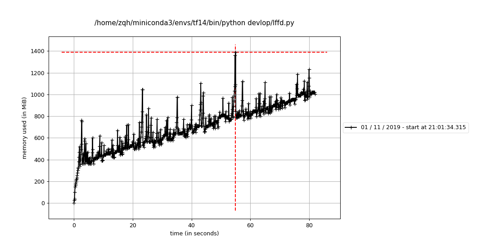
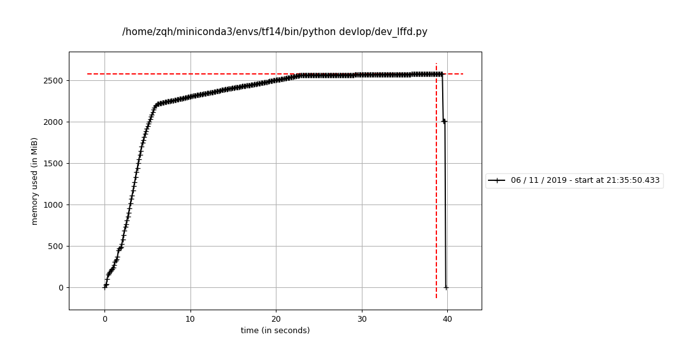
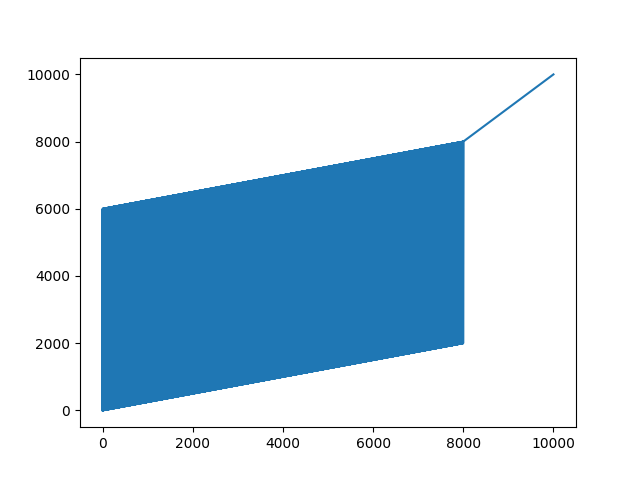
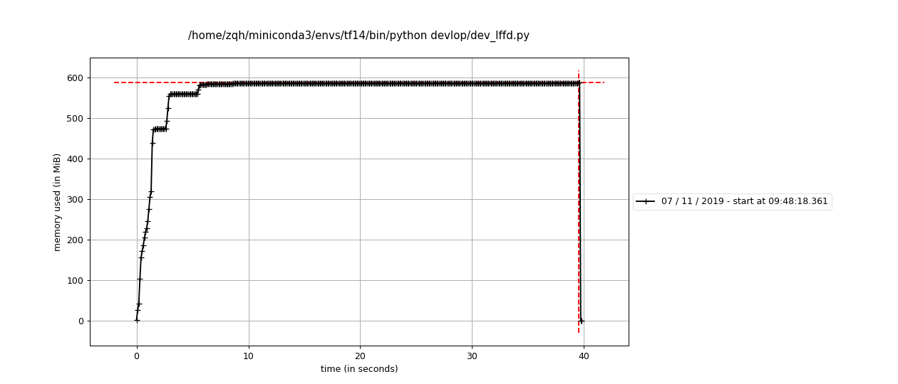
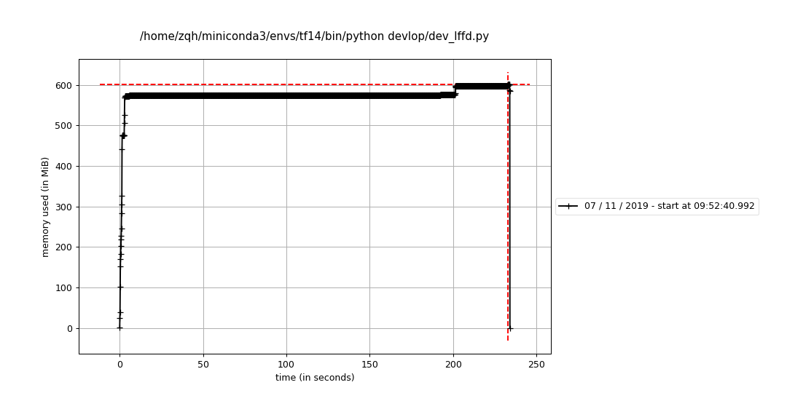
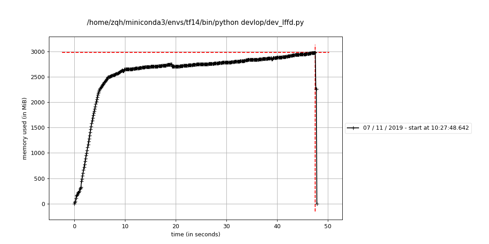
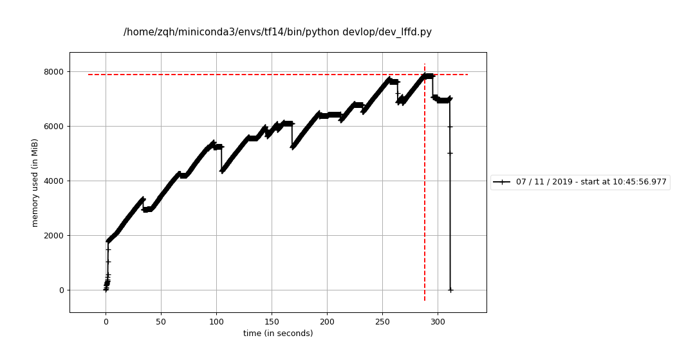

我今天运行个模型,跑着跑着内存就泄漏了,我很奇怪,然后用`memory_profiler`分析了下内存泄漏的点.发现是`skimage`的`resize`中出现了泄漏.

<!--more-->


# 问题原因

## 原本的代码:

```python
img = resize(img, [int(img.shape[0] * resize_factor),
           int(img.shape[1] * resize_factor)],
     preserve_range=True).astype(np.uint8)
```

然后分析内存的时候得到如下:

```
Line #    Mem usage    Increment   Line Contents
================================================
130 871.9648 MiB   0.0000 MiB           img = img_as_ubyte(resize(img, [int(img.shape[0] * resize_factor),
131 924.0703 MiB  52.1055 MiB                                           int(img.shape[1] * resize_factor)]))


130 924.0703 MiB   0.0000 MiB           img = img_as_ubyte(resize(img, [int(img.shape[0] * resize_factor),
131 946.7148 MiB  22.6445 MiB                                           int(img.shape[1] * resize_factor)]))

130 875.6328 MiB   0.0000 MiB           img = img_as_ubyte(resize(img, [int(img.shape[0] * resize_factor),
131 932.0742 MiB  56.4414 MiB                                           int(img.shape[1] * resize_factor)]))
```




## 修改后代码

我参考了网上的人,修改之后发现还是不行
```python
img = img_as_ubyte(resize(img, [int(img.shape[0] * resize_factor),
                                int(img.shape[1] * resize_factor)]))
```

```
Line #    Mem usage    Increment   Line Contents
================================================
132 795.3477 MiB   0.0000 MiB           img = resize(img, [int(img.shape[0] * resize_factor),
133 795.3477 MiB   0.0000 MiB                              int(img.shape[1] * resize_factor)],
134 807.4141 MiB  12.0664 MiB                        preserve_range=True).astype(np.uint8)


132 807.4141 MiB   0.0000 MiB           img = resize(img, [int(img.shape[0] * resize_factor),
133 807.4141 MiB   0.0000 MiB                              int(img.shape[1] * resize_factor)],
134 823.9102 MiB  16.4961 MiB                        preserve_range=True).astype(np.uint8)

132 824.1680 MiB   0.0000 MiB           img = resize(img, [int(img.shape[0] * resize_factor),
133 824.1680 MiB   0.0000 MiB                              int(img.shape[1] * resize_factor)],
134 824.1758 MiB   0.0078 MiB                        preserve_range=True).astype(np.uint8)
```


## 只测试resize

之前的分析文件:
```
Line #    Mem usage    Increment   Line Contents
================================================
282 880.1875 MiB   0.0000 MiB           if boxes is None:
283 895.7812 MiB  15.5938 MiB               self._resize_neg_img(im_in, img)
284                                     else:
285                                         boxes = self._resize_pos_img(im_in, img, boxes)


282 840.2148 MiB   0.0000 MiB           if boxes is None:
283 889.9688 MiB  49.7539 MiB               self._resize_neg_img(im_in, img)
284                                     else:
285                                         boxes = self._resize_pos_img(im_in, img, boxes)

282 889.9688 MiB   0.0000 MiB           if boxes is None:
283 890.1172 MiB   0.1484 MiB               self._resize_neg_img(im_in, img)
284                                     else:
285                                         boxes = self._resize_pos_img(im_in, img, boxes)
```

我发现都是`_resize_neg_img`函数出的问题,然后就只测试这个函数看看有没有问题,发现好像并没有内存泄漏.


我发现内存泄漏还是得在`tf.data`对象运行起来之后才能发现的.所以我得继续测试.


这里用了那个`line_profiler`测试了一下代码执行时间.发现了一个大问题:
```sh
img = img_as_ubyte(rescale(img, resize_factor, multichannel=True))  # 107486.0ms
img = resize(img, None, fx=resize_factor, fy=resize_factor)  # 849.4ms
```
!用`skimage`和`opencv`的`resize`速度居然差10倍以上.

## 修改读取方式后

最后我虽然没有找到哪里出现了问题,但是我首先修改了图像处理函数都使用`opencv`完成.

第二,我看了一下`tfrecord`的制作方式,将数据转换为了`tfrecord`的存储方式.
制作时,我们可以选择将图像解码前的`buf`序列化,也可以先读取出来然后用`tf.io.serialize_tensor()`的方式进行序列化,后者所存储的`tfrecord`会大10倍以上.我经过测试之后发现,直接存未序列化的图像数据比较好,因为读取的时候对`tensor`反序列化和解码图像速度差不太多.
```python
def make_example(img_string: str, label: int, bbox_string: str):
    """ make example """
    feature = {
        'img_raw': tf.train.Feature(bytes_list=tf.train.BytesList(value=[img_string])),
        'label': tf.train.Feature(int64_list=tf.train.Int64List(value=[label])),
        'bbox': tf.train.Feature(bytes_list=tf.train.BytesList(value=[bbox_string])),
    }

    return tf.train.Example(features=tf.train.Features(feature=feature)).SerializeToString()
    
with tf.io.TFRecordWriter(str(record_file)) as writer:
    for idx in tqdm(idx_list, total=len(idx_list)):
        im_buf, label, bboxes = data[idx]
        bboxes = tf.io.serialize_tensor(bboxes).numpy()
        serialized_example = make_example(im_buf.tostring(), label, bboxes)
        writer.write(serialized_example)
```

读取代码实例,`tfrecord`总体来说还是比较简单的,唯一的不方便就是我们调试的时候不方便,我之前都是从列表里面读取图像的,那样调试的时候直接执行就能很快找到问题,现在需要先启动一个小的`dataset`对象才可以进行图像读取,比较难受.综合考虑还是性价比较高,训练的速度有明显提升:
```python
def build_datapipe(self, pos_tfrecord: tf.Tensor, neg_tfrecord: tf.Tensor,
                   batch_size: int, rand_seed: int, is_augment: bool,
                   is_normlize: bool, is_training: bool) -> tf.data.Dataset:

    def _wapper(raw_img: np.ndarray, ann: np.ndarray, is_augment: bool) -> [np.ndarray, tuple]:
        """ wapper for process image and ann to label """
        raw_img, ann = self.process_img(raw_img, ann, is_augment, True, False)
        labels = self.ann_to_label(ann)
        return (raw_img, *labels)

    def _parser(stream: bytes):
        example = tf.io.parse_single_example(stream, {
            'img_raw': tf.io.FixedLenFeature([], tf.string),
            'label': tf.io.FixedLenFeature([], tf.int64),
            'bbox': tf.io.FixedLenFeature([], tf.string),
        })  # type:dict

        raw_img = tf.image.decode_image(example['img_raw'], channels=3)
        label = example['label']
        bbox = tf.io.parse_tensor(example['bbox'], tf.float32)

        # load image -> resize image -> image augmenter -> make labels
        raw_img, *labels = tf.numpy_function(
            _wapper, [raw_img, bbox, is_augment],
            [tf.uint8] + [tf.float32] * self.scale_num, name='process_img')

        # normlize image
        if is_normlize:
            img = self.normlize_img(raw_img)
        else:
            img = tf.cast(raw_img, tf.float32)

        for i, v in enumerate(self.featuremap_size):
            labels[i].set_shape((v, v, self.out_channels + 2))
        img.set_shape((self.in_hw[0], self.in_hw[1], 3))

        return img, tuple(labels)

    if is_training:
        pos_ds = (tf.data.TFRecordDataset(pos_tfrecord, buffer_size=100,
                                          num_parallel_reads=6).
                  shuffle(batch_size * 200, rand_seed).repeat().map(_parser))
        neg_ds = (tf.data.TFRecordDataset(neg_tfrecord, buffer_size=100,
                                          num_parallel_reads=6).
                  shuffle(batch_size * 200, rand_seed).repeat().map(_parser))
        ds = (tf.data.experimental.sample_from_datasets(
            [pos_ds, neg_ds], [1 - self.neg_sample_ratio,
                               self.neg_sample_ratio]).
            batch(batch_size, True).prefetch(-1))
    else:
        raise NotImplementedError('No support to test eval')

    return ds
```


## 进一步定位问题

现在我发现虽然用了`tfrecord+tf.data`的方式,但还是有内存泄漏的问题,不过这次更加进一步的定位到了问题:

测试代码如下,我检测`fn`是否报错.
```python
@profile(stream=open('tmp/process.log', 'w'), precision=4)
def fn(sess, h: LFFDHelper, imgs, bboxs):
    img, ann = sess.run([imgs, bboxs])
    img, ann = h.resize_img(img, ann)
    img, ann = h.data_augmenter(img, ann)
    label = h.ann_to_label(ann)
    return img, label


def _parser(stream: bytes):
    example = tf.io.parse_single_example(stream, {
        'img_raw': tf.io.FixedLenFeature([], tf.string),
        'label': tf.io.FixedLenFeature([], tf.int64),
        'bbox': tf.io.FixedLenFeature([], tf.string),
    })  # type:dict
    raw_img = tf.image.decode_image(example['img_raw'], channels=3)
    label = example['label']
    # bbox = tf.io.parse_tensor(example['bbox'], tf.float32)
    bbox = 0.
    return raw_img, bbox


def test_no_dataset_memory_leak():
    """ 测试以非dataset的方式运行时内存泄漏问题
    ! 1.发现问题出现在tf.data读取tfrecord的地方
     """
    neg_resize_factor = np.array([0.5, 3.5])
    in_hw = np.array([640, 640])
    featuremap_size = np.array([159, 79, 39, 19, 9])
    h = LFFDHelper('data/lffd_img_ann.npy',
                   featuremap_size, in_hw, neg_resize_factor, 0.2, 0.1)

    batch_size = 16
    pos_ds = (tf.data.Dataset.list_files(h.train_pos, True).
              interleave(tf.data.TFRecordDataset, len(h.train_pos), 1, 4).
              shuffle(batch_size * 500).repeat().map(_parser))
    neg_ds = (tf.data.Dataset.list_files(h.train_neg, True).
              interleave(tf.data.TFRecordDataset, len(h.train_neg), 1, 4).
              shuffle(batch_size * 500).repeat().map(_parser))
    ds = (tf.data.experimental.sample_from_datasets(
        [pos_ds, neg_ds],
        [1 - h.neg_sample_ratio, h.neg_sample_ratio]).prefetch(-1))

    iters = ds._make_one_shot_iterator()
    imgs, bboxs = iters.get_next()
    sess = tf.Session()
    for i in range(5000):
        fn(sess, h, imgs, bboxs)


test_no_dataset_memory_leak()
```


log文件如下,可以发现正常的一个读取`tfrecord`的流程就会出问题:
```
Filename: devlop/dev_lffd.py

Line #    Mem usage    Increment   Line Contents
================================================
  1156 2506.0898 MiB 2506.0898 MiB   @profile(stream=open('tmp/process.log', 'w'), precision=4)
  1157                             def fn(sess, h: LFFDHelper, imgs, bboxs):
  1158 2506.3477 MiB   0.2578 MiB       img, ann = sess.run([imgs, bboxs])
  1159 2506.3477 MiB   0.0000 MiB       img, ann = h.resize_img(img, ann)
  1160 2506.3477 MiB   0.0000 MiB       img, ann = h.data_augmenter(img, ann)
  1161 2506.3477 MiB   0.0000 MiB       label = h.ann_to_label(ann)
  1162 2506.3477 MiB   0.0000 MiB       return img, label


Filename: devlop/dev_lffd.py

Line #    Mem usage    Increment   Line Contents
================================================
  1156 2506.3477 MiB 2506.3477 MiB   @profile(stream=open('tmp/process.log', 'w'), precision=4)
  1157                             def fn(sess, h: LFFDHelper, imgs, bboxs):
  1158 2506.6055 MiB   0.2578 MiB       img, ann = sess.run([imgs, bboxs])
  1159 2506.6055 MiB   0.0000 MiB       img, ann = h.resize_img(img, ann)
  1160 2506.6055 MiB   0.0000 MiB       img, ann = h.data_augmenter(img, ann)
  1161 2506.6055 MiB   0.0000 MiB       label = h.ann_to_label(ann)
  1162 2506.6055 MiB   0.0000 MiB       return img, label


Filename: devlop/dev_lffd.py

Line #    Mem usage    Increment   Line Contents
================================================
  1156 2506.6055 MiB 2506.6055 MiB   @profile(stream=open('tmp/process.log', 'w'), precision=4)
  1157                             def fn(sess, h: LFFDHelper, imgs, bboxs):
  1158 2506.8633 MiB   0.2578 MiB       img, ann = sess.run([imgs, bboxs])
  1159 2506.8633 MiB   0.0000 MiB       img, ann = h.resize_img(img, ann)
  1160 2506.8633 MiB   0.0000 MiB       img, ann = h.data_augmenter(img, ann)
  1161 2506.8633 MiB   0.0000 MiB       label = h.ann_to_label(ann)
  1162 2506.8633 MiB   0.0000 MiB       return img, label
```


## 检查下别的tf.data输入是否会出现内存泄漏问题

我做了6次实验如下:


1.  去除`prefetch`**依旧内存泄漏**


2.  两个`dataset`对象共用一个`map`函数**依旧内存泄漏**


3.  只读取一个`pos dataset`**依旧内存泄漏**


4.  不使用交错读取就没有问题了
    
    不会内存泄漏的构建过程如下:
    
    ```python
    def test_sample_dataset_memory_leak():
        neg_resize_factor = np.array([0.5, 3.5])
        in_hw = np.array([640, 640])
        featuremap_size = np.array([159, 79, 39, 19, 9])
        h = LFFDHelper('data/lffd_img_ann.npy',
                       featuremap_size, in_hw, neg_resize_factor, 0.2, 0.1)

        batch_size = 16
        pos_ds = (tf.data.TFRecordDataset(h.train_pos, buffer_size=100, num_parallel_reads=4).
                  shuffle(batch_size * 500).
                  repeat().
                  map(_parser))
        neg_ds = (tf.data.TFRecordDataset(h.train_neg, buffer_size=100, num_parallel_reads=4).
                  shuffle(batch_size * 500).
                  repeat().
                  map(_parser))
        ds = (tf.data.experimental.sample_from_datasets(
            [pos_ds, neg_ds],
            [1 - h.neg_sample_ratio, h.neg_sample_ratio]))

        iters = ds._make_one_shot_iterator()
        imgs, bboxs = iters.get_next()
        sess = tf.Session()
        for i in range(5000):
            fn(sess, h, imgs, bboxs)
    ```
    

## 新的问题

我之所以需要使用交错读取,是为了保证对多个`tfrecord`的随机性,如果不能交错读取...那我不能随机训练起来不是很蛋疼么?我得看看非交错读取和交错读取的读取随机性.

1.  首先生成一个总长`10000`的`tfrecord`文件.
    
    ```python
    def test_make_range_tfrecord():
        """ 生成按顺序的tfrecord,用于检查tfrecord生成的随机性 """
        a = np.arange(10000)
        for i in range(0, len(a), 2000):
            with tf.io.TFRecordWriter(f'tmp/{i}.tfrecords') as writer:
                for num in a[i:i + 2000]:
                    feature = {
                        'var': tf.train.Feature(int64_list=tf.train.Int64List(value=[num])),
                    }
                    serialized_example = tf.train.Example(features=tf.train.Features(feature=feature)).SerializeToString()

                    writer.write(serialized_example)
    ```

2. 测试无交错的读取`tfrecord`.
    
    ```python
    def test_read_range_tfrecord_no_interleave():
        """ 测试无交错的读取顺序tfrecord dataset """
        l = ['tmp/0.tfrecords', 'tmp/2000.tfrecords',
            'tmp/4000.tfrecords', 'tmp/6000.tfrecords',
            'tmp/8000.tfrecords']

        def _par(stream: bytes):
            example = tf.io.parse_single_example(stream, {
                'var': tf.io.FixedLenFeature([], tf.int64),
            })  # type:dict
            var = example['var']
            # bbox = tf.io.parse_tensor(example['bbox'], tf.float32)
            return var

        # @profile(stream=open('tmp/_fn.log', 'w'), precision=4)
        def _fn(sess, next_num):
            num = sess.run([next_num])
            return num[0]

        ds = (tf.data.TFRecordDataset(l, buffer_size=100, num_parallel_reads=4).
            #   shuffle(16 * 500).
            repeat().map(_par))

        iters = ds._make_one_shot_iterator()
        next_num = iters.get_next()
        sess = tf.Session()
        arr = np.zeros((10000))
        f = open('tmp/_fn.log', 'w')
        for i in range(10000):
            arr[i] = _fn(sess, next_num)
            print(arr[i], file=f)
        plt.plot(arr)
        plt.show()
    ```
    
    输出结果,可以发现采样现场为`4`,就是从`4`个`tfrecord`里面按顺序取:
    ```sh
    0.0
    2000.0
    4000.0
    6000.0
    1.0
    2001.0
    4001.0
    6001.0
    2.0
    2002.0
    4002.0
    6002.0
    3.0
    2003.0
    4003.0
    6003.0
    4.0
    ```
    但采样到后面就会出现比较单一的情况:
    
    然后并没有出现内存泄漏的问题:
    
    
    
3. 测试有交错的读取`tfrecord`.

   ```python
   def test_read_range_tfrecord_has_interleave():
     """ 测试使用交错的读取tfrecord dataset """
     l = ['tmp/0.tfrecords', 'tmp/2000.tfrecords',
         'tmp/4000.tfrecords', 'tmp/6000.tfrecords',
         'tmp/8000.tfrecords']

     def _par(stream: bytes):
         example = tf.io.parse_single_example(stream, {
             'var': tf.io.FixedLenFeature([], tf.int64),
         })  # type:dict
         var = example['var']
         # bbox = tf.io.parse_tensor(example['bbox'], tf.float32)
         return var

     # @profile(stream=open('tmp/_fn.log', 'w'), precision=4)
     def _fn(sess, next_num):
         num = sess.run([next_num])
         return num[0]

     ds = (tf.data.Dataset.list_files(l, True).
         interleave(tf.data.TFRecordDataset, len(l), 1, 4).
         repeat().map(_par))

     iters = ds._make_one_shot_iterator()
     next_num = iters.get_next()
     sess = tf.Session()
     arr = np.zeros((10000))
     f = open('tmp/_fn.log', 'w')
     for i in range(10000):
         arr[i] = (_fn(sess, next_num))
         print(arr[i], file=f)
     plt.plot(arr)
     plt.show()
   ```
   我发现这个交错`4`线程读取,他的预期行为和直接`4`线程读取`tfrecords`也是一样的:
   ```sh
   2000.0
   0.0
   8000.0
   4000.0
   6000.0
   2001.0
   1.0
   8001.0
   4001.0
   6001.0
   2002.0
   2.0
   8002.0
   4002.0
   6002.0
   2003.0
   3.0
   8003.0
   4003.0
   6003.0
   2004.0
   4.0
   ```
   这个采样到最后就不会出现单一数值的情况:
   
   但是我发现也没有出现内存泄漏的情况!!我心累了,看来之前的内存泄漏问题**原因还不在这里**.
   
   
## 进一步检查是不是`tf.example`的格式导致的.

我忽然发现前面定位问题还没定位到,最后一个我认为没有内存泄漏的方式在我运行时间够长之后还是有内存存在的.这个`tf.example`我尝试了,并不影响.继续尝试:

1.  之前使用非交错读取:
    ```python
     pos_ds = (tf.data.TFRecordDataset(h.train_pos, buffer_size=100, num_parallel_reads=4).
               shuffle(batch_size * 500).
               repeat())
     neg_ds = (tf.data.TFRecordDataset(h.train_neg, buffer_size=100, num_parallel_reads=4).
               shuffle(batch_size * 500).
               repeat())
     ds = (tf.data.experimental.sample_from_datasets(
         [pos_ds, neg_ds],
         [1 - h.neg_sample_ratio, h.neg_sample_ratio]).map(_parser))
    ```

    但是运行时间长了之后:
    


2. 单个数据集非交错读取

    ```python
    pos_ds = (tf.data.TFRecordDataset(h.train_pos, buffer_size=100, num_parallel_reads=4).
              shuffle(batch_size * 500).
              repeat())
    # neg_ds = (tf.data.TFRecordDataset(h.train_neg, buffer_size=100, num_parallel_reads=4).
    #           shuffle(batch_size * 500).
    #           repeat())
    # ds = (tf.data.experimental.sample_from_datasets(
    #     [pos_ds, neg_ds],
    #     [1 - h.neg_sample_ratio, h.neg_sample_ratio]).map(_parser))
    ds = pos_ds.map(_parser)
    ```
    
    运行,感觉好像还是有点问题,我人都晕了...:
    

3.  单个数据集交错读取

    ```python
    pos_ds = (tf.data.Dataset.list_files(h.train_pos, True).
              interleave(tf.data.TFRecordDataset, len(h.train_pos), 1, 4).
              shuffle(batch_size * 500).repeat())
    # neg_ds = (tf.data.TFRecordDataset(h.train_neg, buffer_size=100, num_parallel_reads=4).
    #           shuffle(batch_size * 500).
    #           repeat())
    # ds = (tf.data.experimental.sample_from_datasets(
    #     [pos_ds, neg_ds],
    #     [1 - h.neg_sample_ratio, h.neg_sample_ratio]).map(_parser))
    ds = pos_ds.map(_parser)
    ```
    运行结果,这个占内存更大并且持续升高比例大:
    
    
4.  双数据集无交错采样读取:
   
    ```python
    pos_ds = (tf.data.TFRecordDataset(h.train_pos, buffer_size=100, num_parallel_reads=8).
              shuffle(batch_size * 500).repeat())
    neg_ds = (tf.data.TFRecordDataset(h.train_neg, buffer_size=100, num_parallel_reads=8).
              shuffle(batch_size * 500).repeat())
    ds = (tf.data.experimental.sample_from_datasets(
        [pos_ds, neg_ds],
        [1 - h.neg_sample_ratio, h.neg_sample_ratio]).map(_parser))
    ```
    还是在增加,我头大...为什么简单的数据集就不会有这个情况.
    
    
    
# 不折腾了

这个`tfrecord`的问题把我恶心到了,我现在直接用我最常用的方式,从`range`里面索引数据的方式做,这样是最稳妥的,没有出过问题.
```python
pos_ds = (tf.data.Dataset.range(len(pos_list))
```
修改成这个方式之后,我的运行内存就一直保持在`6.1GB`左右了.算是勉强解决了这个傻吊问题.

```sh
Filename: devlop/dev_lffd.py

Line #    Mem usage    Increment   Line Contents
================================================
  1212   6133.3 MiB   6133.3 MiB   @mem_profile
  1213                             def fn(sess, next_op):
  1214   6131.7 MiB      0.0 MiB       return sess.run(next_op)


Filename: devlop/dev_lffd.py

Line #    Mem usage    Increment   Line Contents
================================================
  1212   6131.7 MiB   6131.7 MiB   @mem_profile
  1213                             def fn(sess, next_op):
  1214   6133.0 MiB      1.3 MiB       return sess.run(next_op)


Filename: devlop/dev_lffd.py

Line #    Mem usage    Increment   Line Contents
================================================
  1212   6133.0 MiB   6133.0 MiB   @mem_profile
  1213                             def fn(sess, next_op):
  1214   6133.1 MiB      0.1 MiB       return sess.run(next_op)

```