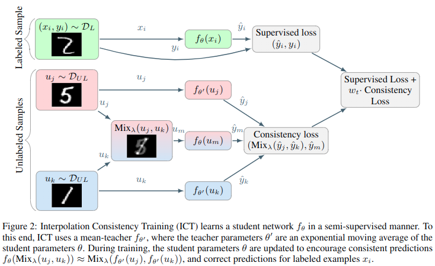
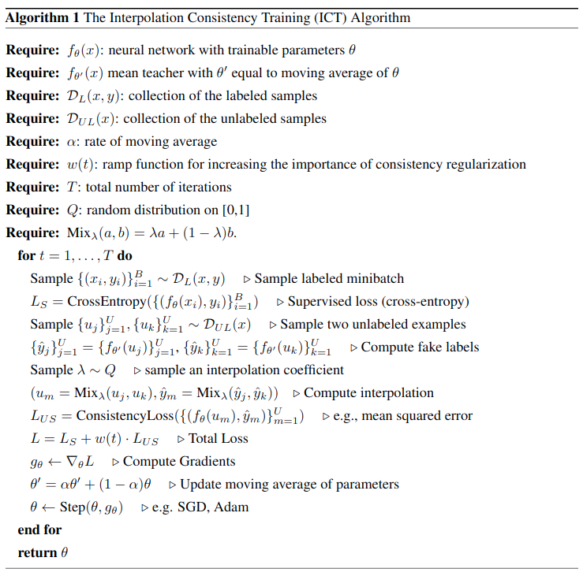

第六个算法`Interpolation Consistency Training forSemi-Supervised Learning`，这个算法是利用`mixup`提出了一种简单的一致性正则化方法。


<!--more-->

# 算法理论

半监督学习的一致性正则化方法通过鼓励针对未标记点$u$的扰动$u+\delta$的不变预测$f(u)=f(u+\delta)$来实施低密度分离假设。当且仅当决策边界横穿低密度路径时，才能同时满足这种一致性和较小的预测误差。


不同的一致性正则化技术在选择未标记数据扰动$\delta$方面的方式有所不同。一种简单的选择是使用随机扰动$\delta$，但是，随机扰动在高维空间上效率低下，因为只有一小部分输入扰动能够将决策边界推入低密度区域。因此`vat`等方法通过寻找能得使模型预测变化最大的最小扰动$\delta$，但这涉及到计算分类器相对于其输入的梯度，这对于大型神经网络模型而言相当耗时。此外，最近的研究表明，对抗性扰动训练可能会损害泛化性能(Adversarial robustness may be at odds with simplicity.)

为了克服以上限制，提出了插值一致性训练`ICT`，这是一种用于最新半监督学习的高效一致性正则化技术。简而言之，`ICT`通过输入未标记点$u_1$和$u_2$的插值$\alpha u_1+(1-\alpha)u_2$，鼓励一致的预测得到$f(\alpha u_1+(1-\alpha)u_2)=\alpha f(u_1)+(1-\alpha)f(u_2)$来规范化半监督学习。

## 插值一致性训练

首先给出`mixup`的公式：
$$
\begin{align}
\operatorname{Mix}_{\lambda}(a, b)=\lambda \cdot a+(1-\lambda) \cdot b
\end{align}
$$

插值一致性训练(ICT)训练分类器$f_\theta$以在未标记点的插值中提供一致的预测:
$$
f_{\theta}(\operatorname{Mix}_{\lambda}(u_j, u_k))\approx \operatorname{Mix}_{\lambda}(f_{\theta'}(u_j),f_{\theta'} (u_k))
$$

其中$\theta'$是$\theta$的滑动平均。为什么在未标记样本之间进行插值可以为半监督训练提供良好的一致性扰动？首先，应用一致性正则化的最有用样本是**决策边界附近的样本**。在这样的靠近边距未标记样本上添加一个小扰动$\delta$可能把$u_j+\delta$推入决策边界的另一侧，将是一个不错的位置。



回到低边距的无标签数据$u_j$，如何找到一个合适的扰动$\delta$将$u_i$与$u_j+\delta$尽量分布在决策面相对两侧？其中随机扰动是一种无效策略，因为接近决策边距方向的子集仅仅占作为空间的一小部分。取而代之，考虑向第二个随机选择的无标签样本进行插值$u_j+\delta=\operatorname{Mix}_\lambda(u_j,u_k)$，然后两个无标签样本$u_j,u_k$有三种情况：

1.  位于同一集群中
2.  位于不同的集群中，但属于同一类别
3.  位于不同的集群上，属于不同的类别

由聚类假设，则(1)的概率随类别数的增加而降低;如果假设每个类别的聚类数是平衡的，则(2)的概率较低;最后，(3)的概率为最高的。然后，假设$u_j,u_k$中的一个位于决策边界附近(它是执行一致性的一个很好的候选者)，则由于(3的概率很高)插值$u_k$有可能朝着低密度区域插值，其次是另一类的聚类。由于这是移动决策的好方向，因此插值对于基于一致性的正则化是一个很好的扰动。

到目前为止，我们的论证认为，随机未标记样本之间的插值可能会落在低密度区域中。因此，此类插值是可以应用基于一致性的正则化的良好位置。但是，我们应该如何标记这些插值呢？与单个未标记的样本$u_j$的随机或对抗性扰动不同，我们的方案涉及两个未标记的样本$u_j,u_k$。直观地讲，我们希望将决策边界尽可能地远离类边界，因为众所周知，具有较大余量的决策边界可以更好地泛化(A framework for structural riskminimisation),在有监督的学习环境中，一种实现大幅度决策边界的方法是`mixup`。在`mixup`中，通过强制预测模型在样本之间线性变化，将决策边界推离类边界。在这里，我们通过训练模式将`mixup`扩展到半监督学习，通过训练模型$f_\theta$预测样本点$\operatorname{Mix}_\lambda(u_j,u_k)$的`fake label`$\operatorname{Mix}_\lambda(f_\theta(u_j),f_\theta(u_k))$。为了遵守更保守的一致正则化，鼓励模型$f_\theta$预测样本点$\operatorname{Mix}_\lambda(u_j,u_k)$的`fake label`的$\operatorname{Mix}_\lambda(f_{\theta'}(u_j),f_{\theta'}(u_k))$，其中$\theta'$是$\theta$的滑动平滑，就如同`mean teacher`一样。

总之`ICT`可以描述为以下公式：
$$
\begin{align}
\mathcal{L}_{U S}=\underset{u_{j}, u_{k} \sim P(X)}{\mathbb{E}} \underset{\lambda \sim \operatorname{Beta}(\alpha, \alpha)}{\mathbb{E}} \ell\left(f_{\theta}\left(\operatorname{Mix}_{\lambda}\left(u_{j}, u_{k}\right)\right), \operatorname{Mix}_{\lambda}\left(f_{\theta^{\prime}}\left(u_{j}\right), f_{\theta^{\prime}}\left(u_{k}\right)\right)\right)
\end{align}
$$



其本质是结合了`mixup`结合了`mean teacher`。


# 代码

```python
hwc = [self.dataset.height, self.dataset.width, self.dataset.colors]
xt_in = tf.placeholder(tf.float32, [batch] + hwc, 'xt')  # For training
x_in = tf.placeholder(tf.float32, [None] + hwc, 'x')
y_in = tf.placeholder(tf.float32, [batch, 2] + hwc, 'y')
l_in = tf.placeholder(tf.int32, [batch], 'labels')
l = tf.one_hot(l_in, self.nclass)
wd *= lr
warmup = tf.clip_by_value(tf.to_float(self.step) / (warmup_pos * (FLAGS.train_kimg << 10)), 0, 1)

y = tf.reshape(tf.transpose(y_in, [1, 0, 2, 3, 4]), [-1] + hwc)
y_1, y_2 = tf.split(y, 2)

# 得到mixup比例
mix = tf.distributions.Beta(beta, beta).sample([tf.shape(xt_in)[0], 1, 1, 1])
mix = tf.maximum(mix, 1 - mix)

classifier = lambda x, **kw: self.classifier(x, **kw, **kwargs).logits
logits_x = classifier(xt_in, training=True)
post_ops = tf.get_collection(tf.GraphKeys.UPDATE_OPS)  # Take only first call to update batch norm.

ema = tf.train.ExponentialMovingAverage(decay=ema)
ema_op = ema.apply(utils.model_vars())
ema_getter = functools.partial(utils.getter_ema, ema)
# 对原始无标签数据输入teacher模型，并输出的分布进行mixup，得到伪标签
logits_teacher = classifier(y_1, training=True, getter=ema_getter)
labels_teacher = tf.stop_gradient(tf.nn.softmax(logits_teacher))
labels_teacher = labels_teacher * mix[:, :, 0, 0] + labels_teacher[::-1] * (1 - mix[:, :, 0, 0])
# 对无标签数据进行mixup后输入student模型，得到输出应该尽可能相似于伪标签
logits_student = classifier(y_1 * mix + y_1[::-1] * (1 - mix), training=True)
loss_mt = tf.reduce_mean((labels_teacher - tf.nn.softmax(logits_student)) ** 2, -1)
loss_mt = tf.reduce_mean(loss_mt)

loss = tf.nn.softmax_cross_entropy_with_logits_v2(labels=l, logits=logits_x)
loss = tf.reduce_mean(loss)
tf.summary.scalar('losses/xe', loss)
tf.summary.scalar('losses/mt', loss_mt)

post_ops.append(ema_op)
post_ops.extend([tf.assign(v, v * (1 - wd)) for v in utils.model_vars('classify') if 'kernel' in v.name])

train_op = tf.train.AdamOptimizer(lr).minimize(loss + loss_mt * warmup * consistency_weight,
                                               colocate_gradients_with_ops=True)
with tf.control_dependencies([train_op]):
    train_op = tf.group(*post_ops)
```


# 测试结果


使用默认参数以及cifar10中250张标注样本训练128个epoch，得到测试集准确率如下，这个算法我感觉比纯`mixup`好，但是为什么效果反而不如纯`mixup`。。。：

```
"last01": 46.849998474121094,
"last10": 46.53000068664551,
"last20": 46.84499931335449,
"last50": 47.21500015258789
```