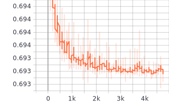
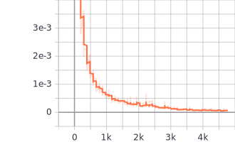

最近想用[`infomax`算法](https://zhen8838.github.io/2019/08/01/infor-max/)和[对比学习](https://zhen8838.github.io/2020/03/29/ssl-simclr/)结合起来，然后应用在半监督学习中。在实验过程中遇到了一个非常奇怪的问题。

<!--more-->

# 问题描述

我一开始以为`infomax`中的判别器也可以随便来，然后就定义了判别器如下：

```python
# get global discriminate result
globaldiscriminator = compose(
    # kl.InputLayer(input_shape=[2 * z_dim]),
    kl.Dense(z_dim, activation='relu'),
    kl.BatchNormalization(),
    kl.Dense(z_dim, activation='relu'),
    kl.BatchNormalization(),
    kl.Dense(z_dim, activation='relu'),
    kl.BatchNormalization(),
    kl.Dense(1, activation='sigmoid'),
)
```

然后在`cifar10`数据集中进行实验，发现判别器损失一直没有降低，反而先验损失会降低到一个相当小的值，但编码器输出的隐变量明显不符合先验分布。


下面分别是全局互信息损失和局部互信息损失，可以看到这么多`step`过去后，几乎没有下降：



    


对于先验分布的损失可以看到下降到一个非常低的值了。




隐变量输出分布统计结果：
```sh
z mean 0.005774456
z std 0.120639555
z mean 0.00078799046
z std 0.08064849
z mean 0.0028064575
z std 0.09524193
z mean 7.149822e-05
z std 0.08297808
```

相似度采样结果，虽然是测试集上的结果，差一点说的过去，但是这还不如不训练：


# 问题解决

经过各种修改，发现问题就在判别器中，只要将判别器中的`bn`删除：

```python
# get global discriminate result
globaldiscriminator = compose(
    # kl.InputLayer(input_shape=[2 * z_dim]),
    kl.Dense(z_dim, activation='relu'),
    kl.Dense(z_dim, activation='relu'),
    kl.Dense(z_dim, activation='relu'),
    kl.Dense(1, activation='sigmoid'),
)
```

然后在`cifar10`数据集中进行实验，发现判别器损失有效降低，先验损失会维持在一个范围，这样才有对抗的感觉了。


下面分别是全局互信息损失和局部互信息损失，降到了相当低：


    

对于先验分布的损失有下降，当没有那么强烈。


隐变量输出分布统计结果，这次就接近于独立正态分布了：
```sh
z mean 0.0043534352
z std 1.0862136
z mean 0.009636099
z std 1.1103721
z mean -0.011318588
z std 1.0901983
z mean -0.0093264235
z std 1.112159
z mean -0.010979499
z std 1.1168234
```

相似度采样结果，这次就好了很多：


# 思考

个人认为是这个问题是因为判别器的输入是两个隐变量直接`concat`在一起的，如果进行`bn`就导致分布相同丧失判别能力了。下一步可以考虑借鉴`simclr`中的方法，`infomax`中的负采样估计只是简单的`shuffle`一下，而`simclr`中利用矩阵乘法在一个`batch`中直接组合出`batch*batch-batch`个样本对，特别是他的论文中`batch size`最大是8192，相当暴力。

在实验的过程中我还发现了一个比较有趣的地方，就是如果直接初始化模型然后对编码器的输出做相似度采样，结果其实不差。让我感觉我训练这个模型这么久好像就改变了一下编码器输出的分布。。。

