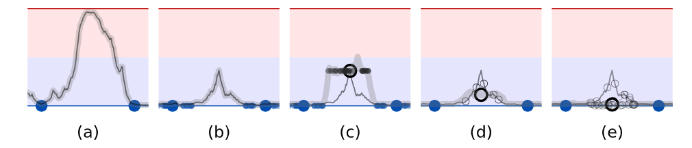
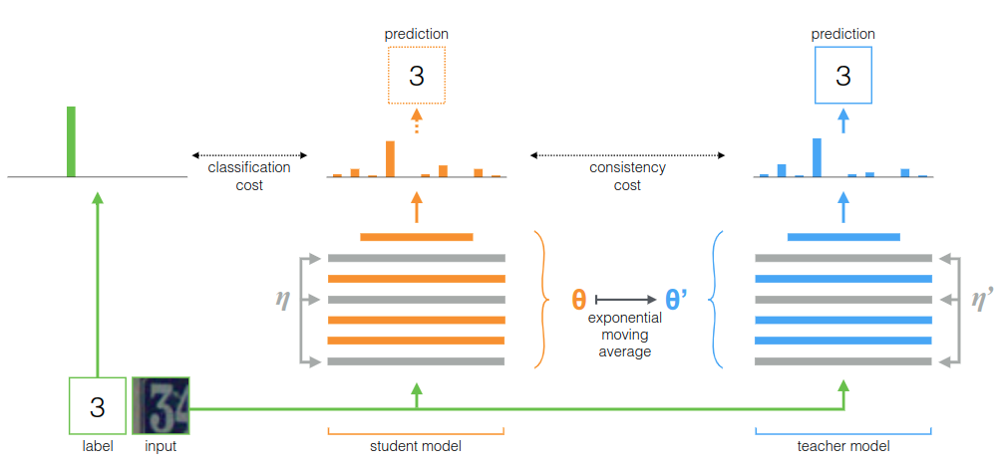

第三个算法`mean teacher`，此算法是对`Π model`的升级。


<!--more-->

# 算法理论

`mean teacher`的引言写的非常好，所以我翻译并精简：

深度学习模型需要大量参数，从而易于过度拟合(图1a)。此外，将高质量标签手动添加到训练数据通常很昂贵。因此，希望使用可有效利用未标记数据的正则化方法，以减少半监督学习中的过度拟合。 (**半监督实际是减少过拟合**)

当输入略有变化时，人们通常仍将其视为同一对象。相应地，分类模型应该偏向为相似数据点提供一致输出的函数。实现此目的的一种方法是将噪声添加到模型的输入中。为了使模型能够学习更多抽象不变性，可以将噪声添加到中间表示中，这一见解激发了许多正则化技术，例如Dropout。正则化模型不是使输入空间的零维数据点上的分类成本最小化，而是使每个数据点周围的流形上的成本最小化，从而使决策边界远离带标签的数据点(图1b)  (**类间间距大，类内间距小**)

由于对于未标记的示例未定义分类成本，因此噪声正则化本身无助于半监督学习。为了克服这个问题，`Γ model`评估了有无噪声的每个数据点，然后在两个预测之间应用了`consistency cost`。在这种情况下，模型承担着`teacher`和`student`的双重角色。作为`student`，它像以前一样学习。作为`teacher`，它会生成标签让`student`学习。由于模型本身会生成标签，因此它们很可能是**错误**的。如果对生成的标签给予过多的权重，则`consistency cost`将超过错误分类的损失，从而阻止学习新信息。实际上，模型存在确认偏差(图1c)，这种风险可以通过提高标签质量来减轻。

至少有两种方法可以提高目标质量。一种方法是仔细选择表示的扰动，而不是仅仅施加加性或乘性噪声。另一种方法是谨慎选择`teacher`模型，而不是仅仅复制`student`模型。同时，在我们的研究中，`Virtual Adversarial Training`采用了第一种方法可以产生令人印象深刻的结果。我们采取第二种方法，并将表明它也提供了显著的好处。同时这两种方法是兼容的，并且它们的组合可能会产生更好的结果。

因此，我们的目标是在没有额外训练的情况下从`student`模型中形成更好的教师模型。第一步，考虑模型的`softmax`输出通常不会在训练数据之外提供准确的预测。通过在`dropout`推理时将噪声添加到模型中，可以部分缓解这种情况，因此，带噪声的`teacher`可以产生更准确的目标(图1d)。该`Π model`近来已证明在半监督图像分类中效果很好。我们将使用该名称及其版本作为我们实验的基础。

可以通过`Temporal Ensembling`进一步改进`Π model`，该模型为每个训练示例保持了指数移动平均值(EMA)预测。在每个训练步骤中，都会基于新的预测更新该小批中示例的所有EMA预测。因此，每个示例的EMA预测由模型的当前版本和评估同一示例的早期版本组成。这种集成可以提高预测的质量，并将其用作`teacher`的预测可以改善结果。然而，由于每个目标每个时期仅更新一次，所以学习的信息以缓慢的速度被合并到训练过程中。数据集越大，更新的时间越长，并且在在线学习的情况下，很难完全使用`Temporal Ensembling`。(一个时期可以周期性地对所有目标进行一次评估，但要使评估范围保持恒定，则每个时期需要O(n2)次评估，而训练示例的数量也是如此。)




带有两个标记示例(大蓝点)和一个无标签样本的二元分类任务的草图，展示了无标签样本(黑色圆圈)如何影响拟合函数(灰色曲线)。**(a)**没有正则化的模型可以自由地拟合任何可以很好地预测带标签样本。**(b)**经过训练的模型带有嘈杂的标记数据(小点)，可以学习为带标签样本周围提供一致的预测 **(c)**无标签样本周围的噪声一致性提供了额外的平滑度。为了清楚起见，首先将`teacher`模型(灰色曲线)拟合到标记的样本点中，然后在训练学生模型时保持不变。同样为了清楚起见，我们将省略图d和e中的小点 **(d)** `teacher`模型上的噪音可减少目标的偏差，而无需额外的培训。随机梯度下降的预期方向是朝向各个有噪声目标(小蓝色圆圈)的平均值(大蓝色圆圈) **(e)** 一组模型给出了更好的预期目标。`Temporal Ensembling`和`mean teacher`方法都使用此方法。

## mean teacher

为了克服`Temporal Ensembling`的局限性，建议对模型权重取平均而不是预测结果。由于`teacher`模型是连续的`student`模型权重平均值，因此将其称为`mean teacher`方法(图2)。
在训练步骤的上平均模型权重往往会产生比直接使用最终权重更准确的模型。我们可以在培训过程中利用这一优势来构建更好的目标。与使用学生模型共享权重不同，教师模型使用学生模型的EMA权重。现在，它可以在每个步骤之后而不是每个时期都汇总信息。另外，由于权重平均值改善了所有层的输出，而不仅仅是顶部输出，因此目标模型具有更好的中间表示。这些方面在时间合计方面具有两个实践优势：首先，目标标签更准确可导致学生模型与教师模型之间的反馈回路更快，从而提高测试准确性。其次，该方法可扩展到大型数据集和在线学习。





好了到这里其实应该清晰了，`mean teacher`对于`Temporal Ensembling`的实际改进其实就在与`teacher`模型的权重更新方式，使用的是`student`模型权重的滑动平均，而`student`模型实际上和`Π model`相同。

# 代码

和`Π model`的区别就在于使用了`ema`更新`teacher`模型的权重。

```python
hwc = [self.dataset.height, self.dataset.width, self.dataset.colors]
xt_in = tf.placeholder(tf.float32, [batch] + hwc, 'xt')  # For training
x_in = tf.placeholder(tf.float32, [None] + hwc, 'x')
y_in = tf.placeholder(tf.float32, [batch, 2] + hwc, 'y') # 一次输入两个无标签样本
l_in = tf.placeholder(tf.int32, [batch], 'labels')
l = tf.one_hot(l_in, self.nclass)

warmup = tf.clip_by_value(tf.to_float(self.step) / (warmup_pos * (FLAGS.train_kimg << 10)), 0, 1)
lrate = tf.clip_by_value(tf.to_float(self.step) / (FLAGS.train_kimg << 10), 0, 1)
lr *= tf.cos(lrate * (7 * np.pi) / (2 * 8))
tf.summary.scalar('monitors/lr', lr)
# classifier是网络输入到输出的流程函数，实际上每次调用都构建了一个新的网络，不过他auto reuse了
classifier = lambda x, **kw: self.classifier(x, **kw, **kwargs).logits
logits_x = classifier(xt_in, training=True)  # 定义有标签数据的分类器
post_ops = tf.get_collection(tf.GraphKeys.UPDATE_OPS)  # Take only first call to update batch norm.
y = tf.reshape(tf.transpose(y_in, [1, 0, 2, 3, 4]), [-1] + hwc)
y_1, y_2 = tf.split(y, 2)
# 指定全部的变量getter
ema = tf.train.ExponentialMovingAverage(decay=ema)
ema_op = ema.apply(utils.model_vars())
ema_getter = functools.partial(utils.getter_ema, ema)
# 第一个无标签数据的概率作为teacher
logits_y = classifier(y_1, training=True, getter=ema_getter)  # 定义teacher模型，并通过ema更新
logits_teacher = tf.stop_gradient(logits_y) # 但是屏蔽梯度，使其无法通过梯度下降更新
# 第二个无标签数据的概率作为student
logits_student = classifier(y_2, training=True)  # 定义student模型
# 以teacher和student间的mse损失学习其一致性
loss_mt = tf.reduce_mean((tf.nn.softmax(logits_teacher) - tf.nn.softmax(logits_student)) ** 2, -1)
loss_mt = tf.reduce_mean(loss_mt)

# 分类损失
loss = tf.nn.softmax_cross_entropy_with_logits_v2(labels=l, logits=logits_x)
loss = tf.reduce_mean(loss)
tf.summary.scalar('losses/xe', loss)
tf.summary.scalar('losses/mt', loss_mt)

# 权重l2正则化
loss_wd = sum(tf.nn.l2_loss(v) for v in utils.model_vars('classify') if 'kernel' in v.name)
tf.summary.scalar('losses/wd', loss_wd)

post_ops.append(ema_op)
train_op = tf.train.MomentumOptimizer(lr, 0.9, use_nesterov=True).minimize(
    loss + loss_mt * warmup * consistency_weight + wd * loss_wd, colocate_gradients_with_ops=True)
with tf.control_dependencies([train_op]):
    # 梯度下降一次后更新teacher权重
    train_op = tf.group(*post_ops)
```

# 测试结果

使用默认参数以及cifar10中250张标注样本训练128个epoch，得到测试集准确率如下，效果好于之前两个模型，但训练到后面有退化的迹象：

```
"last01": 50.95000076293945,
"last10": 51.114999771118164,
"last20": 51.3799991607666,
"last50": 52.079999923706055
```