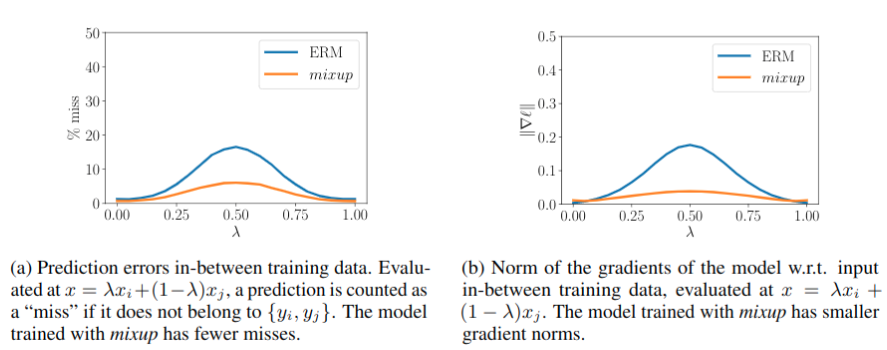

第五个算法`mixup: BEYOND EMPIRICAL RISK MINIMIZATION`，这个算法应该很多人都听过或者用过，它十分简单但又十分有效，是之后大部分半监督论文都用到的技巧。

<!--more-->

# 算法理论

## 从经验风险最小化到mixup


在监督学习中，我们的目标是找到一个函数$f\in\mathcal{F}$，该函数描述遵循联合分布$P(X,Y)$的随机特征向量$X$和随机目标向量$Y$之间的关系。为此，我们首先定义一个损失函数，该函数对预测$f(x)$和实际目标$y$之间的差异进行惩罚，例如$(x,y)\sim p$。然后，我们将数据分布$P$上损失函数$\ell$的平均值最小化，也称为预期风险：
$$
\begin{align}
R(f)=\int \ell(f(x), y) \mathrm{d} P(x, y)
\end{align}
$$

不幸的是，在大多数实际情况下，分布$P$是未知的。相反，我们通常可以加载一组训练数据$\mathcal{D}={(x_i,y_i)}_{i=1}^n$，其中$(x_i,y_i)\sim P$,$i=1,\ldots,n$。使用训练数据$\mathcal{D}$，我们可以根据经验分布来近似：
$$
\begin{align}
P_{\delta}(x, y)=\frac{1}{n} \sum_{i=1}^{n} \delta\left(x=x_{i}, y=y_{i}\right)
\end{align}
$$

其中$\delta\left(x=x_{i}, y=y_{i}\right)$是$(x_{i}, y_{i})$的狄克拉质量中心。使用经验分布$P_\delta$，我们现在可以通过经验风险来近似预期风险:

$$
\begin{align}
R_{\delta}(f)=\int \ell(f(x), y) \mathrm{d} P_{\delta}(x, y)=\frac{1}{n} \sum_{i=1}^{n} \ell\left(f\left(x_{i}\right), y_{i}\right)
\end{align}\tag{1}
$$

通过最小化学习函数$1$被称为经验风险最小化(ERM)原理(Vapnik，1998年)。尽管计算效率很高，但经验风险$1$仅在一组有限的n个示例中监控行为偏离。当考虑具有大量参数的功能时(例如大型神经网络)，最小化$1$的一种简单方法是记忆训练数据(Zhang et al。，2017)。记忆反过来会导致训练数据之外的不良行为(Szegedy等，2014)。

但是，朴素估计$P_\delta$是逼近真实分布$P$的许多可能选择之一。例如，在`领域风险最小化(VRM)`原理中(Chapelle等，2000)，分布$P$近似为:
$$
\begin{align}
P_{\nu}(\tilde{x}, \tilde{y})=\frac{1}{n} \sum_{i=1}^{n} \nu\left(\tilde{x}, \tilde{y} | x_{i}, y_{i}\right)
\end{align}
$$

其中$v$是`vicinity distributionth`用于测量在训练特征-目标对$(x_{i}, y_{i})$的领域内找到虚拟特征-目标对$(\hat{x}, \hat{y})$的概率，特别是，chapellpe等人(2000年)考虑了高斯领域内$\nu\left(\tilde{x}, \tilde{y} | x_{i}, y_{i}\right)=\mathcal{N}\left(\tilde{x}-x_{i}, \sigma^{2}\right) \delta\left(\tilde{y}=y_{i}\right)$，相对与用加性高斯噪声来增强训练数据。要学习使用`VRM`，我们对附近的分布进行采样以构建数据$\mathcal{D}_{\nu}:=\left\{\left(\tilde{x}_{i}, \tilde{y}_{i}\right)\right\}_{i=1}^{m}$，然后最小化经验风险损失：

$$
\begin{align}
R_{\nu}(f)=\frac{1}{m} \sum_{i=1}^{m} \ell\left(f\left(\tilde{x}_{i}\right), \tilde{y}_{i}\right)
\end{align}
$$

此文章的作用是提出一种通用的邻域分布，称为`mixup`：


$$
\begin{align}
\mu\left(\tilde{x}, \tilde{y} | x_{i}, y_{i}\right)=\frac{1}{n} \sum_{j}^{n} \underset{\lambda}{\mathbb{E}}\left[\delta\left(\tilde{x}=\lambda \cdot x_{i}+(1-\lambda) \cdot x_{j}, \tilde{y}=\lambda \cdot y_{i}+(1-\lambda) \cdot y_{j}\right)\right]
\end{align}
$$

其中$\lambda\sim \text{Beta}(\alpha,\alpha),\alpha\in(0,\infty)$。从混合邻域分布中采样会生成虚拟特征目标向量：
$$
\begin{align}
\begin{aligned}
&\tilde{x}=\lambda x_{i}+(1-\lambda) x_{j}\\
&\tilde{y}=\lambda y_{i}+(1-\lambda) y_{j}
\end{aligned}
\end{align}
$$

## 总结

实际上`mixup`的目标是使的模型更加线性，联想到之前的几个算法，就如`mean-teacher`算法第一幅图所展示的，最终目标是使在两个标注数据间的未标注区域获得更平滑的概率分布输出，这样我们可以找到类别`A`与类别`B`间更加合适的决策面，从而提升分类准确性，下图可以看到输出的概率分布更加平滑了。




# 代码

原论文提出`mixup`针对的是有标签数据，代码是针对半监督学习的(pseudo label结合mixup)：

```python
def augment(self, x, l, beta, **kwargs):
    del kwargs
    mix = tf.distributions.Beta(beta, beta).sample([tf.shape(x)[0], 1, 1, 1])
    mix = tf.maximum(mix, 1 - mix)
    # batch中数据反转并mixup
    xmix = x * mix + x[::-1] * (1 - mix)
    lmix = l * mix[:, :, 0, 0] + l[::-1] * (1 - mix[:, :, 0, 0])
    return xmix, lmix

def model(self, batch, lr, wd, ema, **kwargs):
    hwc = [self.dataset.height, self.dataset.width, self.dataset.colors]
    xt_in = tf.placeholder(tf.float32, [batch] + hwc, 'xt')  # For training
    x_in = tf.placeholder(tf.float32, [None] + hwc, 'x')
    y_in = tf.placeholder(tf.float32, [batch] + hwc, 'y')
    l_in = tf.placeholder(tf.int32, [batch], 'labels')
    wd *= lr
    classifier = lambda x, **kw: self.classifier(x, **kw, **kwargs).logits

    def get_logits(x):
        logits = classifier(x, training=True)
        return logits
    # 有标签数据mixup
    x, labels_x = self.augment(xt_in, tf.one_hot(l_in, self.nclass), **kwargs)
    logits_x = get_logits(x)
    post_ops = tf.get_collection(tf.GraphKeys.UPDATE_OPS)
    # 无标签数据mixup，首先构造pseudo label再进行mixup，虽然这样比较慢。
    y, labels_y = self.augment(y_in, tf.nn.softmax(get_logits(y_in)), **kwargs)
    labels_y = tf.stop_gradient(labels_y)
    logits_y = get_logits(y)

    loss_xe = tf.nn.softmax_cross_entropy_with_logits_v2(labels=labels_x, logits=logits_x)
    loss_xe = tf.reduce_mean(loss_xe)
    loss_xeu = tf.nn.softmax_cross_entropy_with_logits_v2(labels=labels_y, logits=logits_y)
    loss_xeu = tf.reduce_mean(loss_xeu)
    tf.summary.scalar('losses/xe', loss_xe)
    tf.summary.scalar('losses/xeu', loss_xeu)

    ema = tf.train.ExponentialMovingAverage(decay=ema)
    ema_op = ema.apply(utils.model_vars())
    ema_getter = functools.partial(utils.getter_ema, ema)
    post_ops.append(ema_op)
    post_ops.extend([tf.assign(v, v * (1 - wd)) for v in utils.model_vars('classify') if 'kernel' in v.name])

    train_op = tf.train.AdamOptimizer(lr).minimize(loss_xe + loss_xeu, colocate_gradients_with_ops=True)
    with tf.control_dependencies([train_op]):
        train_op = tf.group(*post_ops)
```


# 测试结果


使用默认参数以及cifar10中250张标注样本训练128个epoch，得到测试集准确率如下，比之前的算法的确有提升，不如`vat`好，不过胜在它比较简单，而且`vat`也会出现退化的情况，`mixup`更加稳定：

```
"last01": 52.7400016784668,
"last10": 52.939998626708984,
"last20": 52.73500061035156,
"last50": 52.47999954223633
```