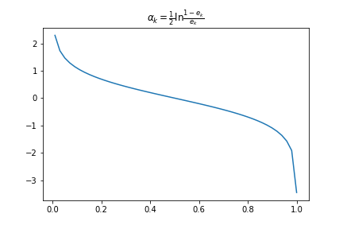

提升方法。这个思路可以被考虑到`集成`中。提升方法`AdaBoost`的想法是将`相同类型的不同参数的弱分类器的分类结果进行集成`,他是一个串行的提升过程。此方法的流程比较清楚，关于原理部分建议大家仔细看书。

<!--more-->

# 原理

他的方法是通过串行的训练：

1.  提升弱分类器分类错误样本点的权重
2.  提升准确率高的弱分类器输出结果权重

假设一个二类分类的训练数据集：
$$\begin{aligned}
D = \{\left( x_{1},y_{1} \right),\left( x_{2},y_{2} \right),\ldots,(x_{n},\ y_{n})\}\\
x_{i} \in X \subseteq \mathbb{R}^{n}\ ;y_{i} \in Y = \{ - 1,\  + 1\}
\end{aligned}
$$

开始训练，假设我们迭代$M$次，首先初始化权重分布$W_k$为均匀分布，对于$k = 0,1,\ldots,\ M - 1$：

1.  利用权重$W_k$训练弱分类器：

$$\begin{aligned}
g_{k}(x):X \rightarrow \{ - 1,\  + 1\}
\end{aligned}
$$
  
2.  计算分类器$g_{k}(x)$的加权错误率：

$$\begin{aligned}
e_{k} = \sum_{i = 1}^{N}{w_{\text{k|i}}I(g_{k}\left( x_{i} \right) \neq y_{i})}
\end{aligned} 
$$

3.  根据加权错误率计算分类器的输出结果权值：
$$\begin{aligned}
  \alpha_{k} = \frac{1}{2}\ln\frac{1 - e_{k}}{e_{k}}
\end{aligned}
$$

4.  根据分类器$g_{k}(x)$的错误率修改训练数据的权重，对于误分类的样本要增大权重，反之则减少。

$$
\begin{aligned}
  w_{k + 1,i} = \frac{w_{\text{k|i}}}{Z_{k}} \cdot exp( - \alpha_{k}y_{i}g_{k}(x_{i}))\\
  Z_{k}=\sum_{i=1}^N w_{\text{k|i}} \cdot exp( - \alpha_{k}y_{i}g_{k}(x_{i}))
\end{aligned}
$$

5.  重复以上过程，迭代结束后最终分类器如下：

$$
\begin{aligned}
  g\left( x \right) =  \text{sign}\left( \sum_{k = 1}^{M}{\alpha_{k}g_{k}\left( x \right)} \right)
\end{aligned}
$$

# 题外话

错误率-权重映射关系：

