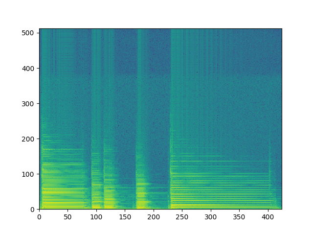
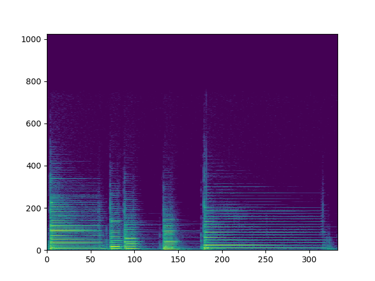

以后还是要自己实现`k210`中的代码,所以准备还是在`python`中先实现一下.下面记录两种`stft`谱图的实现方式

<!--more-->

# 1.网上找到的实现方式


```python
import matplotlib.pyplot as plt
import scipy.io.wavfile
import numpy as np


def calc_stft(signal, sample_rate, frame_size=0.025, frame_stride=0.01, winfunc=np.hamming, NFFT=512):

    # 分帧, frame size 单位为s,
    frame_length = frame_size * sample_rate  # 代表一个帧的长度
    frame_step = frame_stride * sample_rate  # 一跳的长度.
    signal_length = len(signal)  # 总信号长度
    frame_length = int(round(frame_length))  # 一帧的长度
    frame_step = int(round(frame_step))  # 一跳的个数
    # (总长度-帧长度)/跳长度=需要分析的个数
    num_frames = 1 + int(np.ceil(float(np.abs(signal_length - frame_length)) / frame_step))
    # 因为分析个数*帧跳数+帧长度是会超过全部的长度的.所以需要零填充
    pad_signal_length = num_frames * frame_step + frame_length
    z = np.zeros((pad_signal_length - signal_length))
    # padding都是直接加后面,感觉不对
    pad_signal = np.append(signal, z)

    # 获得帧的切片,是一个二维数组:
    # [num_frames,frame_length]
    # [   0,    1,    2, ..., 1099, 1100, 1101]
    # [ 441,  442,  443, ..., 1540, 1541, 1542]
    # ...
    # [87318, 87319, 87320, ..., 88417, 88418, 88419]
    indices = np.tile(np.arange(0, frame_length), (num_frames, 1)) + np.tile(np.arange(0, num_frames * frame_step, frame_step), (frame_length, 1)).T
    # 按照索引矩阵将所有信号提取出来
    frames = pad_signal[indices.astype(np.int32, copy=False)]
    # 取出一个与frame_length相同的窗,然后*,boardcast效应.
    frames *= winfunc(frame_length)
    # Compute the one-dimensional n-point discrete Fourier Transform(DFT) of
    # rfft 就是只取fft一半有效值 本来fft为512 rfft得到512//2+1 (从正半轴开始取)
    mag_frames = np.absolute(np.fft.rfft(frames, NFFT))  # fft之后取幅度谱, shape [199,257]
    # Compute power spectrum
    pow_frames = (1.0 / NFFT) * ((mag_frames) ** 2)  # 计算幅度谱

    return pow_frames


if __name__ == '__main__':

    # Read wav file
    # "OSR_us_000_0010_8k.wav" is downloaded from http://www.voiptroubleshooter.com/open_speech/american.html
    sample_rate, signal = scipy.io.wavfile.read("../sms-tools-master/sounds/piano.wav")
    # Get speech data in the first 2 seconds
    # 只取2s钟时间
    signal = signal[0:int(2. * sample_rate)]

    # Calculate the short time fourier transform
    pow_spec = calc_stft(signal, sample_rate)

    plt.pcolormesh(pow_spec, cmap=plt.get_cmap('rainbow'))
    plt.tight_layout()
    plt.show()


```


## 效果


# 2.sms-tools的实现方式


```python
import numpy as np
import matplotlib.pyplot as plt
import os
import sys
from scipy.signal import get_window
from scipy.io import wavfile


inputfile = "../sms-tools-master/sounds/piano.wav"
window = 'hamming'
M = 801
N = 1024
H = 400
fs, x = wavfile.read(inputfile)
w = get_window(window, M)

hM1 = (M+1)//2  # 一半的窗长  401
hM2 = M//2  # 一半窗长 (floor的) 400
# 直接在样本前后做零填充
x = np.append(np.zeros(hM2), x)
x = np.append(x, np.zeros(hM1))
pin = hM1  # 设置一个指针指向样本中心
pend = x.size-hM1  # 最后一帧开始的位置
w = w / sum(w)  # 将窗口归一化
xmX = []  # 初始化
xpX = []  # 初始化
while pin <= pend:  # 只要指针的位置小于最后一个开始位置
    # -----analysis-----
    x1 = x[pin-hM1:pin+hM2]  # 选择一帧开始分析
    X = np.fft.rfft(x1*w, N)   # fft 变化
    xmX.append(np.array(20 * np.log10(np.abs(X))))  # Append output to list
    xpX.append(np.array(np.unwrap(np.angle(X))))
    pin += H                                    # advance **sound** pointer
mX = np.array(xmX)  # [238,513]
pX = np.array(xpX)  # [238,513]


plt.pcolormesh(mX)
plt.show()

```


## 效果




# librosa的实现


```python
import tensorflow as tf
import matplotlib.pyplot as plt
import numpy as np
import librosa
from scipy.io import wavfile
from scipy import fft

y, sr = librosa.load("../sms-tools-master/sounds/piano.wav", sr=None)
# d = librosa.amplitude_to_db(np.abs(librosa.stft(x, n_fft=512, hop_length=512)))
# plt.pcolormesh(d.T)
# plt.show()

n_fft = 2048
hop_length = None
win_length = None
window = 'hann'
center = True
dtype = np.complex64
pad_mode = 'reflect'


win_length = n_fft  # 窗长为fft的长度
hop_length = int(win_length // 4)  # hop默认是四分之一fft长度
# ! fftbins 的意思就是为了fft的对称性, 对2048的窗口先生成2049长度的信号,然后再截断,保证有中心点
fft_window = librosa.filters.get_window('hann', win_length, fftbins=True)
# * 居中零填充,但是这里其实没有必要,因为这里的窗长度就是fft长度
fft_window = librosa.util.pad_center(fft_window, n_fft)
# 将其转变为2维,便于进行broadcast
fft_window = fft_window.reshape((-1, 1))

if center:
    # 如果帧起始是从窗口中间开始,那么需要对信号前后进行padding
    y = np.pad(y, int(n_fft//2), mode=pad_mode)

# 开始分帧 分成 [n_fft,floor(len(y)/hop_length)] 维度的数组
y_frames = librosa.util.frame(y, frame_length=n_fft, hop_length=hop_length)

# ! 预分配stft结果数组 这里是只取fft的一半长度
stft_matrix = np.empty((int(1+n_fft//2), y_frames.shape[1]), dtype=dtype)


# 计算内存块最大一次能处理多少列
n_columns = int(librosa.util.MAX_MEM_BLOCK / (stft_matrix.shape[0] * stft_matrix.itemsize))

# 一块一块的处理
for bl_s in range(0, stft_matrix.shape[1], n_columns):
    bl_t = min(bl_s + n_columns, stft_matrix.shape[1])

    stft_matrix[:, bl_s:bl_t] = fft(fft_window * y_frames[:, bl_s:bl_t], axis=0)[:stft_matrix.shape[0]]

# 转换为db
spec = librosa.amplitude_to_db(np.abs(stft_matrix))
plt.pcolormesh(spec)
plt.show()
```


## 效果



# scipy的实现

```python
import tensorflow as tf
import numpy as np
import matplotlib.pyplot as plt
from scipy.signal import get_window
from scipy.io import wavfile
from scipy.signal import spectrogram, windows
import numpy as np


inputfile = "../sms-tools-master/sounds/piano.wav"
fs, x = wavfile.read(inputfile)
f, t, sxx = spectrogram(x, fs=fs, nfft=1024, window=windows.blackman(801), noverlap=2)
plt.pcolormesh(t, f, sxx)
plt.show()
```

# 效果

说实话我还是没有太清楚`scipy`的函数内部怎样工作的,但是我累了..
