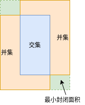
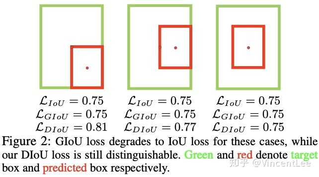

最近想搞半监督的东西，但是我发现一个人的精力着实不够，而且这个`tensorflow`也让我很难受，莫名其妙只要一用`jit`就`core dump`，不用`jit`训练又慢，显存又狂吃，再这样下去准备转mxnet了😤。然后今天把之前本来想做没做完的东西做做完，就是各种`iou`的`tensorflow`实现，顺便为自己做一个总结。

<!--more-->

# TLDR

先上代码就完事了：

```python
import numpy as np
import tensorflow as tf


def center_to_corner(bbox: np.ndarray, to_all_scale=True, in_hw=None) -> np.ndarray:
    """convert box coordinate from center to corner

    Parameters
    ----------
    bbox : np.ndarray
        bbox [c_x,c_y,w,h]
    to_all_scale : bool, optional
        weather to all image scale, by default True
    in_hw : np.ndarray, optional
        in hw, by default None

    Returns
    -------
    np.ndarray
        bbox [x1,y1,x2,y2]
    """
    if to_all_scale:
        x1 = (bbox[:, 0:1] - bbox[:, 2:3] / 2) * in_hw[1]
        y1 = (bbox[:, 1:2] - bbox[:, 3:4] / 2) * in_hw[0]
        x2 = (bbox[:, 0:1] + bbox[:, 2:3] / 2) * in_hw[1]
        y2 = (bbox[:, 1:2] + bbox[:, 3:4] / 2) * in_hw[0]
    else:
        x1 = (bbox[:, 0:1] - bbox[:, 2:3] / 2)
        y1 = (bbox[:, 1:2] - bbox[:, 3:4] / 2)
        x2 = (bbox[:, 0:1] + bbox[:, 2:3] / 2)
        y2 = (bbox[:, 1:2] + bbox[:, 3:4] / 2)

    xyxy = np.hstack([x1, y1, x2, y2])
    return xyxy


def tf_center_to_corner(bbox: tf.Tensor, to_all_scale=True, in_hw=None) -> tf.Tensor:
    """convert box coordinate from center to corner

    Parameters
    ----------
    bbox : tf.Tensor
        bbox [c_x,c_y,w,h]
    to_all_scale : bool, optional
        weather to all image scale, by default True
    in_hw : tf.Tensor, optional
        in hw, by default None

    Returns
    -------
    np.ndarray
        bbox [x1,y1,x2,y2]
    """
    if to_all_scale:
        x1 = (bbox[..., 0:1] - bbox[..., 2:3] / 2) * in_hw[1]
        y1 = (bbox[..., 1:2] - bbox[..., 3:4] / 2) * in_hw[0]
        x2 = (bbox[..., 0:1] + bbox[..., 2:3] / 2) * in_hw[1]
        y2 = (bbox[..., 1:2] + bbox[..., 3:4] / 2) * in_hw[0]
    else:
        x1 = (bbox[..., 0:1] - bbox[..., 2:3] / 2)
        y1 = (bbox[..., 1:2] - bbox[..., 3:4] / 2)
        x2 = (bbox[..., 0:1] + bbox[..., 2:3] / 2)
        y2 = (bbox[..., 1:2] + bbox[..., 3:4] / 2)

    xyxy = tf.concat([x1, y1, x2, y2], -1)
    return xyxy


def corner_to_center(bbox: np.ndarray, from_all_scale=True, in_hw=None) -> np.ndarray:
    """convert box coordinate from corner to center

    Parameters
    ----------
    bbox : np.ndarray
        bbox [x1,y1,x2,y2]
    to_all_scale : bool, optional
        weather to all image scale, by default True
    in_hw : np.ndarray, optional
        in hw, by default None

    Returns
    -------
    np.ndarray
        bbox [c_x,c_y,w,h]
    """
    if from_all_scale:
        x = ((bbox[..., 2:3] + bbox[..., 0:1]) / 2) / in_hw[1]
        y = ((bbox[..., 3:4] + bbox[..., 1:2]) / 2) / in_hw[0]
        w = (bbox[..., 2:3] - bbox[..., 0:1]) / in_hw[1]
        h = (bbox[..., 3:4] - bbox[..., 1:2]) / in_hw[0]
    else:
        x = ((bbox[..., 2:3] + bbox[..., 0:1]) / 2)
        y = ((bbox[..., 3:4] + bbox[..., 1:2]) / 2)
        w = (bbox[..., 2:3] - bbox[..., 0:1])
        h = (bbox[..., 3:4] - bbox[..., 1:2])

    xywh = np.hstack([x, y, w, h])
    return xywh


def tf_corner_to_center(bbox: tf.Tensor, from_all_scale=True, in_hw=None) -> tf.Tensor:
    """convert box coordinate from corner to center

    Parameters
    ----------
    bbox : tf.Tensor
        bbox [x1,y1,x2,y2]
    to_all_scale : bool, optional
        weather to all image scale, by default True
    in_hw : tf.Tensor, optional
        in hw, by default None

    Returns
    -------
    np.ndarray
        bbox [c_x,c_y,w,h]
    """
    if from_all_scale:
        x = ((bbox[..., 2:3] + bbox[..., 0:1]) / 2) / in_hw[1]
        y = ((bbox[..., 3:4] + bbox[..., 1:2]) / 2) / in_hw[0]
        w = (bbox[..., 2:3] - bbox[..., 0:1]) / in_hw[1]
        h = (bbox[..., 3:4] - bbox[..., 1:2]) / in_hw[0]
    else:
        x = ((bbox[..., 2:3] + bbox[..., 0:1]) / 2)
        y = ((bbox[..., 3:4] + bbox[..., 1:2]) / 2)
        w = (bbox[..., 2:3] - bbox[..., 0:1])
        h = (bbox[..., 3:4] - bbox[..., 1:2])

    xywh = np.concatenate([x, y, w, h], -1)
    return xywh


def bbox_iou(a: np.ndarray, b: np.ndarray, offset: int = 0) -> np.ndarray:
    """Calculate Intersection-Over-Union(IOU) of two bounding boxes.

    Parameters
    ----------
    a : np.ndarray

        (n,4) x1,y1,x2,y2

    b : np.ndarray

        (m,4) x1,y1,x2,y2


    offset : int, optional
        by default 0

    Returns
    -------
    np.ndarray

        iou (n,m)
    """
    tl = np.maximum(a[:, None, :2], b[:, :2])
    br = np.minimum(a[:, None, 2:4], b[:, 2:4])

    area_i = np.prod(br - tl + offset, axis=2) * (tl < br).all(axis=2)
    area_a = np.prod(a[:, 2:4] - a[:, :2] + offset, axis=1)
    area_b = np.prod(b[:, 2:4] - b[:, :2] + offset, axis=1)
    return area_i / (area_a[:, None] + area_b - area_i)


def tf_bbox_iou(a: tf.Tensor, b: tf.Tensor, offset: int = 0) -> tf.Tensor:
    """Calculate Intersection-Over-Union(IOU) of two bounding boxes.

    Parameters
    ----------
    a : tf.Tensor

        (n,4) x1,y1,x2,y2

    b : tf.Tensor

        (m,4) x1,y1,x2,y2


    offset : int, optional
        by default 0

    Returns
    -------
    tf.Tensor

        iou (n,m)
    """
    a = a[..., None, :]
    tl = tf.maximum(a[..., :2], b[..., :2])
    br = tf.minimum(a[..., 2:4], b[..., 2:4])

    area_i = tf.reduce_prod(tf.maximum(br - tl, 0) + offset, axis=-1)
    area_a = tf.reduce_prod(a[..., 2:4] - a[..., :2] + offset, axis=-1)
    area_b = tf.reduce_prod(b[..., 2:4] - b[..., :2] + offset, axis=-1)
    return area_i / (area_a + area_b - area_i)


def tf_bbox_giou(a: tf.Tensor, b: tf.Tensor, offset: int = 0) -> tf.Tensor:
    """Calculate GIOU of two bounding boxes.

    Parameters
    ----------
    a : tf.Tensor

        (n,4) x1,y1,x2,y2

    b : tf.Tensor

        (m,4) x1,y1,x2,y2


    offset : int, optional
        by default 0

    Returns
    -------
    tf.Tensor

        giou (n,m)
    """
    a = a[..., None, :]
    tl = tf.maximum(a[..., :2], b[..., :2])
    br = tf.minimum(a[..., 2:4], b[..., 2:4])

    area_i = tf.reduce_prod(tf.maximum(br - tl, 0) + offset, axis=-1)
    area_a = tf.reduce_prod(a[..., 2:4] - a[..., :2] + offset, axis=-1)
    area_b = tf.reduce_prod(b[..., 2:4] - b[..., :2] + offset, axis=-1)

    outer_tl = tf.minimum(a[..., :2], b[..., :2])
    outer_br = tf.maximum(a[..., 2:4], b[..., 2:4])
    area_o = tf.reduce_prod(tf.maximum(outer_br - outer_tl, 0) + offset, axis=-1)
    union = (area_a + area_b - area_i)
    return (area_i / union) - ((area_o - union) / area_o)


def tf_bbox_diou(a: tf.Tensor, b: tf.Tensor, offset: int = 0) -> tf.Tensor:
    """Calculate DIoU of two bounding boxes.

    Parameters
    ----------
    a : tf.Tensor

        (n,4) x1,y1,x2,y2

    b : tf.Tensor

        (m,4) x1,y1,x2,y2

    offset : int, optional
        by default 0

    Returns
    -------
    tf.Tensor

        diou (n,m)
    """
    a = a[..., None, :]
    tl = tf.maximum(a[..., :2], b[..., :2])
    br = tf.minimum(a[..., 2:4], b[..., 2:4])

    area_i = tf.reduce_prod(tf.maximum(br - tl, 0) + offset, axis=-1)
    area_a = tf.reduce_prod(a[..., 2:4] - a[..., :2] + offset, axis=-1)
    area_b = tf.reduce_prod(b[..., 2:4] - b[..., :2] + offset, axis=-1)
    iou = area_i / (area_a + area_b - area_i)

    outer_tl = tf.minimum(a[..., :2], b[..., :2])
    outer_br = tf.maximum(a[..., 2:4], b[..., 2:4])
    # two bbox center distance sum((b_cent-a_cent)^2)
    inter_diag = tf.reduce_sum(tf.square((b[..., :2] + b[..., 2:]) / 2
                                         - (a[..., :2] + a[..., 2:]) / 2 + offset), -1)
    # two bbox diagonal distance
    outer_diag = tf.reduce_sum(tf.square(outer_tl - outer_br + offset), -1)
    return tf.clip_by_value(iou - inter_diag / outer_diag, -1., 1.)


def tf_bbox_ciou(a: tf.Tensor, b: tf.Tensor, offset: int = 0) -> tf.Tensor:
    """Calculate CIoU of two bounding boxes.

    Parameters
    ----------
    a : tf.Tensor

        (n,4) x1,y1,x2,y2

    b : tf.Tensor

        (m,4) x1,y1,x2,y2

    offset : int, optional
        by default 0

    Returns
    -------
    tf.Tensor

        ciou (n,m)
    """
    a = a[..., None, :]
    tl = tf.maximum(a[..., :2], b[..., :2])
    br = tf.minimum(a[..., 2:4], b[..., 2:4])

    area_i = tf.reduce_prod(tf.maximum(br - tl, 0) + offset, axis=-1)
    area_a = tf.reduce_prod(a[..., 2:4] - a[..., :2] + offset, axis=-1)
    area_b = tf.reduce_prod(b[..., 2:4] - b[..., :2] + offset, axis=-1)
    iou = area_i / (area_a + area_b - area_i)

    outer_tl = tf.minimum(a[..., :2], b[..., :2])
    outer_br = tf.maximum(a[..., 2:4], b[..., 2:4])
    # two bbox center distance sum((b_cent-a_cent)^2)
    inter_diag = tf.reduce_sum(tf.square((b[..., :2] + b[..., 2:]) / 2
                                         - (a[..., :2] + a[..., 2:]) / 2 + offset), -1)
    # two bbox diagonal distance
    outer_diag = tf.reduce_sum(tf.square(outer_tl - outer_br + offset), -1)
    # calc ciou alpha paramter

    arctan = tf.stop_gradient(
        (tf.math.atan(tf.math.divide_no_nan(b[..., 2] - b[..., 0],
                                            b[..., 3] - b[..., 1]))
         - tf.math.atan(tf.math.divide_no_nan(a[..., 2] - a[..., 0],
                                              a[..., 3] - a[..., 1]))))

    v = tf.stop_gradient(tf.math.square(2 / np.pi * arctan))
    alpha = tf.stop_gradient(v / ((1 - iou) + v))
    w_temp = tf.stop_gradient(2 * (a[..., 2] - a[..., 0]))

    ar = (8 / tf.square(np.pi)) * arctan * ((a[..., 2] - a[..., 0] - w_temp) * (a[..., 3] - a[..., 1]))

    return tf.clip_by_value(iou - (inter_diag / outer_diag + alpha * ar), -1., 1.)


def bbox_iof(a: np.ndarray, b: np.ndarray) -> np.ndarray:
    """Calculate Intersection-Over-Foreground(IOF) of two bounding boxes.

    Parameters
    ----------
    a : np.ndarray

        (n,4) x1,y1,x2,y2

    b : np.ndarray

        (m,4) x1,y1,x2,y2


    offset : int, optional
        by default 0

    Returns
    -------
    np.ndarray

        iof (n,m)
    """
    lt = np.maximum(a[:, np.newaxis, :2], b[:, :2])
    rb = np.minimum(a[:, np.newaxis, 2:], b[:, 2:])

    area_i = np.prod(rb - lt, axis=2) * (lt < rb).all(axis=2)
    area_a = np.prod(a[:, 2:] - a[:, :2], axis=1)
    return area_i / np.maximum(area_a[:, np.newaxis], 1)


def nms_oneclass(bbox: np.ndarray, score: np.ndarray, thresh: float) -> np.ndarray:
    """Pure Python NMS oneclass baseline.

    Parameters
    ----------
    bbox : np.ndarray

        bbox, n*(x1,y1,x2,y2)

    score : np.ndarray

        confidence score (n,)

    thresh : float

        nms thresh

    Returns
    -------
    np.ndarray
        keep index
    """
    x1 = bbox[:, 0]
    y1 = bbox[:, 1]
    x2 = bbox[:, 2]
    y2 = bbox[:, 3]

    areas = (x2 - x1 + 1) * (y2 - y1 + 1)
    order = score.argsort()[::-1]

    keep = []
    while order.size > 0:
        i = order[0]
        keep.append(i)
        xx1 = np.maximum(x1[i], x1[order[1:]])
        yy1 = np.maximum(y1[i], y1[order[1:]])
        xx2 = np.minimum(x2[i], x2[order[1:]])
        yy2 = np.minimum(y2[i], y2[order[1:]])

        w = np.maximum(0.0, xx2 - xx1 + 1)
        h = np.maximum(0.0, yy2 - yy1 + 1)
        inter = w * h
        ovr = inter / (areas[i] + areas[order[1:]] - inter)

        inds = np.where(ovr <= thresh)[0]
        order = order[inds + 1]

    return keep
```


因为我是按原来`yolo`中交叉求`iou`的方式统一编写的，所以默认是交叉求`iou`值的，如果说要按对应元素求`iou`，那么给`boxes2`添加一个维度即可：

```python
def test_bbox():
    boxes1 = tf.constant([[4.0, 3.0, 7.0, 5.0], [5.0, 6.0, 10.0, 7.0]]) / 20.
    boxes2 = tf.constant([[3.0, 4.0, 6.0, 8.0], [14.0, 14.0, 15.0, 15.0]]) / 20.
    """ 按元素求iou """
    print(tf_bbox_iou(boxes1, boxes2[..., None, :]).numpy())
    # [[0.12500001] [0.        ]]
    print(tf_bbox_diou(boxes1, boxes2[..., None, :]).numpy())
    # [[ 0.00304878] [-0.6243095 ]]
    print(tf_bbox_ciou(boxes1, boxes2[..., None, :]).numpy())
    # [[ 0.00283995] [-0.6250417 ]]
    print(tf_bbox_giou(boxes1, boxes2[..., None, :]).numpy())
    # [[-0.07499996] [-0.93333334]]

    """ 交叉求iou """
    print(tf_bbox_iou(boxes1, boxes2).numpy())
    # [[0.12500001 0.        ] [0.0625     0.        ]]
    print(tf_bbox_diou(boxes1, boxes2).numpy())
    # [[ 0.00304878 -0.72169816] [-0.07980768 -0.6243095 ]]
    print(tf_bbox_ciou(boxes1, boxes2).numpy())
    # [[ 0.00283995 -0.7217355 ] [-0.08119209 -0.6250417 ]]
    print(tf_bbox_giou(boxes1, boxes2).numpy())
    # [[-0.07499996 -0.9469697 ] [-0.3660715  -0.93333334]]
```
# IOU


`iou`比较简单，交集除以并集即可，只需要注意没有交集时设置交集为`0`即可：
```python
area_i = tf.reduce_prod(tf.maximum(br - tl, 0) + offset, axis=-1)
```

# GIOU

传统我们拟合`bbox`靠`mse`，如下图：


图`a`与图`b`中，`mse`的值都一样，但是他们的不重叠方式却完全不同，也就是说`mse`的优化不代表`iou`就可以变好。那么咱们就直接来优化`iou`好了，但是直接优化`iou`又有一系列问题：

1.  两个`bbox`不相交的时候`iou`值为`0`，这样没法优化。
2.  `iou`不知道`bbox`的相交形式，比如下图，三个`iou`值都相同。
    
    

所以`giou`就是来解决这两个问题的，假如现在有两个矩形：`A`、`B`，我们找到一个最小的封闭矩形`C`，让`C`可以把`A`、`B`包含在内，然后我们计算`C`中没有覆盖`A`和`B`的面积占`C`总面积的比值，然后用`A`与`B`的`iou`减去这个比值(以下`A`均代表预测矩形、`B`均代表标签矩形)：



公式化：
$$
\begin{aligned}
    giou&=iou-\frac{|\frac{C}{A\cup B}|}{|C|},giou\in[-1,1]\\
    Loss_{giou}&= 1-giou
\end{aligned}
$$

当两个矩形完全重叠时，$giou==iou==1$，当两个矩形重叠区域越少$giou\rightarrow -1$,这个性质就相当好。

# DIOU

但是`giou`也有没考虑到的地方，那就是如果一个矩形被另一个矩形包含的时候，他的后一项就退化为了1，也就是说退化为了`iou`，因此提出`diou`来解决在矩形重合时的进一步优化问题(此处参考知乎作者，下面的公式我按自己实现的来写)。



也就是在`iou`中添加中心点距离作为损失：


$$
\begin{aligned}
    center\ diag&= \sum((A_{cent} -B_{cent})^2)\\
    outer\ diag&= \sum((C_{tl} -C_{rb})^2)\\
    diou&=iou-\frac{center\ diag}{outer\ diag}，diou\in[-1,1]
\end{aligned}
$$

`diou`的性质和`giou`类似，且加入了中心距离惩罚。

# CIOU

在`diou`中还有矩形的长宽没有考虑到，在传统`mse`中，矩形回归有一个关于长宽的权重:$2-w^{g t}\times h^{g t}$，为了更好的利用矩形的长宽，同时考虑预测框与标签框的长宽，提出了`ciou` (这里他提出的公式中$\rho$代表欧式距离，下面我就按我的理解来写公式了)：

$$
\begin{aligned}
   v&=[\frac{2}{\pi}(\arctan\frac{w^{g t}}{h^{g t}}-\arctan\frac{w}{h})]^2\\ 
   \alpha&=\frac{v}{1-iou+v}\\
   ciou&=iou-\frac{\rho^2(b,b_{gt})}{c^2} - \alpha v\\ 
      &=iou-  \frac{center\ diag}{outer\ diag} - \alpha v
\end{aligned}
$$

然后作者还考虑的求导数时的情况：
$$
\begin{aligned}
\frac{\partial v}{\partial w}&=\frac{8}{\pi^{2}}\left(\arctan \frac{w^{g t}}{h^{g t}}-\arctan \frac{w}{h}\right) \times \frac{h}{w^{2}+h^{2}} \\
\frac{\partial v}{\partial h}&=-\frac{8}{\pi^{2}}\left(\arctan \frac{w^{g t}}{h^{g t}}-\arctan \frac{w}{h}\right) \times \frac{w}{w^{2}+h^{2}}
\end{aligned}
$$

我参考的知乎文章说当$w,h\in[0,1]$时，$\frac{w}{w^{2}+h^{2}}$和$\frac{h}{w^{2}+h^{2}}$的值都比较小，容易导致梯度爆炸，因此作者在代码实现上进行了一些修改。

但是当我检查了作者做的修改后，发现好像并不是那样，我的代码已经按作者修改的来改了，实际作者实现的`ciou`公式是这样的：

$$
\begin{aligned}
    \text{atan} &= \arctan\frac{w^{g t}}{h^{g t}}-\arctan\frac{w}{h}\\
    v&=(\frac{2}{\pi}\ \text{atan})^2\\  
   \alpha&=\frac{v}{1-iou+v}\\
   w_{temp}&=2w\\
   ar&= \frac{8}{\pi^2}\ \text{atan}\ (w-w_{temp})\ h\\
    ciou &= iou-  \frac{center\ diag}{outer\ diag} - \alpha\ ar   
\end{aligned}
$$

其中$\text{atan},v,w_{temp}$均屏蔽梯度，我又做了些梯度测试，在测试代码中可以看到，对于$ar$求梯度只有预测框包含梯度，我估计作者的主要目的应该是消除标签框的梯度，因为最后一项只有$ar$中的预测$w,h$包含了梯度。


```python
def test_grad():
    offset = 0.
    a = tf.Variable([[4.0, 3.0, 7.0, 5.0], [5.0, 6.0, 10.0, 7.0]])
    b = tf.Variable([[3.0, 4.0, 6.0, 8.0], [14.0, 14.0, 15.0, 15.0]])
    with tf.GradientTape(True) as tape:
        a = a[..., None, :]
        b = b[..., None, :]
        tl = tf.maximum(a[..., :2], b[..., :2])
        br = tf.minimum(a[..., 2:4], b[..., 2:4])

        area_i = tf.reduce_prod(tf.maximum(br - tl, 0) + offset, axis=-1)
        area_a = tf.reduce_prod(a[..., 2:4] - a[..., :2] + offset, axis=-1)
        area_b = tf.reduce_prod(b[..., 2:4] - b[..., :2] + offset, axis=-1)
        iou = area_i / (area_a + area_b - area_i)

        outer_tl = tf.minimum(a[..., :2], b[..., :2])
        outer_br = tf.maximum(a[..., 2:4], b[..., 2:4])
        # two bbox center distance sum((b_cent-a_cent)^2)
        inter_diag = tf.reduce_sum(tf.square((b[..., :2] + b[..., 2:]) / 2
                                             - (a[..., :2] + a[..., 2:]) / 2 + offset), -1)
        # two bbox diagonal distance
        outer_diag = tf.reduce_sum(tf.square(outer_tl - outer_br + offset), -1)
        # calc ciou alpha paramter

        arctan = (tf.math.atan(tf.math.divide_no_nan(b[..., 2] - b[..., 0],
                                                     b[..., 3] - b[..., 1]))
                  - tf.math.atan(tf.math.divide_no_nan(a[..., 2] - a[..., 0],
                                                       a[..., 3] - a[..., 1])))

        v = tf.math.square(2 / np.pi) * tf.square(arctan)
        alpha = v / ((1 - iou) + v)
        w_temp = 2 * (a[..., 2] - a[..., 0])

        ar = (8 / tf.square(np.pi)) * arctan * ((a[..., 2] - a[..., 0] - w_temp) * (a[..., 3] - a[..., 1]))

        ciou = iou - (inter_diag / outer_diag) - (alpha * ar)

    tape.gradient(v, [a, b])
    """ [[[-0.04231081,  0.06346621,  0.04231081, -0.06346621]],
        [[-0.01833142,  0.09165711,  0.01833142, -0.09165711]]]

        [[[ 0.04400324, -0.03300243, -0.04400324,  0.03300243]],
        [[ 0.23830847, -0.23830847, -0.23830847,  0.23830847]]]"""
    tape.gradient(ciou, [a, b])
    """
        [[[ 0.06351729, -0.08257562, -0.15244228,  0.27827212]],
        [[ 0.08103281,  0.01117781, -0.07266921,  0.01513398]]],

        [[[-0.0851735 , -0.06970734,  0.17409849, -0.12598914]],
        [[-0.7246207 ,  0.6417478 ,  0.7162571 , -0.6680595 ]]]
    """

    offset = 0.
    a = tf.Variable([[4.0, 3.0, 7.0, 5.0], [5.0, 6.0, 10.0, 7.0]])
    b = tf.Variable([[3.0, 4.0, 6.0, 8.0], [14.0, 14.0, 15.0, 15.0]])
    with tf.GradientTape(True) as tape:
        a = a[..., None, :]
        b = b[..., None, :]
        tl = tf.maximum(a[..., :2], b[..., :2])
        br = tf.minimum(a[..., 2:4], b[..., 2:4])

        area_i = tf.reduce_prod(tf.maximum(br - tl, 0) + offset, axis=-1)
        area_a = tf.reduce_prod(a[..., 2:4] - a[..., :2] + offset, axis=-1)
        area_b = tf.reduce_prod(b[..., 2:4] - b[..., :2] + offset, axis=-1)
        iou = area_i / (area_a + area_b - area_i)

        outer_tl = tf.minimum(a[..., :2], b[..., :2])
        outer_br = tf.maximum(a[..., 2:4], b[..., 2:4])
        # two bbox center distance sum((b_cent-a_cent)^2)
        inter_diag = tf.reduce_sum(tf.square((b[..., :2] + b[..., 2:]) / 2
                                             - (a[..., :2] + a[..., 2:]) / 2 + offset), -1)
        # two bbox diagonal distance
        outer_diag = tf.reduce_sum(tf.square(outer_tl - outer_br + offset), -1)
        # calc ciou alpha paramter

        arctan = tf.stop_gradient(
            (tf.math.atan(tf.math.divide_no_nan(b[..., 2] - b[..., 0],
                                                b[..., 3] - b[..., 1]))
             - tf.math.atan(tf.math.divide_no_nan(a[..., 2] - a[..., 0],
                                                  a[..., 3] - a[..., 1]))))

        v = tf.stop_gradient(tf.math.square(2 / np.pi) * tf.square(arctan))
        alpha = tf.stop_gradient(v / ((1 - iou) + v))
        w_temp = tf.stop_gradient(2 * (a[..., 2] - a[..., 0]))
        ar = (8 / tf.square(np.pi)) * arctan * ((a[..., 2] - a[..., 0] - w_temp) * (a[..., 3] - a[..., 1]))

        ciou = iou - (inter_diag / outer_diag) - (alpha * ar)

    tape.gradient(ar, [a, b])
    """
        [[[ 0.5500405 , -0.8250607 , -0.5500405 ,  0.8250607 ]],
        [[ 0.47661695, -2.3830848 , -0.47661695,  2.3830848 ]]],

        None
     """
    tape.gradient(v, [a, b])
    """ [None, None] """
    tape.gradient(ciou, [a, b])
    
    """
        [[[-0.10692195,  0.08424009,  0.01162432,  0.12420168]],
        [[-0.08888854,  0.27500343,  0.09725215, -0.24869165]]]

        [[[ 0.03184488, -0.16596799,  0.06345274, -0.04247379]],
        [[-0.03867403, -0.0441989 ,  0.03031043,  0.01788712]]]
    """
```


到这里应该差不多了，注意`ciou`的值因为加上了`wh`，因此框的尺度会影响结果，记得把框的尺寸归一化到`0-1`之间。

累了累了。。休息了