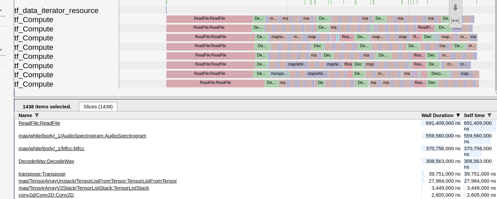

`tensorflow`和`keras`的结合太好了，今天训练模型超级慢，我准备使用`tensorflow`中的`timeline`来进行分析，一番寻找发现根本不需要以前那么麻烦。

<!--more-->

# 升级Tensorflow

首先要升级一下，我`2.0`版本的都还没有这个特性，需要安装：
```sh
pip install tf-nightly-gpu-2.0-preview -U
```
然后在`TensorBoard`回调中添加：
```python
tb_call = TensorBoard(log_dir=str(log_dir), profile_batch=3, update_freq='batch')
```
这样他会自动分析`batch=3`时的函数调用分析。

# 效果

可以看到基本上所有的等待时间都在读取文件与频谱图的生成了，所以我下一步要想办法去提升性能。



