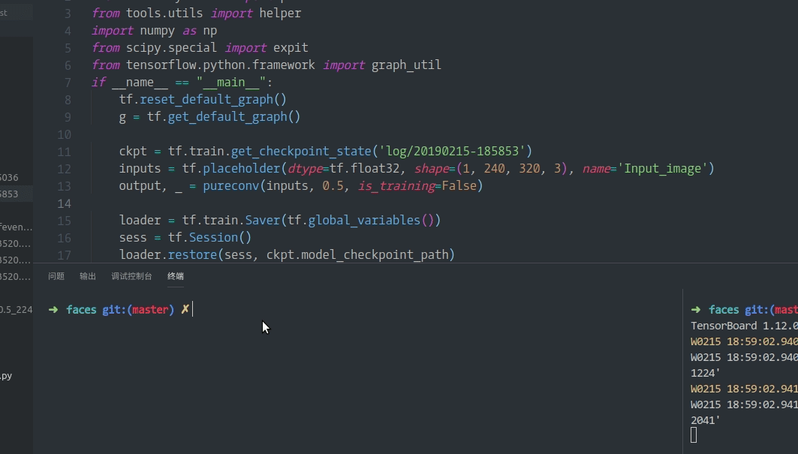
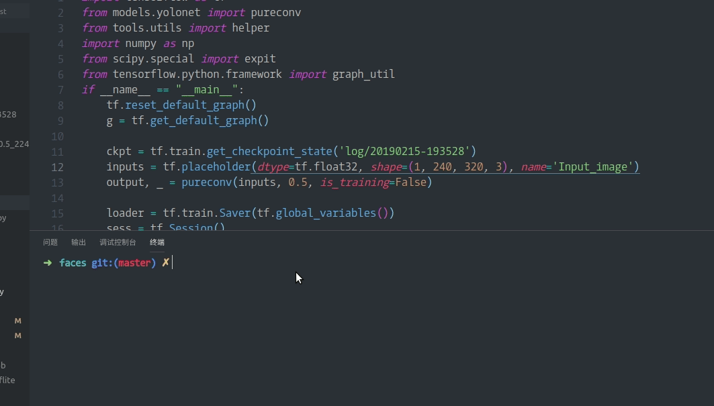

我最近做网络测试的时候,我发现推理出的结果和我训练的时候结果完全不相同.我做了一番测试.

<!--more-->

# 测试

首先我的原始的测试流程如下:


以上构建新图原因是因为要把网络输入修改成`Batch Size=1`.

之后的测试流程我直接训练结束保存pb文件:


## 测试代码

```Python
from models.yolonet import yoloconv
import tensorflow as tf
from tools.utils import helper
import skimage
import numpy as np
from scipy.special import expit

if __name__ == "__main__":
    tf.enable_eager_execution()
    fddb = helper('/home/zqh/Documents/faces/data/train.list', (224, 320), (7, 10))
    gen = fddb.generator()
    tf.reset_default_graph()
    g = tf.Graph()
    g1 = tf.Graph()
    with g.as_default():
        with tf.gfile.GFile('/home/zqh/Documents/faces/Training_save.pb', 'rb') as f:
            Training_save = tf.GraphDef()
            Training_save.ParseFromString(f.read())
        tf.import_graph_def(Training_save, name='')

    with g1.as_default():
        with tf.gfile.GFile('/home/zqh/Documents/faces/Freeze_save.pb.pb', 'rb') as f:
            Freeze_save = tf.GraphDef()
            Freeze_save.ParseFromString(f.read())
        tf.import_graph_def(Freeze_save, name='')

    train_weights = [opt for opt in g.get_operations() if 'read' in opt.name]
    train_weights = [g.get_tensor_by_name(opt.name+':0') for opt in train_weights]

    freeze_weights = [opt for opt in g1.get_operations() if 'read' in opt.name]
    freeze_weights = [g1.get_tensor_by_name(opt.name+':0') for opt in freeze_weights]

    """ start compare weights """
    with tf.Session(graph=g) as t_sess:
        t_var_dict = {}
        for var in train_weights:
            t_var_dict[var.name] = t_sess.run(var)

    with tf.Session(graph=g1) as f_sess:
        f_var_dict = {}
        for var in freeze_weights:
            f_var_dict[var.name] = f_sess.run(var)

    for name, value in t_var_dict.items():
        # ! all weights are equal
        assert np.array_equal(t_var_dict[name], f_var_dict[name])

    """ start test output """
    img, label = next(gen)
    img = img[np.newaxis, :, :, :]
    with tf.Session(graph=g) as t_sess:
        t_output = t_sess.run(g.get_tensor_by_name('predict:0'), feed_dict={g.get_tensor_by_name('Input_image:0'): img})

    with tf.Session(graph=g1) as f_sess:
        f_output = f_sess.run(g1.get_tensor_by_name('predict:0'), feed_dict={g1.get_tensor_by_name('Input_image:0'): img})

    t_output = expit(t_output)
    f_output = expit(f_output)
    # ! array not equal    Why ??
    if np.array_equal(t_output, f_output):
        print('test success!')
    else:
        print('results not equal. Why ??')
```

## 运行结果
```sh
results not equal. Why ??
```
以上代码中,我加载了两种不同保存方式的权重,然后一一对比了**所有权重**,权重**完全相同**,证明了保存pb的方式都没有问题.但是同一张图像,两个网络的输出结果确实不相同的.这个就十分诡异.

# 解决方案

~~我暂时也没用找到问题的原因,所以暂时还是直接训练完之后保存成pb文件.~~

这个问题还是必须要解决的,我在今天暂时解决了这个问题.

首先这个问题的原因在与`Batch norm`,因为`Batch norm`中的滑动平均值以及滑动方差,都是需要在数据集上重新计算出来的,所以如果把`Batch norm`的`is training`参数设置为`True`去保存.
那么在推理的时候输出会较好. 但是`k210`中必须要使`Batch norm`的`is training`参数设置为`False`.

下面是一个典型的现象:


## 解决步骤1

1.  首先我们需要让这个两个参数进行更新,将`train_op`定义为如下:
```python
    """ define train_op """
    update_ops = tf.get_collection(tf.GraphKeys.UPDATE_OPS)
    with tf.control_dependencies(update_ops):
        train_op = tf.train.AdamOptimizer(current_learning_rate).minimize(total_loss, global_steps)
```

2.  接下来我们需要让模型保存滑动平均参数

**注意:**正是因为滑动平均参数是需要在输入数据上计算出来的,所以这两个参数是默认不保存的.
将所有变量都传入,进行保存.
```python
    """ must save the bn paramter! """
    var_list = tf.global_variables()
    saver = tf.train.Saver(var_list)
```

加载时也同样:
```python
loader = tf.train.Saver(tf.global_variables())
```

以上就是代码中需要加的地方.

## 解决步骤2

现在我们需要训练模型.并且需要保证他有良好的泛化能力.
1.  设置占位符控制
```python
training_control = tf.placeholder_with_default(True, shape=[], name='training_control')
nets, endpoints = network(batch_image, depth_multiplier, is_training=training_control)
```

2.  在训练的同时测试

我们一直观察着模型的验证误差,这样在做推理的时候才知道效果.
```python
if j % 40 == 0:
    summary, test_con_acc, _, step_cnt = sess.run(
        [merged,  test_confidence_acc, test_acc_op, global_steps], feed_dict={training_control: False})
else:
    summary, _, total_l, con_acc, _,  lr, step_cnt = sess.run(
        [merged, train_op, total_loss, confidence_acc, acc_op, current_learning_rate, global_steps])
```

## 解决

说是解决,实际上没有解决.因为选择`False`以及`True`一定会导致模型输出不同,但是经过之前的步骤,是可以得出近似相同的结果的.


