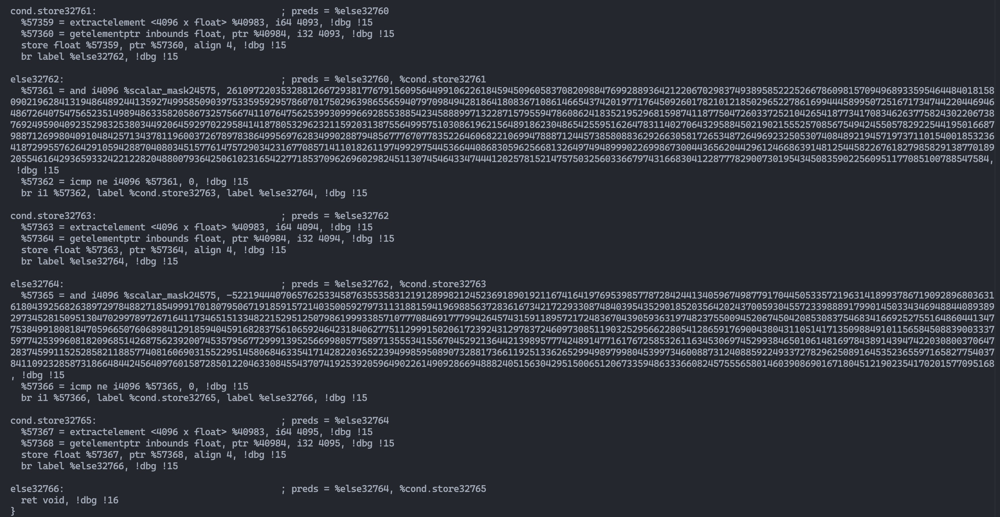

体验一下triton cpu，看看是否有想象中的效果。

<!--more-->


# 1. 下载

因为triton他依赖一个特定版本的llvm，所以必须要clone 完整的llvm再切过去，下载就浪费我半天= =
```sh
❯ git clone https://github.com/triton-lang/triton-cpu.git                                                       
❯ git clone https://github.com/llvm/llvm-project.git 
```

# 2. 编译

triton给出的编译方法是`pip install -e .`， 但是我还是想用cmake的方式自己编译， 然后遇到了一堆问题。。

## 2.1 llvm 编译

llvm可以参考他的ci中的编译方式, 他给每个平台都给出了详细的编译命令。

## 2.2 triton 编译选项

如果只有cpu后端， 那么就使用下面的选项:
```json
{
  "LLVM_LIBRARY_DIR": "xxxx/llvm-project/install/lib",
  "TRITON_BUILD_PYTHON_MODULE": true,
  "TRITON_BUILD_PROTON": false,
  "TRITON_CODEGEN_BACKENDS": "cpu",
  "TRITON_BUILD_UT": false
}
```


## 2.3 cmake bug 修复

cpu后端这句话会报错， 先注释掉
```cmake
# Override sleef's output directory with our own
# set_target_properties(sleef PROPERTIES LIBRARY_OUTPUT_DIRECTORY ${CMAKE_LIBRARY_OUTPUT_DIRECTORY})
```

## 2.4 cpp 编译错误修复

由于triton他的opt里面用了所有的后端的pass， 但是我们又没有编译nv/amd， 所以需要修改`bin/RegisterTritonDialects.h`, 把编译时报错的地方都注释掉。
然后`third_party/nvidia/include/TritonNVIDIAGPUToLLVM/Utility.h`中还有一个nv的函数找不到定义， 自己手动写个实现：
```cpp
bool canSkipBarSync(Operation *before, Operation *after){
  return false;
}
```

## 2.5 python 加载段错误修复

我用的python3.8， 好像在mac会和pybind会有奇怪的问题，需要修改cmake：
```cmake
    if(NOT APPLE)
      link_libraries(${Python3_LIBRARIES})
    endif()
```

## 2.6 软链接

triton的python编译脚本中有自动copy后端文件到指定目录， 这里我们手动就需要自己软链接
```sh
❯ cd python/triton/backends
❯ mkdir cpu
❯ cd cpu
❯ ln -s xxxx/triton-cpu/third_party/cpu/backend/driver.py driver.py               
❯ ln -s xxxx/triton-cpu/third_party/cpu/backend/compiler.py compiler.py
❯ cd triton-cpu/python/triton/_C
❯ ln -s xxxx/triton-cpu/out/build/debug/libtriton.so libtriton.so              
❯ ln -s xxxx/triton-cpu/out/build/debug/third_party/cpu/libTritonCPURuntime.dylib libTritonCPURuntime.dylib                
❯ ln -s xxxx/triton-cpu/out/build/debug/third_party/cpu/sleef/lib/libsleef.dylib libsleef.dylib                
```

## 2.7 环境变量配置

下面三个是debug使用的。
```sh
PYTHONPATH="xxxx/triton-cpu/out/build/debug:xxxx/triton-cpu/python"
TRITON_KERNEL_DUMP=1
TRITON_DEBUG=1
LLVM_IR_ENABLE_DUMP=1
```


## 2.8 python 执行报错

我这里是python3.8 但是他写了一个3.11才有的特性, 所以修改掉
```python
    def _init_slots(self):
        """ Initialize the slots of this class """
        for name, val in self.arg_properties.items():
            setattr(self, (name[3:] if name.startswith("tt.") else name) + '_' + str(self.property_values[name]), val)
```

还有一个是mac中选择编译器的问题, 修改文件`python/triton/runtime/build.py`:
```python
        if system == 'Darwin' and clang is not None:
            cc = clang
        else:
            cc = gcc if gcc is not None else clang
```

# 3. 运行

## 3.1  vector add

我尝试执行最简单的例子，但是他会卡死在生成asm，然后我发现dump的llvm ir非常奇怪， 有32768个数：

然后发现vector add中又有:
```python
CPU_ST_THRESHOLD = 65536
```

然后尝试一下缩小这个阈值， 果然就可以正常编译了= =。 但是还有omp的问题， 因为apple自带的apple-clang是没有omp功能的。

可以使用conda安装omp然后修改`python/triton/runtime/build.py`中mac的配置，并且下面之前添加的openmp需要注释掉，添加上编译选项/头文件/库。
```sh
    if system == "Darwin":
        cc_cmd += ["-undefined", "dynamic_lookup"]
        cc_cmd += ['-Xpreprocessor', '-fopenmp', '-lomp']
        include_dirs += ['xxxxx/miniforge3/envs/ci/include']
        library_dirs += ['xxxxx/miniforge3/envs/ci/lib']
        # Don't use libgcc on clang + macos
        if "clang" in cc:
            libraries.remove("gcc")
.
.
.
        # if not os.environ.get("TRITON_DISABLE_OPENMP", None):
        #   cc_cmd += ["-fopenmp"]
```

现在终于可以正常运行vector add:
```sh
❯ python python/tutorials/01-vector-add.py
tensor([0.5151, 1.6826, 0.9153,  ..., 0.9852, 1.2714, 1.8192])
tensor([0.5151, 1.6826, 0.9153,  ..., 0.9852, 1.2714, 1.8192])
The maximum difference between torch-cpu and triton-cpu is 0.0
The maximum difference between torch-cpu-tiled and triton-cpu is 0.0
```

我仔细观察后，发现这个`CPU_ST_THRESHOLD`其实就是`BLOCK_SIZE`的最大值，那么其实是`BLOCK_SIZE`大于512的时候就已经很难编译了，这个可能和triton编译出展开的代码关系比较大。


# 4. 整体流程

通过下面这个例子可以很好理解整个启动过程：

```python
import triton
import triton.language as tl
import torch


@triton.jit
def program_id_kernel(a, ConstArg: tl.constexpr):
  # There are multiple 'programs' processing different data. We identify which program
  # we are here:
  xid = tl.program_id(axis=0)
  yid = tl.program_id(axis=1)
  zid = tl.program_id(axis=2)
  tl.device_print("id:", xid, yid, zid)

  xsize = tl.num_programs(axis=0)
  ysize = tl.num_programs(axis=1)
  zsize = tl.num_programs(axis=2)
  tl.device_print("nums:", xsize, ysize, zsize)


def grid_callback(arguments):
  print(arguments)
  return [2, 2, 2]

a = torch.rand([10])
program_id_kernel[grid_callback](a, ConstArg=123)
```

## 4.1 如何并行？

首先triton编译出来的kernel他作为一个库函数， 默认都有3维的index作为输入参数。然后runtime的driver部分手写了一个launcher去调用triton kernel，在启动时根据预先设定的`gridX, gridY, gridZ`大小，将这些index的tuple展平为1维，然后直接用openmp并行循环i即可。这里其实存在一个问题，三个id生成的循环顺序和程序是无关的，但是程序的运行出来的性能却和id的顺序有关。
```cpp
auto all_grids = get_all_grids(gridX, gridY, gridZ);
// For now, use the default chunk size, total iterations / max_threads.
#ifdef _OPENMP
#pragma omp parallel for schedule(static) num_threads(max_threads)
#endif // _OPENMP
  for (size_t i = 0; i < N; ++i) {{
    const auto [x, y, z] = all_grids[i];
    (*kernel_ptr)({kernel_fn_args_list + ', ' if len(kernel_fn_args) > 0 else ''} x, y, z, gridX, gridY, gridZ);
  }}
}}
```

## 4.2 `gridX, gridY, gridZ`大小如何设定？

triton的runtime有launcher，但runtime也是被python端的jit function所调用的，在jit function启动一个kernel的时候，会把当前python端输入的参数都给到上面提到的`grid_callback`函数，此时这个函数的返回值就是`gridX, gridY, gridZ`大小。 也就是说我们可以根据当前输入tensor的尺寸选择合适的工作线程个数。

```python
class JITFunction(KernelInterface[T]):
    ...
    def run(self, *args, grid, warmup, **kwargs):
        ...
        if not warmup:
            # canonicalize grid
            assert grid is not None
            if callable(grid):
                # Arguments are passed as a dict to `grid`, by contract.
                # TODO(jlebar): In the new launch API, pass the compiler flags as a
                # second parameter to `grid`.
                grid = grid(bound_args)
            grid_size = len(grid)
            grid_0 = grid[0]
            grid_1 = grid[1] if grid_size > 1 else 1
            grid_2 = grid[2] if grid_size > 2 else 1

            # launch kernel
            launch_metadata = kernel.launch_metadata(grid, stream, *non_constexpr_vals)
            kernel.run(grid_0, grid_1, grid_2, stream, kernel.function, kernel.packed_metadata, launch_metadata,
                       self.CompiledKernel.launch_enter_hook, self.CompiledKernel.launch_exit_hook, *non_constexpr_vals)
```