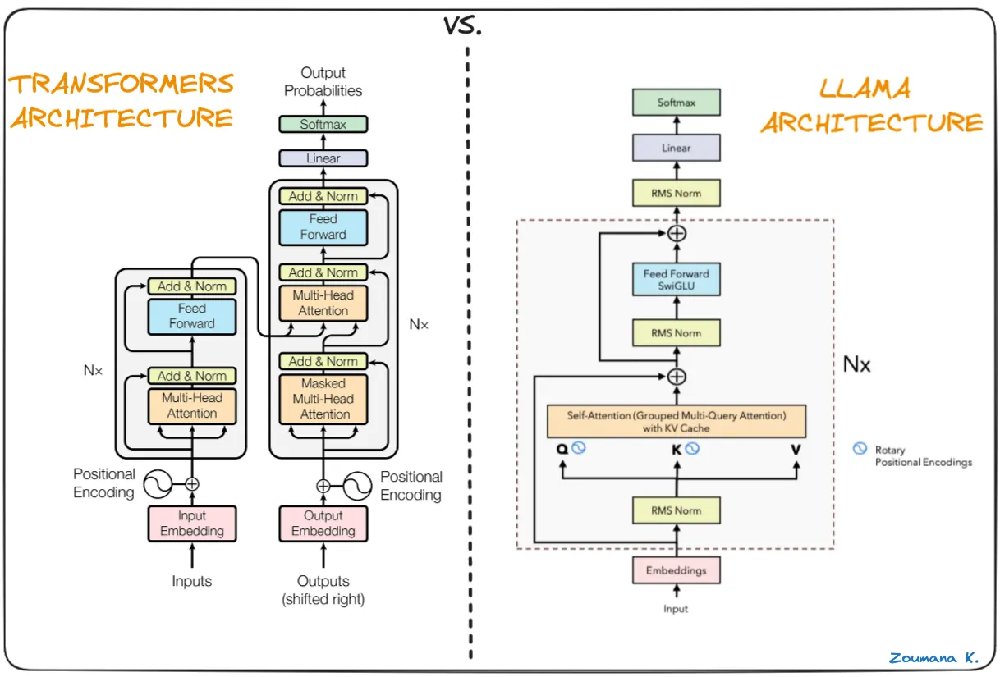
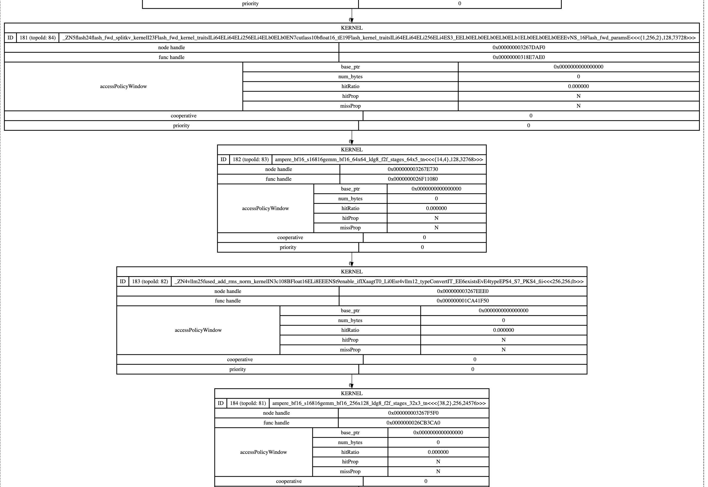
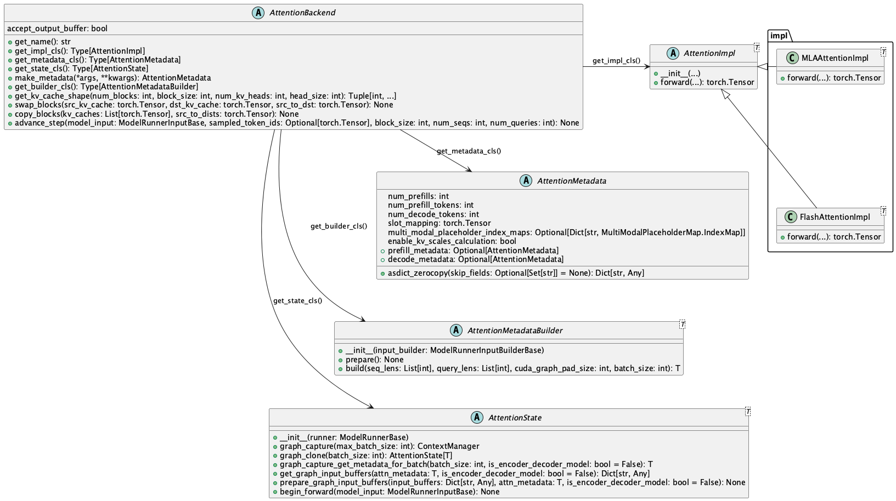
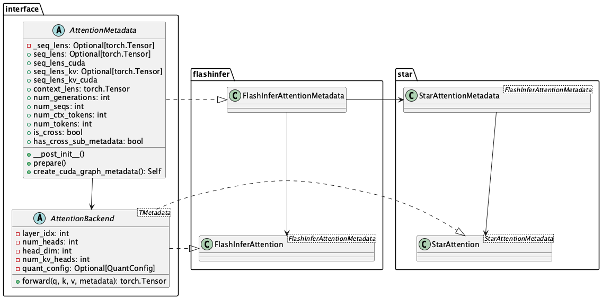
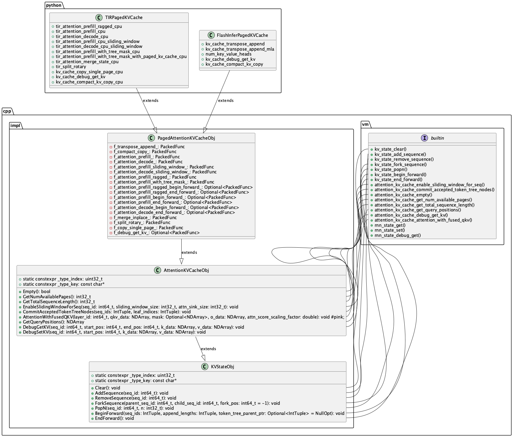

记录一下学习vllm/trt llm等框架的内容。

<!--more-->

# LLM模型结构

虽然用编译器编译了挺久的LLM，但其实对于宏观上的模型结构还是理解的不够深入。



首先现在的LLM基本上是重复Attention + FFN的结构，Attention里面首先有三个权重矩阵来计算得到QKV。 然后把QKV转换为`[batch,num_head,seq_len,head_size]`的形式, 然后是`Q*K^T`,这一步是计算每个head的相似度，计算完之后head size进行了规约，得到`[batch,num_head,seq_len,total_seq_len]`，然后是scaling以及softmax。后面再和V的`total seq len`维度进行规约，最后又得到`[batch,num_head,seq_len,head_size]`的输出。

```python
q: [batch,num_head,target_len,head_size]
k: [batch,num_head,source_len,head_size]
v: [batch,num_head,source_len,head_size]
s: [batch,num_head,target_len,source_len] = q @ k.T
s = s * scale + mask
s: [batch,num_head,target_len,source_len] = softmax(s,-1)
d: [batch,num_head,target_len,head_size] = s @ v
```


# vllm

vll支持的优化：
1. Continuous Batching
2. Paged Attention
3. Chunked Prefill
  要把decode融合到prefill中一起执行，当然比如要求`[prefill_token,decode_token]`的排列顺序。

## 安装 & 开发

为了构建一个方便调试的开发环境，可以采用官方镜像, 并且需要自己修改entrypoint：
```sh
docker run -d -it \
  --gpus all \
  --name vllm_dev \
  --cap-add=NET_ADMIN \
  --network=host \
  --privileged=true \
  --shm-size 50g \
  --entrypoint /bin/bash \
  vllm/vllm-openai:latest \
  -c "while true; do sleep 10; done"
```

进入官方镜像之后，他自带一个python3的环境，并且安装好了所有依赖，所以直接clone最新的vllm的并只安装python部分即可：
```sh
git clone https://gitee.com/mirrors/vllm.git
cd vllm
export VLLM_TARGET_DEVICE=cuda
export VLLM_USE_PRECOMPILED=1
python3 use_existing_torch.py
pip install --no-build-isolation -e .
```

## cuda graph

基于qwen 2.5 0.5b， 在`vllm/worker/model_runner.py`中1915行，注意他这里capture并不是一次，而是类似shape bucket, 迭代这些batch size`[256, 248, 240, 232, 224, 216, 208, 200, 192, 184, 176, 168, 160, 152, 144, 136, 128, 120, 112, 104, 96, 88, 80, 72, 64, 56, 48, 40, 32, 24, 16, 8, 4, 2, 1]`，他们也只会在batch上进行capture。
```python
        self._graph = torch.cuda.CUDAGraph()
        self._graph.enable_debug_mode()
        with torch.cuda.graph(self._graph, pool=memory_pool, stream=stream):
            output_hidden_or_intermediate_states = self.model(
                input_ids=input_ids, # [256]
                positions=positions, # [256]
                kv_caches=kv_caches, # [[2, 103168, 16, 2, 64], [2, 103168, 16, 2, 64],...] 24个
                attn_metadata=attn_metadata,
                intermediate_tensors=intermediate_inputs,
                **kwargs,
            )

            if isinstance(output_hidden_or_intermediate_states, torch.Tensor):
                hidden_or_intermediate_states = weak_ref_tensor(
                    output_hidden_or_intermediate_states)
            elif isinstance(output_hidden_or_intermediate_states,
                            IntermediateTensors):
                hidden_or_intermediate_states = IntermediateTensors(
                    tensors={
                        key: weak_ref_tensor(value)
                        for key, value in
                        output_hidden_or_intermediate_states.tensors.items()
                    })

            del output_hidden_or_intermediate_states
            # make sure `output_hidden_or_intermediate_states` is deleted
            # in the graph's memory pool
            gc.collect()
        torch.cuda.synchronize()
        self._graph.debug_dump("/root/vllm_learn/graph.dot")
```

不过他这里生成的cuda graph是这样的，并没有shape。



## attention layer size trace

在模型初始化的时候，会用最大的batch size trace一次， 这是每一个att的打印代码：
```python
    def forward(
        self,
        positions: torch.Tensor,
        hidden_states: torch.Tensor,
        kv_cache: torch.Tensor,
        attn_metadata: AttentionMetadata,
    ) -> torch.Tensor:
        print("hidden_states", hidden_states.shape) # [1, 896]
        qkv, _ = self.qkv_proj(hidden_states) 
        q, k, v = qkv.split([self.q_size, self.kv_size, self.kv_size], dim=-1)
        print("q", q.shape,"k", k.shape,"v", v.shape)
        q, k = self.rotary_emb(positions, q, k)
        print("ro q", q.shape,"ro k", k.shape)
        attn_output = self.attn(q, k, v, kv_cache, attn_metadata)
        print("attn_output", attn_output.shape)
        output, _ = self.o_proj(attn_output)
        print("output", output.shape)
        return output

hidden_states torch.Size([32768, 896])
q torch.Size([32768, 896]) k torch.Size([32768, 128]) v torch.Size([32768, 128])
ro q torch.Size([32768, 896]) ro k torch.Size([32768, 128])
attn_output torch.Size([32768, 896])
output torch.Size([32768, 896])
```

然后是prefill：
```python
hidden_states torch.Size([48, 896])
q torch.Size([48, 896]) k torch.Size([48, 128]) v torch.Size([48, 128])
ro q torch.Size([48, 896]) ro k torch.Size([48, 128])
attn_output torch.Size([48, 896])
output torch.Size([48, 896])
```

接下来是decode:
```python
hidden_states torch.Size([1, 896])
q torch.Size([1, 896]) k torch.Size([1, 128]) v torch.Size([1, 128])
ro q torch.Size([1, 896]) ro k torch.Size([1, 128])
attn_output torch.Size([1, 896])
output torch.Size([1, 896])
```

所以最重要的就是看decode的时候是如何适配seq len增长的。

## vllm attention detail

这是vllm中对于attention类的的设计：


这是vllm调度出来的请求与attention的meta data的对应关系图：


在decode的时候，会调用`vllm/attention/layer.py`的attention：
```python
def forward(
        self,
        query: torch.Tensor,
        key: torch.Tensor,
        value: torch.Tensor,
        kv_cache: torch.Tensor,
        attn_metadata: AttentionMetadata,
    ) -> torch.Tensor:
        # NOTE: please avoid accessing `kv_cache` and `attn_metadata` arguments
        # directly, use `self.kv_cache` and
        # `get_forward_context().attn_metadata` instead.
        if self.calculate_kv_scales:
            ctx_attn_metadata = get_forward_context().attn_metadata
            if ctx_attn_metadata.enable_kv_scales_calculation:
                self.calc_kv_scales(key, value)
        if self.use_output:
            output = torch.empty_like(query)
            hidden_size = query.size(-1)
            # Reshape the query, key, and value tensors.
            # NOTE(woosuk): We do this outside the custom op to minimize the
            # CPU overheads from the non-CUDA-graph regions.
            query = query.view(-1, self.num_heads, self.head_size)
            output = output.view(-1, self.num_heads, self.head_size)
            if key is not None:
                key = key.view(-1, self.num_kv_heads, self.head_size)
            if value is not None:
                value = value.view(-1, self.num_kv_heads, self.head_size)
            if self.use_direct_call:
                forward_context: ForwardContext = get_forward_context()
                ctx_attn_metadata = forward_context.attn_metadata
                self_kv_cache = self.kv_cache[forward_context.virtual_engine]
                self.impl.forward(self,
                                  query,
                                  key,
                                  value,
                                  self_kv_cache,
                                  ctx_attn_metadata,
                                  output=output)
            else:
                # note 上面把q都reshape到 [batch,num_heads,head_size]， kv转换为[num_kv_heads, head_size]
                # q [1,1,64] , k,v [1,2,64]
                torch.ops.vllm.unified_attention_with_output(
                    query, key, value, output, self.layer_name)
            return output.view(-1, hidden_size)
        else:
            if self.use_direct_call:
                forward_context = get_forward_context()
                ctx_attn_metadata = forward_context.attn_metadata
                self_kv_cache = self.kv_cache[forward_context.virtual_engine]
                return self.impl.forward(self, query, key, value,
                                         self_kv_cache, ctx_attn_metadata)
            else:
                return torch.ops.vllm.unified_attention(
                    query, key, value, self.layer_name)
# 虽然torch.ops.vllm.unified_attention_with_output看起来没有使用kv cache，但是实际上是使用了的。
def unified_attention_with_output(
    query: torch.Tensor,
    key: torch.Tensor,
    value: torch.Tensor,
    output: torch.Tensor,
    layer_name: str,
) -> None:
    forward_context: ForwardContext = get_forward_context()
    attn_metadata = forward_context.attn_metadata
    self = forward_context.attn_layers[layer_name]
    kv_cache = self.kv_cache[forward_context.virtual_engine]
    self.impl.forward(self,
                      query,
                      key,
                      value,
                      kv_cache,
                      attn_metadata,
                      output=output)
```


检查当前的attn metadata：
```python
FlashAttentionMetadata(num_prefills=0, num_prefill_tokens=0, num_decode_tokens=1, slot_mapping=tensor([54], device='cuda:0'), multi_modal_placeholder_index_maps={}, enable_kv_scales_calculation=True, seq_lens=[55], seq_lens_tensor=tensor([55], device='cuda:0', dtype=torch.int32), max_prefill_seq_len=0, max_decode_seq_len=55, context_lens_tensor=tensor([54], device='cuda:0', dtype=torch.int32), block_tables=tensor([[0, 1, 2, 3]], device='cuda:0', dtype=torch.int32), use_cuda_graph=False, max_query_len=1, max_decode_query_len=1, query_start_loc=tensor([0, 1], device='cuda:0', dtype=torch.int32), seq_start_loc=tensor([ 0, 55], device='cuda:0', dtype=torch.int32), _cached_prefill_metadata=None, _cached_decode_metadata=FlashAttentionMetadata(num_prefills=0, num_prefill_tokens=0, num_decode_tokens=1, slot_mapping=tensor([54], device='cuda:0'), multi_modal_placeholder_index_maps=None, enable_kv_scales_calculation=True, seq_lens=None, seq_lens_tensor=tensor([55], device='cuda:0', dtype=torch.int32), max_prefill_seq_len=0, max_decode_seq_len=55, context_lens_tensor=None, block_tables=tensor([[0, 1, 2, 3]], device='cuda:0', dtype=torch.int32), use_cuda_graph=False, max_query_len=1, max_decode_query_len=1, query_start_loc=tensor([0, 1], device='cuda:0', dtype=torch.int32), seq_start_loc=tensor([ 0, 55], device='cuda:0', dtype=torch.int32), _cached_prefill_metadata=None, _cached_decode_metadata=FlashAttentionMetadata(num_prefills=0, num_prefill_tokens=0, num_decode_tokens=1, slot_mapping=tensor([54], device='cuda:0'), multi_modal_placeholder_index_maps=None, enable_kv_scales_calculation=True, seq_lens=None, seq_lens_tensor=tensor([55], device='cuda:0', dtype=torch.int32), max_prefill_seq_len=0, max_decode_seq_len=55, context_lens_tensor=None, block_tables=tensor([[0, 1, 2, 3]], device='cuda:0', dtype=torch.int32), use_cuda_graph=False, max_query_len=1, max_decode_query_len=1, query_start_loc=tensor([0, 1], device='cuda:0', dtype=torch.int32), seq_start_loc=tensor([ 0, 55], device='cuda:0', dtype=torch.int32), _cached_prefill_metadata=None, _cached_decode_metadata=None, encoder_seq_lens=None, encoder_seq_lens_tensor=None, encoder_seq_start_loc=None, max_encoder_seq_len=None, num_encoder_tokens=None, cross_slot_mapping=None, cross_block_tables=None), encoder_seq_lens=None, encoder_seq_lens_tensor=None, encoder_seq_start_loc=None, max_encoder_seq_len=None, num_encoder_tokens=None, cross_slot_mapping=None, cross_block_tables=None), encoder_seq_lens=None, encoder_seq_lens_tensor=None, encoder_seq_start_loc=None, max_encoder_seq_len=None, num_encoder_tokens=None, cross_slot_mapping=None, cross_block_tables=None)

kv_cache: torch.Size([2, 101291, 16, 2, 64])
```

然后走到了`FlashAttentionImpl`.

注意这里在启用chunked prefill之后，一批token里面会同时存在prefill和decode，因此需要拆分为两个部分分别执行prefill的decode的attention。 同时这个只是在动态的情况下会被执行到，如果开启了cuda graph，那么decode阶段会直接走cuda graph replay，同时

```python
    """
    If the input tensors contain prompt tokens, the layout is as follows:
    |<--------------- num_prefill_tokens ----------------->|	
    |<--prefill_0-->|<--prefill_1-->|...|<--prefill_N-1--->|

    Otherwise, the layout is as follows:	
    |<----------------- num_decode_tokens ------------------>|	
    |<--decode_0-->|..........|<--decode_M-1-->|<--padding-->|

    Generation tokens can contain padding when cuda-graph is used.
    Currently, prompt tokens don't contain any padding.

    The prompts might have different lengths, while the generation tokens
    always have length 1.

    If chunked prefill is enabled, prefill tokens and decode tokens can be
    batched together in a flattened 1D query.

    |<----- num_prefill_tokens ---->|<------- num_decode_tokens --------->|
    |<-prefill_0->|...|<-prefill_N-1->|<--decode_0-->|...|<--decode_M-1-->|

    Currently, cuda graph is disabled for chunked prefill, meaning there's no
    padding between prefill and decode tokens.
    """
    def forward(
        self,
        layer: AttentionLayer,
        query: torch.Tensor,
        key: torch.Tensor,
        value: torch.Tensor,
        kv_cache: torch.Tensor,
        attn_metadata: FlashAttentionMetadata,
        output: Optional[torch.Tensor] = None,
    ) -> torch.Tensor:
        """Forward pass with FlashAttention.

        Args:
            query: shape = [num_tokens, num_heads, head_size]
            key: shape = [num_tokens, num_kv_heads, head_size]
            value: shape = [num_tokens, num_kv_heads, head_size]
            output: shape = [num_tokens, num_heads, head_size]
            kv_cache = [2, num_blocks, block_size, num_kv_heads, head_size]
                NOTE: kv_cache will be an empty tensor with shape [0]
                for profiling run.
            attn_metadata: Metadata for attention.
        NOTE: It in-place updates the output tensor.
        """
        # NOTE(woosuk): FlashAttention does not support FP8 KV cache.

        (num_prefill_query_tokens, num_prefill_kv_tokens,
        num_decode_query_tokens) = \
            get_num_prefill_decode_query_kv_tokens(attn_metadata, attn_type)
        decode_query = query[num_prefill_query_tokens:]
        decode_output = output[num_prefill_query_tokens:]
        # QKV for prefill.
        query = query[:num_prefill_query_tokens]
        prefill_output = output[:num_prefill_query_tokens]
        assert query.shape[0] == num_prefill_query_tokens
        assert decode_query.shape[0] == num_decode_query_tokens
        
        if prefill_meta := attn_metadata.prefill_metadata:
            # Prompt run.
            if (kv_cache.numel() == 0 or prefill_meta.block_tables is None
                    or prefill_meta.block_tables.numel() == 0):
                # normal attention
                # When block_tables are not filled, it means q and k are the
                # prompt, and they have the same length.
                q_seq_start_loc, q_seq_len, k_seq_start_loc, k_seq_len = \
                    _get_query_key_seq_metadata(prefill_meta, True, attn_type)

                key = key[:num_prefill_kv_tokens]
                value = value[:num_prefill_kv_tokens]

                flash_attn_varlen_func(
                    q=query,
                    k=key,
                    v=value,
                    cu_seqlens_q=q_seq_start_loc,
                    cu_seqlens_k=k_seq_start_loc,
                    max_seqlen_q=q_seq_len,
                    max_seqlen_k=k_seq_len,
                    softmax_scale=softmax_scale,
                    causal=_get_causal_option(attn_type),
                    window_size=window_size,
                    alibi_slopes=alibi_slopes,
                    softcap=logits_soft_cap,
                    out=prefill_output,
                    fa_version=self.fa_version,
                )
            else:
                # prefix-enabled attention
                assert attn_type == AttentionType.DECODER, (
                    "Only decoder-only models support prefix caching")
                assert prefill_meta.seq_lens is not None
                max_seq_len = max(prefill_meta.seq_lens)
                flash_attn_varlen_func(  # noqa
                    q=query,
                    k=key_cache,
                    v=value_cache,
                    cu_seqlens_q=prefill_meta.query_start_loc,
                    max_seqlen_q=prefill_meta.max_query_len,
                    seqused_k=prefill_meta.seq_lens_tensor,
                    max_seqlen_k=max_seq_len,
                    softmax_scale=softmax_scale,
                    causal=True,
                    window_size=window_size,
                    alibi_slopes=alibi_slopes,
                    block_table=prefill_meta.block_tables,
                    softcap=logits_soft_cap,
                    out=prefill_output,
                    fa_version=self.fa_version,
                )

        if decode_meta := attn_metadata.decode_metadata:
            # Decoding run.
            # Use flash_attn_varlen_func kernel for speculative decoding
            # because different queries might have different lengths.

            assert decode_meta.max_decode_query_len is not None
            # use only for actual varlen decoding
            if decode_meta.max_decode_query_len > 1:
                assert attn_type == AttentionType.DECODER, (
                    "Only decoder-only models support max_decode_query_len > 1"
                )
                flash_attn_varlen_func(
                    q=decode_query,
                    k=key_cache,
                    v=value_cache,
                    cu_seqlens_q=decode_meta.query_start_loc,
                    max_seqlen_q=decode_meta.max_decode_query_len,
                    seqused_k=decode_meta.seq_lens_tensor,
                    max_seqlen_k=decode_meta.max_decode_seq_len,
                    softmax_scale=softmax_scale,
                    causal=True,
                    window_size=window_size,
                    alibi_slopes=alibi_slopes,
                    softcap=logits_soft_cap,
                    block_table=decode_meta.block_tables,
                    out=decode_output,
                    fa_version=self.fa_version,
                )
            else:
                # Use flash_attn_with_kvcache for normal decoding.
                (
                    seq_lens_arg,
                    _,
                    block_tables_arg,
                ) = get_seq_len_block_table_args(decode_meta, False, attn_type)
                flash_attn_with_kvcache(
                    q=decode_query.unsqueeze(1),
                    k_cache=key_cache,
                    v_cache=value_cache,
                    block_table=block_tables_arg,
                    cache_seqlens=seq_lens_arg,
                    softmax_scale=softmax_scale,
                    causal=True,
                    window_size=window_size,
                    alibi_slopes=alibi_slopes,
                    softcap=logits_soft_cap,
                    out=decode_output.unsqueeze(1),
                    fa_version=self.fa_version,
                )
        return output
```

他上面实际上就是分三部分，首先是kv的reshape:
```python
            if kv_cache.numel() > 0:
            key_cache = kv_cache[0]
            value_cache = kv_cache[1]
            # We skip updating the KV cache under two conditions:
            #  a. When the Attention Type is ENCODER. In this phase, we compute
            #     only the encoder attention without updating the cache.
            #  b. When both Key and Value are None. This occurs during
            #     cross-attention computation in the decoding phase, where the
            #     KV cache is already populated with the cross-attention
            #     tensor. Thus, we skip cache updates during this time.
            if (attn_type != AttentionType.ENCODER) and (key is not None) and (
                    value is not None):
                if attn_type == AttentionType.ENCODER_DECODER:
                    # Update cross-attention KV cache (prefill-only)
                    updated_slot_mapping = attn_metadata.cross_slot_mapping
                else:
                    # Update self-attention KV cache (prefill/decode)
                    updated_slot_mapping = attn_metadata.slot_mapping

                # Reshape the input keys and values and store them in the cache.
                # If kv_cache is not provided, the new key and value tensors are
                # not cached. This happens during the initial memory
                # profiling run.
                torch.ops._C_cache_ops.reshape_and_cache_flash(
                    key,
                    value,
                    kv_cache[0],
                    kv_cache[1],
                    updated_slot_mapping.flatten(),  # type: ignore[union-attr]
                    kv_cache_dtype,
                    layer._k_scale,
                    layer._v_scale,
                )

        (num_prefill_query_tokens, num_prefill_kv_tokens,
        num_decode_query_tokens) = \
            get_num_prefill_decode_query_kv_tokens(attn_metadata, attn_type)
        decode_query = query[num_prefill_query_tokens:]
        decode_output = output[num_prefill_query_tokens:]
        # QKV for prefill.
        query = query[:num_prefill_query_tokens]
        prefill_output = output[:num_prefill_query_tokens]
        assert query.shape[0] == num_prefill_query_tokens
        assert decode_query.shape[0] == num_decode_query_tokens
```

然后根据场景走prefill和decode的flash attn,这里我主要关注decode部分。 在reshape kv的过程中，他的updated_slot_mapping是`[54]`，而实际上当前的seq_lens_arg是`[55]`,
block_tables_arg为`[1,2,3,4]`。
```python
        if decode_meta := attn_metadata.decode_metadata:
            # Decoding run.
            # Use flash_attn_varlen_func kernel for speculative decoding
            # because different queries might have different lengths.

            assert decode_meta.max_decode_query_len is not None
            # use only for actual varlen decoding
            if decode_meta.max_decode_query_len > 1:
                assert attn_type == AttentionType.DECODER, (
                    "Only decoder-only models support max_decode_query_len > 1"
                )
                flash_attn_varlen_func(
                    q=decode_query,
                    k=key_cache,
                    v=value_cache,
                    cu_seqlens_q=decode_meta.query_start_loc,
                    max_seqlen_q=decode_meta.max_decode_query_len,
                    seqused_k=decode_meta.seq_lens_tensor,
                    max_seqlen_k=decode_meta.max_decode_seq_len,
                    softmax_scale=softmax_scale,
                    causal=True,
                    window_size=window_size,
                    alibi_slopes=alibi_slopes,
                    softcap=logits_soft_cap,
                    block_table=decode_meta.block_tables,
                    out=decode_output,
                    fa_version=self.fa_version,
                )
            else:
                # Use flash_attn_with_kvcache for normal decoding.
                (
                    seq_lens_arg,
                    _,
                    block_tables_arg,
                ) = get_seq_len_block_table_args(decode_meta, False, attn_type)
                flash_attn_with_kvcache(
                    q=decode_query.unsqueeze(1),
                    k_cache=key_cache,
                    v_cache=value_cache,
                    block_table=block_tables_arg,
                    cache_seqlens=seq_lens_arg,
                    softmax_scale=softmax_scale,
                    causal=True,
                    window_size=window_size,
                    alibi_slopes=alibi_slopes,
                    softcap=logits_soft_cap,
                    out=decode_output.unsqueeze(1),
                    fa_version=self.fa_version,
                )
        return output

```

目前调用的是flash attn 2:
```python
def flash_attn_with_kvcache(
    q,
    k_cache,
    v_cache,
    k=None,
    v=None,
    rotary_cos=None,
    rotary_sin=None,
    cache_seqlens: Optional[Union[(int, torch.Tensor)]] = None,
    cache_batch_idx: Optional[torch.Tensor] = None,
    cache_leftpad: Optional[torch.Tensor] = None,
    block_table: Optional[torch.Tensor] = None,
    softmax_scale=None,
    causal=False,
    window_size=(-1, -1),  # -1 means infinite context window
    softcap=0.0, # 0.0 means deactivated
    rotary_interleaved=True,
    alibi_slopes=None,
    num_splits=0,
    return_softmax_lse=False,
    *,
    out=None,
    fa_version: int = DEFAULT_FA_VERSION,
):
    """
    If k and v are not None, k_cache and v_cache will be updated *inplace* with the new values from
    k and v. This is useful for incremental decoding: you can pass in the cached keys/values from
    the previous step, and update them with the new keys/values from the current step, and do
    attention with the updated cache, all in 1 kernel.

    If you pass in k / v, you must make sure that the cache is large enough to hold the new values.
    For example, the KV cache could be pre-allocated with the max sequence length, and you can use
    cache_seqlens to keep track of the current sequence lengths of each sequence in the batch.

    Also apply rotary embedding if rotary_cos and rotary_sin are passed in. The key @k will be
    rotated by rotary_cos and rotary_sin at indices cache_seqlens, cache_seqlens + 1, etc.
    If causal or local (i.e., window_size != (-1, -1)), the query @q will be rotated by rotary_cos
    and rotary_sin at indices cache_seqlens, cache_seqlens + 1, etc.
    If not causal and not local, the query @q will be rotated by rotary_cos and rotary_sin at
    indices cache_seqlens only (i.e. we consider all tokens in @q to be at position cache_seqlens).

    See tests/test_flash_attn.py::test_flash_attn_kvcache for examples of how to use this function.

    Supports multi-query and grouped-query attention (MQA/GQA) by passing in KV with fewer heads
    than Q. Note that the number of heads in Q must be divisible by the number of heads in KV.
    For example, if Q has 6 heads and K, V have 2 heads, head 0, 1, 2 of Q will attention to head
    0 of K, V, and head 3, 4, 5 of Q will attention to head 1 of K, V.

    If causal=True, the causal mask is aligned to the bottom right corner of the attention matrix.
    For example, if seqlen_q = 2 and seqlen_k = 5, the causal mask (1 = keep, 0 = masked out) is:
        1 1 1 1 0
        1 1 1 1 1
    If seqlen_q = 5 and seqlen_k = 2, the causal mask is:
        0 0
        0 0
        0 0
        1 0
        1 1
    If the row of the mask is all zero, the output will be zero.

    If window_size != (-1, -1), implements sliding window local attention. Query at position i
    will only attend to keys between
    [i + seqlen_k - seqlen_q - window_size[0], i + seqlen_k - seqlen_q + window_size[1]] inclusive.

    Note: Does not support backward pass.

    Arguments:
        q: (batch_size, seqlen, nheads, headdim)
        k_cache: (batch_size_cache, seqlen_cache, nheads_k, headdim) if there's no block_table,
            or (num_blocks, page_block_size, nheads_k, headdim) if there's a block_table (i.e. paged KV cache)
            page_block_size must be a multiple of 256.
        v_cache: (batch_size_cache, seqlen_cache, nheads_k, headdim) if there's no block_table,
            or (num_blocks, page_block_size, nheads_k, headdim) if there's a block_table (i.e. paged KV cache)
        k [optional]: (batch_size, seqlen_new, nheads_k, headdim). If not None, we concatenate
            k with k_cache, starting at the indices specified by cache_seqlens.
        v [optional]: (batch_size, seqlen_new, nheads_k, headdim). Similar to k.
        rotary_cos [optional]: (seqlen_ro, rotary_dim / 2). If not None, we apply rotary embedding
            to k and q. Only applicable if k and v are passed in. rotary_dim must be divisible by 16.
        rotary_sin [optional]: (seqlen_ro, rotary_dim / 2). Similar to rotary_cos.
        cache_seqlens: int, or (batch_size,), dtype torch.int32. The sequence lengths of the
            KV cache.
        block_table [optional]: (batch_size, max_num_blocks_per_seq), dtype torch.int32.
        cache_batch_idx: (batch_size,), dtype torch.int32. The indices used to index into the KV cache.
            If None, we assume that the batch indices are [0, 1, 2, ..., batch_size - 1].
            If the indices are not distinct, and k and v are provided, the values updated in the cache
                 might come from any of the duplicate indices.
        softmax_scale: float. The scaling of QK^T before applying softmax.
            Default to 1 / sqrt(headdim).
        causal: bool. Whether to apply causal attention mask (e.g., for auto-regressive modeling).
        window_size: (left, right). If not (-1, -1), implements sliding window local attention.
        softcap: float. Anything > 0 activates softcapping attention.
        rotary_interleaved: bool. Only applicable if rotary_cos and rotary_sin are passed in.
            If True, rotary embedding will combine dimensions 0 & 1, 2 & 3, etc. If False,
            rotary embedding will combine dimensions 0 & rotary_dim / 2, 1 & rotary_dim / 2 + 1
            (i.e. GPT-NeoX style).
        alibi_slopes: (nheads,) or (batch_size, nheads), fp32. A bias of
            (-alibi_slope * |i + seqlen_k - seqlen_q - j|)
            is added to the attention score of query i and key j.
        num_splits: int. If > 1, split the key/value into this many chunks along the sequence.
           If num_splits == 1, we don't split the key/value. If num_splits == 0, we use a heuristic
           to automatically determine the number of splits.
           Don't change this unless you know what you are doing.
        return_softmax_lse: bool. Whether to return the logsumexp of the attention scores.

    Return:
        out: (batch_size, seqlen, nheads, headdim).
        softmax_lse [optional, if return_softmax_lse=True]: (batch_size, nheads, seqlen). The
            logsumexp of each row of the matrix QK^T * scaling (e.g., log of the softmax
            normalization factor).
    """
    assert k_cache.stride(-1) == 1, "k_cache must have contiguous last dimension"
    assert v_cache.stride(-1) == 1, "v_cache must have contiguous last dimension"
    q, k, v = [maybe_contiguous(x) for x in (q, k, v)]
    if softmax_scale is None:
        softmax_scale = q.shape[-1] ** (-0.5)
    if cache_seqlens is not None and isinstance(cache_seqlens, int):
        cache_seqlens = torch.full(
            (k_cache.shape[0],), cache_seqlens, dtype=torch.int32, device=k_cache.device
        )
        cache_seqlens = maybe_contiguous(cache_seqlens)
    cache_batch_idx = maybe_contiguous(cache_batch_idx)
    block_table = maybe_contiguous(block_table)
    
    if fa_version == 2:
        out, softmax_lse = torch.ops._vllm_fa2_C.fwd_kvcache(
            q, k_cache, v_cache,
            k, v,             # k_new, v_new
            cache_seqlens,
            rotary_cos,
            rotary_sin,
            cache_batch_idx,
            cache_leftpad,
            block_table,
            alibi_slopes,
            out,
            softmax_scale,
            causal,
            window_size[0],
            window_size[1],
            softcap,
            rotary_interleaved,
            num_splits,
        )
    return (out, softmax_lse) if return_softmax_lse else out

```

其中这个`torch.ops._vllm_fa2_C.fwd_kvcache`实际上位于vllm的flash attention的`csrc/flash_attn/flash_api_torch_lib.cpp`。
```cpp

std::vector<at::Tensor>
mha_fwd_kvcache(at::Tensor &q,                 // batch_size x seqlen_q x num_heads x head_size
                const at::Tensor &kcache,            // batch_size_c x seqlen_k x num_heads_k x head_size or num_blocks x page_block_size x num_heads_k x head_size if there's a block_table.
                const at::Tensor &vcache,            // batch_size_c x seqlen_k x num_heads_k x head_size or num_blocks x page_block_size x num_heads_k x head_size if there's a block_table.
                std::optional<const at::Tensor> &k_, // batch_size x seqlen_knew x num_heads_k x head_size
                std::optional<const at::Tensor> &v_, // batch_size x seqlen_knew x num_heads_k x head_size
                std::optional<const at::Tensor> &seqlens_k_, // batch_size
                std::optional<const at::Tensor> &rotary_cos_, // seqlen_ro x (rotary_dim / 2)
                std::optional<const at::Tensor> &rotary_sin_, // seqlen_ro x (rotary_dim / 2)
                std::optional<const at::Tensor> &cache_batch_idx_, // indices to index into the KV cache
                std::optional<const at::Tensor> &leftpad_k_, // batch_size
                std::optional<at::Tensor> &block_table_, // batch_size x max_num_blocks_per_seq
                std::optional<at::Tensor> &alibi_slopes_, // num_heads or batch_size x num_heads
                std::optional<at::Tensor> &out_,             // batch_size x seqlen_q x num_heads x head_size
                const float softmax_scale,
                bool is_causal,
                int window_size_left,
                int window_size_right,
                const float softcap,
                bool is_rotary_interleaved,   // if true, rotary combines indices 0 & 1, else indices 0 & rotary_dim / 2
                int num_splits
                ) {

    // Otherwise the kernel will be launched from cuda:0 device
    at::cuda::CUDAGuard device_guard{q.device()};

    auto [cc_major, cc_minor] = get_compute_capability(get_current_device());
    bool is_sm8x_min = cc_major >= 8;
    TORCH_CHECK(is_sm8x_min, "FlashAttention only supports Ampere GPUs or newer.");

    auto q_dtype = q.dtype();
    TORCH_CHECK(q_dtype == torch::kFloat16 || q_dtype == torch::kBFloat16,
                "FlashAttention only support fp16 and bf16 data type");
    TORCH_CHECK(kcache.dtype() == q_dtype, "query and key must have the same dtype");
    TORCH_CHECK(vcache.dtype() == q_dtype, "query and value must have the same dtype");

    CHECK_DEVICE(q); CHECK_DEVICE(kcache); CHECK_DEVICE(vcache);

    TORCH_CHECK(q.stride(-1) == 1, "Input tensor must have contiguous last dimension");
    TORCH_CHECK(kcache.stride(-1) == 1, "Input tensor must have contiguous last dimension");
    TORCH_CHECK(vcache.stride(-1) == 1, "Input tensor must have contiguous last dimension");

    at::Tensor block_table;
    const bool paged_KV = block_table_.has_value();
    if (paged_KV) {
        TORCH_CHECK(!cache_batch_idx_.has_value(), "Paged KVcache does not support cache_batch_idx");
        block_table = block_table_.value();
        CHECK_DEVICE(block_table);
        TORCH_CHECK(block_table.dtype() == torch::kInt32, "block_table must have dtype torch.int32");
        TORCH_CHECK(block_table.stride(-1) == 1, "block_table must have contiguous last dimension");
    }

    const auto sizes = q.sizes();

    const int batch_size = sizes[0];
    int seqlen_q = sizes[1];
    int num_heads = sizes[2];
    const int head_size_og = sizes[3];
    const int seqlen_q_og = seqlen_q;
    const int num_heads_og = num_heads;

    const int max_num_blocks_per_seq = !paged_KV ? 0 : block_table.size(1);
    const int num_blocks = !paged_KV ? 0 : kcache.size(0);
    const int page_block_size = !paged_KV ? 1 : kcache.size(1);
    TORCH_CHECK(!paged_KV || page_block_size % 16 == 0, "Paged KV cache block size must be divisible by 16");
    const int seqlen_k = !paged_KV ? kcache.size(1) : max_num_blocks_per_seq * page_block_size;
    const int num_heads_k = kcache.size(2);
    const int batch_size_c = !paged_KV ? kcache.size(0) : batch_size;
    TORCH_CHECK(batch_size > 0, "batch size must be positive");
    TORCH_CHECK(head_size_og <= 256, "FlashAttention forward only supports head dimension at most 256");
    TORCH_CHECK(num_heads % num_heads_k == 0, "Number of heads in key/value must divide number of heads in query");

    // causal=true is the same as causal=false in this case
    if (seqlen_q == 1 && !alibi_slopes_.has_value()) { is_causal = false; }
    if (is_causal) { window_size_right = 0; }

    // Faster to transpose q from (b, 1, (nheads_kv ngroups), d) to (b, ngroups, nheads_kv, d) in this case
    // H/t Daniel Haziza
    const int seqlenq_ngroups_swapped = seqlen_q == 1 && num_heads > num_heads_k && window_size_left < 0 && window_size_right < 0 && head_size_og % 8 == 0 && !alibi_slopes_.has_value();
    if (seqlenq_ngroups_swapped) {
        const int ngroups = num_heads / num_heads_k;
        q = q.reshape({batch_size, num_heads_k, ngroups, head_size_og}).transpose(1, 2);
        seqlen_q = ngroups;
        num_heads = num_heads_k;
    }

    if (window_size_left >= seqlen_k) { window_size_left = -1; }
    if (window_size_right >= seqlen_k) { window_size_right = -1; }

    CHECK_SHAPE(q, batch_size, seqlen_q, num_heads, head_size_og);
    if (!paged_KV) {
        CHECK_SHAPE(kcache, batch_size_c, seqlen_k, num_heads_k, head_size_og);
        CHECK_SHAPE(vcache, batch_size_c, seqlen_k, num_heads_k, head_size_og);
    } else {
        CHECK_SHAPE(kcache, num_blocks, page_block_size, num_heads_k, head_size_og);
        CHECK_SHAPE(vcache, num_blocks, page_block_size, num_heads_k, head_size_og);
        CHECK_SHAPE(block_table, batch_size, max_num_blocks_per_seq);
    }

    at::Tensor q_padded, kcache_padded, vcache_padded;
    if (head_size_og % 8 != 0) {
        q_padded = torch::nn::functional::pad(q, torch::nn::functional::PadFuncOptions({0, 8 - head_size_og % 8}));
        kcache_padded = torch::nn::functional::pad(kcache, torch::nn::functional::PadFuncOptions({0, 8 - head_size_og % 8}));
        vcache_padded = torch::nn::functional::pad(vcache, torch::nn::functional::PadFuncOptions({0, 8 - head_size_og % 8}));
    } else {
        q_padded = q;
        kcache_padded = kcache;
        vcache_padded = vcache;
    }

    at::Tensor out;
    if (out_.has_value()) {
        out = out_.value();
        TORCH_CHECK(out.dtype() == q_dtype, "Output must have the same dtype as inputs");
        CHECK_DEVICE(out);
        TORCH_CHECK(out.stride(-1) == 1, "Output tensor must have contiguous last dimension");
        CHECK_SHAPE(out, batch_size, seqlen_q_og, num_heads_og, head_size_og);
        if (head_size_og % 8 != 0) {
            out = torch::empty_like(q_padded);
        } else if (seqlenq_ngroups_swapped) {
            out = out.reshape({batch_size, num_heads, seqlen_q, head_size_og}).transpose(1, 2);
        }
    } else {
        out = torch::empty_like(q_padded);
    }

    auto round_multiple = [](int x, int m) { return (x + m - 1) / m * m; };
    const int head_size = round_multiple(head_size_og, 8);
    const int head_size_rounded = head_size <= 192 ? round_multiple(head_size, 32) : 256;
    const int seqlen_q_rounded = round_multiple(seqlen_q, 128);
    const int seqlen_k_rounded = round_multiple(seqlen_k, 128);

    auto opts = q.options();

    auto softmax_lse = torch::empty({batch_size, num_heads, seqlen_q}, opts.dtype(at::kFloat));

    Flash_fwd_params params;
    set_params_fprop(params,
                     batch_size,
                     seqlen_q, seqlen_k,
                     seqlen_q_rounded, seqlen_k_rounded,
                     num_heads, num_heads_k,
                     head_size, head_size_rounded,
                     q_padded, kcache_padded, vcache_padded, out,
                     /*cu_seqlens_q_d=*/nullptr,
                     /*cu_seqlens_k_d=*/nullptr,
                     /*seqused_k=*/nullptr,
                     /*p_ptr=*/nullptr,
                     softmax_lse.data_ptr(),
                     /*p_dropout=*/0.f,
                     softmax_scale,
                     window_size_left,
                     window_size_right,
                     softcap
                     );

    at::Tensor k, v, k_padded, v_padded;
    if (k_.has_value()) {
        TORCH_CHECK(v_.has_value(), "If key is supplied, value must also be passed in");
        TORCH_CHECK(seqlens_k_.has_value(), "If key is supplied, seqlens_k must also be passed in");
        TORCH_CHECK(seqlen_q <= seqlen_k, "If key is supplied, it must have seqlen <= the seqlen of the KV cache");
        k = k_.value();
        v = v_.value();
        TORCH_CHECK(k.dtype() == q_dtype, "Key must have the same dtype as query");
        TORCH_CHECK(v.dtype() == q_dtype, "Value must have the same dtype as query");
        CHECK_DEVICE(k); CHECK_DEVICE(v);
        TORCH_CHECK(k.stride(-1) == 1, "Key tensor must have contiguous last dimension");
        TORCH_CHECK(v.stride(-1) == 1, "Value tensor must have contiguous last dimension");
        int seqlen_knew = k.size(1);
        CHECK_SHAPE(k, batch_size, seqlen_knew, num_heads_k, head_size_og);
        CHECK_SHAPE(v, batch_size, seqlen_knew, num_heads_k, head_size_og);
        if (head_size_og % 8 != 0) {
            k_padded = torch::nn::functional::pad(k, torch::nn::functional::PadFuncOptions({0, 8 - head_size_og % 8}));
            v_padded = torch::nn::functional::pad(v, torch::nn::functional::PadFuncOptions({0, 8 - head_size_og % 8}));
        } else {
            k_padded = k;
            v_padded = v;
        }
        params.seqlen_knew = seqlen_knew;
        params.knew_ptr = k_padded.data_ptr();
        params.vnew_ptr = v_padded.data_ptr();
        // All stride are in elements, not bytes.
        params.knew_batch_stride = k_padded.stride(0);
        params.vnew_batch_stride = v_padded.stride(0);
        params.knew_row_stride = k_padded.stride(-3);
        params.vnew_row_stride = v_padded.stride(-3);
        params.knew_head_stride = k_padded.stride(-2);
        params.vnew_head_stride = v_padded.stride(-2);
    }

    if (seqlens_k_.has_value()) {
        auto seqlens_k = seqlens_k_.value();
        TORCH_CHECK(seqlens_k.dtype() == torch::kInt32, "seqlens_k must have dtype int32");
        CHECK_DEVICE(seqlens_k);
        CHECK_CONTIGUOUS(seqlens_k);
        CHECK_SHAPE(seqlens_k, batch_size);
        params.cu_seqlens_k = static_cast<int *>(seqlens_k.data_ptr());
    }
    params.is_seqlens_k_cumulative = !(seqlens_k_.has_value());
    if (leftpad_k_.has_value()) {
        TORCH_CHECK(!paged_KV, "We don't support Paged KV and leftpad_k running at the same time yet");
        auto leftpad_k = leftpad_k_.value();
        TORCH_CHECK(leftpad_k.dtype() == torch::kInt32, "leftpad_k must have dtype int32");
        CHECK_DEVICE(leftpad_k);
        CHECK_CONTIGUOUS(leftpad_k);
        CHECK_SHAPE(leftpad_k, batch_size);
        params.leftpad_k = static_cast<int *>(leftpad_k.data_ptr());
    }

    if (rotary_cos_.has_value()) {
        TORCH_CHECK(k_.has_value(), "If rotary cos/sin are provided, new key / value to be appended to KV cache must also be provided");
        auto rotary_cos = rotary_cos_.value();
        CHECK_DEVICE(rotary_cos);
        params.rotary_dim = rotary_cos.size(1) * 2;
        TORCH_CHECK(params.rotary_dim <= head_size, "rotary_dim must be <= headdim");
        TORCH_CHECK(params.rotary_dim % 16 == 0, "Only rotary dimensions divisible by 16 are currently supported");
        const int seqlen_ro = rotary_cos.size(0);
        TORCH_CHECK(seqlen_ro >= seqlen_k, "cos/sin seqlen must be at least the seqlen of KV cache");
        CHECK_SHAPE(rotary_cos, seqlen_ro, params.rotary_dim / 2);
        CHECK_CONTIGUOUS(rotary_cos);
        TORCH_CHECK(rotary_cos.scalar_type() == q_dtype, "rotary_cos must have the same dtype as query");

        TORCH_CHECK(rotary_sin_.has_value(), "If rotary cos is provided, rotary sin must also be provided");
        auto rotary_sin = rotary_sin_.value();
        CHECK_DEVICE(rotary_sin);
        CHECK_SHAPE(rotary_sin, seqlen_ro, params.rotary_dim / 2);
        CHECK_CONTIGUOUS(rotary_sin);
        TORCH_CHECK(rotary_sin.scalar_type() == q_dtype, "rotary_cos must have the same dtype as query");
        params.rotary_cos_ptr = rotary_cos.data_ptr();
        params.rotary_sin_ptr = rotary_sin.data_ptr();
        params.is_rotary_interleaved = is_rotary_interleaved;
    } else {
        params.rotary_dim = 0;
    }

    if (cache_batch_idx_.has_value()) {
        auto cache_batch_idx = cache_batch_idx_.value();
        CHECK_DEVICE(cache_batch_idx);
        CHECK_CONTIGUOUS(cache_batch_idx);
        TORCH_CHECK(cache_batch_idx.scalar_type() == torch::kInt32, "cache_batch_idx must have dtype int32");
        params.cache_batch_idx = reinterpret_cast<int *>(cache_batch_idx.data_ptr());
    }

    // Keep references to these tensors to extend their lifetime
    at::Tensor softmax_lse_accum, out_accum;
    std::tie(softmax_lse_accum, out_accum) = set_params_splitkv(
        params, batch_size, num_heads, head_size, seqlen_k, seqlen_q,
        head_size_rounded, /*dropout*/ 0.f, num_splits, get_num_sm(get_current_device()), opts);

    if (paged_KV) {
        params.block_table = block_table.data_ptr<int>();
        params.block_table_batch_stride = block_table.stride(0);
    }
    params.page_block_size = page_block_size;


    set_params_alibi(params, alibi_slopes_, batch_size, num_heads);

    auto stream = at::cuda::getCurrentCUDAStream().stream();
    // Only split kernel supports appending to KV cache, or indexing to the cache with cache_batch_idx,
    // or paged KV cache
    run_mha_fwd(params, stream, /*force_split_kernel=*/k_.has_value() || cache_batch_idx_.has_value() || paged_KV);

    if (head_size_og % 8 != 0) {
        out = out.index({"...", torch::indexing::Slice(torch::indexing::None, head_size_og)});
        if (out_.has_value()) { out_.value().copy_(out); }
        if (k_.has_value()) {
            // It's expensive to copy the KV cache here for the case where head size not divisible by 8,
            // but we don't expect to get this case in practice. This is just so that the code works for that case.
            kcache.copy_(kcache_padded.index({"...", torch::indexing::Slice(torch::indexing::None, head_size_og)}));
            vcache.copy_(vcache_padded.index({"...", torch::indexing::Slice(torch::indexing::None, head_size_og)}));
        }
    }

    if (seqlenq_ngroups_swapped) {
        out = out.transpose(1, 2).reshape({batch_size, 1, num_heads_k * seqlen_q, head_size_og});
        softmax_lse = softmax_lse.reshape({batch_size, num_heads_k * seqlen_q, 1});
    }
    return {out, softmax_lse};
}
```

实际上他这里也是有padding的。当k存在时，强行走split k:
```cpp
void run_mha_fwd(Flash_fwd_params &params, cudaStream_t stream, bool force_split_kernel=false) {
    FP16_SWITCH(!params.is_bf16, [&] {
        HEADDIM_SWITCH(params.d, [&] {
            BOOL_SWITCH(params.is_causal, Is_causal, [&] {
                if (params.num_splits <= 1 && !force_split_kernel) {  // If we don't set it num_splits == 0
                    run_mha_fwd_<elem_type, kHeadDim, Is_causal>(params, stream);
                } else {
                    run_mha_fwd_splitkv_dispatch<elem_type, kHeadDim, Is_causal>(params, stream);
                }
            });
        });
    });
}
```

然后在这个dispatch中还有许多变体，不过重要的就是tile的kv都是从远端读取过来的。

```cpp
    if (block_table != nullptr) {
        auto final_block_size = binfo.actual_seqlen_k - (n_block_max - 1) * kBlockN;
        tKgK.data() = gK.data() + flash::resolve_thread_kv_page_slice_offset<Kernel_traits>(tidx, n_block_max - 1, params.page_block_size,
            block_table, params.k_batch_stride, params.k_row_stride, final_block_size);
        tVgV.data() = gV.data() + flash::resolve_thread_kv_page_slice_offset<Kernel_traits>(tidx, n_block_max - 1, params.page_block_size,
            block_table, params.v_batch_stride, params.v_row_stride, final_block_size);
    }

```

## vllm fused moe

要理解vllm fused moe，首先从最naive的huggingface版来理解moe的执行流程，首先整体流程如下：


实际上就是一共64个expert，假设4个设备，ep=4，那么每个设备放8个expert。到gating时的输入都需要是broadcast的，然后gating计算hidden states对应每个expert的概率，将概率排序后进行all to all后使用当前设备中expert的计算outputs。注意他这里的all to all之后实际上每个设备还是算64个expert，只不过是8个expert重复了4次。 等计算完outpus之后再all to all就可以恢复到每个节点64个expert的输出。

```python
    @torch.no_grad()
    def moe_infer(self, x, topk_ids, topk_weight):
        cnts = topk_ids.new_zeros((topk_ids.shape[0], len(self.experts))) # [global batch, n_experts]
        cnts.scatter_(1, topk_ids, 1) # assgin activated experts to 1
        tokens_per_expert = cnts.sum(dim=0) # 每个token会选择不同的，那么一个专家会处理多个token，统计每个专家要处理的token数量
        idxs = topk_ids.view(-1).argsort() # 先sort topk id, 这样idx 为 [global batch * n_experts], 其中expert的索引从小到大排序
        sorted_tokens = x[idxs // topk_ids.shape[1]] # 因为他前面是先view再argsort，除shape[1]是为了保证只选当前token对应的expert。
        sorted_tokens_shape = sorted_tokens.shape
        if self.ep_size > 1:
            tokens_per_ep_rank = tokens_per_expert.view(self.ep_size, -1).sum(dim=1) # [ep_size, n_experts/ep_size] -> [ep_size]
            tokens_per_expert_group = tokens_per_expert.new_empty(
                tokens_per_expert.shape[0]
            )
            dist.all_to_all_single(tokens_per_expert_group, tokens_per_expert) # 先all to all拿到当前的节点上每个expert要处理的token数量
            output_splits = (
                tokens_per_expert_group.view(self.ep_size, -1)
                .sum(1)
                .cpu()
                .numpy()
                .tolist()
            )
            gathered_tokens = sorted_tokens.new_empty(
                tokens_per_expert_group.sum(dim=0).cpu().item(), sorted_tokens.shape[1]
            )
            input_split_sizes = tokens_per_ep_rank.cpu().numpy().tolist()
            dist.all_to_all(
                list(gathered_tokens.split(output_splits)),
                list(sorted_tokens.split(input_split_sizes)),
            ) # all to all拿到当前的节点上每个expert要处理的token
            tokens_per_expert_post_gather = tokens_per_expert_group.view(
                self.ep_size, self.experts_per_rank
            ).sum(dim=0)
            gatherd_idxs = np.zeros(shape=(gathered_tokens.shape[0],), dtype=np.int32)
            s = 0
            for i, k in enumerate(tokens_per_expert_group.cpu().numpy()):
                gatherd_idxs[s : s + k] = i % self.experts_per_rank
                s += k
            gatherd_idxs = gatherd_idxs.argsort()
            sorted_tokens = gathered_tokens[gatherd_idxs]
            tokens_per_expert = tokens_per_expert_post_gather
        tokens_per_expert = tokens_per_expert.cpu().numpy()

        outputs = []
        start_idx = 0
        for i, num_tokens in enumerate(tokens_per_expert):
            end_idx = start_idx + num_tokens
            if num_tokens == 0:
                continue
            expert = self.experts[i + self.ep_rank * self.experts_per_rank]
            tokens_for_this_expert = sorted_tokens[start_idx:end_idx] # 由于sort之后，分到同一个expert上token已经都排好了，所以直接取
            expert_out = expert(tokens_for_this_expert)
            outputs.append(expert_out)
            start_idx = end_idx

        outs = torch.cat(outputs, dim=0) if len(outputs) else sorted_tokens.new_empty(0) # [global batch*n_act_experts, hidden_size]
        if self.ep_size > 1:
            new_x = torch.empty_like(outs)
            new_x[gatherd_idxs] = outs
            gathered_tokens = new_x.new_empty(*sorted_tokens_shape)
            dist.all_to_all(
                list(gathered_tokens.split(input_split_sizes)),
                list(new_x.split(output_splits)),
            )
            outs = gathered_tokens # 再来一次all to all拿到当前节点处理好的gathered tokens

        new_x = torch.empty_like(outs)
        new_x[idxs] = outs
        final_out = (
            new_x.view(*topk_ids.shape, -1)
            .type(topk_weight.dtype)
            .mul_(topk_weight.unsqueeze(dim=-1))
            .sum(dim=1)
            .type(new_x.dtype)
        )
        return final_out
```


## vllm并行模式


|           | **Attention**                                        | **MoE - Shared Experts**         | **MoE - Routed Experts**                                                   |
| --------- | ---------------------------------------------------- | -------------------------------- | -------------------------------------------------------------------------- |
| **DP**    | 权重复制 <br> *可在推理框架外部处理*                     | 权重复制                     | **EP关闭:** 权重复制<br>**EP开启:** 按EP(=DP)数量切分                  |
| **TP**    | 按head切分<br>*需同步LM head*<br>*需支持广播meta data* | 切分n和k维度<br>*需做all-reduce* | **EP关闭:** 权重复制<br>**EP开启:** 按EP(=TP)数量切分                        |
| **TP+DP** | TP组内切分<br>DP组内复制                               | TP组内切分<br>DP组内复制       | **EP关闭:** 权重复制<br>**EP开启:** 按EP(=TP*DP)总数切分 |

- **EP是依赖于DP/TP的MoE专用切分模式，EP = TP * DP**，主要影响Routed Experts的分布


同时开启DP + TP时，对于权重分布如上图所示，在group 0/group 1间为权重复制，在每个group内为权重切分。此时需要主要attn metadata是group间不同，group内相同。


# trt llm

trt llm的整体流程其实还蛮像一个端到端的AI编译器的。他可以直接吃整个模型，然后直接生成c代码，并且替换已有的plugin算子。

## plugin

先看看他如何定义plugin的，首先他在python端提供了一些辅助函数用于定义plugin算子的输入输出信息。

```python
def get_fmha_kernel_meta_data():
    return KernelMetaData(
        kernel_name='fused_attention_kernel',
        ios=[
            # outputs
            OutputArg('Out', Type('tensor[fp16]'), hints=['16', '16']),
            OutputArg('L', Type('tensor[fp32]'), hints=['16', '16']),
            OutputArg('M', Type('tensor[fp16]'), hints=['16', '16']),
            # inputs
            InputArg('Q', Type('tensor[fp16]'), hints=['16', '16']),
            InputArg('K', Type('tensor[fp16]'), hints=['16', '16']),
            InputArg('V', Type('tensor[fp16]'), hints=['16', '16']),
            ParamArg('sm_scale', Type('fp32')),
            DimSizeArg('batch_size'),
            ParamArg('num_heads', Type('i32')),
            DimSizeArg('seq_len', hints=['', '16']),
            # constexprs
            Constexpr(128),
            Constexpr(64),
            Constexpr(128),
        ],
        shape_infer_rules=[
            # The following rules helps to deduce the shapes of the output tensors
            "Q[*] -> Out[*]",
            "Q[m,n,k,*] -> L[m,n,k]",
            "Q[m,n,k,*] -> M[m,n,k]",

            # The following rules helps to deduce both DimSizeArgs: batch_size and seq_len
            "Q[m,n,k,*] : m -> batch_size",
            "Q[m,n,k,*] : k -> seq_len",
        ],
        version=0,
        kernel_file=f'{openai_triton_example_root}/fmha_triton.py',
        num_warps=1,
        grid_dims=("(seq_len + 127) / 128", "batch_size * num_heads", "1"))


KERNELS = [
    get_fmha_kernel_meta_data(),
]

```

甚至还支持了一套读取复杂计算表达式参数的转换器，用于把算子的计算逻辑转换成c接口代码。
```python
@pytest.mark.parametrize('expr, target', [
    ("a[m,n,k]:m*2+k+(n+1) -> b",
     "((inputDesc[0].dims.d[0] * 2) + (inputDesc[0].dims.d[2] + (inputDesc[0].dims.d[1] + 1)))"
     ),
    ("a[m,n,k]:m*(2+k)+n+1 -> b",
     "((inputDesc[0].dims.d[0] * (2 + inputDesc[0].dims.d[2])) + (inputDesc[0].dims.d[1] + 1))"
     ),
    ("a[m,n,k] -> b[m*((((n+1))))]", """
if (outputIndex == 0) {
  outputDims.nbDims = 1;
  outputDims.d[0] = (inputDims[0].d[0] * (inputDims[0].d[1] + 1));
}
     """),
    ("a[m,n,k] -> b[m*(n+k), 2*n, k+3]", """
nvinfer1::DimsExprs outputDims;
if (outputIndex == 0) {
  outputDims.nbDims = 3;
  outputDims.d[0] = (inputDims[0].d[0] * (inputDims[0].d[1] + inputDims[0].d[2]));
  outputDims.d[1] = (2 * inputDims[0].d[1]);
  outputDims.d[2] = (inputDims[0].d[2] + 3);
}""")
])
def test_CppCodeTranspiler(expr: str, target: str):
    args = dict(
        a=InputArg('a', Type('fp16')),
        b=InputArg('b', Type('fp16')),
    )
    target = target.strip()

    transpiler = CppCodeTranspiler(args)

    shape_infer_code, dim_infer_code = transpiler([expr])

    # we don't check the correctness of the code since the lark produces unstable ast tree
    # refer to https://github.com/lark-parser/lark/issues/324
    assert shape_infer_code or dim_infer_code
```

## auto parallel

首先是切分描述，trt llm和shardy类似，是对一个维度来描述切分，如果为空，那么当前维度就是复制，否则在对应的mesh上进行切分：
```python
class DimSpec:
    def __init__(self, shard_list):
        self.is_replica = len(shard_list) == 0
        self.shard_list = shard_list

    def __repr__(self):
        if self.is_replica:
            return 'R'
        target = f"S({','.join(str(dim) for dim in self.shard_list)})"
        return target
```

然后一个tensor的切分信息由多个dim spec组成:

```python
class ShardingSpec:
    def __init__(self, entire_shape, sharding_sequence, device_mesh):
      ...
    def __repr__(self):
        res = "DistSpec("
        res += f"shape={self.entire_shape},"
        res += f"shard={self.sharding_sequence},"
        res += f"mesh={self.device_mesh.mesh_shape}"
        res += ")"
        return res
```

然后构造一个分布式切分搜索图：
```python
    def get_cost_graph(self, lmesh):
        leaf_strategies = []
        for node in self.nodes:
            if node.is_replicated:
                node.set_strategy(None, lmesh)
            else:
                node.collect_strategies(lmesh)
        for node in self.nodes:
            strategies_vector = node.update_resharding_cost()
            if len(strategies_vector) != 0:
                leaf_strategies.append(strategies_vector)
        cost_graph = CostGraph(leaf_strategies)
        return cost_graph
```

首先是遍历所有节点，如果这个是`is_replicated`，也就是提前标记了不可分布式，那么直接设置为None，否则遍历所有可能的切分策略，然后计算这个节点的cost（包含了通信和计算）。其中`collect_strategies`核心代码如下, 他似乎是只考虑在2维拓扑以下进行分布式，但是这里加的策略还是全的，不过好像只添加考虑输出节点的切分，并不是SBP的基于推导的方法。
```python
    def _collect_strategies(self, device_mesh):
        dim_partition_list = []
        dim_size = len(self.op_data['output0'].shape)
        dim_partition_list.append({})
        dim_partition_list.extend(
            self._enumerate_all_possible_1d_sharding([0, 1], dim_size))
        dim_partition_list.extend(
            self._enumerate_all_possible_2d_sharding([0], [1], dim_size))
        dim_partition_list.extend(
            self._enumerate_all_possible_1d_sharding([0], dim_size))
        dim_partition_list.extend(
            self._enumerate_all_possible_1d_sharding([1], dim_size))

        strategies_vector = StrategiesVector(self)
        for dim_partition_dict in dim_partition_list:
            dim_partition_dict_mapping = {'output0': dim_partition_dict}
            sharding_spec_mapping = self._to_sharding_spec_mapping(
                dim_partition_dict_mapping, device_mesh)
            if 0 == len(sharding_spec_mapping):
                continue
            sharding_seq = sharding_spec_mapping['output0'].sharding_sequence
            sharding_strategy = self._get_sharding_strategy(
                name=f'constant-op {sharding_seq}',
                sharding_spec_mapping=sharding_spec_mapping,
                communication_action_mapping={})
            strategies_vector.append(sharding_strategy)

        return strategies_vector
```

然后发现实际上这个方法是可以被override的，对于matmul来说有自己的collect方法：
```python
    def _collect_strategies(self, device_mesh):
        strategies_vector = StrategiesVector(self)
        dp_strategies = self._dp_strategies(device_mesh)
        tp_strategies = self._tp_strategies(device_mesh)
        mix_strategies = self._mix_strategies(device_mesh)
        bmm_strategies = self._bmm_strategies(device_mesh)
        strategies_vector.extend(dp_strategies)
        strategies_vector.extend(tp_strategies)
        strategies_vector.extend(mix_strategies)
        strategies_vector.extend(bmm_strategies)
        return strategies_vector
```
这是matmul所collect出来的切分方式：
```python
RR = RS(0) x S(0)R_allreduceS(0)
RR = RS(1) x S(1)R_allreduceS(1)
RR = RS(0,1) x S(0,1)R_allreduceS(0,1)
[R, S(0)] = [R, S(0)] x [S(0), R]_reducescatter(1, S(0))
[R, S(1)] = [R, S(1)] x [S(1), R]_reducescatter(1, S(1))
[R, S(0,1)] = [R, S(0,1)] x [S(0,1), R]_reducescatter(1, S(0,1))
RS(0) = RR x RS(0)
RS(1) = RR x RS(1)
RS(0,1) = RR x RS(0,1)
RS(1) = RS(0) x S(0)S(1)_allreduceS(0)
RS(0) = RS(1) x S(1)S(0)_allreduceS(1)
RR = RR x RR
```

同样attention或其他节点也有自己的分布式切分收集函数，这里和oneflow不同的是，他并不会传播partial的切分，我的理解是拆分的越细那么灵活性更高，可以后续做自动的通算融合，大粒度后面还是走匹配替换来优化。

每个算子的分布式策略收集好之后，还需要构建reshard cost，因为可能上一个节点的切分策略并不是下一个节点所需要的切分策略，所以需要计算reshard cost。
```python
    def _update_resharding_cost(self, strategies):
        for strategy in strategies:
            resharding_costs = {}
            for pre_node, out_index in self.predecessor_nodes_out_index.items():
                if pre_node is None:
                    continue
                pre_node_out_data_name = pre_node.get_output(out_index).name
                pre_node_out_data_lname = pre_node.global_to_local_op_name[
                    pre_node_out_data_name]
                if pre_node_out_data_name not in self.global_to_local_op_name:
                    print(f"pre_node_out_data_name = {pre_node_out_data_name}")
                    continue
                cur_node_inp_data_lname = self.global_to_local_op_name[
                    pre_node_out_data_name]
                cur_sharding_spec = strategy.sharding_specs[
                    cur_node_inp_data_lname]

                pre_node_out_sharding_specs = []
                for pre_strategy in pre_node.strategies_vector:
                    pre_node_out_sharding_specs.append(
                        pre_strategy.sharding_specs[pre_node_out_data_lname])

                if pre_node not in resharding_costs:
                    resharding_costs[pre_node.node_name] = []
                for prev_sharding_spec in pre_node_out_sharding_specs:
                    resharding_cost = self._compute_resharding_cost(
                        prev_sharding_spec, cur_sharding_spec,
                        self.op_data[cur_node_inp_data_lname]) # 话说为什么他要限制这个op的切分类型，本来这个gather就可以切输入啊
                    resharding_costs[pre_node.node_name].append(resharding_cost)
            strategy.resharding_costs = resharding_costs
```

## PyExector

trt llm之前通过编译的方式发现使用起来不方便，因此他也模仿vllm，提供了一个python的executor，直接动态执行大模型。并且他新的接口就做了相当的精简：



# mlc llm

mlc这里就不看调度的过程了，只看kv cache，attention是如何和编译器集成的。



tvm中首先是在vm中定义了基础的kv cache state接口，然后实现了具体的kv cache管理逻辑。然后AttentionKVCacheObj中包含了一个最重要的函数AttentionWithFusedQKV。tvm为了在python端可以集成不同的 attention实现，是在python中调用vm的kv cache的create，在create中将不同的attention计算函数作为packed func传入。最终执行时是vm调用AttentionWithFusedQKV，AttentionWithFusedQKV中调用自身的tir_attention_decode_cpu/tir_attention_decode_gpu等等函数。

他这套逻辑还是比较复杂的，需要在python和cpp中转换多次。

# sglang 

这是sglang在attention部分的类图：


# 问题汇总

## vllm问题

1. TypeError: must be called with a dataclass type or instance

发现是torch 2.5.1 cu118不能用triton 3.2，需要降级到3.1

2. RuntimeError: NCCL error: unhandled cuda error (run with NCCL_DEBUG=INFO for details)

检查detail发现是runtime的nccl是cu12的

3. json.decoder.JSONDecodeError: Extra data: line 5298 column 2 (char 479924)

发现是之前下载的模型的json有问题，重新下载就行了

4. RuntimeError: Triton Error [CUDA]: device kernel image is invalid

```sh
[rank0]: torch._dynamo.exc.BackendCompilerFailed: backend='inductor' raised:
[rank0]: RuntimeError: Triton Error [CUDA]: device kernel image is invalid

[rank0]: Set TORCH_LOGS="+dynamo" and TORCHDYNAMO_VERBOSE=1 for more information


[rank0]: You can suppress this exception and fall back to eager by setting:
[rank0]:     import torch._dynamo
[rank0]:     torch._dynamo.config.suppress_errors = True
```

这个应该是triton默认只能编译出最新的cuda版本的代码,把本地的ptxas替换掉triton中的：
```sh
cp /usr/local/cuda/bin/ptxas /root/miniconda3/envs/vllm/lib/python3.10/site-packages/triton/backends/nvidia/bin/ptxas
```

5. `NCCL WARN NCCL cannot be captured in a graph`

好像是安装的nccl版本和cuda 11.8还是兼容？
```sh
misc/strongstream.cc:53 NCCL WARN NCCL cannot be captured in a graph if either it wasn't built with CUDA runtime >= 11.3 or if the installed CUDA driver < R465.
```

我现在的版本是`nvidia-nccl-cu11-2.21.5`,卸载之后重装老的版本
```
❯ pip install nvidia-nccl-cu11==2.19.3 -i https://download.pytorch.org/whl/cu118
```

好像也不行，可能是因为老的版本的nccl就没有支持capture graph的功能，需要重新编译nccl，但是实际上可以`--enforce-eager`跳过这个问题。

## trt llm问题

1. cuda版本问题

trt llm和cuda版本是强绑定的，所以如果cuda 版本不到，就直接没法运行，所以只能安装老版本的trt llm。


2. tensorrt bindings的问题

我发现使用pip安装的tensorrt llm中的tensorrt 调用的是tensorrt bindings，然后我安装他得到的是8.6.1版本，这个不是我想要的。解决方法是pip卸载tensorrt，然后用trt llm中的shell脚本安装tensorrt。

3. mpi版本问题

pip安装trt llm的时候总是报错编译mpi4py失败，然后我查看了一下，发现是mpi版本的问题，默认apt安装openmpi得到40+版本了，但是trt llm中需要的是3.1.5，所以解决方案是不要apt装openmpi，通过conda-forge安装3.1.5版本


## scaled dot product attention (SDPA) 精度问题

我发现在mac上使用 `torch.nn.functional.scaled_dot_product_attention` 与自己实现的 `scaled_dot_product_attention` 得到的结果精度有差异。但是如果设定了SDPA的实现为MATH就不会有精度差异，并且是否设定MATH的backend也会导致精度问题，我就很难理解默认的backend是什么。
```python
import math
from typing import Optional
import torch
from torch.nn.attention import SDPBackend, sdpa_kernel

def scaled_dot_product_attention(query: torch.Tensor, key: torch.Tensor, value: torch.Tensor, attn_mask: Optional[torch.Tensor] = None, dropout_p: float = 0.0, is_causal: bool = False, scale: Optional[float] = None) -> torch.Tensor:
    L, S = query.size(-2), key.size(-2)
    scale_factor = 1 / math.sqrt(query.size(-1)) if scale is None else scale
    attn_bias = torch.zeros(L, S, dtype=query.dtype, device=query.device)
    if is_causal:
        assert attn_mask is None
        temp_mask = torch.ones(L, S, dtype=torch.bool).tril(diagonal=0)
        attn_bias.masked_fill_(temp_mask.logical_not(), float("-inf"))
        attn_bias.to(query.dtype)

    if attn_mask is not None:
        if attn_mask.dtype == torch.bool:
            attn_bias.masked_fill_(attn_mask.logical_not(), float("-inf"))
        else:
            attn_bias = attn_mask + attn_bias

    # if enable_gqa:
    #     key = key.repeat_interleave(query.size(-3)//key.size(-3), -3)
    #     value = value.repeat_interleave(query.size(-3)//value.size(-3), -3)

    attn_weight = query @ key.transpose(-2, -1) * scale_factor
    attn_weight += attn_bias
    attn_weight = torch.softmax(attn_weight, dim=-1)
    attn_weight = torch.dropout(attn_weight, dropout_p, train=True)
    return attn_weight @ value

q = torch.randn(1, 2, 7, 101, 64)
k = torch.randn(1, 2, 1, 101, 64)
v = torch.randn(1, 2, 1, 101, 64)
mask = torch.zeros(1, 2, 7, 101, 101)

y1 = scaled_dot_product_attention(
    q, k, v, attn_mask=mask, dropout_p=0.0, scale=1.0, is_causal=mask is None)

q2 = q.reshape(1, -1, 101, 64)
k2 = torch.repeat_interleave(k, 7, 2).reshape(1, -1, 101, 64)
v2 = torch.repeat_interleave(v, 7, 2).reshape(1, -1, 101, 64)
mask2 = mask.reshape(1, -1, 101, 101)
y2 = scaled_dot_product_attention(
    q2, k2, v2, attn_mask=mask2, dropout_p=0.0, scale=1.0, is_causal=mask2 is None)
 
assert torch.allclose(y1, y2.reshape(1, 2, 7, 101, 64))

with sdpa_kernel([SDPBackend.MATH]):
  y3 = torch.nn.functional.scaled_dot_product_attention(
      q2, k2, v2, attn_mask=mask2, dropout_p=0.0, scale=1.0, is_causal=mask2 is None)
 
assert torch.allclose(y2, y3)

y3_1 = torch.nn.functional.scaled_dot_product_attention(
    q2, k2, v2, attn_mask=mask2, dropout_p=0.0, scale=1.0, is_causal=mask2 is None)
 
assert torch.allclose(y3, y3_1) # will fail
```