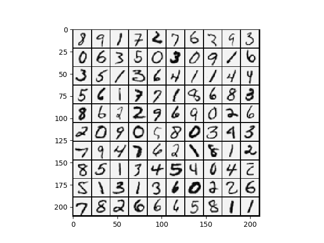

这个是第三周的作业,是一个多类的正则化逻辑回归和神经网络.


<!--more-->

# 注意要点:

1.  **正则化损失函数**

    $$ \begin{aligned}
        J(\Theta)&=\frac{1}{2m}\sum^m_{i=1}[((h_\theta(x)-y)^2+\lambda\sum^n_{j=1}\theta_j^2)]\\
    \end{aligned} $$


    这里的`j`是从`1`开始的,但是这个$X*\Theta=\theta_0+\theta_1x_1+\theta_2x_2+\ldots\theta_nx_n$,为了补全这个$\theta_0$需要将$\Theta$矩阵加一行.


2.  **正则化梯度函数**

    $$ \begin{aligned}
        \theta_0&=\theta_0-a\frac{1}{m}\sum^m_{i=1}((h_\theta(x^i)-y^i)x_0^i) \\
        \theta_j&=\theta_j-a[\frac{1}{m}\sum^m_{i=1}((h_\theta(x^i)-y^i)x_j^i)+\frac{\lambda}{m}\theta_j] \\
    \end{aligned} $$

    这里$\theta_0$在正则化的时候没有了,所以在乘上$\Theta$的时候要`copy`一个新的`temp`让其第一行为`0`.

3.  **维度匹配**


    因为$\Theta$加了一行,所以我的`X`也要加一列,用于矩阵运算维数匹配.

3.  **预测下标问题**


    因为`python`的数组下标为`0`开始,但是手写数字识别的数据是从`matlab`中来的,是从`1`开始的,所以在`argmax`之后需要将返回值加`1`.


# ex3.py


```python
from numpy.core import *
from numpy import c_
from numpy.random import *
import matplotlib.pyplot as plt
from fucs3 import displayData, lrCostFunction,\
    oneVsAll, costFuc, gradFuc, predictOneVsAll
from scipy.io import loadmat

if __name__ == "__main__":
    # Machine Learning Online Class - Exercise 3 | Part 1: One-vs-all

    #  Instructions
    #  ------------
    #
    #  This file contains code that helps you get started on the
    #  linear exercise. You will need to complete the following functions
    #  in this exericse:
    #
    #     lrCostFunction.m (logistic regression cost function)
    #     oneVsAll.m
    #     predictOneVsAll.m
    #     predict.m
    #
    #  For this exercise, you will not need to change any code in this file,
    #  or any other files other than those mentioned above.
    #

    # Initialization

    # Setup the parameters you will use for this part of the exercise
    input_layer_size = 400  # 20x20 Input Images of Digits
    num_labels = 10          # 10 labels, from 1 to 10
    # (note that we have mapped "0" to label 10)

    # =========== Part 1: Loading and Visualizing Data =============
    #  We start the exercise by first loading and visualizing the dataset.
    #  You will be working with a dataset that contains handwritten digits.
    #

    # Load Training Data
    print('Loading and Visualizing Data ...')

    # training data stored in arrays X, y
    data = loadmat('machine_learning_exam/week3/ex3data1.mat')
    X = data['X']  # type:ndarray
    y = data['y']  # type:ndarray

    m = size(X, 0)

    # Randomly select 100 data points to display
    rand_indices = choice(m, 100)
    sel = X[rand_indices, :]
    displayData(sel)

    print('Program paused. Press enter to continue.')
    # # pause

    # ============ Part 2a: Vectorize Logistic Regression ============
    #  In this part of the exercise, you will reuse your logistic regression
    #  code from the last exercise. You task here is to make sure that your
    #  regularized logistic regression implementation is vectorized. After
    #  that, you will implement one-vs-all classification for the handwritten
    #  digit dataset.
    #

    # Test case for lrCostFunction
    print('Testing lrCostFunction() with regularization')

    theta_t = array([-2., - 1., 1., 2.]).reshape(-1, 1)
    # [ones((5, 1)) reshape(1:15, 5, 3)/10]
    X_t = c_[ones((5, 1)), arange(
        1, 16, dtype=float).reshape((5, 3), order='F')/10]
    y_t = array([1., 0., 1., 0., 1.]).reshape(-1, 1)
    lambda_t = 3
    # print('theta', theta_t)
    # print('x', X_t)
    # print('y', y_t)
    J, grad = lrCostFunction(theta_t, X_t, y_t, lambda_t)

    print('Cost: {}'.format(J))
    print('Expected cost: 2.534819')
    print('Gradients:')
    print(grad)
    print('Expected gradients:')
    print(' 0.146561 -0.548558 0.724722 1.398003')

    print('Program paused. Press enter to continue.')

    # # ============ Part 2b: One-vs-All Training ============
    print('Training One-vs-All Logistic Regression...')

    lamda = 0.1

    all_theta = oneVsAll(X, y, num_labels, lamda)

    print('Program paused. Press enter to continue.')

    # # ================ Part 3: Predict for One-Vs-All ================

    # y是1~10之间的 所以pred要加1
    pred = predictOneVsAll(all_theta, X).reshape(-1, 1)+1

    print('Training Set Accuracy: {}%'.format(mean(array(pred == y)) * 100))
    plt.show()

```


## 效果



**下面的waring是因为达到我设定的迭代次数**

```sh
➜  Machine_learning /usr/bin/python3 /media/zqh/程序与工程/Python_study/Machine_learning/machine_learning_exam/week3/ex3.py
Loading and Visualizing Data ...
Program paused. Press enter to continue.
Testing lrCostFunction() with regularization
Cost: [[2.5348194]]
Expected cost: 2.534819
Gradients:
[[ 0.14656137]
 [-0.54855841]
 [ 0.72472227]
 [ 1.39800296]]
Expected gradients:
 0.146561 -0.548558 0.724722 1.398003
Program paused. Press enter to continue.
Training One-vs-All Logistic Regression...
Warning: Maximum number of iterations has been exceeded.
         Current function value: 0.013718
         Iterations: 50
         Function evaluations: 183
         Gradient evaluations: 183
Warning: Maximum number of iterations has been exceeded.
         Current function value: 0.056204
         Iterations: 50
         Function evaluations: 141
         Gradient evaluations: 141
Warning: Maximum number of iterations has been exceeded.
         Current function value: 0.061957
         Iterations: 50
         Function evaluations: 139
         Gradient evaluations: 139
Warning: Maximum number of iterations has been exceeded.
         Current function value: 0.037384
         Iterations: 50
         Function evaluations: 154
         Gradient evaluations: 154
Warning: Maximum number of iterations has been exceeded.
         Current function value: 0.064096
         Iterations: 50
         Function evaluations: 131
         Gradient evaluations: 131
Warning: Maximum number of iterations has been exceeded.
         Current function value: 0.020031
         Iterations: 50
         Function evaluations: 175
         Gradient evaluations: 175
Warning: Maximum number of iterations has been exceeded.
         Current function value: 0.033819
         Iterations: 50
         Function evaluations: 161
         Gradient evaluations: 161
Warning: Maximum number of iterations has been exceeded.
         Current function value: 0.085543
         Iterations: 50
         Function evaluations: 130
         Gradient evaluations: 130
Warning: Maximum number of iterations has been exceeded.
         Current function value: 0.076294
         Iterations: 50
         Function evaluations: 136
         Gradient evaluations: 136
Warning: Maximum number of iterations has been exceeded.
         Current function value: 0.009110
         Iterations: 50
         Function evaluations: 182
         Gradient evaluations: 182
Program paused. Press enter to continue.
Training Set Accuracy: 95.12%
```


# ex3_nn.py


```python
from numpy.core import *
from numpy.matrixlib import mat
from numpy.random import choice, shuffle
from scipy.io import loadmat
import matplotlib.pyplot as plt
from fucs3 import displayData, predict

if __name__ == "__main__":
    # Machine Learning Online Class - Exercise 3 | Part 2: Neural Networks

    #  Instructions
    #  ------------
    #
    #  This file contains code that helps you get started on the
    #  linear exercise. You will need to complete the following functions
    #  in this exericse:
    #
    #     lrCostFunction.m (logistic regression cost function)
    #     oneVsAll.m
    #     predictOneVsAll.m
    #     predict.m
    #
    #  For this exercise, you will not need to change any code in this file,
    #  or any other files other than those mentioned above.
    #

    # Setup the parameters you will use for this exercise
    input_layer_size = 400  # 20x20 Input Images of Digits
    hidden_layer_size = 25   # 25 hidden units
    num_labels = 10          # 10 labels, from 1 to 10
    # (note that we have mapped "0" to label 10)

    # =========== Part 1: Loading and Visualizing Data =============
    #  We start the exercise by first loading and visualizing the dataset.
    #  You will be working with a dataset that contains handwritten digits.
    #

    # Load Training Data
    print('Loading and Visualizing Data ...')

    # training data stored in arrays X, y
    data = loadmat('machine_learning_exam/week3/ex3data1.mat')
    X = data['X']  # type:ndarray
    y = data['y']  # type:ndarray

    m = size(X, 0)

    # Randomly select 100 data points to display
    rand_indices = choice(m, 100)
    sel = X[rand_indices, :]
    displayData(sel)
    plt.show()

    print('Program paused. Press enter to continue.')

    # ================ Part 2: Loading Pameters ================
    # In this part of the exercise, we load some pre-initialized
    # neural network parameters.

    print('Loading Saved Neural Network Parameters ...')

    # Load the weights into variables Theta1 and Theta2
    weightdata = loadmat('machine_learning_exam/week3/ex3weights.mat')
    Theta1 = weightdata['Theta1']
    Theta2 = weightdata['Theta2']
    # ================= Part 3: Implement Predict =================
    #  After training the neural network, we would like to use it to predict
    #  the labels. You will now implement the "predict" function to use the
    #  neural network to predict the labels of the training set. This lets
    #  you compute the training set accuracy.

    pred = predict(Theta1, Theta2, X)

    print('Training Set Accuracy: {}%'.format(mean((pred == y)) * 100))

    print('Program paused. Press enter to continue.')

    #  To give you an idea of the network's output, you can also run
    #  through the examples one at the a time to see what it is predicting.

    #  Randomly permute examples
    rp = arange(m)
    shuffle(rp)

    for i in range(10):
        # Display
        print('Displaying Example Image')
        displayData(mat(X[rp[i, ], :]))

        pred = predict(Theta1, Theta2, mat(X[rp[i, ], :]))
        print('Neural Network Prediction: {} (digit {})'.format(pred,
                                                                pred % 10))
        plt.show()

```


## 效果

```sh
➜  Machine_learning /usr/bin/python3 /media/zqh/程序与工程/Python_study/Machine_learning/machine_learning_exam/week3/ex3_nn.py
Loading and Visualizing Data ...
Program paused. Press enter to continue.
Loading Saved Neural Network Parameters ...
Training Set Accuracy: 97.52%
Program paused. Press enter to continue.
Displaying Example Image
Neural Network Prediction: [[8]] (digit [[8]])
Displaying Example Image
Neural Network Prediction: [[5]] (digit [[5]])
Displaying Example Image
Neural Network Prediction: [[10]] (digit [[0]])
Displaying Example Image
Neural Network Prediction: [[5]] (digit [[5]])
Displaying Example Image
Neural Network Prediction: [[10]] (digit [[0]])
Displaying Example Image
Neural Network Prediction: [[8]] (digit [[8]])
Displaying Example Image
Neural Network Prediction: [[6]] (digit [[6]])
Displaying Example Image
Neural Network Prediction: [[10]] (digit [[0]])
Displaying Example Image
Neural Network Prediction: [[2]] (digit [[2]])
Displaying Example Image
Neural Network Prediction: [[3]] (digit [[3]])
```

# fuc3.py


```python
from scipy.optimize import minimize
import matplotlib.pyplot as plt
import numpy as np
from scipy.special import expit
from scipy.optimize import fmin_cg
import math


def displayData(X: np.ndarray, e_width=0):
    if e_width == 0:
        e_width = int(round(math.sqrt(X.shape[1])))
    m, n = X.shape

    # 单独一个样本的像素大小
    e_height = int(n/e_width)

    # 分割线
    pad = 1

    # 整一副图的像素大小
    d_rows = math.floor(math.sqrt(m))
    d_cols = math.ceil(m / d_rows)
    d_array = np.mat(
        np.ones((pad+d_rows*(e_height+pad), pad + d_cols * (e_width+pad))))

    curr_ex = 0
    for j in range(d_rows):
        for i in range(d_cols):
            if curr_ex > m:
                break
            max_val = np.max(abs(X[curr_ex, :]))
            d_array[pad+j*(e_height+pad) + 0:pad+j*(e_height+pad) + e_height,
                    pad+i*(e_width+pad)+0:pad+i*(e_width+pad) + e_width] = \
                X[curr_ex, :].reshape(e_height, e_width)/max_val
            curr_ex += 1
        if curr_ex > m:
            break
    # 转置一下放正
    plt.imshow(d_array.T, cmap='Greys')


def lrCostFunction(theta: np.ndarray, X: np.ndarray, y: np.ndarray, lamda):
    # LRCOSTFUNCTION Compute cost and gradient for logistic regression with
    # regularization
    #   J = LRCOSTFUNCTION(theta, X, y, lambda) computes the cost of using
    #   theta as the parameter for regularized logistic regression and the
    #   gradient of the cost w.r.t. to the parameters.

    # Initialize some useful values
    m = y.shape[0]  # number of training examples

    # You need to return the following variables correctly
    J = 0
    theta = theta.reshape(-1, 1)
    grad = np.zeros(theta.shape)
    y = np.asfarray(y)  # y转为float array

    # ====================== YOUR CODE HERE ======================
    # Instructions: Compute the cost of a particular choice of theta.
    #               You should set J to the cost.
    #               Compute the partial derivatives and set grad to the partial
    #               derivatives of the cost w.r.t. each parameter in theta
    #
    # Hint: The computation of the cost function and gradients can be
    #       efficiently vectorized. For example, consider the computation
    #
    #           sigmoid(X * theta)
    #
    #       Each row of the resulting matrix will contain the value of the
    #       prediction for that example. You can make use of this to vectorize
    #       the cost function and gradient computations.
    #
    # Hint: When computing the gradient of the regularized cost function,
    #       there're many possible vectorized solutions, but one solution
    #       looks like:
    #           grad = (unregularized gradient for logistic regression)
    #           temp = theta;
    #           temp(1) = 0;   # because we don't add anything for j = 0
    #           grad = grad + YOUR_CODE_HERE (using the temp variable)
    #

    # 把theta的第一行变成0,但是不能改变原来的theta!
    temp = theta.copy()
    temp[0, :] = 0

    h = expit(X@theta)  # h:[m,1]

    J = np.sum(-y*np.log(h)-(1-y)*np.log(1-h)) / m \
        + lamda * temp.T@temp / (2*m)
    # 梯度
    grad = (X.T@(h-y)+lamda * temp) / m

    # =============================================================
    return J, grad


# 只计算损失，用于适配scipy的函数
def costFuc(theta: np.ndarray, X: np.ndarray, y: np.ndarray, lamda):
    m = y.shape[0]
    J = 0
    theta = theta.reshape(-1, 1)
    grad = np.zeros(theta.shape)
    y = np.asfarray(y)  # y转为float array

    # 把theta的第一行变成0,但是不能改变原来的theta!
    temp = theta.copy()
    temp[0, :] = 0

    h = expit(X@theta)  # h:[m,1]

    J = np.sum(-y*np.log(h)-(1-y)*np.log(1-h)) / m \
        + lamda * temp.T@temp / (2*m)
    return J


# 只计算梯度，用于适配scipy的函数
def gradFuc(theta: np.ndarray, X: np.ndarray, y: np.ndarray, lamda):
    m = y.shape[0]
    J = 0
    theta = theta.reshape(-1, 1)
    grad = np.zeros(theta.shape)
    y = np.asfarray(y)  # y转为float array

    # 把theta的第一行变成0,但是不能改变原来的theta!
    temp = theta.copy()
    temp[0, :] = 0

    h = expit(X@theta)  # h:[m,1]

    # 梯度
    grad = (X.T@(h-y)+lamda * temp) / m  # tpye:np.ndarray
    return grad.flatten()


def oneVsAll(X: np.ndarray, y: np.ndarray, num_labels: np.ndarray, lamda):
    # ONEVSALL trains multiple logistic regression classifiers and returns all
    # the classifiers in a matrix all_theta, where the i-th row of all_theta
    # corresponds to the classifier for label i
    #   [all_theta] = ONEVSALL(X, y, num_labels, lambda) trains num_labels
    #   logistic regression classifiers and returns each of these classifiers
    #   in a matrix all_theta, where the i-th row of all_theta corresponds
    #   to the classifier for label i

    # Some useful variables
    m, n = X.shape

    # You need to return the following variables correctly
    all_theta = np.zeros((num_labels, n+1))

    # Add ones to the X data matrix
    X = np.c_[np.ones((m, 1), dtype=float), X]

    # ====================== YOUR CODE HERE ======================
    # Instructions: You should complete the following code to train num_labels
    #               logistic regression classifiers with regularization
    #               parameter lambda.
    #
    # Hint: theta(:) will return a column vector.
    #
    # Hint: You can use y == c to obtain a vector of 1's and 0's that tell you
    #       whether the ground truth is true/false for this class.
    #
    # Note: For this assignment, we recommend using fmincg to optimize the cost
    #       function. It is okay to use a for-loop (for c = 1:num_labels) to
    #       loop over the different classes.
    #
    #       fmincg works similarly to fminunc, but is more efficient when we
    #       are dealing with large number of parameters.
    #
    # Example Code for fmincg:
    #
    #     # Set Initial theta
    #     initial_theta = zeros(n + 1, 1);
    #
    #     # Set options for fminunc
    #     options = optimset('GradObj', 'on', 'MaxIter', 50);
    #
    #     # Run fmincg to obtain the optimal theta
    #     # This function will return theta and the cost
    #     [theta] = ...
    #         fmincg (@(t)(lrCostFunction(t, X, (y == c), lambda)), ...
    #                 initial_theta, options);
    #
    initial_theta = np.zeros((n+1, 1))
    for c in range(1, num_labels+1):
        all_theta[c-1, :] = fmin_cg(costFuc, initial_theta, gradFuc,
                                    (X, y == c, lamda), maxiter=50)

    # =========================================================================
    return all_theta


def predictOneVsAll(all_theta: np.ndarray, X: np.ndarray):
    # PREDICT Predict the label for a trained one-vs-all classifier. The labels
    # are in the range 1..K, where K = size(all_theta, 1).
    #  p = PREDICTONEVSALL(all_theta, X) will return a vector of predictions
    #  for each example in the matrix X. Note that X contains the examples in
    #  rows. all_theta is a matrix where the i-th row is a trained logistic
    #  regression theta vector for the i-th class. You should set p to a vector
    #  of values from 1..K (e.g., p = [1; 3; 1; 2] predicts classes 1, 3, 1, 2
    #  for 4 examples)

    m = X.shape[0]
    num_labels = all_theta.shape[0]

    # You need to return the following variables correctly
    p = np.zeros((m, 1))

    # Add ones to the X data matrix
    X = np.c_[np.ones((m, 1), dtype=float), X]

    # ====================== YOUR CODE HERE ======================
    # Instructions: Complete the following code to make predictions using
    #               your learned logistic regression parameters (one-vs-all).
    #               You should set p to a vector of predictions (from 1 to
    #               num_labels).
    #
    # Hint: This code can be done all vectorized using the max function.
    #       In particular, the max function can also return the index of the
    #       max element, for more information see 'help max'. If your examples
    #       are in rows, then, you can use max(A, [], 2) to obtain the max
    #       for each row.
    #
    # x=[5000,401] theta=[10,401]
    p = np.argmax(expit(X@all_theta.T), axis=1).reshape(-1, 1)+1  # 这里的p是0~9

    # =========================================================================

    return p


def predict(Theta1: np.ndarray, Theta2: np.ndarray, X: np.ndarray):
    # PREDICT Predict the label of an input given a trained neural network
    #   p = PREDICT(Theta1, Theta2, X) outputs the predicted
    #   label of X given the
    #   trained weights of a neural network (Theta1, Theta2)

    # Useful values
    m = X.shape[0]
    num_labels = Theta2.shape[0]

    # You need to return the following variables correctly
    p = np.zeros((m, 1))

    # ====================== YOUR CODE HERE ======================
    # Instructions: Complete the following code to make predictions using
    #               your learned neural network. You should set p to a
    #               vector containing labels between 1 to num_labels.
    #
    # Hint: The max function might come in useful. In particular, the max
    #       function can also return the index of the max element, for more
    #       information see 'help max'. If your examples are in rows, then, you
    #       can use max(A, [], 2) to obtain the max for each row.
    #

    a_1 = np.c_[np.ones((m, 1), float), X]
    # [5000,401]*[401,25]=[5000,25]
    z_2 = a_1@ Theta1.T
    a_2 = np.c_[np.ones((m, 1), float), expit(z_2)]
    # [5000,26]*[26,10]=[5000,10]
    z_3 = a_2@Theta2.T
    a_3 = expit(z_3)

    p = np.argmax(a_3, axis=1).reshape(-1, 1)+1
    # =========================================================================

    return p

``

`