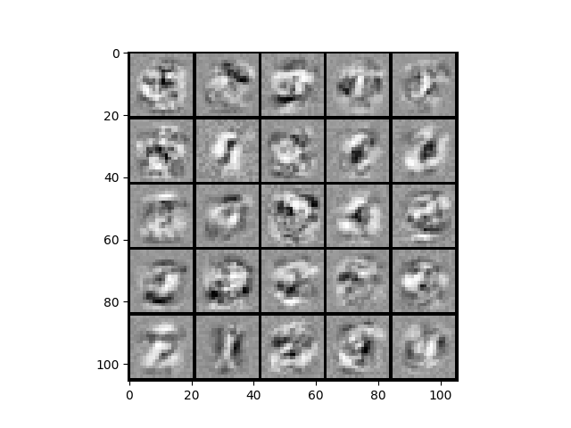

第四周的作业是神经网络的训练和预测.这个和我之前写的神经网络有点不一样,吴恩达老师这里所有的都是加上`bias`节点以及正则化的.主要注意一下梯度函数.

<!--more-->

以下是正则化的梯度函数(代码矩阵形式),假设一共3层:
$$ \begin{aligned}
    temp^{(2)}&=\Theta^{(2)} \\
    temp^{(1)}&=\Theta^{(1)} \\
    temp^{(2)}[:,1:]&=0 \\
    temp^{(1)}[:,1:]&=0 \\
    \Delta^{(2)} &= (a^{(3)}-y)^T*a^{(2)} \\
    \Delta^{(1)} &= ((a^{(3)}-y)[:,1:]\cdot g'(z^{(2)}))^T*a^{(1)} \\
    Grad^{(2)} &=\frac{\Delta^{(2)}+\lambda*temp^{(2)} }{m} \\
    Grad^{(1)} &=\frac{\Delta^{(1)}+\lambda*temp^{(1)} }{m} 
\end{aligned} $$


# ex4.py


```python
from numpy.core import *
from numpy.random import choice
from numpy import c_, r_
import matplotlib.pyplot as plt
from scipy.io import loadmat
from scipy.optimize import fmin_cg
from fucs4 import displayData, nnCostFunction, sigmoidGradient,\
    randInitializeWeights, checkNNGradients, costFuc, gradFuc, predict


if __name__ == "__main__":
    # Machine Learning Online Class - Exercise 4 Neural Network Learning

    #  Instructions
    #  ------------
    #
    #  This file contains code that helps you get started on the
    #  linear exercise. You will need to complete the following functions
    #  in this exericse:
    #
    #     sigmoidGradient.m
    #     randInitializeWeights.m
    #     nnCostFunction.m
    #
    #  For this exercise, you will not need to change any code in this file,
    #  or any other files other than those mentioned above.
    #

    # Setup the parameters you will use for this exercise
    input_layer_size = 400  # 20x20 Input Images of Digits
    hidden_layer_size = 25   # 25 hidden units
    num_labels = 10          # 10 labels, from 1 to 10
    # (note that we have mapped "0" to label 10)

    # =========== Part 1: Loading and Visualizing Data =============
    #  We start the exercise by first loading and visualizing the dataset.
    #  You will be working with a dataset that contains handwritten digits.
    #

    # Load Training Data
    print('Loading and Visualizing Data ...')

    # training data stored in arrays X, y
    data = loadmat('/media/zqh/程序与工程/Python_study/\
Machine_learning/machine_learning_exam/week4/ex4data1.mat')
    X = data['X']  # type:ndarray
    y = data['y']  # type:ndarray

    m = size(X, 0)

    # Randomly select 100 data points to display
    rand_indices = choice(m, 100)
    sel = X[rand_indices, :]
    displayData(sel)

    print('Program paused. Press enter to continue.')

    # ================ Part 2: Loading Parameters ================
    # In this part of the exercise, we load some pre-initialized
    # neural network parameters.

    print('Loading Saved Neural Network Parameters ...')

    # Load the weights into variables Theta1 and Theta2
    weightdata = loadmat('/media/zqh/程序与工程/Python_study/\
Machine_learning/machine_learning_exam/week4/ex4weights.mat')
    Theta1 = weightdata['Theta1']
    Theta2 = weightdata['Theta2']

    # Unroll parameters
    nn_params = r_[Theta1.reshape(-1, 1), Theta2.reshape(-1, 1)]

    # ================ Part 3: Compute Cost (Feedforward) ================
    #  To the neural network, you should first start by implementing the
    #  feedforward part of the neural network that returns the cost only. You
    #  should complete the code in nnCostFunction.m to return cost. After
    #  implementing the feedforward to compute the cost, you can verify that
    #  your implementation is correct by verifying that you get the same cost
    #  as us for the fixed debugging parameters.
    #
    #  We suggest implementing the feedforward cost *without* regularization
    #  first so that it will be easier for you to debug. Later, in part 4, you
    #  will get to implement the regularized cost.
    #
    print('Feedforward Using Neural Network ...')

    # Weight regularization parameter (we set this to 0 here).
    lamda = 0

    J, grad = nnCostFunction(nn_params, input_layer_size, hidden_layer_size,
                             num_labels, X, y, lamda)

    print('Cost at parameters (loaded from ex4weights): {} \n\
    (this value should be about 0.287629)'.format(J))

    print('Program paused. Press enter to continue.')

    # =============== Part 4: Implement Regularization ===============
    #  Once your cost function implementation is correct, you should now
    #  continue to implement the regularization with the cost.
    #

    print('Checking Cost Function (w/ Regularization) ... ')

    # Weight regularization parameter (we set this to 1 here).
    lamda = 1

    J, grad = nnCostFunction(nn_params, input_layer_size, hidden_layer_size,
                             num_labels, X, y, lamda)

    print('Cost at parameters (loaded from ex4weights): {}\n\
    this value should be about 0.383770)'.format(J))

    print('Program paused. Press enter to continue.')

    # ================ Part 5: Sigmoid Gradient  ================
    #  Before you start implementing the neural network, you will first
    #  implement the gradient for the sigmoid function. You should complete
    #  the code in the sigmoidGradient.m file.
    #

    print('Evaluating sigmoid gradient...')

    g = sigmoidGradient(array([-1, -0.5, 0, 0.5, 1]).reshape(-1, 1))
    print('Sigmoid gradient evaluated at [-1 -0.5 0 0.5 1]:  ')
    print(g)

    print('Program paused. Press enter to continue.')

    # ================ Part 6: Initializing Pameters ================
    #  In this part of the exercise, you will be starting to implment a two
    #  layer neural network that classifies digits. You will start by
    #  implementing a function to initialize the weights of the neural network
    #  (randInitializeWeights.m)

    print('Initializing Neural Network Parameters ...')

    initial_Theta1 = randInitializeWeights(input_layer_size, hidden_layer_size)
    initial_Theta2 = randInitializeWeights(hidden_layer_size, num_labels)

    # Unroll parameters
    initial_nn_params = r_[
        initial_Theta1.reshape(-1, 1), initial_Theta2.reshape(-1, 1)]

    # =============== Part 7: Implement Backpropagation ===============
    #  Once your cost matches up with ours, you should proceed to implement the
    #  backpropagation algorithm for the neural network. You should add to the
    #  code you've written in nnCostFunction.m to return the partial
    #  derivatives of the parameters.
    #
    print('Checking Backpropagation... ')

    #  Check gradients by running checkNNGradients
    checkNNGradients()

    print('Program paused. Press enter to continue.')

    # =============== Part 8: Implement Regularization ===============
    #  Once your backpropagation implementation is correct, you should now
    #  continue to implement the regularization with the cost and gradient.
    #

    print('Checking Backpropagation (w/ Regularization) ... ')

    #  Check gradients by running checkNNGradients
    lamda = 3
    checkNNGradients(lamda)

    # Also output the costFunction debugging values
    debug_J, _ = nnCostFunction(nn_params, input_layer_size,
                                hidden_layer_size, num_labels, X, y, lamda)

    print('Cost at (fixed) debugging parameters (w/ lamda = {}): {}\n \
(for lamda = 3, this value should be about 0.576051)'.format(lamda, debug_J))

    print('Program paused. Press enter to continue.')

    # =================== Part 8: Training NN ===================
    #  You have now implemented all the code necessary to train a neural
    #  network. To train your neural network, we will now use "fmincg", which
    #  is a function which works similarly to "fminunc". Recall that these
    #  advanced optimizers are able to train our cost functions efficiently as
    #  long as we provide them with the gradient computations.
    #
    print('Training Neural Network... ')

    #  After you have completed the assignment, change the MaxIter to a larger
    #  value to see how more training helps.
    MaxIter = 50

    #  You should also try different values of lamda
    lamda = 1

    # Now, costFunction is a function that takes in only one argument (the
    # neural network parameters)
    Y = zeros((m, num_labels))  # convrt Y
    for i in range(m):
        Y[i, y[i, :] - 1] = 1
    nn_params = fmin_cg(costFuc, initial_nn_params.flatten(), gradFuc,
                        (input_layer_size, hidden_layer_size,
                         num_labels, X, Y, lamda), maxiter=MaxIter)

    # Obtain Theta1 and Theta2 back from nn_params
    Theta1 = nn_params[: hidden_layer_size * (input_layer_size + 1)] \
        .reshape(hidden_layer_size, input_layer_size + 1)
    Theta2 = nn_params[hidden_layer_size * (input_layer_size + 1):] \
        .reshape(num_labels, hidden_layer_size + 1)

    print('Program paused. Press enter to continue.')

    # ================= Part 9: Visualize Weights =================
    #  You can now "visualize" what the neural network is learning by
    #  displaying the hidden units to see what features they are capturing in
    #  the data.

    print('Visualizing Neural Network... ')

    displayData(Theta1[:, 1:])

    print('Program paused. Press enter to continue.')

    # ================= Part 10: Implement Predict =================
    #  After training the neural network, we would like to use it to predict
    #  the labels. You will now implement the "predict" function to use the
    #  neural network to predict the labels of the training set. This lets
    #  you compute the training set accuracy.

    pred = predict(Theta1, Theta2, X)

    print('Training Set Accuracy: {}%'.format(mean(array(pred == y)) * 100))
    plt.show()

```


## 效果


```sh
➜  Machine_learning /usr/bin/python3 /media/zqh/程序与工程/Python_study/Machine_learning/machine_learning_exam/week4/ex4.py
Loading and Visualizing Data ...
Program paused. Press enter to continue.
Loading Saved Neural Network Parameters ...
Feedforward Using Neural Network ...
Cost at parameters (loaded from ex4weights): 0.2876291651613189
    (this value should be about 0.287629)
Program paused. Press enter to continue.
Checking Cost Function (w/ Regularization) ...
Cost at parameters (loaded from ex4weights): 0.38376985909092365
    this value should be about 0.383770)
Program paused. Press enter to continue.
Evaluating sigmoid gradient...
Sigmoid gradient evaluated at [-1 -0.5 0 0.5 1]:
[[0.19661193]
 [0.23500371]
 [0.25      ]
 [0.23500371]
 [0.19661193]]
Program paused. Press enter to continue.
Initializing Neural Network Parameters ...
Checking Backpropagation...
[[ 1.23162247e-02]
 .
 .
 .
 [ 5.02929547e-02]]
The above two columns you get should be very similar.
(Left-Your Numerical Gradient, Right-Analytical Gradient)
If your backpropagation implementation is correct, then
the relative difference will be small (less than 1e-9).

Relative Difference: 1.848611973407009e-11
Program paused. Press enter to continue.
Checking Backpropagation (w/ Regularization) ...
[[ 0.01231622]
 .
 .
 .
 [ 0.00523372]]
The above two columns you get should be very similar.
(Left-Your Numerical Gradient, Right-Analytical Gradient)
If your backpropagation implementation is correct, then
the relative difference will be small (less than 1e-9).

Relative Difference: 1.8083382559674107e-11
Cost at (fixed) debugging parameters (w/ lamda = 3): 0.5760512469501331
 (for lamda = 3, this value should be about 0.576051)
Program paused. Press enter to continue.
Training Neural Network...
Warning: Maximum number of iterations has been exceeded.
         Current function value: 0.483014
         Iterations: 50
         Function evaluations: 116
         Gradient evaluations: 116
Program paused. Press enter to continue.
Visualizing Neural Network...
Program paused. Press enter to continue.
Training Set Accuracy: 95.88%
```



# fucs.py


```python
import math
import matplotlib.pyplot as plt
from numpy import c_, r_
from numpy.core import *
from numpy.linalg import norm
from numpy.matlib import mat
from numpy.random import rand
from scipy.optimize import fmin_cg, minimize
from scipy.special import expit, logit


def displayData(X: ndarray, e_width=0):
    if e_width == 0:
        e_width = int(round(math.sqrt(X.shape[1])))
    m, n = X.shape

    # 单独一个样本的像素大小
    e_height = int(n / e_width)

    # 分割线
    pad = 1

    # 整一副图的像素大小
    d_rows = math.floor(math.sqrt(m))
    d_cols = math.ceil(m / d_rows)
    d_array = mat(
        ones((pad + d_rows * (e_height + pad),
              pad + d_cols * (e_width + pad))))
    curr_ex = 0
    for j in range(d_rows):
        for i in range(d_cols):
            if curr_ex > m:
                break
            max_val = max(abs(X[curr_ex, :]))
            d_array[pad + j * (e_height + pad) + 0:pad + j *
                    (e_height + pad) + e_height,
                    pad + i * (e_width + pad) + 0:pad + i *
                    (e_width + pad) + e_width] = \
                X[curr_ex, :].reshape(e_height, e_width) / max_val
            curr_ex += 1
        if curr_ex > m:
            break
    # 转置一下放正
    plt.imshow(d_array.T, cmap='Greys')


def sigmoidGradient(z: ndarray)->ndarray:
    # SIGMOIDGRADIENT returns the gradient of the sigmoid function
    # evaluated at z
    #   g = SIGMOIDGRADIENT(z) computes the gradient of the sigmoid function
    #   evaluated at z. This should work regardless if z is a matrix or a
    #   vector. In particular, if z is a vector or matrix, you should return
    #   the gradient for each element.

    g = zeros(shape(z))

    # ====================== YOUR CODE HERE ======================
    # Instructions: Compute the gradient of the sigmoid function evaluated at
    #               each value of z (z can be a matrix, vector or scalar).

    g = expit(z)*(1-expit(z))

    # =============================================================

    return g


def costFuc(nn_params: ndarray,
            input_layer_size, hidden_layer_size, num_labels,
            X: ndarray, Y: ndarray, lamda: float):

    Theta1 = nn_params[: hidden_layer_size * (input_layer_size + 1)] \
        .reshape(hidden_layer_size, input_layer_size + 1)
    Theta2 = nn_params[hidden_layer_size * (input_layer_size + 1):] \
        .reshape(num_labels, hidden_layer_size + 1)

    m = size(X, 0)

    temp1 = power(Theta1[:, 1:], 2)  # power
    temp2 = power(Theta2[:, 1:], 2)

    h = expit(c_[ones((m, 1), float), expit(
        (c_[ones((m, 1), float), X] @ Theta1.T))] @ Theta2.T)

    J = sum(-Y * log(h) - (1 - Y) * log(1 - h)) / m\
        + lamda*(sum(temp1)+sum(temp2))/(2*m)

    return J


def gradFuc(nn_params: ndarray,
            input_layer_size, hidden_layer_size, num_labels,
            X: ndarray, Y: ndarray, lamda: float):

    Theta1 = nn_params[: hidden_layer_size * (input_layer_size + 1)] \
        .reshape(hidden_layer_size, input_layer_size + 1)

    Theta2 = nn_params[hidden_layer_size * (input_layer_size + 1):] \
        .reshape(num_labels, hidden_layer_size + 1)

    # Setup some useful variables
    m = size(X, 0)

    # You need to return the following variables correctly
    Theta1_grad = zeros(shape(Theta1))
    Theta2_grad = zeros(shape(Theta2))

    # a_1 = X add cloum
    a_1 = c_[ones((m, 1), float), X]
    z_2 = a_1@ Theta1.T
    a_2 = c_[ones((m, 1), float), expit(z_2)]
    a_3 = expit(a_2@Theta2.T)  # a_3 is h

    # err
    err_3 = a_3-Y  # [5000,10]
    # [5000,10]*[10,26] 取出第一列 => [5000,25].*[5000,25]
    err_2 = (err_3@Theta2)[:, 1:]*sigmoidGradient(z_2)

    temptheta2 = c_[zeros((size(Theta2, 0), 1)), Theta2[:, 1:]]
    temptheta1 = c_[zeros((size(Theta1, 0), 1)), Theta1[:, 1:]]

    # [5000,10].T*[5000,26]
    Theta2_grad = (err_3.T@a_2+lamda*temptheta2)/m
    Theta1_grad = (err_2.T@a_1+lamda*temptheta1)/m

    # Unroll gradients
    grad = r_[Theta1_grad.reshape(-1, 1), Theta2_grad.reshape(-1, 1)]
    return grad.flatten()


def nnCostFunction(nn_params: ndarray,
                   input_layer_size, hidden_layer_size, num_labels,
                   X: ndarray, y: ndarray, lamda: float):
    # NNCOSTFUNCTION Implements the neural network cost function for
    # a two layer
    #   neural network which performs classification
    #   [J grad] = NNCOSTFUNCTON(nn_params, hidden_layer_size, num_labels, ...
    #   X, y, lamda) computes the cost and gradient of the neural network. The
    #   parameters for the neural network are "unrolled" into the vector
    #   nn_params and need to be converted back into the weight matrices.
    #
    #   The returned parameter grad should be a "unrolled" vector of the
    #   partial derivatives of the neural network.
    #

    # Reshape nn_params back into the parameters Theta1 and Theta2,
    # the weight matrices
    # for our 2 layer neural network
    Theta1 = nn_params[: hidden_layer_size * (input_layer_size + 1), :] \
        .reshape(hidden_layer_size, input_layer_size + 1)

    Theta2 = nn_params[hidden_layer_size * (input_layer_size + 1):] \
        .reshape(num_labels, hidden_layer_size + 1)

    # Setup some useful variables
    m = size(X, 0)

    # You need to return the following variables correctly
    J = 0
    Theta1_grad = zeros(shape(Theta1))
    Theta2_grad = zeros(shape(Theta2))

    # ====================== YOUR CODE HERE ======================
    # Instructions: You should complete the code by working through the
    #               following parts.
    #
    # Part 1: Feedforward the neural network and return the cost in the
    #         variable J. After implementing Part 1, you can verify that your
    #         cost function computation is correct by verifying the cost
    #         computed in ex4.m
    #
    # Part 2: Implement the backpropagation algorithm to compute the gradients
    #         Theta1_grad and Theta2_grad. You should return the partial
    #         derivatives of the cost function with respect to Theta1 and
    #         Theta2 in Theta1_grad and Theta2_grad, respectively.
    #         After implementing Part 2, you can check that your
    #         implementation is correct by running checkNNGradients
    #
    #         Note: The vector y passed into the function is a vector of labels
    #               containing values from 1..K. You need to map this vector
    #               into a binary vector of 1's and 0's to be used with the
    #               neural network cost function.
    #
    #         Hint: We recommend implementing backpropagation using a for-loop
    #               over the training examples if you are implementing it for
    #               the first time.
    #
    # Part 3: Implement regularization with the cost function and gradients.
    #
    #         Hint: You can implement this around the code for
    #               backpropagation. That is, you can compute the gradients for
    #               the regularization separately and then add them to
    #               Theta1_grad and Theta2_grad from Part 2.
    #
    # -------------------------------------------------------------

    # first covert y=[5000,1] to Y=[5000,10]
    Y = zeros((m, num_labels))
    for i in range(m):
        Y[i, y[i, :] - 1] = 1

    # without regularization
    # h = expit(c_[ones((m, 1), float), expit(
    #     (c_[ones((m, 1), float), X] @ Theta1.T))] @ Theta2.T)

    # J = sum(sum(-Y * log(h) - (1 - Y) * log(1 - h), axis=1)) / m

    # regularization
    temp1 = zeros((size(Theta1, 0), size(Theta1, 1)-1))  # [25*400]
    temp2 = zeros((size(Theta2, 0), size(Theta2, 1)-1))  # [10*25]

    temp1 = power(Theta1[:, 1:], 2)  # copy and power
    temp2 = power(Theta2[:, 1:], 2)
    # a_1 = X add cloum
    a_1 = c_[ones((m, 1), float), X]
    z_2 = a_1@ Theta1.T
    a_2 = c_[ones((m, 1), float), expit(z_2)]
    a_3 = expit(a_2@Theta2.T)  # a_3 is h

    J = sum(-Y * log(a_3) - (1 - Y) * log(1 - a_3)) / m\
        + lamda*(sum(temp1)+sum(temp2))/(2*m)

    # err
    err_3 = a_3-Y  # [5000,10]
    # [5000,10]*[10,26] 取出第一列 => [5000,25].*[5000,25]
    err_2 = (err_3@Theta2)[:, 1:]*sigmoidGradient(z_2)

    # grad
    delta_2 = err_3.T@a_2
    delta_1 = err_2.T@a_1

    temptheta2 = c_[zeros((size(Theta2, 0), 1)), Theta2[:, 1:]]
    temptheta1 = c_[zeros((size(Theta1, 0), 1)), Theta1[:, 1:]]

    # [5000,10].T*[5000,26]
    Theta2_grad = (delta_2+lamda*temptheta2)/m
    Theta1_grad = (delta_1+lamda*temptheta1)/m

    # =========================================================================

    # Unroll gradients
    grad = r_[Theta1_grad.reshape(-1, 1), Theta2_grad.reshape(-1, 1)]
    return J, grad


def randInitializeWeights(L_in: int, L_out: int)->ndarray:
    # RANDINITIALIZEWEIGHTS Randomly initialize the weights of
    # a layer with L_in
    # incoming connections and L_out outgoing connections
    #   W = RANDINITIALIZEWEIGHTS(L_in, L_out) randomly initializes the weights
    #   of a layer with L_in incoming connections and L_out outgoing
    #   connections.
    #
    #   Note that W should be set to a matrix of size(L_out, 1 + L_in) as
    #   the first column of W handles the "bias" terms
    #

    # You need to return the following variables correctly
    W = zeros((L_out, 1 + L_in))

    # ====================== YOUR CODE HERE ======================
    # Instructions: Initialize W randomly so that we break the symmetry while
    #               training the neural network.
    #
    # Note: The first column of W corresponds to the parameters for the bias
    # unit
    epsilon_init = 0.12
    W = rand(L_out, L_in+1)*2*epsilon_init-epsilon_init
    # =========================================================================
    return W


def debugInitializeWeights(fan_out, fan_in):
    # DEBUGINITIALIZEWEIGHTS Initialize the weights of a layer with fan_in
    # incoming connections and fan_out outgoing connections using a fixed
    # strategy, this will help you later in debugging
    #   W = DEBUGINITIALIZEWEIGHTS(fan_in, fan_out) initializes the weights
    #   of a layer with fan_in incoming connections and fan_out outgoing
    #   connections using a fix set of values
    #
    #   Note that W should be set to a matrix of size(1 + fan_in, fan_out) as
    #   the first row of W handles the "bias" terms
    #

    # Set W to zeros
    W = zeros((fan_out, 1 + fan_in))

    # Initialize W using "sin", this ensures that W is always of the same
    # values and will be useful for debugging
    W = sin(arange(1, size(W)+1).reshape(fan_out, 1 + fan_in)) / 10

    # =========================================================================

    return W


def computeNumericalGradient(J, theta: ndarray):
    # COMPUTENUMERICALGRADIENT Computes the gradient using "finite differences"
    # and gives us a numerical estimate of the gradient.
    #   numgrad = COMPUTENUMERICALGRADIENT(J, theta) computes the numerical
    #   gradient of the function J around theta. Calling y = J(theta) should
    #   return the function value at theta.

    # Notes: The following code implements numerical gradient checking, and
    #        returns the numerical gradient.It sets numgrad(i) to (a numerical
    #        approximation of) the partial derivative of J with respect to the
    #        i-th input argument, evaluated at theta. (i.e., numgrad(i) should
    #        be the (approximately) the partial derivative of J with respect
    #        to theta(i).)
    #

    numgrad = zeros(shape(theta))
    perturb = zeros(shape(theta))
    e = 1e-4
    for p in range(size(theta)):
        # Set perturbation vector
        perturb[p, :] = e
        loss1 = J(theta - perturb)[0]
        loss2 = J(theta + perturb)[0]
        # Compute Numerical Gradient
        numgrad[p, :] = (loss2 - loss1) / (2*e)
        perturb[p, :] = 0
    return numgrad


def checkNNGradients(lamda=0):
    # CHECKNNGRADIENTS Creates a small neural network to check the
    # backpropagation gradients
    #   CHECKNNGRADIENTS(lamda) Creates a small neural network to check the
    #   backpropagation gradients, it will output the analytical gradients
    #   produced by your backprop code and the numerical gradients (computed
    #   using computeNumericalGradient). These two gradient computations should
    #   result in very similar values.
    #
    input_layer_size = 3
    hidden_layer_size = 5
    num_labels = 3
    m = 5

    # We generate some 'random' test data
    Theta1 = debugInitializeWeights(hidden_layer_size, input_layer_size)
    Theta2 = debugInitializeWeights(num_labels, hidden_layer_size)
    # Reusing debugInitializeWeights to generate X
    X = debugInitializeWeights(m, input_layer_size - 1)
    y = 1 + mod(arange(1, m+1), num_labels).reshape(-1, 1)

    # Unroll parameters
    nn_params = r_[Theta1.reshape(-1, 1), Theta2.reshape(-1, 1)]

    # Short hand for cost function
    def costFunc(p): return nnCostFunction(p, input_layer_size,
                                           hidden_layer_size,
                                           num_labels, X, y, lamda)
    # @(p) nnCostFunction(p, input_layer_size, hidden_layer_size, ...
    #                     num_labels, X, y, lamda)

    [cost, grad] = costFunc(nn_params)
    numgrad = computeNumericalGradient(costFunc, nn_params)

    # Visually examine the two gradient computations.  The two columns
    # you get should be very similar.
    print(numgrad, '\n', grad)
    print('The above two columns you get should be very similar.\n',
          '(Left-Your Numerical Gradient, Right-Analytical Gradient)', sep='')

    # Evaluate the norm of the difference between two solutions.
    # If you have a correct implementation, and assuming you used
    # EPSILON = 0.0001
    # in computeNumericalGradient.m, then diff below should be less than 1e-9
    diff = norm(numgrad-grad)/norm(numgrad+grad)

    print('If your backpropagation implementation is correct, then \n',
          'the relative difference will be small (less than 1e-9). \n',
          '\nRelative Difference: {}'.format(diff), sep='')


def predict(Theta1: ndarray, Theta2: ndarray, X: ndarray)->ndarray:
    # PREDICT Predict the label of an input given a trained neural network
    #   p = PREDICT(Theta1, Theta2, X) outputs the predicted label of X given
    #   the trained weights of a neural network (Theta1, Theta2)

    # Useful values
    m = size(X, 0)
    num_labels = size(Theta2, 0)

    # You need to return the following variables correctly
    h = expit(c_[ones((m, 1), float), expit(
        (c_[ones((m, 1), float), X] @ Theta1.T))] @ Theta2.T)
    p = argmax(h, 1).reshape(-1, 1)+1

    # =========================================================================
    return p

```


